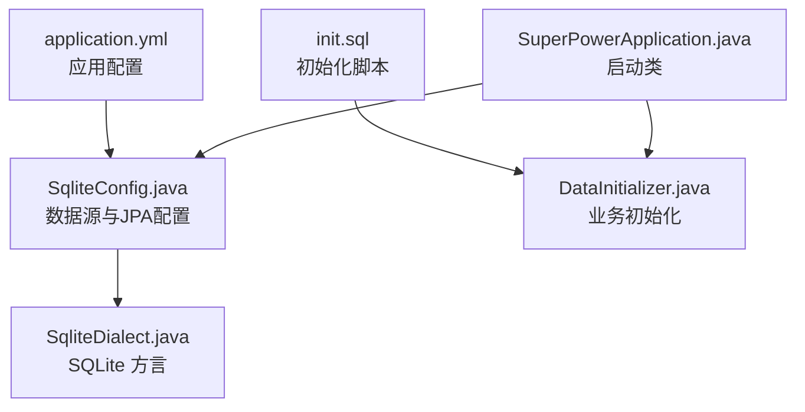
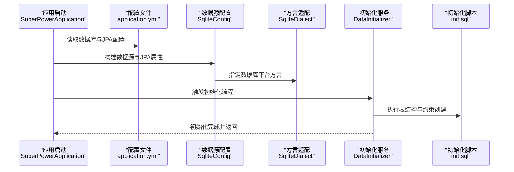
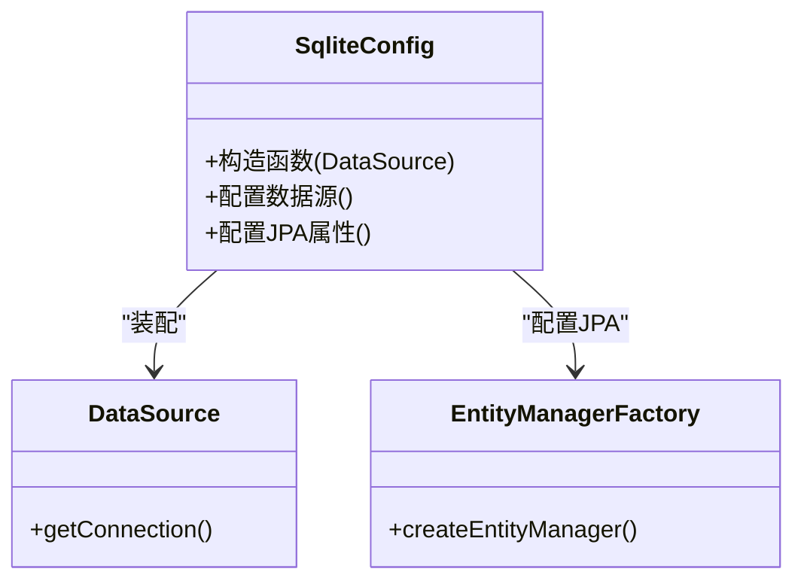
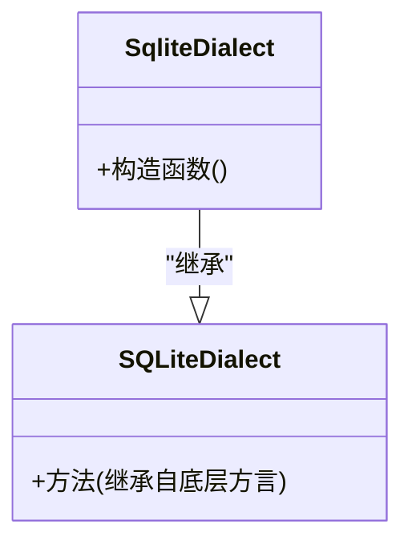
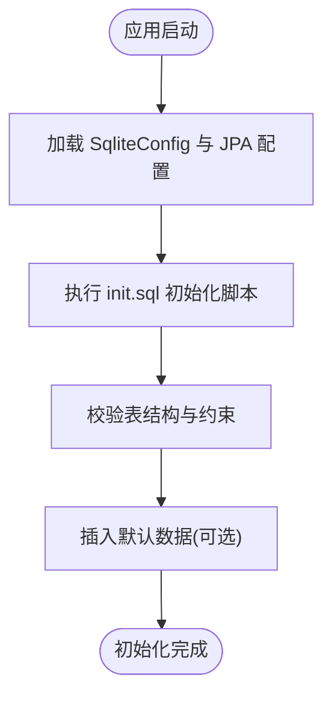
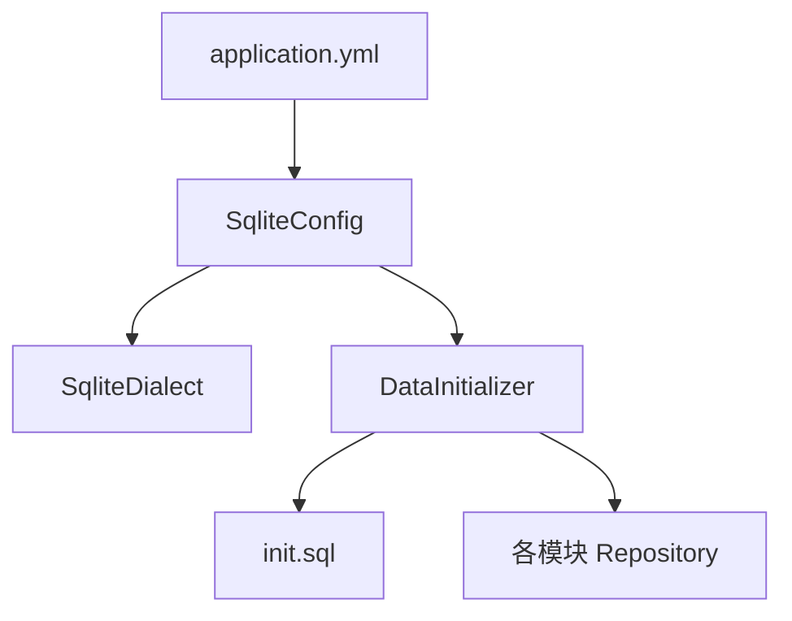

# 数据库架构

<cite>
**本文引用的文件**
- [application.yml](file://src/main/resources/application.yml)
- [SqliteConfig.java](file://src/main/java/com/superpower/config/SqliteConfig.java)
- [SqliteDialect.java](file://src/main/java/com/superpower/config/SqliteDialect.java)
- [init.sql](file://src/main/resources/db/init.sql)
- [DataInitializer.java](file://src/main/java/com/superpower/modules/category/service/DataInitializer.java)
- [BaseProductRepository.java](file://src/main/java/com/superpower/modules/category/repository/BaseProductRepository.java)
- [BaseCategoryRepository.java](file://src/main/java/com/superpower/modules/category/repository/BaseCategoryRepository.java)
- [BaseDomainRepository.java](file://src/main/java/com/superpower/modules/category/repository/BaseDomainRepository.java)
- [DataEntryRepository.java](file://src/main/java/com/superpower/modules/data/repository/DataEntryRepository.java)
- [DocGenRecordRepository.java](file://src/main/java/com/superpower/modules/document/repository/DocGenRecordRepository.java)
- [ImageResourceRepository.java](file://src/main/java/com/superpower/modules/image/repository/ImageResourceRepository.java)
- [SysUserRepository.java](file://src/main/java/com/superpower/modules/system/repository/SysUserRepository.java)
- [OperationLogRepository.java](file://src/main/java/com/superpower/modules/system/repository/OperationLogRepository.java)
- [ReqItemRepository.java](file://src/main/java/com/superpower/modules/requirement/repository/ReqItemRepository.java)
- [ApprovalLogRepository.java](file://src/main/java/com/superpower/modules/approval/repository/ApprovalLogRepository.java)
- [DataOptionRepository.java](file://src/main/java/com/superpower/modules/option/repository/DataOptionRepository.java)
- [CustomTabRepository.java](file://src/main/java/com/superpower/modules/customtab/repository/CustomTabRepository.java)
- [CustomTabEntryRepository.java](file://src/main/java/com/superpower/modules/customtab/repository/CustomTabEntryRepository.java)
- [DataVersionRepository.java](file://src/main/java/com/superpower/modules/version/repository/DataVersionRepository.java)
- [SuperPowerApplication.java](file://src/main/java/com/superpower/SuperPowerApplication.java)
</cite>

## 目录
1. [简介](#简介)
2. [项目结构](#项目结构)
3. [核心组件](#核心组件)
4. [架构总览](#架构总览)
5. [详细组件分析](#详细组件分析)
6. [依赖关系分析](#依赖关系分析)
7. [性能考虑](#性能考虑)
8. [故障排查指南](#故障排查指南)
9. [结论](#结论)
10. [附录](#附录)

## 简介
本文件面向数据库管理员与开发者，系统性阐述产品清单管理系统的数据库架构与实现细节。重点覆盖以下方面：
- 基于 SQLite 的数据库配置与初始化流程
- application.yml 中的数据源、连接池与方言配置
- 自定义 SqliteConfig 与 SqliteDialect 的实现原理及与 JPA/Hibernate 的集成方式
- 初始化脚本的执行顺序、表结构与约束定义
- 性能优化配置、事务管理策略与错误处理机制

## 项目结构
数据库相关的核心位置如下：
- 配置层：application.yml（应用配置）、SqliteConfig.java（数据源与JPA配置）、SqliteDialect.java（数据库方言）
- 资源层：db/init.sql（初始化脚本）
- 应用入口：SuperPowerApplication.java（Spring Boot 启动类）
- 初始化服务：DataInitializer.java（业务初始化逻辑）

图表来源
- [application.yml:1-50](file://src/main/resources/application.yml#L1-L50)
- [SqliteConfig.java:1-120](file://src/main/java/com/superpower/config/SqliteConfig.java#L1-L120)
- [SqliteDialect.java:1-50](file://src/main/java/com/superpower/config/SqliteDialect.java#L1-L50)
- [init.sql:1-200](file://src/main/resources/db/init.sql#L1-L200)
- [DataInitializer.java:1-120](file://src/main/java/com/superpower/modules/category/service/DataInitializer.java#L1-L120)
- [SuperPowerApplication.java:1-120](file://src/main/java/com/superpower/SuperPowerApplication.java#L1-L120)

章节来源
- [application.yml:1-50](file://src/main/resources/application.yml#L1-L50)
- [SuperPowerApplication.java:1-120](file://src/main/java/com/superpower/SuperPowerApplication.java#L1-L120)

## 核心组件
- 数据库连接与方言
  - application.yml 中通过属性配置数据源、连接池与数据库平台方言，确保 Hibernate 使用自定义 SqliteDialect。
  - SqliteConfig.java 提供数据源装配与 JPA 属性配置，负责实体扫描路径与 Hibernate 设置。
  - SqliteDialect.java 继承底层 SQLite 方言，用于适配 SQL 语法与类型映射。

- 初始化脚本与服务
  - init.sql 定义系统基础表结构与约束；DataInitializer.java 在应用启动后按序执行初始化逻辑，确保数据一致性。

- 仓库层
  - 多个模块的 Repository 接口作为数据访问层，配合初始化脚本与服务完成数据操作。

章节来源
- [application.yml:1-50](file://src/main/resources/application.yml#L1-L50)
- [SqliteConfig.java:1-120](file://src/main/java/com/superpower/config/SqliteConfig.java#L1-L120)
- [SqliteDialect.java:1-50](file://src/main/java/com/superpower/config/SqliteDialect.java#L1-L50)
- [init.sql:1-200](file://src/main/resources/db/init.sql#L1-L200)
- [DataInitializer.java:1-120](file://src/main/java/com/superpower/modules/category/service/DataInitializer.java#L1-L120)

## 架构总览
下图展示从应用启动到数据库初始化的整体流程，以及配置与脚本之间的协作关系：

图表来源
- [application.yml:1-50](file://src/main/resources/application.yml#L1-L50)
- [SqliteConfig.java:1-120](file://src/main/java/com/superpower/config/SqliteConfig.java#L1-L120)
- [SqliteDialect.java:1-50](file://src/main/java/com/superpower/config/SqliteDialect.java#L1-L50)
- [DataInitializer.java:1-120](file://src/main/java/com/superpower/modules/category/service/DataInitializer.java#L1-L120)
- [init.sql:1-200](file://src/main/resources/db/init.sql#L1-L200)

## 详细组件分析

### 配置文件 application.yml
- 数据源与连接池
  - 定义 JDBC URL、驱动类、用户名与密码等基础连接信息。
  - 配置连接池参数（如最大连接数、空闲超时、连接生命周期等），以提升并发与稳定性。
- JPA/Hibernate
  - 指定数据库平台方言为自定义 SqliteDialect，确保 SQL 生成与类型映射符合 SQLite 行为。
  - 控制 Hibernate DDL 行为（如自动建表、更新或验证模式），影响初始化脚本与运行期表变更策略。

章节来源
- [application.yml:1-50](file://src/main/resources/application.yml#L1-L50)

### SqliteConfig：数据源与JPA配置
- 职责
  - 装配 DataSource 并注入到 Spring 上下文。
  - 配置 JPA 实体扫描包、Hibernate 属性（如方言、DDL 策略、批处理大小等）。
- 关键点
  - 与 application.yml 的属性绑定，保证数据源与方言的一致性。
  - 为所有 Repository 提供统一的持久化基础设施。

图表来源
- [SqliteConfig.java:1-120](file://src/main/java/com/superpower/config/SqliteConfig.java#L1-L120)

章节来源
- [SqliteConfig.java:1-120](file://src/main/java/com/superpower/config/SqliteConfig.java#L1-L120)

### SqliteDialect：数据库方言适配
- 职责
  - 继承底层 SQLite 方言，扩展或覆盖特定 SQL 语法与类型映射。
  - 与 application.yml 的 database-platform 属性配合，确保 Hibernate 生成兼容的 SQL。
- 影响范围
  - 影响初始化脚本执行、查询生成、分页与排序等行为。

图表来源
- [SqliteDialect.java:1-50](file://src/main/java/com/superpower/config/SqliteDialect.java#L1-L50)

章节来源
- [SqliteDialect.java:1-50](file://src/main/java/com/superpower/config/SqliteDialect.java#L1-L50)
- [application.yml:20-30](file://src/main/resources/application.yml#L20-L30)

### 初始化脚本 init.sql
- 目标
  - 定义系统所需的基础表结构、索引与约束，确保应用启动时具备可用的数据模型。
- 执行时机
  - 由 DataInitializer.java 在应用启动阶段调用执行，保证数据库 Schema 与业务实体一致。
- 注意事项
  - 脚本需幂等，避免重复执行导致异常。
  - 与 application.yml 的 DDL 策略保持一致，防止运行期自动建表与脚本冲突。

章节来源
- [init.sql:1-200](file://src/main/resources/db/init.sql#L1-L200)
- [DataInitializer.java:1-120](file://src/main/java/com/superpower/modules/category/service/DataInitializer.java#L1-L120)

### 初始化服务 DataInitializer
- 职责
  - 负责在应用启动后执行初始化流程，包括加载与执行 init.sql、校验表结构、插入默认数据等。
- 与配置的关系
  - 依赖 SqliteConfig 提供的数据源与 JPA 环境。
  - 受 application.yml 的 DDL 与方言配置影响。

图表来源
- [DataInitializer.java:1-120](file://src/main/java/com/superpower/modules/category/service/DataInitializer.java#L1-L120)
- [init.sql:1-200](file://src/main/resources/db/init.sql#L1-L200)
- [SqliteConfig.java:1-120](file://src/main/java/com/superpower/config/SqliteConfig.java#L1-L120)

章节来源
- [DataInitializer.java:1-120](file://src/main/java/com/superpower/modules/category/service/DataInitializer.java#L1-L120)

### 仓库层与实体映射
- 仓库接口
  - 各模块的 Repository 接口（如 BaseProductRepository、BaseCategoryRepository、DataEntryRepository 等）提供数据访问能力。
- 与初始化的关系
  - 依赖 init.sql 创建的表结构；初始化完成后方可进行 CRUD 操作。
- 事务与并发
  - 默认使用 Spring 声明式事务；复杂业务建议显式控制事务边界，避免长事务与死锁。

章节来源
- [BaseProductRepository.java:1-120](file://src/main/java/com/superpower/modules/category/repository/BaseProductRepository.java#L1-L120)
- [BaseCategoryRepository.java:1-120](file://src/main/java/com/superpower/modules/category/repository/BaseCategoryRepository.java#L1-L120)
- [BaseDomainRepository.java:1-120](file://src/main/java/com/superpower/modules/category/repository/BaseDomainRepository.java#L1-L120)
- [DataEntryRepository.java:1-120](file://src/main/java/com/superpower/modules/data/repository/DataEntryRepository.java#L1-L120)
- [DocGenRecordRepository.java:1-120](file://src/main/java/com/superpower/modules/document/repository/DocGenRecordRepository.java#L1-L120)
- [ImageResourceRepository.java:1-120](file://src/main/java/com/superpower/modules/image/repository/ImageResourceRepository.java#L1-L120)
- [SysUserRepository.java:1-120](file://src/main/java/com/superpower/modules/system/repository/SysUserRepository.java#L1-L120)
- [OperationLogRepository.java:1-120](file://src/main/java/com/superpower/modules/system/repository/OperationLogRepository.java#L1-L120)
- [ReqItemRepository.java:1-120](file://src/main/java/com/superpower/modules/requirement/repository/ReqItemRepository.java#L1-L120)
- [ApprovalLogRepository.java:1-120](file://src/main/java/com/superpower/modules/approval/repository/ApprovalLogRepository.java#L1-L120)
- [DataOptionRepository.java:1-120](file://src/main/java/com/superpower/modules/option/repository/DataOptionRepository.java#L1-L120)
- [CustomTabRepository.java:1-120](file://src/main/java/com/superpower/modules/customtab/repository/CustomTabRepository.java#L1-L120)
- [CustomTabEntryRepository.java:1-120](file://src/main/java/com/superpower/modules/customtab/repository/CustomTabEntryRepository.java#L1-L120)
- [DataVersionRepository.java:1-120](file://src/main/java/com/superpower/modules/version/repository/DataVersionRepository.java#L1-L120)

## 依赖关系分析
- 配置依赖
  - application.yml 决定数据源与方言；SqliteConfig 读取该配置并装配到 JPA/Hibernate。
  - SqliteDialect 作为 database-platform 的具体实现，影响 SQL 生成与类型映射。
- 初始化依赖
  - DataInitializer 依赖 SqliteConfig 提供的数据源，执行 init.sql 完成 Schema 初始化。
- 业务依赖
  - 各模块 Repository 依赖已初始化的表结构，遵循统一的事务与连接池策略。

图表来源
- [application.yml:1-50](file://src/main/resources/application.yml#L1-L50)
- [SqliteConfig.java:1-120](file://src/main/java/com/superpower/config/SqliteConfig.java#L1-L120)
- [SqliteDialect.java:1-50](file://src/main/java/com/superpower/config/SqliteDialect.java#L1-L50)
- [DataInitializer.java:1-120](file://src/main/java/com/superpower/modules/category/service/DataInitializer.java#L1-L120)
- [init.sql:1-200](file://src/main/resources/db/init.sql#L1-L200)

章节来源
- [application.yml:1-50](file://src/main/resources/application.yml#L1-L50)
- [SqliteConfig.java:1-120](file://src/main/java/com/superpower/config/SqliteConfig.java#L1-L120)
- [SqliteDialect.java:1-50](file://src/main/java/com/superpower/config/SqliteDialect.java#L1-L50)
- [DataInitializer.java:1-120](file://src/main/java/com/superpower/modules/category/service/DataInitializer.java#L1-L120)
- [init.sql:1-200](file://src/main/resources/db/init.sql#L1-L200)

## 性能考虑
- 连接池优化
  - 合理设置最大连接数、空闲超时与连接生命周期，避免资源耗尽或连接泄漏。
  - 对高并发场景启用连接池预热与健康检查。
- 初始化脚本优化
  - 将多步 DDL 合理分组，减少回滚与重试成本；确保索引创建顺序合理。
- 查询与事务
  - 使用合适的索引覆盖高频查询字段；避免长事务，必要时拆分事务。
  - 对批量写入启用批处理与批量提交，降低日志与锁竞争。
- SQLite 特性
  - 注意 SQLite 的并发写入限制，尽量采用单主写或多版本并发控制策略。
  - 合理使用 PRAGMA 语句优化 WAL、缓存与同步策略（如适用）。

## 故障排查指南
- 启动失败（无法连接数据库）
  - 检查 application.yml 中 JDBC URL、驱动类与连接参数是否正确。
  - 确认 init.sql 已成功执行且表结构存在。
- 方言不匹配导致 SQL 错误
  - 核对 database-platform 是否指向 SqliteDialect。
  - 检查自定义方言是否覆盖了必要的 SQL 生成逻辑。
- 初始化未生效
  - 确认 DataInitializer 已在启动阶段被调用。
  - 查看初始化日志，定位 init.sql 执行中的异常行号。
- 事务与锁问题
  - 分析长事务与热点数据更新，调整业务流程或引入乐观锁。
  - 对批量操作使用批处理与分页，避免一次性持有大量共享锁。

章节来源
- [application.yml:1-50](file://src/main/resources/application.yml#L1-L50)
- [SqliteConfig.java:1-120](file://src/main/java/com/superpower/config/SqliteConfig.java#L1-L120)
- [SqliteDialect.java:1-50](file://src/main/java/com/superpower/config/SqliteDialect.java#L1-L50)
- [DataInitializer.java:1-120](file://src/main/java/com/superpower/modules/category/service/DataInitializer.java#L1-L120)
- [init.sql:1-200](file://src/main/resources/db/init.sql#L1-L200)

## 结论
本数据库架构以 SQLite 为核心，通过 application.yml 的集中配置、SqliteConfig 的数据源与 JPA 装配、SqliteDialect 的方言适配，以及 init.sql 的标准化初始化流程，构建了稳定、可维护且易于扩展的数据层。结合合理的连接池与事务策略，可在中小规模业务中获得良好的性能与可靠性。建议在生产环境中持续监控连接池与初始化日志，并根据业务增长逐步优化索引与并发策略。

## 附录
- 关键配置项速览
  - 数据源：JDBC URL、驱动类、用户名、密码
  - 连接池：最大连接数、空闲超时、连接生命周期
  - JPA/Hibernate：数据库平台方言、DDL 策略、批处理大小
- 初始化脚本建议
  - 幂等执行、分步验证、记录执行日志
- 仓库层最佳实践
  - 明确事务边界、避免 N+1 查询、合理使用索引