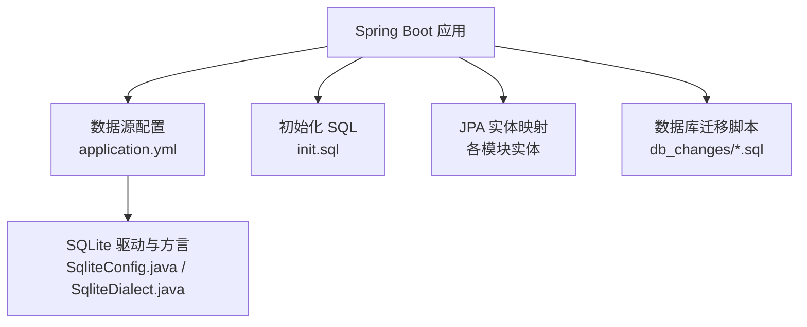
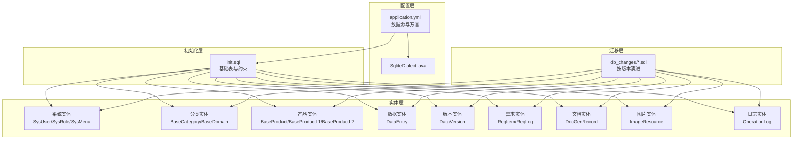
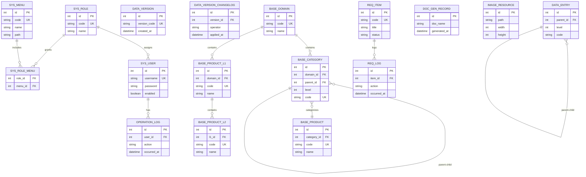
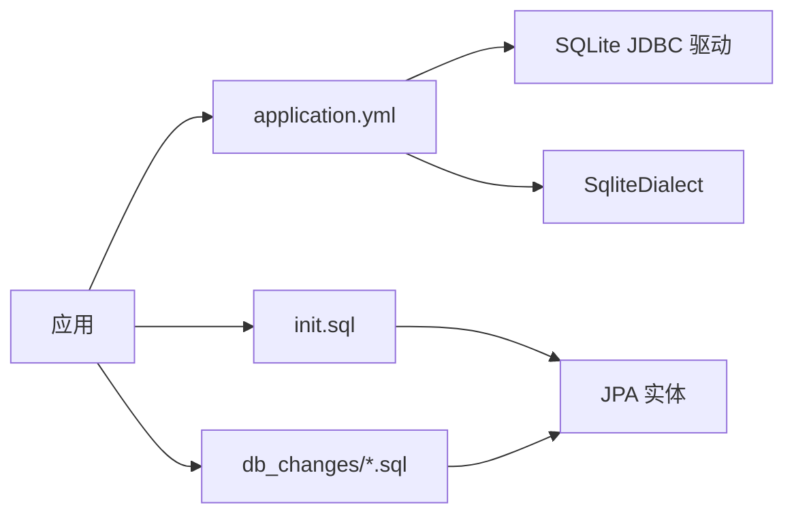

# 数据库设计

<cite>
**本文引用的文件**
- [application.yml](file://src/main/resources/application.yml)
- [init.sql](file://src/main/resources/db/init.sql)
- [SqliteConfig.java](file://src/main/java/com/superpower/config/SqliteConfig.java)
- [SqliteDialect.java](file://src/main/java/com/superpower/config/SqliteDialect.java)
- [BaseCategory.java](file://src/main/java/com/superpower/modules/category/entity/BaseCategory.java)
- [BaseDomain.java](file://src/main/java/com/superpower/modules/category/entity/BaseDomain.java)
- [BaseProduct.java](file://src/main/java/com/superpower/modules/category/entity/BaseProduct.java)
- [BaseProductL1.java](file://src/main/java/com/superpower/modules/category/entity/BaseProductL1.java)
- [BaseProductL2.java](file://src/main/java/com/superpower/modules/category/entity/BaseProductL2.java)
- [SysUser.java](file://src/main/java/com/superpower/modules/system/entity/SysUser.java)
- [SysRole.java](file://src/main/java/com/superpower/modules/system/entity/SysRole.java)
- [SysMenu.java](file://src/main/java/com/superpower/modules/system/entity/SysMenu.java)
- [OperationLog.java](file://src/main/java/com/superpower/modules/system/entity/OperationLog.java)
- [DataVersion.java](file://src/main/java/com/superpower/modules/version/entity/DataVersion.java)
- [DataEntry.java](file://src/main/java/com/superpower/modules/data/entity/DataEntry.java)
- [DocGenRecord.java](file://src/main/java/com/superpower/modules/document/entity/DocGenRecord.java)
- [ImageResource.java](file://src/main/java/com/superpower/modules/image/entity/ImageResource.java)
- [ReqItem.java](file://src/main/java/com/superpower/modules/requirement/entity/ReqItem.java)
- [ReqLog.java](file://src/main/java/com/superpower/modules/requirement/entity/ReqLog.java)
- [20260531_add_requirement_tables.sql](file://db_changes/20260531_add_requirement_tables.sql)
- [20260531_historical_schema_changes.sql](file://db_changes/20260531_historical_schema_changes.sql)
- [20260602_add_base_product_table.sql](file://db_changes/20260602_add_base_product_table.sql)
- [20260602_add_product_category_tables.sql](file://db_changes/20260602_add_product_category_tables.sql)
- [V1.0.6_add_last_login_at_and_operation_log.sql](file://db_changes/V1.0.6_add_last_login_at_and_operation_log.sql)
- [V1.0.10_cleanup_5_6_2_images.sql](file://db_changes/V1.0.10_cleanup_5_6_2_images.sql)
</cite>

## 目录
1. [简介](#简介)
2. [项目结构](#项目结构)
3. [核心组件](#核心组件)
4. [架构总览](#架构总览)
5. [详细组件分析](#详细组件分析)
6. [依赖分析](#依赖分析)
7. [性能考虑](#性能考虑)
8. [故障排查指南](#故障排查指南)
9. [结论](#结论)
10. [附录](#附录)

## 简介
本文件面向产品清单管理系统（后端基于Spring Boot与SQLite）的数据库设计，系统性梳理了数据库配置与初始化流程、核心数据表结构、实体关系模型、索引与约束设计，并结合迁移脚本与版本控制机制，形成可操作的数据库设计参考。读者对象包括数据库管理员与后端开发者。

## 项目结构
数据库相关的关键位置与职责如下：
- 配置层：通过Spring Boot配置文件定义数据源URL、驱动类名与方言，确保应用以SQLite作为持久化后端。
- 初始化层：在首次启动时执行初始化SQL，创建系统基础表与初始数据。
- 实体层：JPA实体映射到SQLite表结构，承载业务模型。
- 迁移层：db_changes目录下按时间戳与版本号组织的SQL脚本，记录历史演进与回滚策略。

图表来源
- [application.yml:17-25](file://src/main/resources/application.yml#L17-L25)
- [SqliteConfig.java](file://src/main/java/com/superpower/config/SqliteConfig.java)
- [SqliteDialect.java](file://src/main/java/com/superpower/config/SqliteDialect.java)
- [init.sql:4-70](file://src/main/resources/db/init.sql#L4-L70)
- [20260531_historical_schema_changes.sql:10-79](file://db_changes/20260531_historical_schema_changes.sql#L10-L79)

章节来源
- [application.yml:17-25](file://src/main/resources/application.yml#L17-L25)
- [init.sql:4-70](file://src/main/resources/db/init.sql#L4-L70)

## 核心组件
- 数据源与方言配置：通过配置文件指定SQLite JDBC驱动与数据库平台方言，确保ORM行为与SQLite兼容。
- 初始化SQL：包含系统用户、角色、菜单、版本控制与数据条目等核心表的建表与约束定义。
- 实体模型：系统模块（如分类、产品、系统、版本、需求、文档、图片）对应的JPA实体，映射到SQLite表结构。
- 迁移脚本：按版本与日期命名的SQL脚本，覆盖新增表、字段、索引与修复逻辑。

章节来源
- [application.yml:17-25](file://src/main/resources/application.yml#L17-L25)
- [init.sql:4-70](file://src/main/resources/db/init.sql#L4-L70)
- [20260531_historical_schema_changes.sql:10-79](file://db_changes/20260531_historical_schema_changes.sql#L10-L79)
- [20260602_add_base_product_table.sql](file://db_changes/20260602_add_base_product_table.sql)
- [20260602_add_product_category_tables.sql](file://db_changes/20260602_add_product_category_tables.sql)
- [20260531_add_requirement_tables.sql:2-19](file://db_changes/20260531_add_requirement_tables.sql#L2-L19)
- [V1.0.6_add_last_login_at_and_operation_log.sql:2-20](file://db_changes/V1.0.6_add_last_login_at_and_operation_log.sql#L2-L20)
- [V1.0.10_cleanup_5_6_2_images.sql](file://db_changes/V1.0.10_cleanup_5_6_2_images.sql)

## 架构总览
系统采用“配置+初始化+实体映射+迁移”的分层架构，确保SQLite作为嵌入式数据库在开发与生产环境的一致性与可演进性。

图表来源
- [application.yml:17-25](file://src/main/resources/application.yml#L17-L25)
- [SqliteDialect.java](file://src/main/java/com/superpower/config/SqliteDialect.java)
- [init.sql:4-70](file://src/main/resources/db/init.sql#L4-L70)
- [20260531_historical_schema_changes.sql:10-79](file://db_changes/20260531_historical_schema_changes.sql#L10-L79)
- [20260602_add_base_product_table.sql](file://db_changes/20260602_add_base_product_table.sql)
- [20260602_add_product_category_tables.sql](file://db_changes/20260602_add_product_category_tables.sql)
- [20260531_add_requirement_tables.sql:2-19](file://db_changes/20260531_add_requirement_tables.sql#L2-L19)
- [V1.0.6_add_last_login_at_and_operation_log.sql:2-20](file://db_changes/V1.0.6_add_last_login_at_and_operation_log.sql#L2-L20)
- [V1.0.10_cleanup_5_6_2_images.sql](file://db_changes/V1.0.10_cleanup_5_6_2_images.sql)

## 详细组件分析

### 数据库配置与初始化
- 数据源配置要点
  - JDBC URL指向本地SQLite文件，设置忙等待超时参数，避免并发写入阻塞。
  - 指定SQLite JDBC驱动类名。
  - 指定自定义方言类，适配SQLite的SQL方言差异。
- 初始化SQL要点
  - 建立系统用户、角色、菜单、角色-菜单关联等基础表。
  - 建立版本控制表与变更日志表，支撑数据版本化与审计。
  - 建立数据条目主表，承载业务数据的统一入口。
  - 建立操作日志表，记录用户关键操作轨迹。
- 实体映射要点
  - 各模块实体通过JPA注解映射到对应表，遵循初始化SQL中的表结构与约束。

章节来源
- [application.yml:17-25](file://src/main/resources/application.yml#L17-L25)
- [init.sql:4-70](file://src/main/resources/db/init.sql#L4-L70)
- [SqliteDialect.java](file://src/main/java/com/superpower/config/SqliteDialect.java)

### 核心数据表结构与约束

#### 系统与权限表
- sys_user：系统用户表，包含用户标识、认证信息与状态字段。
- sys_role：系统角色表，用于权限分组。
- sys_menu：系统菜单表，描述功能菜单项。
- sys_role_menu：角色-菜单关联表，建立权限矩阵。
- 约束与索引：主键、唯一约束（如用户名唯一），必要时建立外键与索引提升查询效率。

章节来源
- [init.sql:4-43](file://src/main/resources/db/init.sql#L4-L43)
- [SysUser.java](file://src/main/java/com/superpower/modules/system/entity/SysUser.java)
- [SysRole.java](file://src/main/java/com/superpower/modules/system/entity/SysRole.java)
- [SysMenu.java](file://src/main/java/com/superpower/modules/system/entity/SysMenu.java)

#### 版本控制表
- data_version：当前生效的数据版本元数据。
- data_version_changelog：版本变更日志，记录每次版本切换的时间、操作者与变更详情。
- 约束与索引：主键；版本号唯一；时间戳索引辅助审计查询。

章节来源
- [init.sql:44-67](file://src/main/resources/db/init.sql#L44-L67)
- [DataVersion.java](file://src/main/java/com/superpower/modules/version/entity/DataVersion.java)

#### 数据条目表
- data_entry：业务数据条目的主表，承载字段与层级关系。
- 约束与索引：主键；层级与父节点外键；必要字段非空；索引优化查询路径。

章节来源
- [init.sql:68-70](file://src/main/resources/db/init.sql#L68-L70)
- [DataEntry.java](file://src/main/java/com/superpower/modules/data/entity/DataEntry.java)

#### 分类与产品表族
- base_domain：领域基表，抽象出产品所属的领域维度。
- base_category：分类基表，支持多级分类的通用结构。
- base_product：产品基表，承载产品通用属性。
- base_product_l1：一级产品分类。
- base_product_l2：二级产品分类。
- 约束与索引：主键；父子关系外键；唯一标识字段；索引优化分类树查询。

章节来源
- [20260531_historical_schema_changes.sql:10-30](file://db_changes/20260531_historical_schema_changes.sql#L10-L30)
- [20260602_add_base_product_table.sql](file://db_changes/20260602_add_base_product_table.sql)
- [20260602_add_product_category_tables.sql:1-15](file://db_changes/20260602_add_product_category_tables.sql#L1-L15)
- [BaseDomain.java](file://src/main/java/com/superpower/modules/category/entity/BaseDomain.java)
- [BaseCategory.java](file://src/main/java/com/superpower/modules/category/entity/BaseCategory.java)
- [BaseProduct.java](file://src/main/java/com/superpower/modules/category/entity/BaseProduct.java)
- [BaseProductL1.java](file://src/main/java/com/superpower/modules/category/entity/BaseProductL1.java)
- [BaseProductL2.java](file://src/main/java/com/superpower/modules/category/entity/BaseProductL2.java)

#### 文档生成与图片资源表
- doc_gen_record：文档生成记录表，跟踪生成任务与结果。
- image_resource：图片资源表，记录图片存储路径、尺寸与关联对象。
- 约束与索引：主键；唯一标识；外键关联；索引优化检索。

章节来源
- [20260531_historical_schema_changes.sql:68-79](file://db_changes/20260531_historical_schema_changes.sql#L68-L79)
- [DocGenRecord.java](file://src/main/java/com/superpower/modules/document/entity/DocGenRecord.java)
- [ImageResource.java](file://src/main/java/com/superpower/modules/image/entity/ImageResource.java)

#### 需求与审批表
- req_item：需求条目表，承载需求数据与状态。
- req_log：需求变更日志表，记录需求的变更轨迹。
- 约束与索引：主键；状态与版本字段；索引优化筛选与排序。

章节来源
- [20260531_add_requirement_tables.sql:2-19](file://db_changes/20260531_add_requirement_tables.sql#L2-L19)
- [ReqItem.java](file://src/main/java/com/superpower/modules/requirement/entity/ReqItem.java)
- [ReqLog.java](file://src/main/java/com/superpower/modules/requirement/entity/ReqLog.java)

#### 操作日志表
- operation_log：记录用户的操作日志，便于审计与追踪。
- 约束与索引：主键；时间戳索引；用户与操作类型字段索引。

章节来源
- [V1.0.6_add_last_login_at_and_operation_log.sql:2-20](file://db_changes/V1.0.6_add_last_login_at_and_operation_log.sql#L2-L20)
- [OperationLog.java](file://src/main/java/com/superpower/modules/system/entity/OperationLog.java)

### 实体关系模型（ER）

图表来源
- [init.sql:4-70](file://src/main/resources/db/init.sql#L4-L70)
- [20260531_historical_schema_changes.sql:10-79](file://db_changes/20260531_historical_schema_changes.sql#L10-L79)
- [20260602_add_base_product_table.sql](file://db_changes/20260602_add_base_product_table.sql)
- [20260602_add_product_category_tables.sql:1-15](file://db_changes/20260602_add_product_category_tables.sql#L1-L15)
- [20260531_add_requirement_tables.sql:2-19](file://db_changes/20260531_add_requirement_tables.sql#L2-L19)
- [V1.0.6_add_last_login_at_and_operation_log.sql:2-20](file://db_changes/V1.0.6_add_last_login_at_and_operation_log.sql#L2-L20)

### 索引与约束设计
- 主键约束：所有表均设置自增主键，保证行级唯一性。
- 唯一约束：用户名、角色编码、菜单编码、产品/分类/需求编码等关键字段设置唯一约束，防止重复。
- 外键约束：父子关系（如分类树、数据条目）、角色-菜单关联、版本变更日志、需求日志等建立外键，确保参照完整性。
- 索引建议：
  - 用户名、角色编码、菜单编码：用于登录与鉴权快速匹配。
  - 版本号、变更时间：用于版本审计与回溯。
  - 分类层级与父节点：用于树形查询与层级遍历。
  - 图片路径与文档名称：用于检索与归档。
  - 操作日志时间与用户：用于审计与追踪。

章节来源
- [init.sql:4-70](file://src/main/resources/db/init.sql#L4-L70)
- [20260531_historical_schema_changes.sql:10-79](file://db_changes/20260531_historical_schema_changes.sql#L10-L79)
- [20260602_add_base_product_table.sql](file://db_changes/20260602_add_base_product_table.sql)
- [20260602_add_product_category_tables.sql:1-15](file://db_changes/20260602_add_product_category_tables.sql#L1-L15)
- [20260531_add_requirement_tables.sql:2-19](file://db_changes/20260531_add_requirement_tables.sql#L2-L19)
- [V1.0.6_add_last_login_at_and_operation_log.sql:2-20](file://db_changes/V1.0.6_add_last_login_at_and_operation_log.sql#L2-L20)

### 数据库迁移策略与版本控制
- 迁移脚本组织
  - 以时间戳前缀（YYYYMMDD）与版本号（VX.Y.Z）组合命名，清晰记录演进顺序。
  - 脚本内容包含建表、新增列、索引、修复与清理等操作。
- 版本控制机制
  - data_version与data_version_changelog记录当前版本与变更历史，支持回滚与审计。
- 数据演进方案
  - 新增表：通过独立脚本创建并补充初始化数据。
  - 字段变更：先添加新列，再迁移数据，最后删除旧列或标记弃用。
  - 索引优化：针对高频查询字段建立索引，定期评估与调整。
  - 清理与修复：对历史遗留问题（如图片目录深度、URL格式）进行批量修复脚本。

章节来源
- [init.sql:44-67](file://src/main/resources/db/init.sql#L44-L67)
- [20260531_historical_schema_changes.sql:10-79](file://db_changes/20260531_historical_schema_changes.sql#L10-L79)
- [20260531_add_requirement_tables.sql:2-19](file://db_changes/20260531_add_requirement_tables.sql#L2-L19)
- [V1.0.6_add_last_login_at_and_operation_log.sql:2-20](file://db_changes/V1.0.6_add_last_login_at_and_operation_log.sql#L2-L20)
- [V1.0.10_cleanup_5_6_2_images.sql](file://db_changes/V1.0.10_cleanup_5_6_2_images.sql)

## 依赖分析
- 配置依赖：application.yml依赖SQLite JDBC驱动与自定义方言类。
- 初始化依赖：init.sql定义的表结构被各模块实体映射所依赖。
- 迁移依赖：db_changes脚本逐步扩展与修复表结构，与实体映射保持一致。
- 外键依赖：分类树、产品分类、需求日志、版本变更日志等形成稳定的参照关系。

图表来源
- [application.yml:17-25](file://src/main/resources/application.yml#L17-L25)
- [SqliteDialect.java](file://src/main/java/com/superpower/config/SqliteDialect.java)
- [init.sql:4-70](file://src/main/resources/db/init.sql#L4-L70)
- [20260531_historical_schema_changes.sql:10-79](file://db_changes/20260531_historical_schema_changes.sql#L10-L79)

章节来源
- [application.yml:17-25](file://src/main/resources/application.yml#L17-L25)
- [init.sql:4-70](file://src/main/resources/db/init.sql#L4-L70)
- [20260531_historical_schema_changes.sql:10-79](file://db_changes/20260531_historical_schema_changes.sql#L10-L79)

## 性能考虑
- 并发写入：通过配置文件设置忙等待超时，减少锁竞争导致的阻塞。
- 查询优化：为高频过滤字段（如用户名、角色编码、版本号、时间戳）建立索引；对树形结构（分类、数据条目）建立层级与父节点索引。
- 存储优化：图片资源与文档生成记录按需建立索引，避免全表扫描。
- 日志审计：操作日志表按时间与用户建立索引，支持高效审计查询。

章节来源
- [application.yml:17-25](file://src/main/resources/application.yml#L17-L25)
- [V1.0.6_add_last_login_at_and_operation_log.sql:2-20](file://db_changes/V1.0.6_add_last_login_at_and_operation_log.sql#L2-L20)

## 故障排查指南
- 连接失败
  - 检查数据源URL是否正确指向SQLite文件，确认文件存在且有写权限。
  - 确认SQLite JDBC驱动已加载。
- 初始化异常
  - 检查init.sql中建表语句与实体映射是否一致，尤其是唯一约束与外键。
  - 确认方言类与SQLite版本兼容。
- 迁移失败
  - 按脚本顺序执行，先执行历史脚本，再执行后续版本脚本。
  - 对修复类脚本（如图片目录修复）单独验证后再批量执行。
- 审计与回溯
  - 通过data_version与data_version_changelog核对当前版本与变更记录。
  - 使用operation_log定位用户操作轨迹。

章节来源
- [application.yml:17-25](file://src/main/resources/application.yml#L17-L25)
- [init.sql:44-67](file://src/main/resources/db/init.sql#L44-L67)
- [V1.0.6_add_last_login_at_and_operation_log.sql:2-20](file://db_changes/V1.0.6_add_last_login_at_and_operation_log.sql#L2-L20)

## 结论
本设计以SQLite为核心，结合Spring Boot配置、初始化SQL与JPA实体映射，构建了从系统权限、版本控制、数据条目到分类产品、需求文档与图片资源的完整数据模型。通过db_changes目录的有序迁移脚本与版本控制表，实现了数据库的可演进与可审计。建议在生产环境中持续完善索引策略与监控告警，保障系统稳定性与性能。

## 附录
- 关键文件路径
  - 配置：[application.yml:17-25](file://src/main/resources/application.yml#L17-L25)
  - 初始化：[init.sql:4-70](file://src/main/resources/db/init.sql#L4-L70)
  - 方言：[SqliteDialect.java](file://src/main/java/com/superpower/config/SqliteDialect.java)
  - 实体示例：[SysUser.java](file://src/main/java/com/superpower/modules/system/entity/SysUser.java)、[DataVersion.java](file://src/main/java/com/superpower/modules/version/entity/DataVersion.java)、[BaseProduct.java](file://src/main/java/com/superpower/modules/category/entity/BaseProduct.java)、[ReqItem.java](file://src/main/java/com/superpower/modules/requirement/entity/ReqItem.java)、[ImageResource.java](file://src/main/java/com/superpower/modules/image/entity/ImageResource.java)
  - 迁移脚本示例：[20260531_historical_schema_changes.sql:10-79](file://db_changes/20260531_historical_schema_changes.sql#L10-L79)、[20260602_add_product_category_tables.sql:1-15](file://db_changes/20260602_add_product_category_tables.sql#L1-L15)、[V1.0.10_cleanup_5_6_2_images.sql](file://db_changes/V1.0.10_cleanup_5_6_2_images.sql)