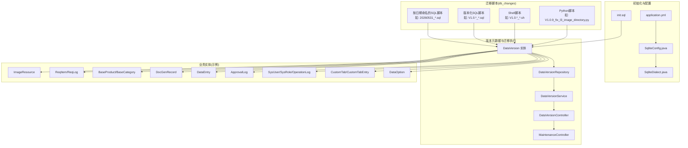
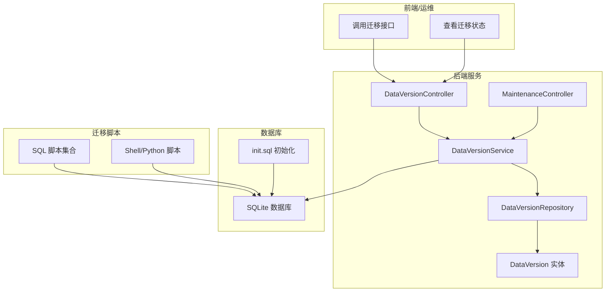
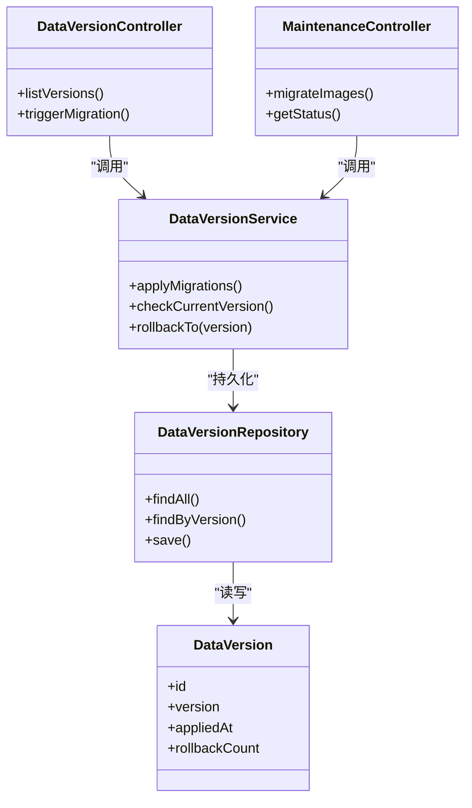
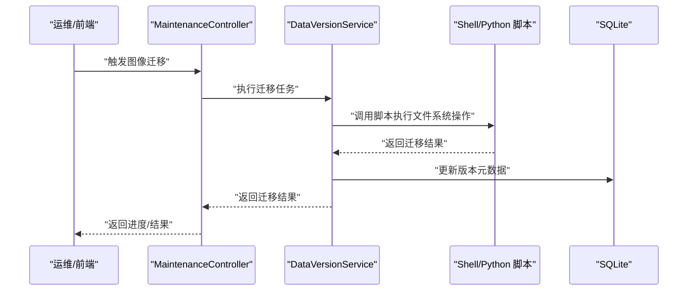
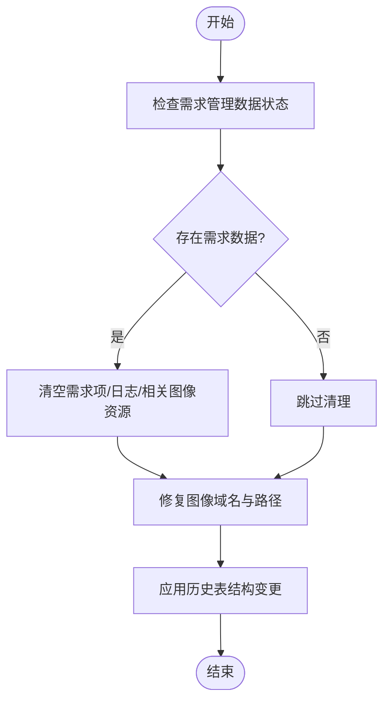
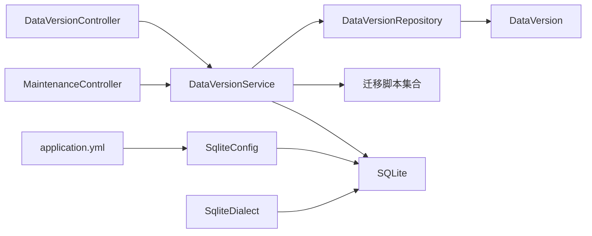

# 数据库迁移管理

<cite>
**本文引用的文件**
- [db_changes/20260531_add_requirement_tables.sql](file://db_changes/20260531_add_requirement_tables.sql)
- [db_changes/20260531_add_req_item_type.sql](file://db_changes/20260531_add_req_item_type.sql)
- [db_changes/20260531_add_doc_gen_record_doc_name.sql](file://db_changes/20260531_add_doc_gen_record_doc_name.sql)
- [db_changes/20260531_add_version_rollback_and_req_domain.sql](file://db_changes/20260531_add_version_rollback_and_req_domain.sql)
- [db_changes/20260531_clear_requirement_data.sql](file://db_changes/20260531_clear_requirement_data.sql)
- [db_changes/20260531_fix_req_image_domain.sql](file://db_changes/20260531_fix_req_image_domain.sql)
- [db_changes/20260531_historical_schema_changes.sql](file://db_changes/20260531_historical_schema_changes.sql)
- [db_changes/20260531_req_images_directory.sql](file://db_changes/20260531_req_images_directory.sql)
- [db_changes/20260602_add_base_product_table.sql](file://db_changes/20260602_add_base_product_table.sql)
- [db_changes/20260602_add_product_category_tables.sql](file://db_changes/20260602_add_product_category_tables.sql)
- [db_changes/V1.0.10_cleanup_5_6_2_images.sql](file://db_changes/V1.0.10_cleanup_5_6_2_images.sql)
- [db_changes/V1.0.10_cleanup_5_6_2_images.sh](file://db_changes/V1.0.10_cleanup_5_6_2_images.sh)
- [db_changes/V1.0.10_fix_truncated_pngs.sh](file://db_changes/V1.0.10_fix_truncated_pngs.sh)
- [db_changes/V1.0.12_add_col_intelligent.sql](file://db_changes/V1.0.12_add_col_intelligent.sql)
- [db_changes/V1.0.12_fix_l3_images_535.sql](file://db_changes/V1.0.12_fix_l3_images_535.sql)
- [db_changes/V1.0.2_fix_hierarchy_level_and_parent.sql](file://db_changes/V1.0.2_fix_hierarchy_level_and_parent.sql)
- [db_changes/V1.0.4_add_image_width_height.sql](file://db_changes/V1.0.4_add_image_width_height.sql)
- [db_changes/V1.0.6_add_last_login_at_and_operation_log.sql](file://db_changes/V1.0.6_add_last_login_at_and_operation_log.sql)
- [db_changes/V1.0.7_fix_image_directory_depth.sql](file://db_changes/V1.0.7_fix_image_directory_depth.sql)
- [db_changes/V1.0.7_fix_v6_image_url.sql](file://db_changes/V1.0.7_fix_v6_image_url.sql)
- [db_changes/V1.0.7_migrate_image_files.sh](file://db_changes/V1.0.7_migrate_image_files.sh)
- [db_changes/V1.0.8_add_image_product_id.sql](file://db_changes/V1.0.8_add_image_product_id.sql)
- [db_changes/V1.0.9_fix_l3_images.sql](file://db_changes/V1.0.9_fix_l3_images.sql)
- [db_changes/V1.0.9_fix_l3_images_move.sh](file://db_changes/V1.0.9_fix_l3_images_move.sh)
- [db_changes/V1.0.9_fix_l3_image_directory.py](file://db_changes/V1.0.9_fix_l3_image_directory.py)
- [src/main/resources/db/init.sql](file://src/main/resources/db/init.sql)
- [src/main/java/com/superpower/modules/version/controller/DataVersionController.java](file://src/main/java/com/superpower/modules/version/controller/DataVersionController.java)
- [src/main/java/com/superpower/modules/version/entity/DataVersion.java](file://src/main/java/com/superpower/modules/version/entity/DataVersion.java)
- [src/main/java/com/superpower/modules/version/repository/DataVersionRepository.java](file://src/main/java/com/superpower/modules/version/repository/DataVersionRepository.java)
- [src/main/java/com/superpower/modules/version/service/DataVersionService.java](file://src/main/java/com/superpower/modules/version/service/DataVersionService.java)
- [src/main/java/com/superpower/modules/system/controller/MaintenanceController.java](file://src/main/java/com/superpower/modules/system/controller/MaintenanceController.java)
- [src/main/java/com/superpower/modules/image/service/ImageResourceService.java](file://src/main/java/com/superpower/modules/image/service/ImageResourceService.java)
- [src/main/java/com/superpower/modules/image/dto/MigrationTaskProgress.java](file://src/main/java/com/superpower/modules/image/dto/MigrationTaskProgress.java)
- [src/main/java/com/superpower/modules/image/dto/MigrationResult.java](file://src/main/java/com/superpower/modules/image/dto/MigrationResult.java)
- [src/main/java/com/superpower/modules/image/dto/ImageMigrationStatus.java](file://src/main/java/com/superpower/modules/image/dto/ImageMigrationStatus.java)
- [src/main/java/com/superpower/modules/requirement/service/RequirementService.java](file://src/main/java/com/superpower/modules/requirement/service/RequirementService.java)
- [src/main/java/com/superpower/modules/requirement/entity/ReqItem.java](file://src/main/java/com/superpower/modules/requirement/entity/ReqItem.java)
- [src/main/java/com/superpower/modules/requirement/entity/ReqLog.java](file://src/main/java/com/superpower/modules/requirement/entity/ReqLog.java)
- [src/main/java/com/superpower/modules/requirement/repository/ReqItemRepository.java](file://src/main/java/com/superpower/modules/requirement/repository/ReqItemRepository.java)
- [src/main/java/com/superpower/modules/requirement/repository/ReqLogRepository.java](file://src/main/java/com/superpower/modules/requirement/repository/ReqLogRepository.java)
- [src/main/java/com/superpower/modules/category/entity/BaseProduct.java](file://src/main/java/com/superpower/modules/category/entity/BaseProduct.java)
- [src/main/java/com/superpower/modules/category/entity/BaseCategory.java](file://src/main/java/com/superpower/modules/category/entity/BaseCategory.java)
- [src/main/java/com/superpower/modules/category/entity/BaseProductL1.java](file://src/main/java/com/superpower/modules/category/entity/BaseProductL1.java)
- [src/main/java/com/superpower/modules/category/entity/BaseProductL2.java](file://src/main/java/com/superpower/modules/category/entity/BaseProductL2.java)
- [src/main/java/com/superpower/modules/category/repository/BaseProductRepository.java](file://src/main/java/com/superpower/modules/category/repository/BaseProductRepository.java)
- [src/main/java/com/superpower/modules/category/repository/BaseCategoryRepository.java](file://src/main/java/com/superpower/modules/category/repository/BaseCategoryRepository.java)
- [src/main/java/com/superpower/modules/category/repository/BaseProductL1Repository.java](file://src/main/java/com/superpower/modules/category/repository/BaseProductL1Repository.java)
- [src/main/java/com/superpower/modules/category/repository/BaseProductL2Repository.java](file://src/main/java/com/superpower/modules/category/repository/BaseProductL2Repository.java)
- [src/main/java/com/superpower/modules/document/entity/DocGenRecord.java](file://src/main/java/com/superpower/modules/document/entity/DocGenRecord.java)
- [src/main/java/com/superpower/modules/document/repository/DocGenRecordRepository.java](file://src/main/java/com/superpower/modules/document/repository/DocGenRecordRepository.java)
- [src/main/java/com/superpower/modules/data/entity/DataEntry.java](file://src/main/java/com/superpower/modules/data/entity/DataEntry.java)
- [src/main/java/com/superpower/modules/data/repository/DataEntryRepository.java](file://src/main/java/com/superpower/modules/data/repository/DataEntryRepository.java)
- [src/main/java/com/superpower/modules/approval/entity/ApprovalLog.java](file://src/main/java/com/superpower/modules/approval/entity/ApprovalLog.java)
- [src/main/java/com/superpower/modules/approval/repository/ApprovalLogRepository.java](file://src/main/java/com/superpower/modules/approval/repository/ApprovalLogRepository.java)
- [src/main/java/com/superpower/modules/system/entity/SysUser.java](file://src/main/java/com/superpower/modules/system/entity/SysUser.java)
- [src/main/java/com/superpower/modules/system/entity/SysRole.java](file://src/main/java/com/superpower/modules/system/entity/SysRole.java)
- [src/main/java/com/superpower/modules/system/entity/OperationLog.java](file://src/main/java/com/superpower/modules/system/entity/OperationLog.java)
- [src/main/java/com/superpower/modules/system/repository/SysUserRepository.java](file://src/main/java/com/superpower/modules/system/repository/SysUserRepository.java)
- [src/main/java/com/superpower/modules/system/repository/SysRoleRepository.java](file://src/main/java/com/superpower/modules/system/repository/SysRoleRepository.java)
- [src/main/java/com/superpower/modules/system/repository/OperationLogRepository.java](file://src/main/java/com/superpower/modules/system/repository/OperationLogRepository.java)
- [src/main/java/com/superpower/modules/customtab/entity/CustomTab.java](file://src/main/java/com/superpower/modules/customtab/entity/CustomTab.java)
- [src/main/java/com/superpower/modules/customtab/entity/CustomTabEntry.java](file://src/main/java/com/superpower/modules/customtab/entity/CustomTabEntry.java)
- [src/main/java/com/superpower/modules/customtab/repository/CustomTabRepository.java](file://src/main/java/com/superpower/modules/customtab/repository/CustomTabRepository.java)
- [src/main/java/com/superpower/modules/customtab/repository/CustomTabEntryRepository.java](file://src/main/java/com/superpower/modules/customtab/repository/CustomTabEntryRepository.java)
- [src/main/java/com/superpower/modules/option/entity/DataOption.java](file://src/main/java/com/superpower/modules/option/entity/DataOption.java)
- [src/main/java/com/superpower/modules/option/repository/DataOptionRepository.java](file://src/main/java/com/superpower/modules/option/repository/DataOptionRepository.java)
- [src/main/java/com/superpower/modules/image/entity/ImageResource.java](file://src/main/java/com/superpower/modules/image/entity/ImageResource.java)
- [src/main/java/com/superpower/modules/image/repository/ImageResourceRepository.java](file://src/main/java/com/superpower/modules/image/repository/ImageResourceRepository.java)
- [src/main/java/com/superpower/common/SqliteConfig.java](file://src/main/java/com/superpower/common/SqliteConfig.java)
- [src/main/java/com/superpower/common/SqliteDialect.java](file://src/main/java/com/superpower/common/SqliteDialect.java)
- [src/main/resources/application.yml](file://src/main/resources/application.yml)
</cite>

## 目录
1. [简介](#简介)
2. [项目结构](#项目结构)
3. [核心组件](#核心组件)
4. [架构总览](#架构总览)
5. [详细组件分析](#详细组件分析)
6. [依赖分析](#依赖分析)
7. [性能考虑](#性能考虑)
8. [故障排查指南](#故障排查指南)
9. [结论](#结论)
10. [附录](#附录)

## 简介
本文件面向产品清单管理系统的数据库迁移与版本控制，系统采用 SQLite 作为本地数据库，通过“按时间戳+语义化版本”的混合命名策略组织 SQL 迁移脚本，并辅以 Shell 脚本与 Python 脚本完成图像资源的目录与文件层面的迁移与修复。迁移脚本覆盖以下方面：
- 新增表结构与字段
- 索引与约束优化
- 历史数据清理与修复
- 图像资源目录层级与 URL 规范化
- 版本元数据与回滚计数维护

同时，系统提供基于 Spring Boot 的版本元数据实体与服务层，用于记录当前数据库版本及迁移状态；在运维侧，通过维护接口与图像迁移 DTO 支持在线迁移任务的进度与结果反馈。

## 项目结构
数据库迁移相关文件主要位于 db_changes 目录，包含大量以日期前缀命名的 SQL 脚本以及若干 Shell/Python 脚本；初始化 SQL 位于资源目录中；版本元数据与迁移执行相关的后端代码位于 Java 模块中。

图表来源
- [db_changes/20260531_add_requirement_tables.sql](file://db_changes/20260531_add_requirement_tables.sql)
- [db_changes/V1.0.10_cleanup_5_6_2_images.sql](file://db_changes/V1.0.10_cleanup_5_6_2_images.sql)
- [db_changes/V1.0.7_migrate_image_files.sh](file://db_changes/V1.0.7_migrate_image_files.sh)
- [src/main/resources/db/init.sql](file://src/main/resources/db/init.sql)
- [src/main/java/com/superpower/common/SqliteConfig.java](file://src/main/java/com/superpower/common/SqliteConfig.java)
- [src/main/java/com/superpower/common/SqliteDialect.java](file://src/main/java/com/superpower/common/SqliteDialect.java)
- [src/main/java/com/superpower/modules/version/entity/DataVersion.java](file://src/main/java/com/superpower/modules/version/entity/DataVersion.java)
- [src/main/java/com/superpower/modules/version/repository/DataVersionRepository.java](file://src/main/java/com/superpower/modules/version/repository/DataVersionRepository.java)
- [src/main/java/com/superpower/modules/version/service/DataVersionService.java](file://src/main/java/com/superpower/modules/version/service/DataVersionService.java)
- [src/main/java/com/superpower/modules/version/controller/DataVersionController.java](file://src/main/java/com/superpower/modules/version/controller/DataVersionController.java)
- [src/main/java/com/superpower/modules/system/controller/MaintenanceController.java](file://src/main/java/com/superpower/modules/system/controller/MaintenanceController.java)

章节来源
- [db_changes/20260531_add_requirement_tables.sql](file://db_changes/20260531_add_requirement_tables.sql)
- [db_changes/V1.0.10_cleanup_5_6_2_images.sql](file://db_changes/V1.0.10_cleanup_5_6_2_images.sql)
- [src/main/resources/db/init.sql](file://src/main/resources/db/init.sql)
- [src/main/java/com/superpower/common/SqliteConfig.java](file://src/main/java/com/superpower/common/SqliteConfig.java)
- [src/main/java/com/superpower/common/SqliteDialect.java](file://src/main/java/com/superpower/common/SqliteDialect.java)

## 核心组件
- 迁移脚本组织与命名
  - 日期前缀脚本：用于一次性结构变更与历史数据处理，如新增表、字段、索引等。
  - 版本化脚本：以 V1.0.x 前缀命名，聚焦功能迭代与修复，如图像目录修复、URL 规范化、列扩展等。
  - Shell/Python 辅助脚本：用于文件系统层面的图像迁移与目录修复。
- 版本元数据与迁移执行
  - DataVersion 实体与仓库：记录当前数据库版本号、迁移时间、回滚计数等。
  - DataVersionService：封装迁移执行逻辑，提供幂等性与事务保障。
  - DataVersionController 与 MaintenanceController：对外暴露迁移查询与触发接口。
- 初始化与配置
  - init.sql：应用启动时初始化基础表结构。
  - application.yml + SqliteConfig/SqliteDialect：配置 SQLite 数据源与方言。

章节来源
- [src/main/java/com/superpower/modules/version/entity/DataVersion.java](file://src/main/java/com/superpower/modules/version/entity/DataVersion.java)
- [src/main/java/com/superpower/modules/version/repository/DataVersionRepository.java](file://src/main/java/com/superpower/modules/version/repository/DataVersionRepository.java)
- [src/main/java/com/superpower/modules/version/service/DataVersionService.java](file://src/main/java/com/superpower/modules/version/service/DataVersionService.java)
- [src/main/java/com/superpower/modules/version/controller/DataVersionController.java](file://src/main/java/com/superpower/modules/version/controller/DataVersionController.java)
- [src/main/java/com/superpower/modules/system/controller/MaintenanceController.java](file://src/main/java/com/superpower/modules/system/controller/MaintenanceController.java)
- [src/main/resources/db/init.sql](file://src/main/resources/db/init.sql)
- [src/main/resources/application.yml](file://src/main/resources/application.yml)
- [src/main/java/com/superpower/common/SqliteConfig.java](file://src/main/java/com/superpower/common/SqliteConfig.java)
- [src/main/java/com/superpower/common/SqliteDialect.java](file://src/main/java/com/superpower/common/SqliteDialect.java)

## 架构总览
下图展示迁移脚本、版本元数据与后端服务之间的交互关系，以及初始化流程与运行时配置。

图表来源
- [src/main/java/com/superpower/modules/version/controller/DataVersionController.java](file://src/main/java/com/superpower/modules/version/controller/DataVersionController.java)
- [src/main/java/com/superpower/modules/system/controller/MaintenanceController.java](file://src/main/java/com/superpower/modules/system/controller/MaintenanceController.java)
- [src/main/java/com/superpower/modules/version/service/DataVersionService.java](file://src/main/java/com/superpower/modules/version/service/DataVersionService.java)
- [src/main/java/com/superpower/modules/version/repository/DataVersionRepository.java](file://src/main/java/com/superpower/modules/version/repository/DataVersionRepository.java)
- [src/main/java/com/superpower/modules/version/entity/DataVersion.java](file://src/main/java/com/superpower/modules/version/entity/DataVersion.java)
- [src/main/resources/db/init.sql](file://src/main/resources/db/init.sql)
- [db_changes/V1.0.10_cleanup_5_6_2_images.sql](file://db_changes/V1.0.10_cleanup_5_6_2_images.sql)
- [db_changes/V1.0.7_migrate_image_files.sh](file://db_changes/V1.0.7_migrate_image_files.sh)

## 详细组件分析

### 迁移脚本组织与命名规范
- 命名策略
  - 日期前缀：YYYYMMDD_语义化描述.sql，便于按时间线追溯与排序。
  - 版本化前缀：V1.0.x_语义化描述.sql/sh/py，用于与产品版本对齐。
- 执行顺序
  - 日期前缀脚本优先于版本化脚本，确保基础结构先就绪。
  - 同一日期内的脚本按文件名字典序执行。
- 脚本类型
  - SQL：结构变更、数据清理、字段扩展。
  - Shell/Python：文件系统级迁移与修复（如图像目录层级调整）。

章节来源
- [db_changes/20260531_add_requirement_tables.sql](file://db_changes/20260531_add_requirement_tables.sql)
- [db_changes/V1.0.10_cleanup_5_6_2_images.sql](file://db_changes/V1.0.10_cleanup_5_6_2_images.sql)
- [db_changes/V1.0.7_migrate_image_files.sh](file://db_changes/V1.0.7_migrate_image_files.sh)
- [db_changes/V1.0.9_fix_l3_image_directory.py](file://db_changes/V1.0.9_fix_l3_image_directory.py)

### 版本元数据与迁移执行
- DataVersion 实体
  - 记录当前数据库版本、迁移时间、回滚计数等，作为迁移状态的权威来源。
- DataVersionService
  - 提供迁移执行、幂等校验、事务边界控制，确保迁移过程可重复、可恢复。
- DataVersionController 与 MaintenanceController
  - 对外暴露查询与触发接口，支持运维侧按需执行或检查迁移状态。

图表来源
- [src/main/java/com/superpower/modules/version/entity/DataVersion.java](file://src/main/java/com/superpower/modules/version/entity/DataVersion.java)
- [src/main/java/com/superpower/modules/version/repository/DataVersionRepository.java](file://src/main/java/com/superpower/modules/version/repository/DataVersionRepository.java)
- [src/main/java/com/superpower/modules/version/service/DataVersionService.java](file://src/main/java/com/superpower/modules/version/service/DataVersionService.java)
- [src/main/java/com/superpower/modules/version/controller/DataVersionController.java](file://src/main/java/com/superpower/modules/version/controller/DataVersionController.java)
- [src/main/java/com/superpower/modules/system/controller/MaintenanceController.java](file://src/main/java/com/superpower/modules/system/controller/MaintenanceController.java)

章节来源
- [src/main/java/com/superpower/modules/version/entity/DataVersion.java](file://src/main/java/com/superpower/modules/version/entity/DataVersion.java)
- [src/main/java/com/superpower/modules/version/repository/DataVersionRepository.java](file://src/main/java/com/superpower/modules/version/repository/DataVersionRepository.java)
- [src/main/java/com/superpower/modules/version/service/DataVersionService.java](file://src/main/java/com/superpower/modules/version/service/DataVersionService.java)
- [src/main/java/com/superpower/modules/version/controller/DataVersionController.java](file://src/main/java/com/superpower/modules/version/controller/DataVersionController.java)
- [src/main/java/com/superpower/modules/system/controller/MaintenanceController.java](file://src/main/java/com/superpower/modules/system/controller/MaintenanceController.java)

### 图像资源迁移与修复
- 目录层级修复
  - 将图像目录从 L4+ 降级到 L3，统一路径结构，减少访问复杂度。
- URL 规范化
  - 修复 v6 中残留的旧版 URL，确保静态资源可访问。
- 文件系统迁移
  - 使用 Shell/Python 脚本批量移动与重命名文件，保证一致性。
- 进度与结果反馈
  - 通过 MigrationTaskProgress、MigrationResult、ImageMigrationStatus DTO 提供迁移进度与结果。

图表来源
- [src/main/java/com/superpower/modules/system/controller/MaintenanceController.java](file://src/main/java/com/superpower/modules/system/controller/MaintenanceController.java)
- [src/main/java/com/superpower/modules/version/service/DataVersionService.java](file://src/main/java/com/superpower/modules/version/service/DataVersionService.java)
- [db_changes/V1.0.7_migrate_image_files.sh](file://db_changes/V1.0.7_migrate_image_files.sh)
- [db_changes/V1.0.9_fix_l3_images_move.sh](file://db_changes/V1.0.9_fix_l3_images_move.sh)
- [db_changes/V1.0.9_fix_l3_image_directory.py](file://db_changes/V1.0.9_fix_l3_image_directory.py)

章节来源
- [db_changes/V1.0.7_fix_image_directory_depth.sql](file://db_changes/V1.0.7_fix_image_directory_depth.sql)
- [db_changes/V1.0.7_fix_v6_image_url.sql](file://db_changes/V1.0.7_fix_v6_image_url.sql)
- [db_changes/V1.0.9_fix_l3_images.sql](file://db_changes/V1.0.9_fix_l3_images.sql)
- [db_changes/V1.0.9_fix_l3_images_move.sh](file://db_changes/V1.0.9_fix_l3_images_move.sh)
- [db_changes/V1.0.9_fix_l3_image_directory.py](file://db_changes/V1.0.9_fix_l3_image_directory.py)
- [src/main/java/com/superpower/modules/image/dto/MigrationTaskProgress.java](file://src/main/java/com/superpower/modules/image/dto/MigrationTaskProgress.java)
- [src/main/java/com/superpower/modules/image/dto/MigrationResult.java](file://src/main/java/com/superpower/modules/image/dto/MigrationResult.java)
- [src/main/java/com/superpower/modules/image/dto/ImageMigrationStatus.java](file://src/main/java/com/superpower/modules/image/dto/ImageMigrationStatus.java)

### 历史数据清理与修复
- 需求管理模块的数据清理
  - 清空需求项与日志，并清理相关图像资源，避免脏数据影响后续业务。
- 需求图像域名修复
  - 统一图像资源的 URL 与路径，消除重复与冗余目录层级。
- 历史表结构变更
  - 为历史数据表新增审批状态、分类与域等字段，支撑新的业务维度。

图表来源
- [db_changes/20260531_clear_requirement_data.sql](file://db_changes/20260531_clear_requirement_data.sql)
- [db_changes/20260531_fix_req_image_domain.sql](file://db_changes/20260531_fix_req_image_domain.sql)
- [db_changes/20260531_historical_schema_changes.sql](file://db_changes/20260531_historical_schema_changes.sql)

章节来源
- [db_changes/20260531_clear_requirement_data.sql](file://db_changes/20260531_clear_requirement_data.sql)
- [db_changes/20260531_fix_req_image_domain.sql](file://db_changes/20260531_fix_req_image_domain.sql)
- [db_changes/20260531_historical_schema_changes.sql](file://db_changes/20260531_historical_schema_changes.sql)

### 业务实体与迁移关联
- 需求管理
  - req_item、req_log：新增字段与表结构，支撑需求生命周期管理。
- 产品与分类
  - base_product、base_category 及其 L1/L2 层级：新增基础产品与分类表，支撑产品树结构。
- 文档生成
  - doc_gen_record：新增文档名称字段，完善文档生成记录。
- 其他
  - image_resource、data_entry、approval_log、sys_*、custom_tab、data_option 等：结构变更与字段扩展，满足系统功能演进。

章节来源
- [db_changes/20260531_add_requirement_tables.sql](file://db_changes/20260531_add_requirement_tables.sql)
- [db_changes/20260602_add_base_product_table.sql](file://db_changes/20260602_add_base_product_table.sql)
- [db_changes/20260602_add_product_category_tables.sql](file://db_changes/20260602_add_product_category_tables.sql)
- [db_changes/20260531_add_doc_gen_record_doc_name.sql](file://db_changes/20260531_add_doc_gen_record_doc_name.sql)
- [src/main/java/com/superpower/modules/requirement/entity/ReqItem.java](file://src/main/java/com/superpower/modules/requirement/entity/ReqItem.java)
- [src/main/java/com/superpower/modules/requirement/entity/ReqLog.java](file://src/main/java/com/superpower/modules/requirement/entity/ReqLog.java)
- [src/main/java/com/superpower/modules/category/entity/BaseProduct.java](file://src/main/java/com/superpower/modules/category/entity/BaseProduct.java)
- [src/main/java/com/superpower/modules/category/entity/BaseCategory.java](file://src/main/java/com/superpower/modules/category/entity/BaseCategory.java)
- [src/main/java/com/superpower/modules/category/entity/BaseProductL1.java](file://src/main/java/com/superpower/modules/category/entity/BaseProductL1.java)
- [src/main/java/com/superpower/modules/category/entity/BaseProductL2.java](file://src/main/java/com/superpower/modules/category/entity/BaseProductL2.java)
- [src/main/java/com/superpower/modules/document/entity/DocGenRecord.java](file://src/main/java/com/superpower/modules/document/entity/DocGenRecord.java)
- [src/main/java/com/superpower/modules/data/entity/DataEntry.java](file://src/main/java/com/superpower/modules/data/entity/DataEntry.java)
- [src/main/java/com/superpower/modules/approval/entity/ApprovalLog.java](file://src/main/java/com/superpower/modules/approval/entity/ApprovalLog.java)
- [src/main/java/com/superpower/modules/system/entity/SysUser.java](file://src/main/java/com/superpower/modules/system/entity/SysUser.java)
- [src/main/java/com/superpower/modules/system/entity/SysRole.java](file://src/main/java/com/superpower/modules/system/entity/SysRole.java)
- [src/main/java/com/superpower/modules/system/entity/OperationLog.java](file://src/main/java/com/superpower/modules/system/entity/OperationLog.java)
- [src/main/java/com/superpower/modules/customtab/entity/CustomTab.java](file://src/main/java/com/superpower/modules/customtab/entity/CustomTab.java)
- [src/main/java/com/superpower/modules/customtab/entity/CustomTabEntry.java](file://src/main/java/com/superpower/modules/customtab/entity/CustomTabEntry.java)
- [src/main/java/com/superpower/modules/option/entity/DataOption.java](file://src/main/java/com/superpower/modules/option/entity/DataOption.java)
- [src/main/java/com/superpower/modules/image/entity/ImageResource.java](file://src/main/java/com/superpower/modules/image/entity/ImageResource.java)

## 依赖分析
- 组件耦合
  - DataVersionService 依赖 DataVersionRepository，负责迁移执行与状态持久化。
  - DataVersionController 与 MaintenanceController 作为入口，调用 DataVersionService。
  - 迁移脚本与业务实体解耦，通过 SQL 执行实现结构变更。
- 外部依赖
  - SQLite 数据库与方言配置由 SqliteConfig/SqliteDialect 提供。
  - 应用配置由 application.yml 提供。

图表来源
- [src/main/java/com/superpower/modules/version/controller/DataVersionController.java](file://src/main/java/com/superpower/modules/version/controller/DataVersionController.java)
- [src/main/java/com/superpower/modules/system/controller/MaintenanceController.java](file://src/main/java/com/superpower/modules/system/controller/MaintenanceController.java)
- [src/main/java/com/superpower/modules/version/service/DataVersionService.java](file://src/main/java/com/superpower/modules/version/service/DataVersionService.java)
- [src/main/java/com/superpower/modules/version/repository/DataVersionRepository.java](file://src/main/java/com/superpower/modules/version/repository/DataVersionRepository.java)
- [src/main/java/com/superpower/common/SqliteConfig.java](file://src/main/java/com/superpower/common/SqliteConfig.java)
- [src/main/java/com/superpower/common/SqliteDialect.java](file://src/main/java/com/superpower/common/SqliteDialect.java)
- [src/main/resources/application.yml](file://src/main/resources/application.yml)

章节来源
- [src/main/java/com/superpower/modules/version/controller/DataVersionController.java](file://src/main/java/com/superpower/modules/version/controller/DataVersionController.java)
- [src/main/java/com/superpower/modules/system/controller/MaintenanceController.java](file://src/main/java/com/superpower/modules/system/controller/MaintenanceController.java)
- [src/main/java/com/superpower/modules/version/service/DataVersionService.java](file://src/main/java/com/superpower/modules/version/service/DataVersionService.java)
- [src/main/java/com/superpower/common/SqliteConfig.java](file://src/main/java/com/superpower/common/SqliteConfig.java)
- [src/main/java/com/superpower/common/SqliteDialect.java](file://src/main/java/com/superpower/common/SqliteDialect.java)
- [src/main/resources/application.yml](file://src/main/resources/application.yml)

## 性能考虑
- 迁移执行
  - 使用事务包裹多个 SQL，确保原子性；对大表操作建议分批执行并添加必要索引。
- 索引与约束
  - 在频繁查询的列上建立索引，避免全表扫描；在结构变更后评估索引有效性。
- 文件系统迁移
  - Shell/Python 脚本应避免阻塞式 IO，尽量使用流式处理与并发控制，减少锁竞争。
- 版本元数据
  - DataVersion 表保持精简，仅记录必要字段，避免冗余写入。

## 故障排查指南
- 迁移失败
  - 检查 DataVersionService 的异常处理与回滚逻辑，确认是否已记录失败点。
  - 对比脚本执行顺序与版本号，定位冲突或重复执行问题。
- 图像迁移异常
  - 查看 MigrationResult 与 ImageMigrationStatus，确认具体失败步骤与文件。
  - 检查 Shell/Python 脚本权限与磁盘空间。
- 数据不一致
  - 对照历史清理脚本与修复脚本，确认是否遗漏某一步骤。
  - 使用 init.sql 与业务实体定义核对表结构一致性。

章节来源
- [src/main/java/com/superpower/modules/version/service/DataVersionService.java](file://src/main/java/com/superpower/modules/version/service/DataVersionService.java)
- [src/main/java/com/superpower/modules/image/dto/MigrationResult.java](file://src/main/java/com/superpower/modules/image/dto/MigrationResult.java)
- [src/main/java/com/superpower/modules/image/dto/ImageMigrationStatus.java](file://src/main/java/com/superpower/modules/image/dto/ImageMigrationStatus.java)

## 结论
本系统通过“日期前缀 + 版本化”的混合命名策略，结合版本元数据与后端服务，实现了可控、可观测、可回滚的数据库迁移管理。配合图像资源的文件系统迁移脚本，能够高效完成结构与数据的演进。建议在生产环境严格遵循幂等执行、事务包裹与回滚策略，并通过运维接口进行可视化监控与人工干预。

## 附录
- 迁移脚本清单（节选）
  - 日期前缀：新增需求表、字段扩展、历史结构变更、需求数据清理、需求图像域名修复、需求图片目录。
  - 版本化：V1.0.2 层级与父级修复、V1.0.4 图片宽高字段、V1.0.6 登录时间与操作日志、V1.0.7 图片目录深度修复与 v6 URL 修复、V1.0.8 图片产品 ID 关联、V1.0.9 L3 图片修复与移动、V1.0.10 5.1.3/5.6.2 图片清理、V1.0.12 智能化列与 L3 图片修复。
- 初始化与配置
  - init.sql：应用启动时初始化基础表结构。
  - application.yml + SqliteConfig/SqliteDialect：配置 SQLite 数据源与方言。

章节来源
- [db_changes/20260531_add_requirement_tables.sql](file://db_changes/20260531_add_requirement_tables.sql)
- [db_changes/20260531_add_req_item_type.sql](file://db_changes/20260531_add_req_item_type.sql)
- [db_changes/20260531_add_doc_gen_record_doc_name.sql](file://db_changes/20260531_add_doc_gen_record_doc_name.sql)
- [db_changes/20260531_add_version_rollback_and_req_domain.sql](file://db_changes/20260531_add_version_rollback_and_req_domain.sql)
- [db_changes/20260531_clear_requirement_data.sql](file://db_changes/20260531_clear_requirement_data.sql)
- [db_changes/20260531_fix_req_image_domain.sql](file://db_changes/20260531_fix_req_image_domain.sql)
- [db_changes/20260531_historical_schema_changes.sql](file://db_changes/20260531_historical_schema_changes.sql)
- [db_changes/20260531_req_images_directory.sql](file://db_changes/20260531_req_images_directory.sql)
- [db_changes/20260602_add_base_product_table.sql](file://db_changes/20260602_add_base_product_table.sql)
- [db_changes/20260602_add_product_category_tables.sql](file://db_changes/20260602_add_product_category_tables.sql)
- [db_changes/V1.0.2_fix_hierarchy_level_and_parent.sql](file://db_changes/V1.0.2_fix_hierarchy_level_and_parent.sql)
- [db_changes/V1.0.4_add_image_width_height.sql](file://db_changes/V1.0.4_add_image_width_height.sql)
- [db_changes/V1.0.6_add_last_login_at_and_operation_log.sql](file://db_changes/V1.0.6_add_last_login_at_and_operation_log.sql)
- [db_changes/V1.0.7_fix_image_directory_depth.sql](file://db_changes/V1.0.7_fix_image_directory_depth.sql)
- [db_changes/V1.0.7_fix_v6_image_url.sql](file://db_changes/V1.0.7_fix_v6_image_url.sql)
- [db_changes/V1.0.8_add_image_product_id.sql](file://db_changes/V1.0.8_add_image_product_id.sql)
- [db_changes/V1.0.9_fix_l3_images.sql](file://db_changes/V1.0.9_fix_l3_images.sql)
- [db_changes/V1.0.10_cleanup_5_6_2_images.sql](file://db_changes/V1.0.10_cleanup_5_6_2_images.sql)
- [db_changes/V1.0.12_add_col_intelligent.sql](file://db_changes/V1.0.12_add_col_intelligent.sql)
- [db_changes/V1.0.12_fix_l3_images_535.sql](file://db_changes/V1.0.12_fix_l3_images_535.sql)
- [src/main/resources/db/init.sql](file://src/main/resources/db/init.sql)
- [src/main/resources/application.yml](file://src/main/resources/application.yml)
- [src/main/java/com/superpower/common/SqliteConfig.java](file://src/main/java/com/superpower/common/SqliteConfig.java)
- [src/main/java/com/superpower/common/SqliteDialect.java](file://src/main/java/com/superpower/common/SqliteDialect.java)