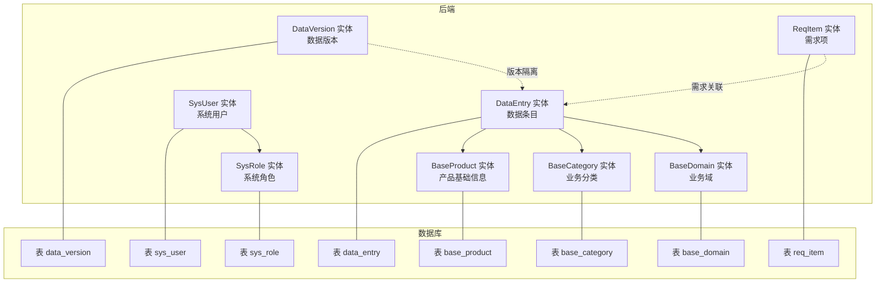
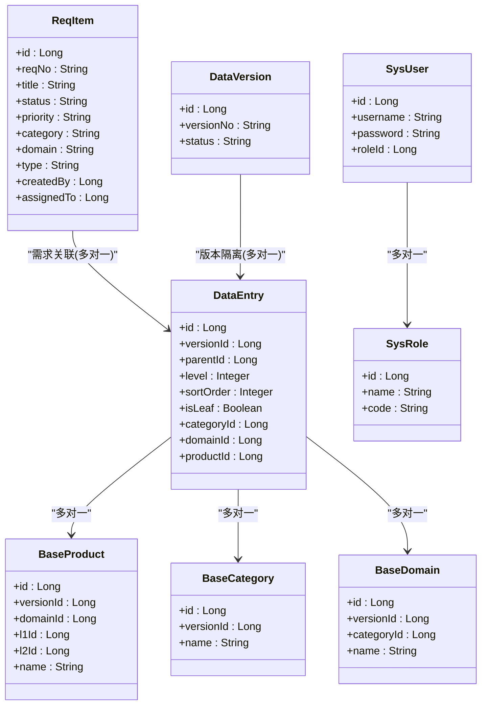
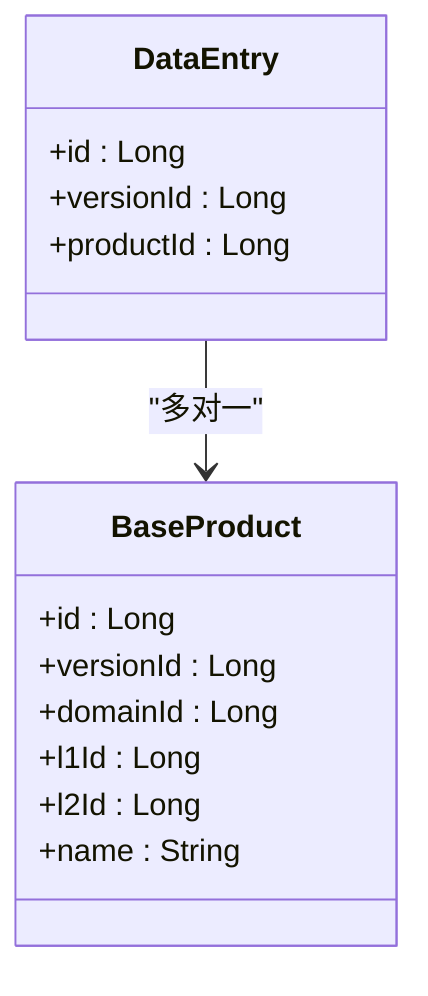
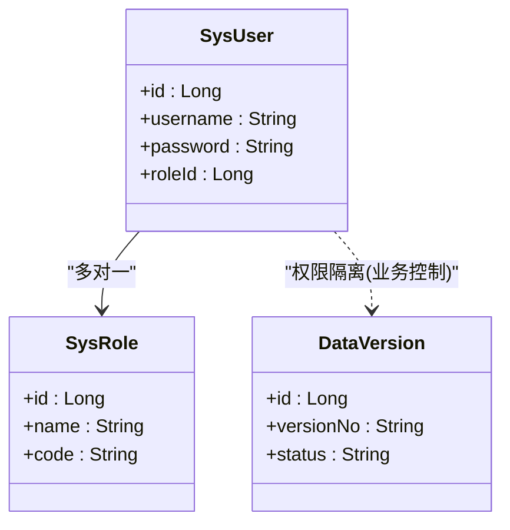
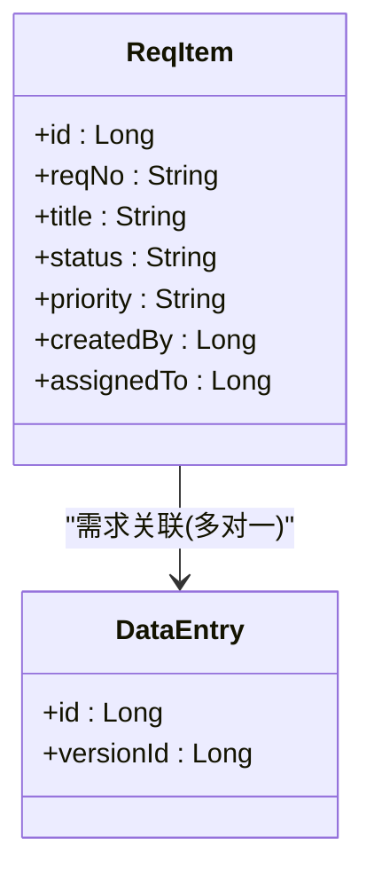
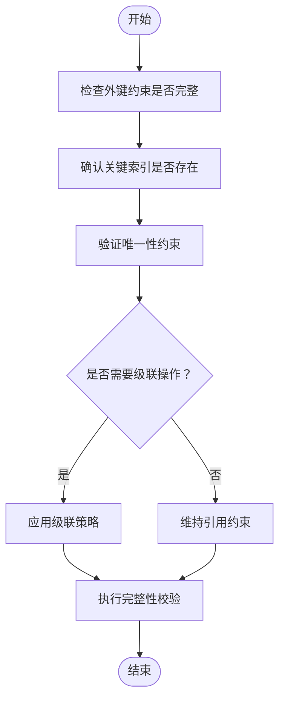
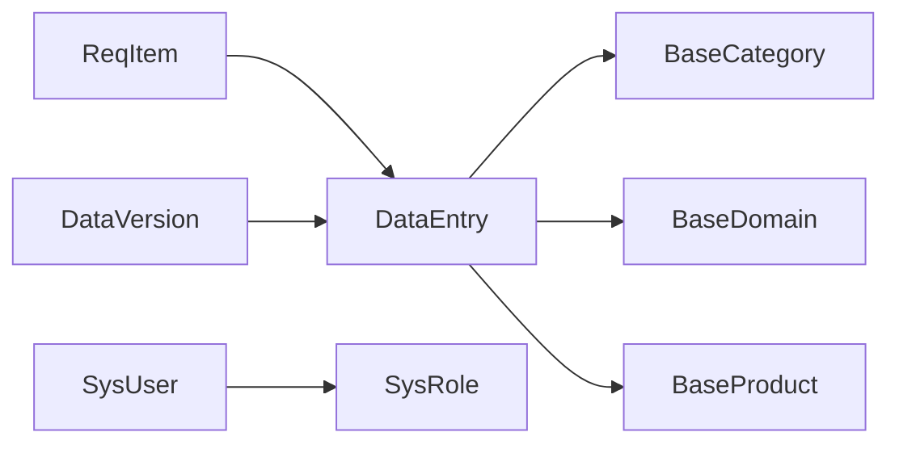

# 实体关系映射

<cite>
**本文引用的文件**
- [src/main/java/com/superpower/modules/data/entity/DataEntry.java](file://src/main/java/com/superpower/modules/data/entity/DataEntry.java)
- [src/main/java/com/superpower/modules/category/entity/BaseProduct.java](file://src/main/java/com/superpower/modules/category/entity/BaseProduct.java)
- [src/main/java/com/superpower/modules/category/entity/BaseCategory.java](file://src/main/java/com/superpower/modules/category/entity/BaseCategory.java)
- [src/main/java/com/superpower/modules/category/entity/BaseDomain.java](file://src/main/java/com/superpower/modules/category/entity/BaseDomain.java)
- [src/main/java/com/superpower/modules/version/entity/DataVersion.java](file://src/main/java/com/superpower/modules/version/entity/DataVersion.java)
- [src/main/java/com/superpower/modules/system/entity/SysUser.java](file://src/main/java/com/superpower/modules/system/entity/SysUser.java)
- [src/main/java/com/superpower/modules/system/entity/SysRole.java](file://src/main/java/com/superpower/modules/system/entity/SysRole.java)
- [src/main/java/com/superpower/modules/requirement/entity/ReqItem.java](file://src/main/java/com/superpower/modules/requirement/entity/ReqItem.java)
- [db_changes/V1.0.2_fix_hierarchy_level_and_parent.sql](file://db_changes/V1.0.2_fix_hierarchy_level_and_parent.sql)
</cite>

## 目录
1. [简介](#简介)
2. [项目结构](#项目结构)
3. [核心组件](#核心组件)
4. [架构总览](#架构总览)
5. [详细组件分析](#详细组件分析)
6. [依赖分析](#依赖分析)
7. [性能考量](#性能考量)
8. [故障排查指南](#故障排查指南)
9. [结论](#结论)
10. [附录](#附录)

## 简介
本技术文档聚焦于产品清单管理系统的实体关系映射（ERD），系统性阐述各实体之间的关联关系（一对一、一对多、多对多）、外键约束设计原则与数据库完整性保障，并深入解析以下关键映射：
- DataEntry 与 BaseProduct 的层级关系映射
- SysUser 与 DataVersion 的权限关联
- ReqItem 与 DataEntry 的需求关联

同时，提供完整的实体关系图（含基数约束与关系类型标注），并总结关系映射的最佳实践与性能优化建议。

## 项目结构
系统采用分层架构，后端以 JPA 实体为核心，结合数据库迁移脚本定义表结构与索引；前端通过 API 与后端交互，支撑产品清单的录入、版本化、权限控制与需求管理等能力。

图表来源
- [src/main/java/com/superpower/modules/data/entity/DataEntry.java:1-267](file://src/main/java/com/superpower/modules/data/entity/DataEntry.java#L1-L267)
- [src/main/java/com/superpower/modules/category/entity/BaseProduct.java:1-39](file://src/main/java/com/superpower/modules/category/entity/BaseProduct.java#L1-L39)
- [src/main/java/com/superpower/modules/category/entity/BaseCategory.java:1-30](file://src/main/java/com/superpower/modules/category/entity/BaseCategory.java#L1-L30)
- [src/main/java/com/superpower/modules/category/entity/BaseDomain.java:1-33](file://src/main/java/com/superpower/modules/category/entity/BaseDomain.java#L1-L33)
- [src/main/java/com/superpower/modules/version/entity/DataVersion.java:1-36](file://src/main/java/com/superpower/modules/version/entity/DataVersion.java#L1-L36)
- [src/main/java/com/superpower/modules/system/entity/SysUser.java:1-40](file://src/main/java/com/superpower/modules/system/entity/SysUser.java#L1-L40)
- [src/main/java/com/superpower/modules/system/entity/SysRole.java:1-27](file://src/main/java/com/superpower/modules/system/entity/SysRole.java#L1-L27)
- [src/main/java/com/superpower/modules/requirement/entity/ReqItem.java:1-60](file://src/main/java/com/superpower/modules/requirement/entity/ReqItem.java#L1-L60)

章节来源
- [src/main/java/com/superpower/modules/data/entity/DataEntry.java:1-267](file://src/main/java/com/superpower/modules/data/entity/DataEntry.java#L1-L267)
- [src/main/java/com/superpower/modules/category/entity/BaseProduct.java:1-39](file://src/main/java/com/superpower/modules/category/entity/BaseProduct.java#L1-L39)
- [src/main/java/com/superpower/modules/category/entity/BaseCategory.java:1-30](file://src/main/java/com/superpower/modules/category/entity/BaseCategory.java#L1-L30)
- [src/main/java/com/superpower/modules/category/entity/BaseDomain.java:1-33](file://src/main/java/com/superpower/modules/category/entity/BaseDomain.java#L1-L33)
- [src/main/java/com/superpower/modules/version/entity/DataVersion.java:1-36](file://src/main/java/com/superpower/modules/version/entity/DataVersion.java#L1-L36)
- [src/main/java/com/superpower/modules/system/entity/SysUser.java:1-40](file://src/main/java/com/superpower/modules/system/entity/SysUser.java#L1-L40)
- [src/main/java/com/superpower/modules/system/entity/SysRole.java:1-27](file://src/main/java/com/superpower/modules/system/entity/SysRole.java#L1-L27)
- [src/main/java/com/superpower/modules/requirement/entity/ReqItem.java:1-60](file://src/main/java/com/superpower/modules/requirement/entity/ReqItem.java#L1-L60)

## 核心组件
- DataEntry：产品清单的核心数据条目，承载多列业务字段与父子层级关系，通过 category_id、domain_id、product_id 关联到基础分类、业务域与产品。
- BaseProduct：产品基础信息，包含版本号、业务域、L1/L2 层级 ID 与名称等。
- BaseCategory：业务分类，与版本绑定，用于对数据条目进行分类。
- BaseDomain：业务域，与分类与版本绑定，用于域维度的数据组织。
- DataVersion：数据版本，用于隔离不同版本的数据，支持回滚计数。
- SysUser：系统用户，与 SysRole 建立多对一关系，体现权限归属。
- ReqItem：需求项，包含需求编号、标题、描述、状态、优先级、类别、域、类型、创建者、负责人等字段。

章节来源
- [src/main/java/com/superpower/modules/data/entity/DataEntry.java:1-267](file://src/main/java/com/superpower/modules/data/entity/DataEntry.java#L1-L267)
- [src/main/java/com/superpower/modules/category/entity/BaseProduct.java:1-39](file://src/main/java/com/superpower/modules/category/entity/BaseProduct.java#L1-L39)
- [src/main/java/com/superpower/modules/category/entity/BaseCategory.java:1-30](file://src/main/java/com/superpower/modules/category/entity/BaseCategory.java#L1-L30)
- [src/main/java/com/superpower/modules/category/entity/BaseDomain.java:1-33](file://src/main/java/com/superpower/modules/category/entity/BaseDomain.java#L1-L33)
- [src/main/java/com/superpower/modules/version/entity/DataVersion.java:1-36](file://src/main/java/com/superpower/modules/version/entity/DataVersion.java#L1-L36)
- [src/main/java/com/superpower/modules/system/entity/SysUser.java:1-40](file://src/main/java/com/superpower/modules/system/entity/SysUser.java#L1-L40)
- [src/main/java/com/superpower/modules/system/entity/SysRole.java:1-27](file://src/main/java/com/superpower/modules/system/entity/SysRole.java#L1-L27)
- [src/main/java/com/superpower/modules/requirement/entity/ReqItem.java:1-60](file://src/main/java/com/superpower/modules/requirement/entity/ReqItem.java#L1-L60)

## 架构总览
下图展示系统中与实体关系映射直接相关的类与表之间的对应关系，以及它们在业务上的职责边界。

图表来源
- [src/main/java/com/superpower/modules/data/entity/DataEntry.java:1-267](file://src/main/java/com/superpower/modules/data/entity/DataEntry.java#L1-L267)
- [src/main/java/com/superpower/modules/category/entity/BaseProduct.java:1-39](file://src/main/java/com/superpower/modules/category/entity/BaseProduct.java#L1-L39)
- [src/main/java/com/superpower/modules/category/entity/BaseCategory.java:1-30](file://src/main/java/com/superpower/modules/category/entity/BaseCategory.java#L1-L30)
- [src/main/java/com/superpower/modules/category/entity/BaseDomain.java:1-33](file://src/main/java/com/superpower/modules/category/entity/BaseDomain.java#L1-L33)
- [src/main/java/com/superpower/modules/version/entity/DataVersion.java:1-36](file://src/main/java/com/superpower/modules/version/entity/DataVersion.java#L1-L36)
- [src/main/java/com/superpower/modules/system/entity/SysUser.java:1-40](file://src/main/java/com/superpower/modules/system/entity/SysUser.java#L1-L40)
- [src/main/java/com/superpower/modules/system/entity/SysRole.java:1-27](file://src/main/java/com/superpower/modules/system/entity/SysRole.java#L1-L27)
- [src/main/java/com/superpower/modules/requirement/entity/ReqItem.java:1-60](file://src/main/java/com/superpower/modules/requirement/entity/ReqItem.java#L1-L60)

## 详细组件分析

### DataEntry 与 BaseProduct 的层级关系映射
- 映射关系
  - DataEntry 与 BaseProduct：多对一（N:1）。每个数据条目可关联一个产品，产品作为该条目的“产品基础信息”来源。
- 设计要点
  - DataEntry 中的 productId 字段作为外键指向 BaseProduct.id，形成产品维度的引用。
  - BaseProduct 包含 versionId、domainId、l1Id、l2Id 等字段，用于与版本与层级结构协同，支撑产品维度的筛选与聚合。
- 复杂度与性能
  - 查询时可通过 productId 进行快速定位，建议在 productId 上建立索引以提升关联查询性能。
- 可能的扩展
  - 若未来需要支持“一个条目对应多个产品”的场景，可在 DataEntry 与 BaseProduct 之间引入中间表，形成多对多关系。

图表来源
- [src/main/java/com/superpower/modules/data/entity/DataEntry.java:65-81](file://src/main/java/com/superpower/modules/data/entity/DataEntry.java#L65-L81)
- [src/main/java/com/superpower/modules/category/entity/BaseProduct.java:1-39](file://src/main/java/com/superpower/modules/category/entity/BaseProduct.java#L1-L39)

章节来源
- [src/main/java/com/superpower/modules/data/entity/DataEntry.java:65-81](file://src/main/java/com/superpower/modules/data/entity/DataEntry.java#L65-L81)
- [src/main/java/com/superpower/modules/category/entity/BaseProduct.java:1-39](file://src/main/java/com/superpower/modules/category/entity/BaseProduct.java#L1-L39)

### SysUser 与 DataVersion 的权限关联
- 映射关系
  - SysUser 与 SysRole：多对一（N:1）。用户归属于某个角色，角色决定其权限范围。
  - SysUser 与 DataVersion：无直接外键关联，但通过业务流程与数据可见性控制实现权限隔离。
- 设计要点
  - SysUser 通过 role_id 引用 SysRole，SysRole 提供权限编码（code）等属性，用于鉴权与授权。
  - DataVersion 通过 version_no 与 status 等字段区分版本状态，通常通过业务逻辑限制用户对特定版本的操作。
- 权限与完整性
  - 建议在业务层对用户操作版本的行为进行校验，确保仅授权用户可访问或修改对应版本的数据。
  - 在数据库层面，可通过视图或存储过程进一步封装版本访问策略，避免越权访问。

图表来源
- [src/main/java/com/superpower/modules/system/entity/SysUser.java:24-26](file://src/main/java/com/superpower/modules/system/entity/SysUser.java#L24-L26)
- [src/main/java/com/superpower/modules/system/entity/SysRole.java:1-27](file://src/main/java/com/superpower/modules/system/entity/SysRole.java#L1-L27)
- [src/main/java/com/superpower/modules/version/entity/DataVersion.java:1-36](file://src/main/java/com/superpower/modules/version/entity/DataVersion.java#L1-L36)

章节来源
- [src/main/java/com/superpower/modules/system/entity/SysUser.java:1-40](file://src/main/java/com/superpower/modules/system/entity/SysUser.java#L1-L40)
- [src/main/java/com/superpower/modules/system/entity/SysRole.java:1-27](file://src/main/java/com/superpower/modules/system/entity/SysRole.java#L1-L27)
- [src/main/java/com/superpower/modules/version/entity/DataVersion.java:1-36](file://src/main/java/com/superpower/modules/version/entity/DataVersion.java#L1-L36)

### ReqItem 与 DataEntry 的需求关联
- 映射关系
  - ReqItem 与 DataEntry：多对一（N:1）。需求项通常针对某个数据条目提出，便于追踪需求来源与变更影响。
- 设计要点
  - ReqItem 中包含 created_by、assigned_to 等字段，用于标识需求的提出者与负责人；与 DataEntry 的关联可通过业务规则或额外字段实现。
  - 需求的状态（status）与优先级（priority）等字段可用于驱动工作流与排期。
- 完整性与一致性
  - 建议在业务层校验需求与条目的关联关系，确保需求不会指向不存在的条目。
  - 对于删除或变更 DataEntry 的操作，应同步更新或清理相关 ReqItem 的关联状态。

图表来源
- [src/main/java/com/superpower/modules/requirement/entity/ReqItem.java:1-60](file://src/main/java/com/superpower/modules/requirement/entity/ReqItem.java#L1-L60)
- [src/main/java/com/superpower/modules/data/entity/DataEntry.java:1-267](file://src/main/java/com/superpower/modules/data/entity/DataEntry.java#L1-L267)

章节来源
- [src/main/java/com/superpower/modules/requirement/entity/ReqItem.java:1-60](file://src/main/java/com/superpower/modules/requirement/entity/ReqItem.java#L1-L60)
- [src/main/java/com/superpower/modules/data/entity/DataEntry.java:1-267](file://src/main/java/com/superpower/modules/data/entity/DataEntry.java#L1-L267)

### 外键约束与数据库完整性
- 外键设计原则
  - 明确主从关系：主表（如 base_category、base_domain、base_product、data_version）提供稳定标识，从表（如 data_entry）通过外键引用。
  - 保持引用一致性：所有外键字段均需在数据库层面设置非空与引用约束，防止悬挂引用。
  - 合理使用级联：根据业务需要选择 RESTRICT、CASCADE 或 SET NULL 等策略，避免误删导致数据不一致。
- 索引与约束
  - data_entry 新增字段与索引：category_id、domain_id、product_id、version_id、level、parent_id、sort_order 等字段在数据库层面通过索引提升查询效率。
  - 唯一性约束：如 sys_user.username、req_item.req_no 等字段具备唯一性，确保标识唯一。
- 完整性保障
  - 通过外键约束与索引组合，确保数据的一致性与可检索性。
  - 对于软删除或状态变更，建议通过状态字段与业务规则共同保障数据完整性。

图表来源
- [db_changes/V1.0.2_fix_hierarchy_level_and_parent.sql:9-28](file://db_changes/V1.0.2_fix_hierarchy_level_and_parent.sql#L9-L28)

章节来源
- [db_changes/V1.0.2_fix_hierarchy_level_and_parent.sql:1-28](file://db_changes/V1.0.2_fix_hierarchy_level_and_parent.sql#L1-L28)

## 依赖分析
- 组件耦合
  - DataEntry 依赖 BaseCategory、BaseDomain、BaseProduct，形成“分类-域-产品”三层引用，耦合度适中，便于扩展。
  - SysUser 依赖 SysRole，形成权限控制链，耦合度低，利于权限策略集中管理。
  - ReqItem 与 DataEntry 的关联为弱耦合，通过业务规则实现，降低直接外键依赖带来的刚性。
- 外部依赖
  - 数据库层面依赖外键与索引；JPA 层面依赖实体注解与懒加载策略，减少不必要的关联加载。
- 循环依赖
  - 当前实体间未发现循环依赖，结构清晰。

图表来源
- [src/main/java/com/superpower/modules/data/entity/DataEntry.java:68-81](file://src/main/java/com/superpower/modules/data/entity/DataEntry.java#L68-L81)
- [src/main/java/com/superpower/modules/system/entity/SysUser.java:24-26](file://src/main/java/com/superpower/modules/system/entity/SysUser.java#L24-L26)
- [src/main/java/com/superpower/modules/requirement/entity/ReqItem.java:1-60](file://src/main/java/com/superpower/modules/requirement/entity/ReqItem.java#L1-L60)
- [src/main/java/com/superpower/modules/version/entity/DataVersion.java:1-36](file://src/main/java/com/superpower/modules/version/entity/DataVersion.java#L1-L36)

章节来源
- [src/main/java/com/superpower/modules/data/entity/DataEntry.java:68-81](file://src/main/java/com/superpower/modules/data/entity/DataEntry.java#L68-L81)
- [src/main/java/com/superpower/modules/system/entity/SysUser.java:24-26](file://src/main/java/com/superpower/modules/system/entity/SysUser.java#L24-L26)
- [src/main/java/com/superpower/modules/requirement/entity/ReqItem.java:1-60](file://src/main/java/com/superpower/modules/requirement/entity/ReqItem.java#L1-L60)
- [src/main/java/com/superpower/modules/version/entity/DataVersion.java:1-36](file://src/main/java/com/superpower/modules/version/entity/DataVersion.java#L1-L36)

## 性能考量
- 索引策略
  - data_entry 上已建立按版本+层级、版本+父节点+排序、版本+层级+父节点+排序、版本+业务分类+业务域等复合索引，显著提升树形查询与层级遍历性能。
- 懒加载与批量抓取
  - DataEntry 对 BaseCategory、BaseDomain、BaseProduct 的关联使用懒加载，避免不必要的关联查询；在批量渲染树形结构时，建议使用批量抓取策略减少 N+1 查询。
- 分页与过滤
  - 对于大数据量的清单列表，建议结合版本号、业务域、业务分类等字段进行分页与过滤，减少单次查询的数据量。
- 写入优化
  - 批量插入/更新时，合理拆分事务大小，避免长时间锁表；必要时使用数据库批量接口或批处理工具。

章节来源
- [db_changes/V1.0.2_fix_hierarchy_level_and_parent.sql:18-28](file://db_changes/V1.0.2_fix_hierarchy_level_and_parent.sql#L18-L28)
- [src/main/java/com/superpower/modules/data/entity/DataEntry.java:68-81](file://src/main/java/com/superpower/modules/data/entity/DataEntry.java#L68-L81)

## 故障排查指南
- 常见问题
  - 外键约束失败：检查被引用的主表记录是否存在，确认外键字段值是否正确。
  - 查询性能差：确认是否命中了必要的索引；对于树形查询，优先使用版本+层级+父节点+排序的复合索引。
  - 懒加载异常：确保在事务范围内访问延迟关联对象，避免脱管状态下的懒加载。
- 排查步骤
  - 使用 EXPLAIN/ANALYZE 检查 SQL 执行计划，确认索引使用情况。
  - 校验唯一性字段（如用户名、需求编号）是否重复。
  - 对于权限相关问题，核对 SysUser 的 role_id 与 SysRole 的权限编码是否匹配。
- 修复建议
  - 对缺失索引的查询语句补充索引；对外键引用不一致的数据进行清洗或重建。
  - 在业务层增加输入校验与前置检查，减少数据库层面的错误。

章节来源
- [src/main/java/com/superpower/modules/system/entity/SysUser.java:24-26](file://src/main/java/com/superpower/modules/system/entity/SysUser.java#L24-L26)
- [src/main/java/com/superpower/modules/system/entity/SysRole.java:1-27](file://src/main/java/com/superpower/modules/system/entity/SysRole.java#L1-L27)
- [db_changes/V1.0.2_fix_hierarchy_level_and_parent.sql:18-28](file://db_changes/V1.0.2_fix_hierarchy_level_and_parent.sql#L18-L28)

## 结论
本系统通过清晰的实体关系设计与完善的数据库约束，实现了产品清单在版本化、权限控制与需求管理方面的稳健支撑。DataEntry 与 BaseProduct 的层级映射、SysUser 与 DataVersion 的权限关联、ReqItem 与 DataEntry 的需求关联构成了系统的核心数据通路。配合合理的索引与懒加载策略，系统在保证数据完整性的同时，具备良好的可扩展性与性能表现。

## 附录
- 关系映射最佳实践
  - 明确主从关系与外键约束，避免悬挂引用。
  - 为高频查询字段建立复合索引，覆盖排序、过滤与层级条件。
  - 使用懒加载与批量抓取平衡性能与内存占用。
  - 在业务层强化输入校验与状态机控制，减少数据库层面的异常。
- 性能优化建议
  - 树形查询优先使用版本+层级+父节点+排序的复合索引。
  - 批量操作时拆分事务，避免长事务锁竞争。
  - 对热点表进行分区或物化视图优化，降低复杂查询成本。