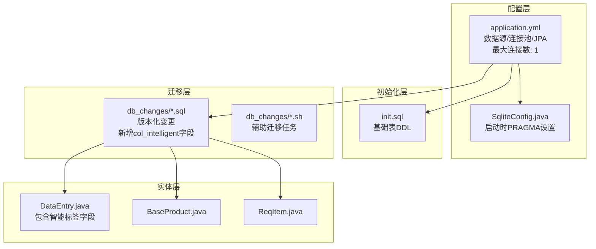
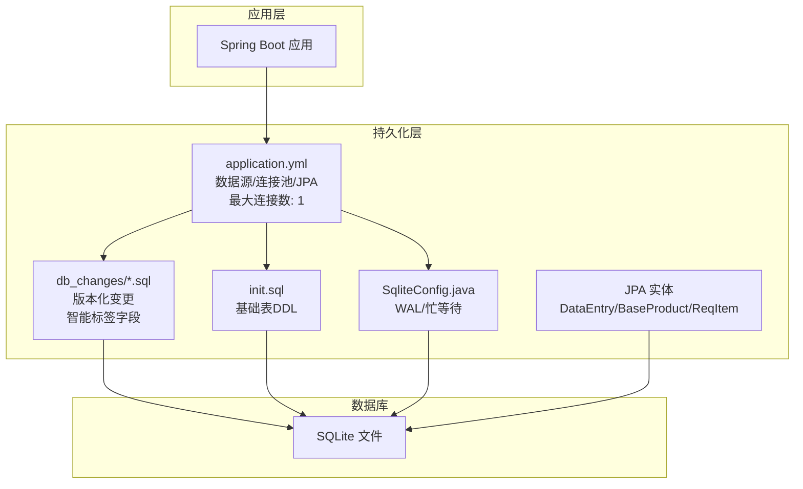
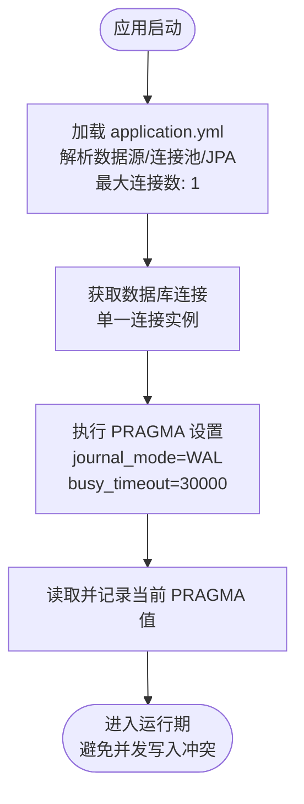
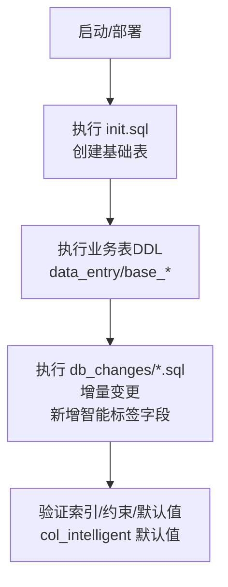
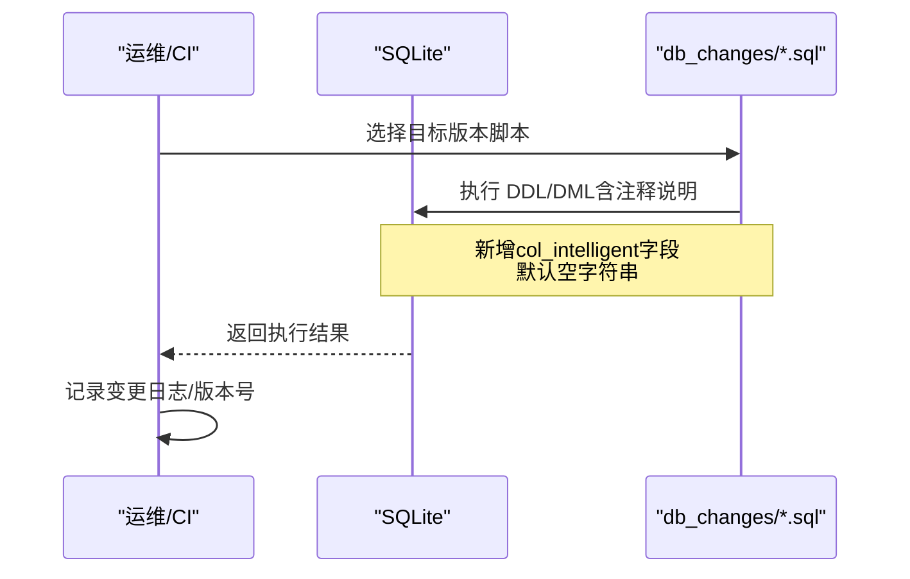
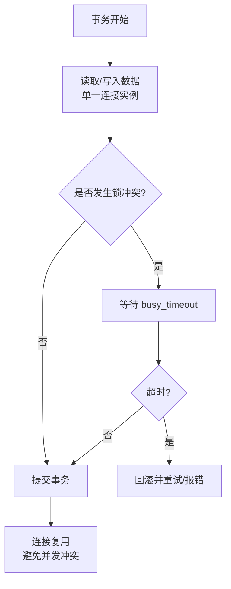
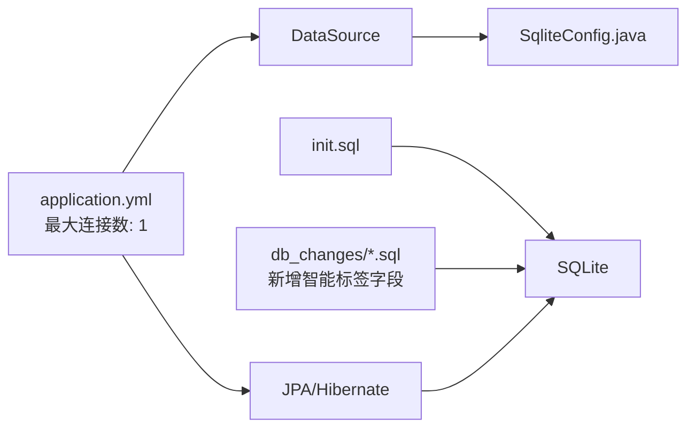

# 数据库架构设计

<cite>
**本文档引用的文件**
- [application.yml](file://src/main/resources/application.yml)
- [V1.0.12_add_col_intelligent.sql](file://db_changes/V1.0.12_add_col_intelligent.sql)
- [20260602_add_base_product_table.sql](file://db_changes/20260602_add_base_product_table.sql)
- [20260602_add_product_category_tables.sql](file://db_changes/20260602_add_product_category_tables.sql)
- [20260531_add_requirement_tables.sql](file://db_changes/20260531_add_requirement_tables.sql)
- [DataEntry.java](file://src/main/java/com/superpower/modules/data/entity/DataEntry.java)
- [BaseProduct.java](file://src/main/java/com/superpower/modules/category/entity/BaseProduct.java)
- [ReqItem.java](file://src/main/java/com/superpower/modules/requirement/entity/ReqItem.java)
- [2026-06-29-fix-sqlite-busy-snapshot.md](file://docs/superpowers/plans/2026-06-29-fix-sqlite-busy-snapshot.md)
- [DataVersionService.java](file://src/main/java/com/superpower/modules/version/service/DataVersionService.java)
- [init.sql](file://src/main/resources/db/init.sql)
</cite>

## 更新摘要
**所做更改**
- 更新了连接池优化策略：Hikari连接池最大连接数从3调整为1，解决SQLite忙快照问题
- 新增了col_intelligent智能标签字段的数据库架构设计说明
- 完善了SQLite并发控制和事务管理策略
- 增强了数据库稳定性优化方案

## 目录
1. [简介](#简介)
2. [项目结构](#项目结构)
3. [核心组件](#核心组件)
4. [架构总览](#架构总览)
5. [详细组件分析](#详细组件分析)
6. [依赖分析](#依赖分析)
7. [性能考虑](#性能考虑)
8. [故障排查指南](#故障排查指南)
9. [结论](#结论)
10. [附录](#附录)

## 简介
本文件面向产品清单管理系统，围绕其基于 SQLite 的数据库架构进行系统化技术文档编制。内容涵盖：
- SQLite 连接池与事务配置、PRAGMA 优化策略
- 初始化脚本结构与执行顺序
- 表结构设计与索引策略
- 数据库迁移管理机制（版本控制、变更追踪、回滚策略）
- 完整数据库架构图（表、索引、约束）
- 性能优化建议与监控指标

**重要更新**：本版本重点解决了SQLite忙快照问题，通过将Hikari连接池最大连接数从3调整为1，确保所有数据库操作通过单一连接执行，彻底避免并发写入冲突。

## 项目结构
与数据库相关的关键位置如下：
- 配置层：Spring Boot 应用配置文件中定义数据源、JPA/Hibernate 参数
- 初始化层：SQL 初始化脚本用于创建基础表结构
- 迁移层：db_changes 目录下的版本化 SQL 脚本与 Shell 脚本
- 实体层：JPA 实体映射到数据库表，体现字段与关系
- 运行期优化：启动时通过 PRAGMA 设置 WAL 模式与忙等待超时



**图表来源**
- [application.yml:18-34](file://src/main/resources/application.yml#L18-L34)
- [V1.0.12_add_col_intelligent.sql:1-4](file://db_changes/V1.0.12_add_col_intelligent.sql#L1-L4)
- [DataEntry.java:14-81](file://src/main/java/com/superpower/modules/data/entity/DataEntry.java#L14-L81)

**章节来源**
- [application.yml:18-34](file://src/main/resources/application.yml#L18-L34)
- [V1.0.12_add_col_intelligent.sql:1-4](file://db_changes/V1.0.12_add_col_intelligent.sql#L1-L4)

## 核心组件
- 数据源与连接池
  - 使用 HikariCP 作为连接池，最大连接数设置为1，确保SQLite单写模式下的并发安全
  - 连接超时、泄漏检测阈值在配置文件中设定，提升连接管理效率
  - JDBC URL 中显式设置了 busy_timeout，提升并发写入稳定性
- JPA/Hibernate
  - 自定义 SQLite 方言，启用自动建模（DDL 自动更新），关闭 SQL 输出便于生产环境整洁
- 启动期 PRAGMA 优化
  - 在容器启动后设置 WAL 日志模式与忙等待超时，并记录当前配置值
- 初始化脚本
  - 提供基础表结构（用户、角色、菜单、数据版本、数据条目等）的 DDL
- 迁移脚本
  - 版本化增量变更（如新增列、新增表、新增索引），并配套注释说明用途
- 实体映射
  - JPA 实体与数据库表字段一一对应，部分字段使用懒加载关联其他实体
- 智能标签字段
  - 新增 col_intelligent 字段，支持智能化标签功能，TEXT类型默认空字符串

**章节来源**
- [application.yml:18-34](file://src/main/resources/application.yml#L18-L34)
- [V1.0.12_add_col_intelligent.sql:1-4](file://db_changes/V1.0.12_add_col_intelligent.sql#L1-L4)
- [DataEntry.java:14-81](file://src/main/java/com/superpower/modules/data/entity/DataEntry.java#L14-L81)

## 架构总览
下图展示了数据库层的整体架构：配置驱动连接池与方言；初始化脚本创建基础表；迁移脚本按版本演进；实体映射支撑业务查询与写入；运行期 PRAGMA 保障并发与稳定性。



**图表来源**
- [application.yml:18-34](file://src/main/resources/application.yml#L18-L34)
- [V1.0.12_add_col_intelligent.sql:1-4](file://db_changes/V1.0.12_add_col_intelligent.sql#L1-L4)
- [DataEntry.java:14-81](file://src/main/java/com/superpower/modules/data/entity/DataEntry.java#L14-L81)

## 详细组件分析

### SQLite 连接池与事务配置
- 连接池参数
  - 最大连接数设置为1，确保SQLite单写模式下的并发安全
  - 连接超时、泄漏检测阈值在配置文件中集中定义，便于运维统一管控
- JDBC URL
  - 显式设置 busy_timeout，避免因锁冲突导致的快速失败
- PRAGMA 运行期优化
  - 启动后设置 journal_mode=WAL，显著提升并发读写能力
  - 设置 busy_timeout，缓解高并发写入时的锁等待问题
  - 记录当前 PRAGMA 值，便于诊断与审计

**更新**：为解决SQLite忙快照问题，最大连接数从3调整为1，确保所有数据库操作通过同一连接执行，彻底避免并发写入冲突。



**图表来源**
- [application.yml:18-34](file://src/main/resources/application.yml#L18-L34)
- [2026-06-29-fix-sqlite-busy-snapshot.md:27-39](file://docs/superpowers/plans/2026-06-29-fix-sqlite-busy-snapshot.md#L27-L39)

**章节来源**
- [application.yml:18-34](file://src/main/resources/application.yml#L18-L34)
- [2026-06-29-fix-sqlite-busy-snapshot.md:15-39](file://docs/superpowers/plans/2026-06-29-fix-sqlite-busy-snapshot.md#L15-L39)

### 初始化脚本结构与执行顺序
- init.sql 负责创建系统基础表，包括用户、角色、菜单、数据版本、数据条目等
- 执行顺序建议
  - 先执行基础表（如 sys_*）以确保外键依赖存在
  - 再执行业务主表（data_entry、base_*）
  - 最后执行变更脚本（db_changes/*）以补充字段与索引
- 注意事项
  - 脚本中包含 PostgreSQL 注释，实际执行需注意语法差异或预处理
  - 建议在生产环境使用受控的迁移工具或脚本编排，确保幂等性



**图表来源**
- [init.sql:44-125](file://src/main/resources/db/init.sql#L44-L125)
- [V1.0.12_add_col_intelligent.sql:1-4](file://db_changes/V1.0.12_add_col_intelligent.sql#L1-L4)

**章节来源**
- [init.sql:44-125](file://src/main/resources/db/init.sql#L44-L125)
- [V1.0.12_add_col_intelligent.sql:1-4](file://db_changes/V1.0.12_add_col_intelligent.sql#L1-L4)

### 表结构设计与索引策略
- data_entry（数据条目）
  - 主键自增，版本号、父子层级、排序、叶子节点标记等字段支撑树形结构与排序
  - 大量列用于存储多维业务字段（如产品系统、应用角色、控标点截图、财务年份等）
  - 新增 col_intelligent 智能标签字段，TEXT类型默认空字符串，"1"表示勾选智能化
  - 建议索引：按 version_id、parent_id、sort_order 组合查询场景建立复合索引
- base_product（产品 L3）
  - 关联版本、业务域、L1/L2 分类，支持三级分类体系
  - 建议索引：version_id、domain_id、l1_id、l2_id 及组合索引
- req_item（需求条目）
  - 唯一编号、标题、描述、状态、优先级、负责人、版本发布等字段
  - 建议索引：req_no、status、domain、type、created_by 等常用过滤字段

**更新**：data_entry表新增col_intelligent智能标签字段，支持智能化标签功能。

```mermaid
erDiagram
DATA_ENTRY {
bigint id PK
bigint version_id
bigint parent_id
int level
int sort_order
boolean is_leaf
varchar product_id
varchar category_id
varchar domain_id
text col_intelligent DEFAULT '' 智能化标签
text col_* 多列业务字段
}
BASE_PRODUCT {
bigint id PK
bigint version_id
bigint domain_id
bigint l1_id
bigint l2_id
varchar name
int sort_order
}
REQ_ITEM {
bigint id PK
varchar req_no UK
varchar title
text description
varchar status
varchar priority
varchar category
varchar domain
varchar type
bigint created_by
bigint assigned_to
text reject_reason
varchar released_version
}
DATA_ENTRY }o--|| BASE_PRODUCT : "可选关联"
DATA_ENTRY }o--o| BASE_CATEGORY : "可选关联"
DATA_ENTRY }o--o| BASE_DOMAIN : "可选关联"
```

**图表来源**
- [DataEntry.java:14-81](file://src/main/java/com/superpower/modules/data/entity/DataEntry.java#L14-L81)
- [V1.0.12_add_col_intelligent.sql:1-4](file://db_changes/V1.0.12_add_col_intelligent.sql#L1-L4)

**章节来源**
- [DataEntry.java:14-81](file://src/main/java/com/superpower/modules/data/entity/DataEntry.java#L14-L81)
- [V1.0.12_add_col_intelligent.sql:1-4](file://db_changes/V1.0.12_add_col_intelligent.sql#L1-L4)

### 数据库迁移管理机制
- 版本控制
  - 采用时间戳+语义版本命名（如 V1.0.x）的脚本集合，清晰记录演进路径
- 变更追踪
  - 每个脚本包含明确注释，说明新增列、表、索引及用途
- 回滚策略
  - 当前脚本未包含回滚逻辑，建议在新增列/索引时配套 DROP 语句或条件判断，确保可逆
- 执行顺序
  - 建议按"基础表 → 业务主表 → 增量变更"的顺序执行，必要时分阶段验证

**更新**：新增V1.0.12版本，包含col_intelligent智能标签字段的添加。



**图表来源**
- [V1.0.12_add_col_intelligent.sql:1-4](file://db_changes/V1.0.12_add_col_intelligent.sql#L1-L4)

**章节来源**
- [V1.0.12_add_col_intelligent.sql:1-4](file://db_changes/V1.0.12_add_col_intelligent.sql#L1-L4)

### 事务管理与并发控制
- WAL 模式
  - 启用 WAL 提升并发读写吞吐，降低锁竞争
- 忙等待超时
  - 设置 busy_timeout，避免短超时导致的写入失败
- 连接池并发
  - 通过最大连接数限制为1，确保SQLite单写模式下的并发安全
  - 结合泄漏检测阈值及时发现异常连接

**更新**：通过将最大连接数限制为1，彻底解决SQLite忙快照问题，确保删除版本等大事务操作的稳定性。



**图表来源**
- [2026-06-29-fix-sqlite-busy-snapshot.md:15-39](file://docs/superpowers/plans/2026-06-29-fix-sqlite-busy-snapshot.md#L15-L39)
- [application.yml:21-24](file://src/main/resources/application.yml#L21-L24)

**章节来源**
- [2026-06-29-fix-sqlite-busy-snapshot.md:15-39](file://docs/superpowers/plans/2026-06-29-fix-sqlite-busy-snapshot.md#L15-L39)
- [application.yml:21-24](file://src/main/resources/application.yml#L21-L24)

## 依赖分析
- 配置对运行期的影响
  - application.yml 决定数据源、连接池与 JPA 行为
  - SqliteConfig.java 在启动后对 PRAGMA 进行最终确认
- 脚本对表结构的影响
  - init.sql 与 db_changes/*.sql 共同决定最终表结构与索引
- 实体对数据库的映射
  - JPA 实体字段与表列名一致，部分字段通过懒加载关联其他实体



**图表来源**
- [application.yml:18-34](file://src/main/resources/application.yml#L18-L34)
- [V1.0.12_add_col_intelligent.sql:1-4](file://db_changes/V1.0.12_add_col_intelligent.sql#L1-L4)

**章节来源**
- [application.yml:18-34](file://src/main/resources/application.yml#L18-L34)
- [V1.0.12_add_col_intelligent.sql:1-4](file://db_changes/V1.0.12_add_col_intelligent.sql#L1-L4)

## 性能考虑
- 连接池与并发
  - 将最大连接数限制为1，避免SQLite单写模式下的并发冲突
  - 合理设置连接超时与泄漏检测阈值，防止连接泄露
- WAL 与锁
  - 使用 WAL 模式提升并发度；在高写入场景下评估 checkpoint 频率
  - busy_timeout 需结合业务重试策略，避免长时间阻塞
- 查询与索引
  - 对高频过滤与排序字段建立复合索引（如 version_id+sort_order）
  - 避免 SELECT *，仅查询必要列
- I/O 与存储
  - 将数据库文件置于高性能存储介质上
  - 定期备份与维护，避免碎片化影响查询性能
- 智能标签性能
  - col_intelligent字段为TEXT类型，默认空字符串，查询时需注意索引策略

**更新**：通过连接池优化和智能标签字段设计，提升了整体数据库性能和稳定性。

## 故障排查指南
- 连接失败/超时
  - 检查 busy_timeout 是否过小，适当增大
  - 确认最大连接数已正确设置为1
- 锁冲突频繁
  - 观察 busy_timeout 日志，评估业务重试策略
  - 确认所有事务都通过同一连接执行
- 迁移失败
  - 确认脚本执行顺序与依赖关系
  - 对于新增列/索引，建议补充回滚脚本或条件判断
- 性能下降
  - 分析慢查询，补充缺失索引
  - 检查 WAL checkpoint 频率与磁盘写入能力
- 智能标签异常
  - 验证col_intelligent字段默认值为空字符串
  - 检查智能标签查询逻辑和索引使用情况

**更新**：新增了连接池优化和智能标签字段相关的故障排查指导。

**章节来源**
- [application.yml:21-24](file://src/main/resources/application.yml#L21-L24)
- [V1.0.12_add_col_intelligent.sql:1-4](file://db_changes/V1.0.12_add_col_intelligent.sql#L1-L4)

## 结论
本系统采用 SQLite 作为轻量级数据库，通过将HikariCP连接池最大连接数限制为1，有效解决了SQLite忙快照问题，确保了并发操作的稳定性。结合 WAL 模式与优化的PRAGMA设置，在保证并发性能的同时维持较低运维复杂度。通过 init.sql 与 db_changes 的版本化迁移机制，实现从基础表到业务表的有序演进。新增的col_intelligent智能标签字段进一步增强了系统的智能化能力。建议在后续版本中继续优化查询性能和监控指标，确保系统长期稳定运行。

**更新**：本次更新重点解决了SQLite并发写入冲突问题，通过连接池优化确保了系统的稳定性和可靠性。

## 附录
- 监控指标建议
  - 连接池：活跃连接数、等待时间、泄漏连接数
  - 数据库：锁等待次数、WAL checkpoint 次数、fsync 调用频率
  - 业务查询：慢查询数量、索引命中率、平均响应时间
  - 智能标签：col_intelligent字段使用统计、查询性能分析
- 最佳实践
  - 事务短小精悍，避免跨模块长事务
  - 对高频字段建立复合索引，定期分析执行计划
  - 生产环境启用备份与恢复演练，确保迁移安全
  - 智能标签查询需考虑索引策略，避免全表扫描
- 故障预防
  - 定期检查连接池配置和数据库锁状态
  - 监控busy_timeout触发频率，及时调整业务逻辑
  - 智能标签功能需进行充分的性能测试和优化

**更新**：新增了智能标签字段的监控指标和最佳实践建议。