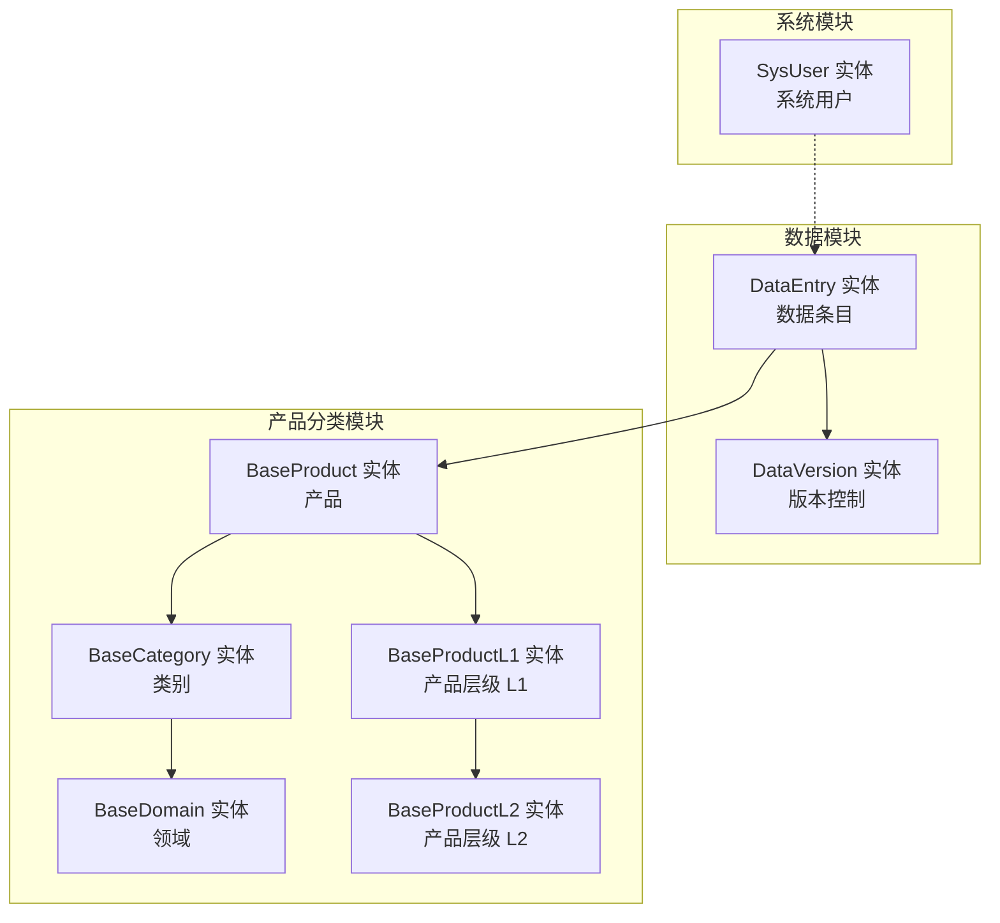
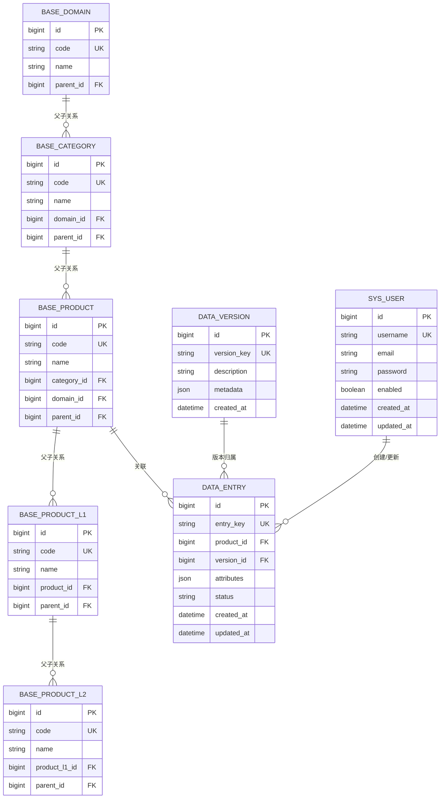
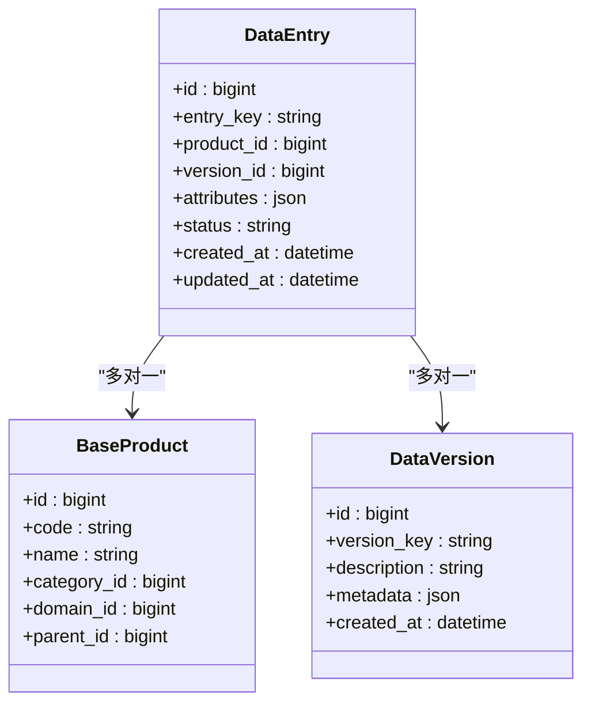
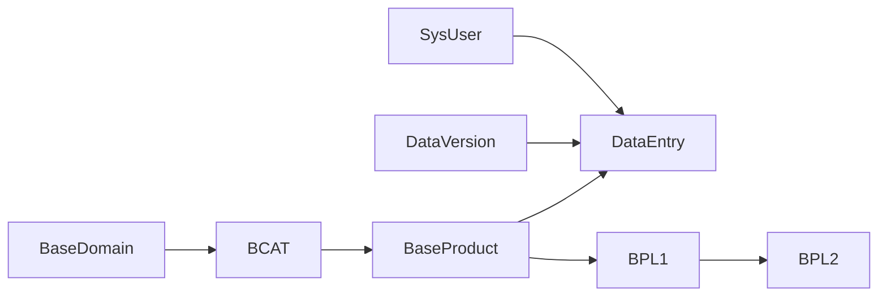

# 数据模型设计

<cite>
**本文引用的文件**
- [DataEntry.java](file://src/main/java/com/superpower/modules/data/entity/DataEntry.java)
- [SysUser.java](file://src/main/java/com/superpower/modules/system/entity/SysUser.java)
- [DataVersion.java](file://src/main/java/com/superpower/modules/version/entity/DataVersion.java)
- [BaseProduct.java](file://src/main/java/com/superpower/modules/category/entity/BaseProduct.java)
- [BaseProductL1.java](file://src/main/java/com/superpower/modules/category/entity/BaseProductL1.java)
- [BaseProductL2.java](file://src/main/java/com/superpower/modules/category/entity/BaseProductL2.java)
- [BaseCategory.java](file://src/main/java/com/superpower/modules/category/entity/BaseCategory.java)
- [BaseDomain.java](file://src/main/java/com/superpower/modules/category/entity/BaseDomain.java)
- [DataEntryRepository.java](file://src/main/java/com/superpower/modules/data/repository/DataEntryRepository.java)
- [SysUserRepository.java](file://src/main/java/com/superpower/modules/system/repository/SysUserRepository.java)
- [DataVersionRepository.java](file://src/main/java/com/superpower/modules/version/repository/DataVersionRepository.java)
- [BaseProductRepository.java](file://src/main/java/com/superpower/modules/category/repository/BaseProductRepository.java)
- [BaseProductL1Repository.java](file://src/main/java/com/superpower/modules/category/repository/BaseProductL1Repository.java)
- [BaseProductL2Repository.java](file://src/main/java/com/superpower/modules/category/repository/BaseProductL2Repository.java)
- [BaseCategoryRepository.java](file://src/main/java/com/superpower/modules/category/repository/BaseCategoryRepository.java)
- [BaseDomainRepository.java](file://src/main/java/com/superpower/modules/category/repository/BaseDomainRepository.java)
- [init.sql](file://src/main/resources/db/init.sql)
- [application.yml](file://src/main/resources/application.yml)
</cite>

## 目录
1. [简介](#简介)
2. [项目结构](#项目结构)
3. [核心组件](#核心组件)
4. [架构总览](#架构总览)
5. [详细组件分析](#详细组件分析)
6. [依赖分析](#依赖分析)
7. [性能考量](#性能考量)
8. [故障排查指南](#故障排查指南)
9. [结论](#结论)
10. [附录](#附录)

## 简介
本文件面向产品清单管理系统（Product List）的数据模型设计，聚焦于核心实体类的设计理念与实现细节，包括数据条目实体 DataEntry、系统用户实体 SysUser、版本控制实体 DataVersion，以及产品分类层级实体（BaseDomain、BaseCategory、BaseProduct、BaseProductL1、BaseProductL2）。文档从字段定义、数据类型选择、业务含义、主键策略、外键约束、索引设计与查询优化等方面进行系统化阐述，并提供实体关系图与数据字典，帮助开发者快速理解并正确使用该数据模型。

## 项目结构
系统采用分层模块化组织，数据模型位于后端 Java 工程的 modules 子包中，按功能域划分为 data、system、version、category 等模块。各模块包含对应的实体、仓库（Repository）、服务（Service）与控制器（Controller），遵循 Spring Data JPA 的约定式命名与注解驱动的持久化策略。



**图表来源**
- [DataEntry.java](file://src/main/java/com/superpower/modules/data/entity/DataEntry.java)
- [DataVersion.java](file://src/main/java/com/superpower/modules/version/entity/DataVersion.java)
- [SysUser.java](file://src/main/java/com/superpower/modules/system/entity/SysUser.java)
- [BaseProduct.java](file://src/main/java/com/superpower/modules/category/entity/BaseProduct.java)
- [BaseProductL1.java](file://src/main/java/com/superpower/modules/category/entity/BaseProductL1.java)
- [BaseProductL2.java](file://src/main/java/com/superpower/modules/category/entity/BaseProductL2.java)
- [BaseCategory.java](file://src/main/java/com/superpower/modules/category/entity/BaseCategory.java)
- [BaseDomain.java](file://src/main/java/com/superpower/modules/category/entity/BaseDomain.java)

**章节来源**
- [DataEntry.java](file://src/main/java/com/superpower/modules/data/entity/DataEntry.java)
- [SysUser.java](file://src/main/java/com/superpower/modules/system/entity/SysUser.java)
- [DataVersion.java](file://src/main/java/com/superpower/modules/version/entity/DataVersion.java)
- [BaseProduct.java](file://src/main/java/com/superpower/modules/category/entity/BaseProduct.java)
- [BaseProductL1.java](file://src/main/java/com/superpower/modules/category/entity/BaseProductL1.java)
- [BaseProductL2.java](file://src/main/java/com/superpower/modules/category/entity/BaseProductL2.java)
- [BaseCategory.java](file://src/main/java/com/superpower/modules/category/entity/BaseCategory.java)
- [BaseDomain.java](file://src/main/java/com/superpower/modules/category/entity/BaseDomain.java)

## 核心组件
本节概述三大核心实体及其职责边界：
- DataEntry：承载具体的产品数据条目，包含产品标识、版本信息、属性字段、状态与元数据等，是系统中最主要的数据载体。
- SysUser：系统用户实体，用于权限控制与审计追踪，记录登录信息、角色关联与操作日志等。
- DataVersion：版本控制实体，用于管理数据条目的版本历史、回滚与变更记录，支撑数据演进与一致性保障。

上述实体均通过 JPA 注解声明主键、列名、非空约束与类型映射，仓库接口继承 JpaRepository 提供标准 CRUD 与查询能力。

**章节来源**
- [DataEntry.java](file://src/main/java/com/superpower/modules/data/entity/DataEntry.java)
- [SysUser.java](file://src/main/java/com/superpower/modules/system/entity/SysUser.java)
- [DataVersion.java](file://src/main/java/com/superpower/modules/version/entity/DataVersion.java)
- [DataEntryRepository.java](file://src/main/java/com/superpower/modules/data/repository/DataEntryRepository.java)
- [SysUserRepository.java](file://src/main/java/com/superpower/modules/system/repository/SysUserRepository.java)
- [DataVersionRepository.java](file://src/main/java/com/superpower/modules/version/repository/DataVersionRepository.java)

## 架构总览
下图展示数据模型在系统中的位置与交互关系，强调实体间的依赖与约束：



**图表来源**
- [SysUser.java](file://src/main/java/com/superpower/modules/system/entity/SysUser.java)
- [DataVersion.java](file://src/main/java/com/superpower/modules/version/entity/DataVersion.java)
- [BaseProduct.java](file://src/main/java/com/superpower/modules/category/entity/BaseProduct.java)
- [BaseProductL1.java](file://src/main/java/com/superpower/modules/category/entity/BaseProductL1.java)
- [BaseProductL2.java](file://src/main/java/com/superpower/modules/category/entity/BaseProductL2.java)
- [BaseCategory.java](file://src/main/java/com/superpower/modules/category/entity/BaseCategory.java)
- [BaseDomain.java](file://src/main/java/com/superpower/modules/category/entity/BaseDomain.java)
- [DataEntry.java](file://src/main/java/com/superpower/modules/data/entity/DataEntry.java)

## 详细组件分析

### DataEntry 实体
- 设计理念
  - DataEntry 是系统最核心的数据条目实体，承载产品属性集合与版本信息，支持多维属性存储与灵活扩展。
  - 通过 JSON 类型字段保存动态属性，便于在不修改表结构的情况下扩展字段。
- 字段与类型
  - 主键：自增长整型，确保全局唯一性。
  - 唯一键：entry_key，保证同一产品在同一版本下的唯一性。
  - 外键：product_id 指向 BaseProduct；version_id 指向 DataVersion。
  - 属性：attributes 使用 JSON 存储动态字段集合。
  - 状态：status 表示条目状态（如草稿、发布、归档等）。
  - 元数据：created_at、updated_at 记录创建与更新时间。
- 关系映射
  - 多对一：与 BaseProduct、DataVersion 建立多对一关系，一个条目属于一个产品与一个版本。
  - 一对多：DataVersion 可能包含多个 DataEntry（通过版本维度区分）。
- 主键策略
  - 自增主键，简单可靠，适合高并发写入场景。
- 外键约束
  - 通过 JPA 映射与数据库约束共同保证 referential integrity。
- 索引设计
  - 建议在 entry_key 上建立唯一索引；在 product_id、version_id 上建立普通索引以优化查询。
- 查询优化
  - 针对属性检索建议使用 JSON 查询函数或在应用层进行过滤；避免全表扫描。
  - 对高频查询条件（如 status、product_id、version_id）建立复合索引。



**图表来源**
- [DataEntry.java](file://src/main/java/com/superpower/modules/data/entity/DataEntry.java)
- [BaseProduct.java](file://src/main/java/com/superpower/modules/category/entity/BaseProduct.java)
- [DataVersion.java](file://src/main/java/com/superpower/modules/version/entity/DataVersion.java)

**章节来源**
- [DataEntry.java](file://src/main/java/com/superpower/modules/data/entity/DataEntry.java)
- [DataEntryRepository.java](file://src/main/java/com/superpower/modules/data/repository/DataEntryRepository.java)

### SysUser 实体
- 设计理念
  - SysUser 聚焦用户身份与权限，支持登录认证、角色分配与操作审计。
- 字段与类型
  - 主键：自增长整型。
  - 唯一键：username，确保用户名唯一。
  - 密码：password，存储加密后的密码摘要。
  - 启用状态：enabled 控制账户有效性。
  - 元数据：created_at、updated_at。
- 关系映射
  - 一对多：与 DataEntry 建立一对多关系，记录条目的创建者与更新者。
- 主键策略
  - 自增主键，适用于大多数业务场景。
- 外键约束
  - 通过 JPA 映射与数据库约束保证 referential integrity。
- 索引设计
  - 建议在 username 上建立唯一索引；在 email 上建立普通索引。
- 查询优化
  - 登录与鉴权查询应基于 username 进行，避免全表扫描。

```mermaid
classDiagram
class SysUser {
+id : bigint
+username : string
+email : string
+password : string
+enabled : boolean
+created_at : datetime
+updated_at : datetime
}
class DataEntry {
+id : bigint
+entry_key : string
+product_id : bigint
+version_id : bigint
+attributes : json
+status : string
+created_at : datetime
+updated_at : datetime
}
SysUser ||--o{ DataEntry : "创建/更新"
```

**图表来源**
- [SysUser.java](file://src/main/java/com/superpower/modules/system/entity/SysUser.java)
- [DataEntry.java](file://src/main/java/com/superpower/modules/data/entity/DataEntry.java)

**章节来源**
- [SysUser.java](file://src/main/java/com/superpower/modules/system/entity/SysUser.java)
- [SysUserRepository.java](file://src/main/java/com/superpower/modules/system/repository/SysUserRepository.java)

### DataVersion 实体
- 设计理念
  - DataVersion 用于管理数据条目的版本生命周期，支持版本号、描述、元数据与创建时间。
- 字段与类型
  - 主键：自增长整型。
  - 唯一键：version_key，确保版本标识唯一。
  - 描述：description 支持版本说明。
  - 元数据：metadata 使用 JSON 存储版本相关配置或扩展信息。
  - 元数据：created_at 记录版本创建时间。
- 关系映射
  - 一对多：与 DataEntry 建立一对多关系，一个版本可包含多个条目。
- 主键策略
  - 自增主键，简单高效。
- 外键约束
  - 通过 JPA 映射与数据库约束保证 referential integrity。
- 索引设计
  - 建议在 version_key 上建立唯一索引。
- 查询优化
  - 版本查询应基于 version_key 进行，避免全表扫描。

```mermaid
classDiagram
class DataVersion {
+id : bigint
+version_key : string
+description : string
+metadata : json
+created_at : datetime
}
class DataEntry {
+id : bigint
+entry_key : string
+product_id : bigint
+version_id : bigint
+attributes : json
+status : string
+created_at : datetime
+updated_at : datetime
}
DataVersion ||--o{ DataEntry : "版本归属"
```

**图表来源**
- [DataVersion.java](file://src/main/java/com/superpower/modules/version/entity/DataVersion.java)
- [DataEntry.java](file://src/main/java/com/superpower/modules/data/entity/DataEntry.java)

**章节来源**
- [DataVersion.java](file://src/main/java/com/superpower/modules/version/entity/DataVersion.java)
- [DataVersionRepository.java](file://src/main/java/com/superpower/modules/version/repository/DataVersionRepository.java)

### 产品分类层级实体
- 设计理念
  - 采用树形层级结构（Domain → Category → Product → ProductL1 → ProductL2）支撑复杂的产品分类与层次化管理。
- 字段与类型
  - 主键：自增长整型。
  - 唯一键：code，确保分类编码唯一。
  - 父节点：parent_id 支持层级回溯。
  - 名称：name 用于显示与搜索。
  - 关联：category_id、domain_id 用于跨表关联。
- 关系映射
  - 父子关系：通过 parent_id 形成树形结构。
  - 多对一：与 BaseDomain、BaseCategory 建立多对一关系。
  - 多对一：与 BaseProduct 建立多对一关系。
- 主键策略
  - 自增主键，适用于层级结构的稳定增长。
- 外键约束
  - 通过 JPA 映射与数据库约束保证 referential integrity。
- 索引设计
  - 建议在 code、parent_id、domain_id、category_id 上建立索引以优化层级查询与过滤。
- 查询优化
  - 层级查询建议使用递归 CTE 或应用层缓存；避免深度遍历导致的 N+1 查询。

```mermaid
classDiagram
class BaseDomain {
+id : bigint
+code : string
+name : string
+parent_id : bigint
}
class BaseCategory {
+id : bigint
+code : string
+name : string
+domain_id : bigint
+parent_id : bigint
}
class BaseProduct {
+id : bigint
+code : string
+name : string
+category_id : bigint
+domain_id : bigint
+parent_id : bigint
}
class BaseProductL1 {
+id : bigint
+code : string
+name : string
+product_id : bigint
+parent_id : bigint
}
class BaseProductL2 {
+id : bigint
+code : string
+name : string
+product_l1_id : bigint
+parent_id : bigint
}
BaseDomain ||--o{ BaseCategory : "父子关系"
BaseCategory ||--o{ BaseProduct : "父子关系"
BaseProduct ||--o{ BaseProductL1 : "父子关系"
BaseProductL1 ||--o{ BaseProductL2 : "父子关系"
```

**图表来源**
- [BaseDomain.java](file://src/main/java/com/superpower/modules/category/entity/BaseDomain.java)
- [BaseCategory.java](file://src/main/java/com/superpower/modules/category/entity/BaseCategory.java)
- [BaseProduct.java](file://src/main/java/com/superpower/modules/category/entity/BaseProduct.java)
- [BaseProductL1.java](file://src/main/java/com/superpower/modules/category/entity/BaseProductL1.java)
- [BaseProductL2.java](file://src/main/java/com/superpower/modules/category/entity/BaseProductL2.java)

**章节来源**
- [BaseDomain.java](file://src/main/java/com/superpower/modules/category/entity/BaseDomain.java)
- [BaseCategory.java](file://src/main/java/com/superpower/modules/category/entity/BaseCategory.java)
- [BaseProduct.java](file://src/main/java/com/superpower/modules/category/entity/BaseProduct.java)
- [BaseProductL1.java](file://src/main/java/com/superpower/modules/category/entity/BaseProductL1.java)
- [BaseProductL2.java](file://src/main/java/com/superpower/modules/category/entity/BaseProductL2.java)
- [BaseDomainRepository.java](file://src/main/java/com/superpower/modules/category/repository/BaseDomainRepository.java)
- [BaseCategoryRepository.java](file://src/main/java/com/superpower/modules/category/repository/BaseCategoryRepository.java)
- [BaseProductRepository.java](file://src/main/java/com/superpower/modules/category/repository/BaseProductRepository.java)
- [BaseProductL1Repository.java](file://src/main/java/com/superpower/modules/category/repository/BaseProductL1Repository.java)
- [BaseProductL2Repository.java](file://src/main/java/com/superpower/modules/category/repository/BaseProductL2Repository.java)

## 依赖分析
- 组件耦合
  - DataEntry 依赖 BaseProduct 与 DataVersion，形成“产品-版本-条目”的核心依赖链。
  - 产品分类层级实体之间存在强耦合的父子关系，需谨慎维护 parent_id 与层级一致性。
- 直接与间接依赖
  - SysUser 通过 DataEntry 间接影响产品数据的创建与更新。
  - DataVersion 通过 DataEntry 影响数据条目的版本归属与历史追踪。
- 外部依赖
  - 数据库初始化脚本与应用配置文件定义了基础表结构与连接参数，是实体持久化的基础设施。



**图表来源**
- [SysUser.java](file://src/main/java/com/superpower/modules/system/entity/SysUser.java)
- [DataEntry.java](file://src/main/java/com/superpower/modules/data/entity/DataEntry.java)
- [DataVersion.java](file://src/main/java/com/superpower/modules/version/entity/DataVersion.java)
- [BaseProduct.java](file://src/main/java/com/superpower/modules/category/entity/BaseProduct.java)
- [BaseProductL1.java](file://src/main/java/com/superpower/modules/category/entity/BaseProductL1.java)
- [BaseProductL2.java](file://src/main/java/com/superpower/modules/category/entity/BaseProductL2.java)
- [BaseCategory.java](file://src/main/java/com/superpower/modules/category/entity/BaseCategory.java)
- [BaseDomain.java](file://src/main/java/com/superpower/modules/category/entity/BaseDomain.java)

**章节来源**
- [init.sql](file://src/main/resources/db/init.sql)
- [application.yml](file://src/main/resources/application.yml)

## 性能考量
- 索引策略
  - 在唯一键（如 entry_key、version_key、code）上建立唯一索引，确保数据完整性与查询效率。
  - 在常用过滤与排序字段（如 product_id、version_id、status、domain_id、category_id）上建立普通索引。
- 查询优化
  - 避免 SELECT *，仅返回必要字段；对 JSON 字段的查询尽量在应用层处理或使用数据库 JSON 函数。
  - 分页查询时结合 ORDER BY 与 LIMIT，确保索引命中率。
- 写入优化
  - 批量插入与更新时使用事务包裹，减少锁竞争与回滚成本。
- 缓存与一致性
  - 对热点分类与版本信息进行缓存，注意缓存失效策略与最终一致性。
- 数据库配置
  - 根据应用配置文件调整连接池大小、超时时间与方言设置，确保与底层数据库兼容。

## 故障排查指南
- 常见问题
  - 唯一键冲突：当 entry_key、version_key 或 code 冲突时，检查重复数据与导入流程。
  - 外键约束失败：确认被引用实体是否存在且状态有效。
  - JSON 字段解析异常：检查 attributes 与 metadata 的格式是否符合预期。
- 排查步骤
  - 使用仓库接口执行最小复现查询，逐步缩小范围。
  - 查看数据库初始化脚本与应用配置，确认表结构与连接参数一致。
  - 结合日志与异常栈定位问题发生的具体实体与方法。
- 修复建议
  - 对唯一键冲突进行幂等处理或去重后再入库。
  - 对外键缺失问题补充父节点数据或调整删除顺序。
  - 对 JSON 字段问题统一序列化规范并在入库前校验。

**章节来源**
- [DataEntryRepository.java](file://src/main/java/com/superpower/modules/data/repository/DataEntryRepository.java)
- [SysUserRepository.java](file://src/main/java/com/superpower/modules/system/repository/SysUserRepository.java)
- [DataVersionRepository.java](file://src/main/java/com/superpower/modules/version/repository/DataVersionRepository.java)
- [init.sql](file://src/main/resources/db/init.sql)
- [application.yml](file://src/main/resources/application.yml)

## 结论
本数据模型围绕“产品-版本-条目”主线，结合树形分类体系，实现了对产品清单的结构化管理与版本演进支持。通过合理的主键策略、外键约束与索引设计，兼顾了数据完整性与查询性能。建议在实际部署中结合业务场景持续优化索引与查询路径，并完善缓存与一致性策略，以获得更优的系统表现。

## 附录

### 数据字典
- SysUser
  - id：自增主键
  - username：唯一用户名
  - email：邮箱
  - password：密码摘要
  - enabled：启用状态
  - created_at/updated_at：创建与更新时间
- DataVersion
  - id：自增主键
  - version_key：版本唯一标识
  - description：版本描述
  - metadata：版本元数据（JSON）
  - created_at：版本创建时间
- BaseDomain
  - id：自增主键
  - code：唯一编码
  - name：名称
  - parent_id：父节点
- BaseCategory
  - id：自增主键
  - code：唯一编码
  - name：名称
  - domain_id：所属领域
  - parent_id：父节点
- BaseProduct
  - id：自增主键
  - code：唯一编码
  - name：名称
  - category_id：所属类别
  - domain_id：所属领域
  - parent_id：父节点
- BaseProductL1
  - id：自增主键
  - code：唯一编码
  - name：名称
  - product_id：所属产品
  - parent_id：父节点
- BaseProductL2
  - id：自增主键
  - code：唯一编码
  - name：名称
  - product_l1_id：所属 L1 产品
  - parent_id：父节点
- DataEntry
  - id：自增主键
  - entry_key：条目唯一标识
  - product_id：所属产品
  - version_id：所属版本
  - attributes：条目属性（JSON）
  - status：条目状态
  - created_at/updated_at：创建与更新时间

### 索引与约束建议
- 唯一键
  - SysUser.username
  - DataVersion.version_key
  - BaseDomain.code
  - BaseCategory.code
  - BaseProduct.code
  - BaseProductL1.code
  - BaseProductL2.code
  - DataEntry.entry_key
- 普通索引
  - DataEntry.product_id、DataEntry.version_id、DataEntry.status
  - BaseProduct.category_id、BaseProduct.domain_id、BaseProduct.parent_id
  - BaseCategory.domain_id、BaseCategory.parent_id
  - BaseDomain.parent_id
  - BaseProductL1.product_id、BaseProductL1.parent_id
  - BaseProductL2.product_l1_id、BaseProductL2.parent_id