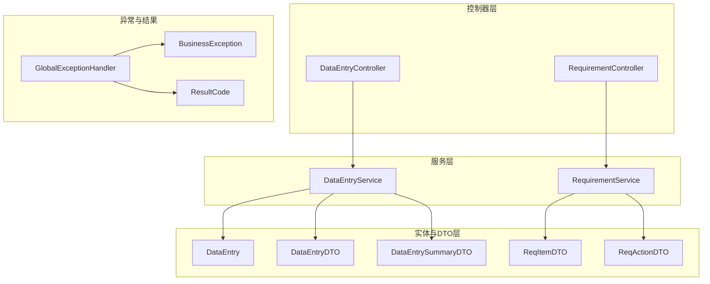
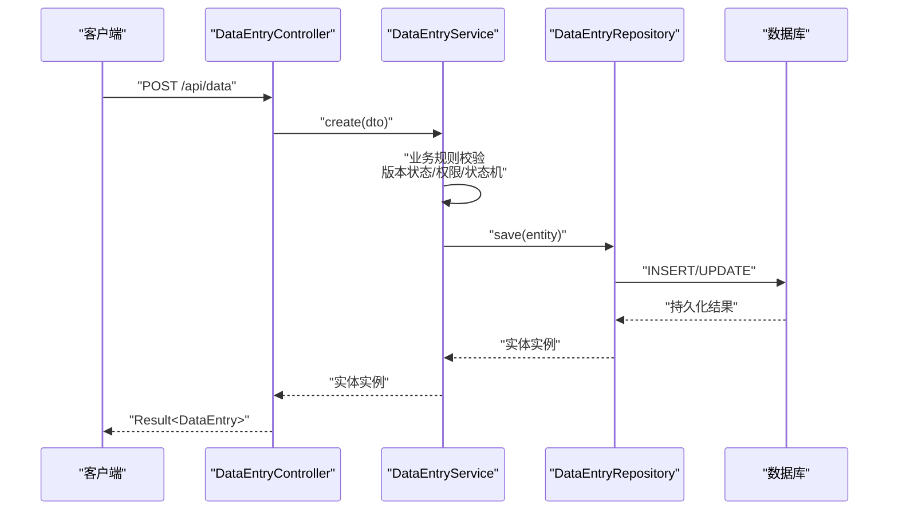
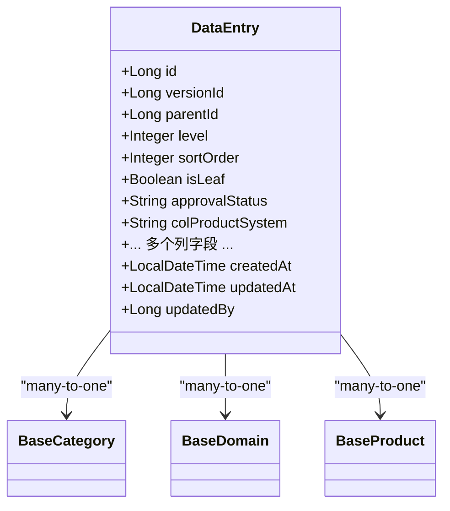
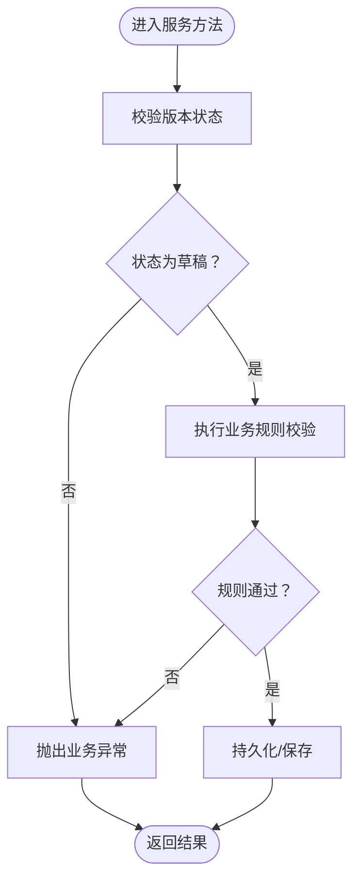
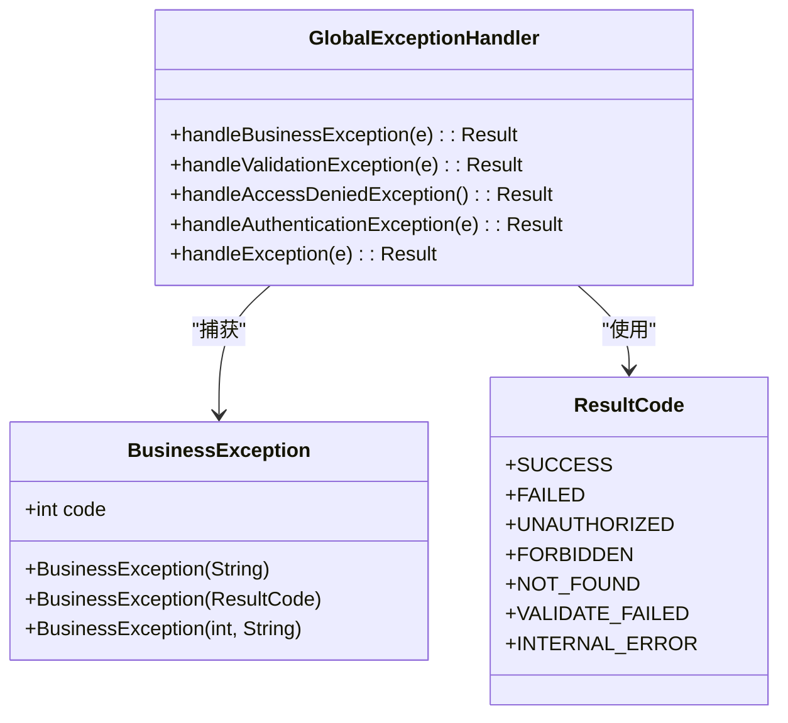

# 数据验证与约束

<cite>
**本文引用的文件**
- [pom.xml](file://pom.xml)
- [DataEntry.java](file://src/main/java/com/superpower/modules/data/entity/DataEntry.java)
- [DataEntryDTO.java](file://src/main/java/com/superpower/modules/data/dto/DataEntryDTO.java)
- [DataEntrySummaryDTO.java](file://src/main/java/com/superpower/modules/data/dto/DataEntrySummaryDTO.java)
- [DataEntryController.java](file://src/main/java/com/superpower/modules/data/controller/DataEntryController.java)
- [DataEntryService.java](file://src/main/java/com/superpower/modules/data/service/DataEntryService.java)
- [RequirementController.java](file://src/main/java/com/superpower/modules/requirement/controller/RequirementController.java)
- [RequirementService.java](file://src/main/java/com/superpower/modules/requirement/service/RequirementService.java)
- [ReqItemDTO.java](file://src/main/java/com/superpower/modules/requirement/dto/ReqItemDTO.java)
- [ReqActionDTO.java](file://src/main/java/com/superpower/modules/requirement/dto/ReqActionDTO.java)
- [BusinessException.java](file://src/main/java/com/superpower/common/BusinessException.java)
- [GlobalExceptionHandler.java](file://src/main/java/com/superpower/common/GlobalExceptionHandler.java)
- [ResultCode.java](file://src/main/java/com/superpower/common/ResultCode.java)
- [DataEntryServiceTest.java](file://src/test/java/com/superpower/modules/data/service/DataEntryServiceTest.java)
</cite>

## 目录
1. [简介](#简介)
2. [项目结构](#项目结构)
3. [核心组件](#核心组件)
4. [架构总览](#架构总览)
5. [详细组件分析](#详细组件分析)
6. [依赖分析](#依赖分析)
7. [性能考虑](#性能考虑)
8. [故障排查指南](#故障排查指南)
9. [结论](#结论)
10. [附录](#附录)

## 简介
本文件面向产品清单管理系统中的“数据验证与约束”，系统性梳理实体层、DTO 层、控制器层与服务层的验证规则与业务约束，解释 JPA 注解与 Hibernate 验证机制的使用方式，分析异常处理策略与错误码定义，并提供数据字典、字段说明、数据质量保证与一致性检查方法。目标是帮助开发者与测试人员准确理解各实体的必填字段、数据类型、长度限制与格式要求，确保在 CRUD 与导入导出流程中实现一致、可靠的验证行为。

## 项目结构
围绕数据验证与约束的关键目录与文件如下：
- 实体层：数据清单实体与关联基础分类/领域/产品的实体映射
- DTO 层：传输对象，承载前端/接口输入与摘要输出
- 控制器层：接收请求参数，触发服务层逻辑
- 服务层：业务规则与状态机控制，包含运行时验证与错误抛出
- 异常与结果：统一异常处理与错误码定义

图表来源
- [DataEntryController.java](file://src/main/java/com/superpower/modules/data/controller/DataEntryController.java)
- [RequirementController.java](file://src/main/java/com/superpower/modules/requirement/controller/RequirementController.java)
- [DataEntryService.java](file://src/main/java/com/superpower/modules/data/service/DataEntryService.java)
- [RequirementService.java](file://src/main/java/com/superpower/modules/requirement/service/RequirementService.java)
- [DataEntry.java](file://src/main/java/com/superpower/modules/data/entity/DataEntry.java)
- [DataEntryDTO.java](file://src/main/java/com/superpower/modules/data/dto/DataEntryDTO.java)
- [DataEntrySummaryDTO.java](file://src/main/java/com/superpower/modules/data/dto/DataEntrySummaryDTO.java)
- [ReqItemDTO.java](file://src/main/java/com/superpower/modules/requirement/dto/ReqItemDTO.java)
- [ReqActionDTO.java](file://src/main/java/com/superpower/modules/requirement/dto/ReqActionDTO.java)
- [BusinessException.java](file://src/main/java/com/superpower/common/BusinessException.java)
- [GlobalExceptionHandler.java](file://src/main/java/com/superpower/common/GlobalExceptionHandler.java)
- [ResultCode.java](file://src/main/java/com/superpower/common/ResultCode.java)

章节来源
- [DataEntryController.java](file://src/main/java/com/superpower/modules/data/controller/DataEntryController.java)
- [RequirementController.java](file://src/main/java/com/superpower/modules/requirement/controller/RequirementController.java)
- [DataEntryService.java](file://src/main/java/com/superpower/modules/data/service/DataEntryService.java)
- [RequirementService.java](file://src/main/java/com/superpower/modules/requirement/service/RequirementService.java)
- [DataEntry.java](file://src/main/java/com/superpower/modules/data/entity/DataEntry.java)
- [DataEntryDTO.java](file://src/main/java/com/superpower/modules/data/dto/DataEntryDTO.java)
- [DataEntrySummaryDTO.java](file://src/main/java/com/superpower/modules/data/dto/DataEntrySummaryDTO.java)
- [ReqItemDTO.java](file://src/main/java/com/superpower/modules/requirement/dto/ReqItemDTO.java)
- [ReqActionDTO.java](file://src/main/java/com/superpower/modules/requirement/dto/ReqActionDTO.java)
- [BusinessException.java](file://src/main/java/com/superpower/common/BusinessException.java)
- [GlobalExceptionHandler.java](file://src/main/java/com/superpower/common/GlobalExceptionHandler.java)
- [ResultCode.java](file://src/main/java/com/superpower/common/ResultCode.java)

## 核心组件
- 实体层（JPA/Hibernate）
  - 使用 @Entity、@Table、@Id、@GeneratedValue、@Column、@ManyToOne、@JoinColumn 等注解进行表结构映射与外键约束声明
  - 对关键字段设置非空、长度与类型约束
- DTO 层（传输对象）
  - 承载请求/响应数据，用于控制器与服务层之间的数据传递
- 控制器层（Spring MVC）
  - 使用 @RequestBody、@RequestParam 等接收参数；对复杂对象参数触发 Bean Validation
- 服务层（业务规则）
  - 在运行时进行业务状态校验、权限校验与数据一致性检查，必要时抛出业务异常
- 异常与结果（全局处理）
  - 统一捕获业务异常、参数校验异常与通用异常，返回标准化错误码与消息

章节来源
- [DataEntry.java](file://src/main/java/com/superpower/modules/data/entity/DataEntry.java)
- [DataEntryDTO.java](file://src/main/java/com/superpower/modules/data/dto/DataEntryDTO.java)
- [DataEntrySummaryDTO.java](file://src/main/java/com/superpower/modules/data/dto/DataEntrySummaryDTO.java)
- [DataEntryController.java](file://src/main/java/com/superpower/modules/data/controller/DataEntryController.java)
- [DataEntryService.java](file://src/main/java/com/superpower/modules/data/service/DataEntryService.java)
- [RequirementController.java](file://src/main/java/com/superpower/modules/requirement/controller/RequirementController.java)
- [RequirementService.java](file://src/main/java/com/superpower/modules/requirement/service/RequirementService.java)
- [BusinessException.java](file://src/main/java/com/superpower/common/BusinessException.java)
- [GlobalExceptionHandler.java](file://src/main/java/com/superpower/common/GlobalExceptionHandler.java)
- [ResultCode.java](file://src/main/java/com/superpower/common/ResultCode.java)

## 架构总览
下图展示了从控制器到服务层再到实体层的数据流与验证位置：

图表来源
- [DataEntryController.java](file://src/main/java/com/superpower/modules/data/controller/DataEntryController.java)
- [DataEntryService.java](file://src/main/java/com/superpower/modules/data/service/DataEntryService.java)
- [DataEntry.java](file://src/main/java/com/superpower/modules/data/entity/DataEntry.java)

## 详细组件分析

### 数据清单实体与字段约束（JPA/Hibernate）
- 表映射与主键
  - 实体映射至 data_entry 表，主键自增
- 必填字段
  - versionId、level 等字段在实体层标注为非空，违反时由 JPA/Hibernate 抛出持久化异常
- 长度与类型约束
  - 多个字符串字段通过 length 或 columnDefinition 设置长度与文本类型
  - 数值字段使用 BigDecimal/Integer 映射
- 关联字段
  - categoryId/domainId/productId 作为外键，通过 @ManyToOne 与基础实体关联，查询时懒加载
- 默认值与状态
  - approvalStatus 默认值为“待提交”
  - isLeaf 默认值为 true
  - 时间戳字段 createdAt/updatedAt 默认值为当前时间

图表来源
- [DataEntry.java](file://src/main/java/com/superpower/modules/data/entity/DataEntry.java)

章节来源
- [DataEntry.java](file://src/main/java/com/superpower/modules/data/entity/DataEntry.java)

### DTO 与摘要 DTO 的字段覆盖
- DataEntryDTO
  - 覆盖所有列字段，便于创建/更新时接收完整数据
- DataEntrySummaryDTO
  - 仅覆盖常用展示字段，用于列表/查询摘要场景，避免冗余字段传输

章节来源
- [DataEntryDTO.java](file://src/main/java/com/superpower/modules/data/dto/DataEntryDTO.java)
- [DataEntrySummaryDTO.java](file://src/main/java/com/superpower/modules/data/dto/DataEntrySummaryDTO.java)

### 控制器层的参数接收与验证
- 入参接收
  - 使用 @RequestBody 接收对象参数，使用 @RequestParam 接收简单参数
- 参数校验触发
  - 当控制器方法参数标注为需要校验的对象时，Spring 将触发 Bean Validation（需启用 starter-validation）

章节来源
- [DataEntryController.java](file://src/main/java/com/superpower/modules/data/controller/DataEntryController.java)

### 服务层的业务验证与状态机
- 版本状态与权限校验
  - 创建/导入/排序等操作前，校验版本状态是否为草稿，否则拒绝
- 需求状态机与必填校验
  - 需求确认/开发/就绪/驳回等状态转换前，进行状态前置校验与必填项校验（如驳回原因）
- 业务异常抛出
  - 违反业务规则时抛出 BusinessException，由全局异常处理器统一返回

图表来源
- [DataEntryService.java](file://src/main/java/com/superpower/modules/data/service/DataEntryService.java)
- [RequirementService.java](file://src/main/java/com/superpower/modules/requirement/service/RequirementService.java)

章节来源
- [DataEntryService.java](file://src/main/java/com/superpower/modules/data/service/DataEntryService.java)
- [RequirementService.java](file://src/main/java/com/superpower/modules/requirement/service/RequirementService.java)
- [RequirementController.java](file://src/main/java/com/superpower/modules/requirement/controller/RequirementController.java)
- [ReqActionDTO.java](file://src/main/java/com/superpower/modules/requirement/dto/ReqActionDTO.java)
- [ReqItemDTO.java](file://src/main/java/com/superpower/modules/requirement/dto/ReqItemDTO.java)

### 异常处理策略与错误码
- BusinessException
  - 自定义业务异常，支持传入错误码枚举或自定义错误码
- GlobalExceptionHandler
  - 捕获 BusinessException 并返回对应错误码与消息
  - 捕获参数校验异常 MethodArgumentNotValidException，聚合字段级错误信息
  - 捕获认证/授权异常，返回相应状态码
  - 其他异常统一返回内部错误
- ResultCode
  - 定义标准错误码与消息，包括参数校验失败、内部错误等

图表来源
- [BusinessException.java](file://src/main/java/com/superpower/common/BusinessException.java)
- [GlobalExceptionHandler.java](file://src/main/java/com/superpower/common/GlobalExceptionHandler.java)
- [ResultCode.java](file://src/main/java/com/superpower/common/ResultCode.java)

章节来源
- [BusinessException.java](file://src/main/java/com/superpower/common/BusinessException.java)
- [GlobalExceptionHandler.java](file://src/main/java/com/superpower/common/GlobalExceptionHandler.java)
- [ResultCode.java](file://src/main/java/com/superpower/common/ResultCode.java)

## 依赖分析
- Spring Boot Starter 依赖
  - web、data-jpa、security、validation、sqlite-jdbc、jjwt、poi-ooxml、lombok 等
- 验证相关依赖
  - spring-boot-starter-validation 提供 Bean Validation 支持
- JPA/Hibernate
  - 通过 JPA 注解实现字段约束与外键关系映射

章节来源
- [pom.xml](file://pom.xml)

## 性能考虑
- DTO 分层
  - 使用 DataEntrySummaryDTO 减少网络传输与序列化开销
- 懒加载关联
  - 基础实体使用懒加载，避免不必要的关联查询
- 批量导入
  - 导入流程应结合事务与分批处理，减少单次事务时间
- 缓存与索引
  - 对高频查询字段建立数据库索引，提升查询性能

## 故障排查指南
- 参数校验失败
  - 观察返回的错误码与消息，定位具体字段与错误类型
- 业务异常
  - 查看 BusinessException 抛出位置与消息，确认业务规则与状态机
- 版本状态限制
  - 若提示“已发版版本不允许修改清单”，确认版本状态是否为 draft
- 单元测试参考
  - 可参考 DataEntryServiceTest 中关于版本状态与删除/排序限制的断言

章节来源
- [GlobalExceptionHandler.java](file://src/main/java/com/superpower/common/GlobalExceptionHandler.java)
- [BusinessException.java](file://src/main/java/com/superpower/common/BusinessException.java)
- [DataEntryServiceTest.java](file://src/test/java/com/superpower/modules/data/service/DataEntryServiceTest.java)

## 结论
本系统通过“实体层约束 + DTO 传输 + 控制器参数校验 + 服务层业务规则 + 全局异常处理”的多层验证体系，确保数据在入库前满足业务与技术约束。建议在后续迭代中补充显式的 Bean Validation 注解（如 @NotBlank、@Pattern、@DecimalMin 等），以增强参数校验的可读性与可维护性，并完善字段级校验规则与错误码映射。

## 附录

### 数据字典与字段说明（数据清单实体）
以下为数据清单实体的核心字段清单与约束说明（节选）：

- 基础字段
  - id：主键，自增
  - versionId：版本标识，必填
  - parentId：父节点标识，可空
  - level：层级，必填
  - sortOrder：排序号，默认 0
  - isLeaf：是否叶子节点，默认 true
  - approvalStatus：审批状态，默认“待提交”
  - created_at/updated_at：创建与更新时间，默认当前时间
  - updated_by：最后更新人标识，可空

- 文本类字段（带长度限制）
  - col_产品系统：最大长度 500
  - col_应用角色：最大长度 500
  - col_状态：最大长度 100
  - col_业务分类：最大长度 200
  - col_业务域：最大长度 200
  - col_版本划分：最大长度 200
  - col_远/col_曜/col_驰：最大长度 50
  - col_交付工作量人月：最大长度 100
  - col_控标点：最大长度 50
  - col_软著：最大长度 500
  - col_产品系统标识/col_模块标识：最大长度 100
  - col_其他解决方案标记：最大长度 200
  - col_文档维护人员/col_产品经理/col_负责人/col_产品线/col_资产类型：最大长度 200/100
  - col_内部版本：最大长度 100
  - col_智慧医疗/col_智慧服务/col_智慧管理/col_互联互通：最大长度 100
  - col_备注：TEXT 类型

- 数值类字段
  - colFY23/colFY24/.../colFY29：数值类型
  - colRDCostTotal：数值类型
  - colSalesYao/colSalesYuan/colSalesChi：整数类型
  - colFactoryPrice：数值类型

- 关联字段
  - categoryId/domainId/productId：外键，可空

章节来源
- [DataEntry.java](file://src/main/java/com/superpower/modules/data/entity/DataEntry.java)

### 数据字典与字段说明（需求实体相关 DTO）
- ReqItemDTO
  - title/description/priority/category/domain/type：字符串类型，用于需求基本信息
- ReqActionDTO
  - comment：评论/备注
  - rejectReason：驳回原因（必填）
  - releasedVersion：发布版本号

章节来源
- [ReqItemDTO.java](file://src/main/java/com/superpower/modules/requirement/dto/ReqItemDTO.java)
- [ReqActionDTO.java](file://src/main/java/com/superpower/modules/requirement/dto/ReqActionDTO.java)

### 最佳实践
- 在实体层补充 Bean Validation 注解，明确必填、长度、格式与范围约束
- 在控制器层对复杂对象参数启用校验，统一返回校验失败错误码
- 在服务层补充边界条件与业务状态校验，确保数据一致性
- 对高频查询字段建立数据库索引，优化查询性能
- 使用 DTO 分层传输，减少冗余字段与序列化开销
- 完善单元测试与集成测试，覆盖关键验证路径与异常分支