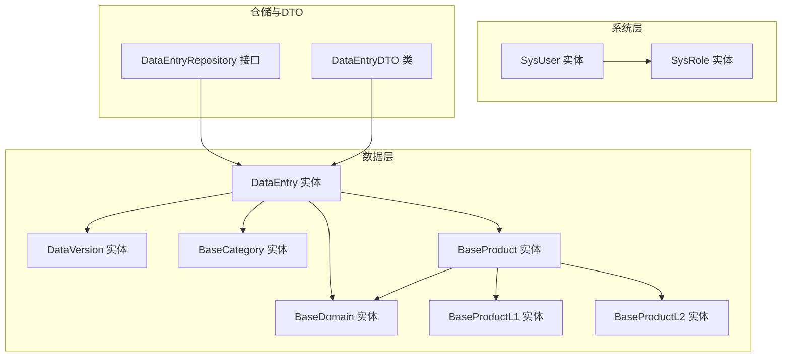
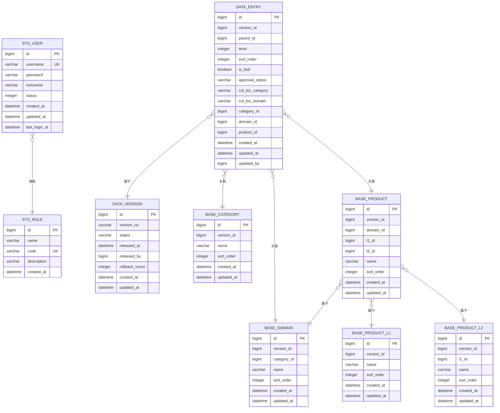
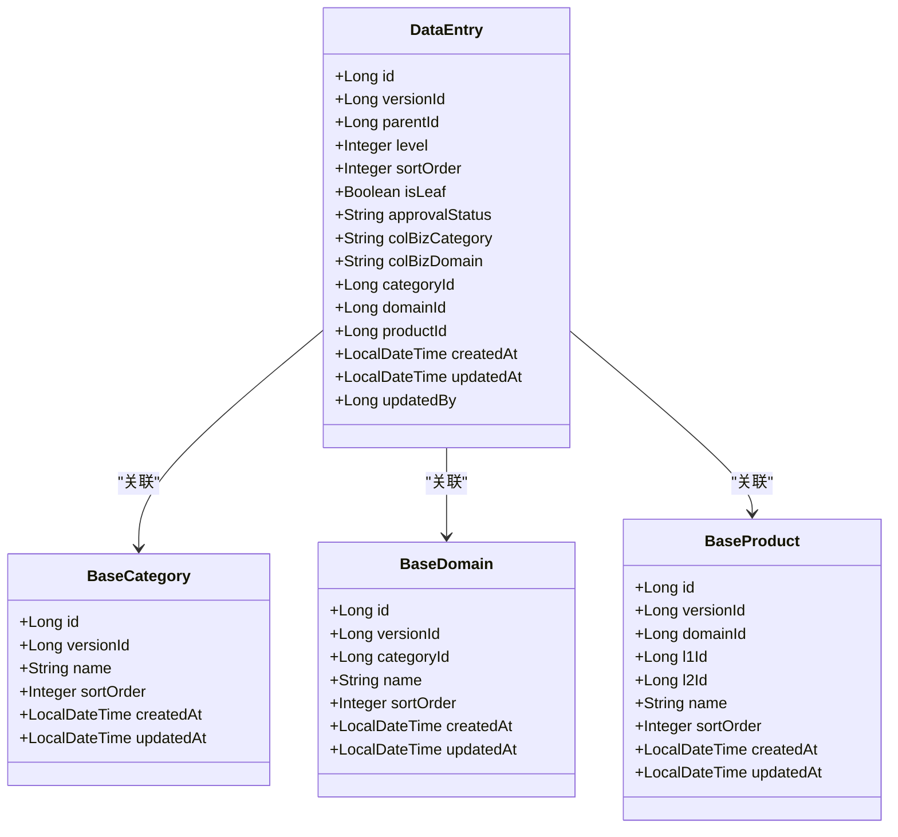
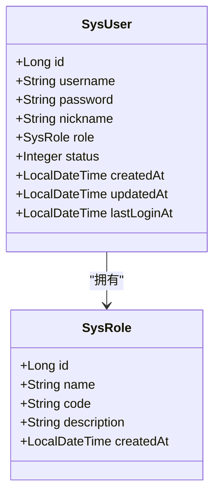
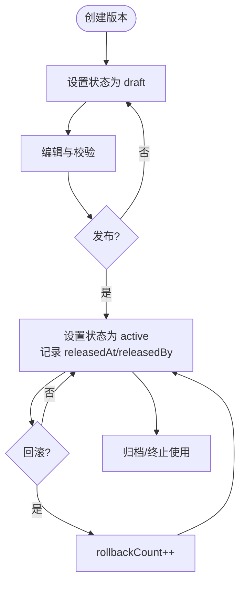
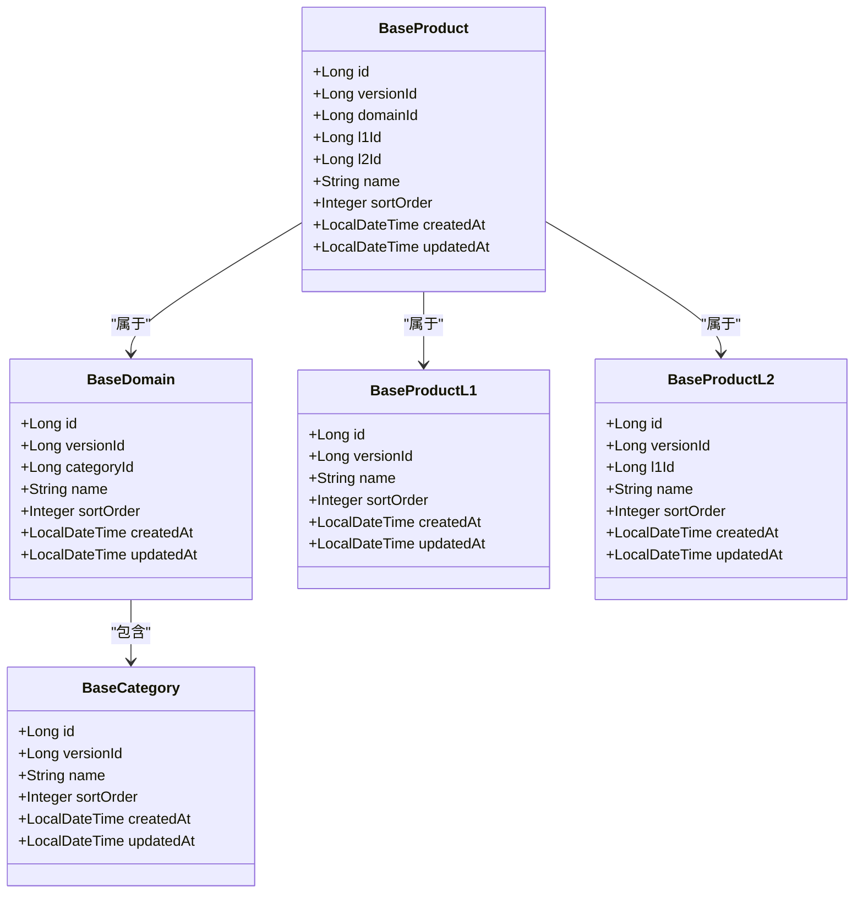
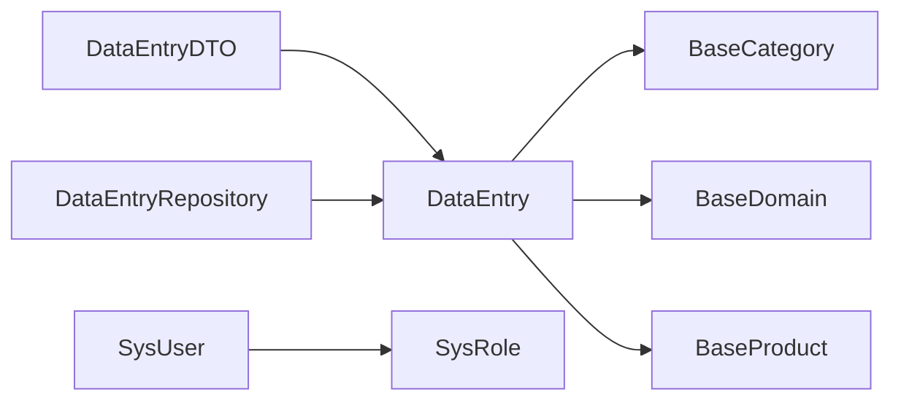

# 核心实体模型

<cite>
**本文引用的文件**
- [DataEntry.java](file://src/main/java/com/superpower/modules/data/entity/DataEntry.java)
- [SysUser.java](file://src/main/java/com/superpower/modules/system/entity/SysUser.java)
- [SysRole.java](file://src/main/java/com/superpower/modules/system/entity/SysRole.java)
- [DataVersion.java](file://src/main/java/com/superpower/modules/version/entity/DataVersion.java)
- [BaseProduct.java](file://src/main/java/com/superpower/modules/category/entity/BaseProduct.java)
- [BaseCategory.java](file://src/main/java/com/superpower/modules/category/entity/BaseCategory.java)
- [BaseDomain.java](file://src/main/java/com/superpower/modules/category/entity/BaseDomain.java)
- [BaseProductL1.java](file://src/main/java/com/superpower/modules/category/entity/BaseProductL1.java)
- [BaseProductL2.java](file://src/main/java/com/superpower/modules/category/entity/BaseProductL2.java)
- [DataEntryRepository.java](file://src/main/java/com/superpower/modules/data/repository/DataEntryRepository.java)
- [DataEntryDTO.java](file://src/main/java/com/superpower/modules/data/dto/DataEntryDTO.java)
</cite>

## 目录
1. [简介](#简介)
2. [项目结构](#项目结构)
3. [核心组件](#核心组件)
4. [架构总览](#架构总览)
5. [详细组件分析](#详细组件分析)
6. [依赖分析](#依赖分析)
7. [性能考量](#性能考量)
8. [故障排查指南](#故障排查指南)
9. [结论](#结论)
10. [附录](#附录)

## 简介
本文件聚焦产品清单管理系统的核心实体模型，围绕以下关键实体展开：DataEntry（产品数据条目）、SysUser（系统用户）、DataVersion（数据版本）、BaseProduct（产品基础信息）、BaseCategory（业务分类）与层级化产品维度（BaseDomain、BaseProductL1、BaseProductL2）。文档将从设计理念、字段定义、数据类型选择、业务规则与验证约束、权限与安全设计、版本管理机制、层级结构设计以及实体关系图与ER模型等方面进行系统性阐述，并提供面向开发与非技术读者的可操作参考。

## 项目结构
本项目采用分层+按功能域划分的组织方式，核心实体位于 modules 子包中：
- data：产品数据实体与仓库、服务、控制器
- system：系统用户、角色、菜单、日志等
- category：产品与业务分类的层级化基础数据
- version：版本控制实体与服务
- 其他模块（如 approval、requirement、image 等）与本主题相关性较低，不在本次重点范围内

图表来源
- [DataEntry.java:1-267](file://src/main/java/com/superpower/modules/data/entity/DataEntry.java#L1-L267)
- [DataVersion.java:1-36](file://src/main/java/com/superpower/modules/version/entity/DataVersion.java#L1-L36)
- [BaseCategory.java:1-30](file://src/main/java/com/superpower/modules/category/entity/BaseCategory.java#L1-L30)
- [BaseDomain.java:1-33](file://src/main/java/com/superpower/modules/category/entity/BaseDomain.java#L1-L33)
- [BaseProduct.java:1-39](file://src/main/java/com/superpower/modules/category/entity/BaseProduct.java#L1-L39)
- [BaseProductL1.java:1-30](file://src/main/java/com/superpower/modules/category/entity/BaseProductL1.java#L1-L30)
- [BaseProductL2.java:1-33](file://src/main/java/com/superpower/modules/category/entity/BaseProductL2.java#L1-L33)
- [SysUser.java:1-40](file://src/main/java/com/superpower/modules/system/entity/SysUser.java#L1-L40)
- [SysRole.java:1-27](file://src/main/java/com/superpower/modules/system/entity/SysRole.java#L1-L27)
- [DataEntryRepository.java:1-152](file://src/main/java/com/superpower/modules/data/repository/DataEntryRepository.java#L1-L152)
- [DataEntryDTO.java:1-65](file://src/main/java/com/superpower/modules/data/dto/DataEntryDTO.java#L1-L65)

章节来源
- [DataEntry.java:1-267](file://src/main/java/com/superpower/modules/data/entity/DataEntry.java#L1-L267)
- [SysUser.java:1-40](file://src/main/java/com/superpower/modules/system/entity/SysUser.java#L1-L40)
- [DataVersion.java:1-36](file://src/main/java/com/superpower/modules/version/entity/DataVersion.java#L1-L36)
- [BaseProduct.java:1-39](file://src/main/java/com/superpower/modules/category/entity/BaseProduct.java#L1-L39)
- [BaseCategory.java:1-30](file://src/main/java/com/superpower/modules/category/entity/BaseCategory.java#L1-L30)
- [BaseDomain.java:1-33](file://src/main/java/com/superpower/modules/category/entity/BaseDomain.java#L1-L33)
- [BaseProductL1.java:1-30](file://src/main/java/com/superpower/modules/category/entity/BaseProductL1.java#L1-L30)
- [BaseProductL2.java:1-33](file://src/main/java/com/superpower/modules/category/entity/BaseProductL2.java#L1-L33)
- [DataEntryRepository.java:1-152](file://src/main/java/com/superpower/modules/data/repository/DataEntryRepository.java#L1-L152)
- [DataEntryDTO.java:1-65](file://src/main/java/com/superpower/modules/data/dto/DataEntryDTO.java#L1-L65)

## 核心组件
本节对四大核心实体进行字段级梳理与业务解读，涵盖数据类型、默认值、约束与业务含义。

- DataEntry（产品数据条目）
  - 关键字段与类型
    - 标识与层级：id（Long）、versionId（Long）、parentId（Long）、level（Integer）、sortOrder（Integer，默认0）、isLeaf（Boolean，默认true）
    - 审批与状态：approvalStatus（String，默认“待提交”，长度20）
    - 业务域与分类：categoryId（Long）、domainId（Long）、productId（Long）
    - 业务分类与域：colBizCategory（String，长度200）、colBizDomain（String，长度200）
    - 产品系统与模块：colProductSystem（String，长度500）、colProductSysId（String，长度100）、colModuleId（String，长度100）
    - 功能与参数：colFeatureDesc（TEXT）、colBidParamDesc（TEXT）
    - 版本划分与文档：colVersionDivision（String，长度200）、colDocMaintainer（String，长度100）
    - 智慧标签与互联互通：colSmartMedical/Service/Management（String，长度100）、colInterconnection（String，长度100）
    - 软著与备注：colCopyright（String，长度500）、colRemark（TEXT）
    - 控标点与截图：colControlPoint（String，长度50）、colControlPointImg1/2/3（TEXT）、colControlPointDoc（TEXT）
    - 交付与成本：colDeliveryWorkload（String，长度100）、colRDCostTotal（BigDecimal）
    - 销量与价格：colSalesYao/colSalesYuan/colSalesChi（Integer）、colFactoryPrice（BigDecimal）
    - 年度预算：colFY23..colFY29（BigDecimal）
    - 负责人与产品线：colPrincipal（String，长度200）、colProductLine（String，长度200）、colAssetType（String，长度100）
    - 其他标记：colOtherSolutionTag（String，长度200）、colIntelligent（String，长度50）、colYao/colYuan/colChi（String，长度50）
    - 时间与审计：createdAt/updatedAt（LocalDateTime，默认当前时间）、updatedBy（Long）
  - 设计要点
    - 使用版本隔离（versionId）与树形结构（parentId/level）支撑多版本产品清单与层级展示
    - 大量字符串字段用于灵活录入；TEXT字段承载长描述与图片/文档链接
    - 默认值与布尔标志确保前端渲染与流程控制的一致性
  - 业务规则
    - level=3及以上为可查询/展示的明细条目
    - isLeaf=true时通常表示不可再细分
    - approvalStatus驱动审批流程状态机

- SysUser（系统用户）
  - 关键字段与类型
    - 标识：id（Long）
    - 登录凭据：username（String，唯一、长度50）、password（String，长度255）
    - 基本信息：nickname（String，长度100）
    - 角色关联：role（SysRole，多对一）
    - 状态：status（Integer，默认1）
    - 时间：createdAt/updatedAt（LocalDateTime，默认当前时间）、lastLoginAt（LocalDateTime）
  - 设计要点
    - 用户名唯一，便于登录与鉴权
    - 角色外键建立权限边界
    - 状态字段支持启用/停用
  - 安全考虑
    - 密码长度充足，建议结合后端加密策略与传输加密
    - lastLoginAt可用于登录追踪与风控

- DataVersion（数据版本）
  - 关键字段与类型
    - 标识：id（Long）
    - 编号与状态：versionNo（String，长度20，非空）、status（String，长度20，默认“draft”）
    - 发布信息：releasedAt（LocalDateTime）、releasedBy（Long）
    - 统计：rollbackCount（Integer，默认0）
    - 时间：createdAt/updatedAt（LocalDateTime，默认当前时间）
  - 设计要点
    - draft/active/retired 等状态驱动版本生命周期
    - rollbackCount用于回滚次数统计与风险控制
    - releasedAt/releasedBy记录发布轨迹

- BaseProduct（产品基础信息）
  - 关键字段与类型
    - 标识：id（Long）
    - 版本：versionId（Long，非空）
    - 所属域与层级：domainId（Long，非空）、l1Id/l2Id（Long）
    - 名称：name（String，长度200，非空）
    - 排序：sortOrder（Integer，默认0）
    - 时间：createdAt/updatedAt（LocalDateTime，默认当前时间）
  - 设计要点
    - 与BaseDomain、BaseProductL1/L2构成三级产品维度
    - 通过versionId与DataEntry形成版本一致性

- BaseCategory（业务分类）
  - 关键字段与类型
    - 标识：id（Long）
    - 版本：versionId（Long，非空）
    - 名称：name（String，长度200，非空）
    - 排序：sortOrder（Integer，默认0）
    - 时间：createdAt/updatedAt（LocalDateTime，默认当前时间）
  - 设计要点
    - 与BaseDomain配合构建“分类-域”两级结构
    - 通过排序字段支持自定义展示顺序

- BaseDomain（业务域）
  - 关键字段与类型
    - 标识：id（Long）
    - 版本：versionId（Long，非空）
    - 分类关联：categoryId（Long，非空）
    - 名称：name（String，长度200，非空）
    - 排序：sortOrder（Integer，默认0）
    - 时间：createdAt/updatedAt（LocalDateTime，默认当前时间）
  - 设计要点
    - 作为业务域的顶层概念，承载多个BaseCategory

- BaseProductL1/L2（产品层级）
  - BaseProductL1：versionId、name、sortOrder、时间戳
  - BaseProductL2：versionId、l1Id、name、sortOrder、时间戳
  - 设计要点
    - 支撑产品维度的分层组织与快速筛选

章节来源
- [DataEntry.java:1-267](file://src/main/java/com/superpower/modules/data/entity/DataEntry.java#L1-L267)
- [SysUser.java:1-40](file://src/main/java/com/superpower/modules/system/entity/SysUser.java#L1-L40)
- [DataVersion.java:1-36](file://src/main/java/com/superpower/modules/version/entity/DataVersion.java#L1-L36)
- [BaseProduct.java:1-39](file://src/main/java/com/superpower/modules/category/entity/BaseProduct.java#L1-L39)
- [BaseCategory.java:1-30](file://src/main/java/com/superpower/modules/category/entity/BaseCategory.java#L1-L30)
- [BaseDomain.java:1-33](file://src/main/java/com/superpower/modules/category/entity/BaseDomain.java#L1-L33)
- [BaseProductL1.java:1-30](file://src/main/java/com/superpower/modules/category/entity/BaseProductL1.java#L1-L30)
- [BaseProductL2.java:1-33](file://src/main/java/com/superpower/modules/category/entity/BaseProductL2.java#L1-L33)

## 架构总览
下图展示核心实体在系统中的交互关系与约束：

图表来源
- [SysUser.java:1-40](file://src/main/java/com/superpower/modules/system/entity/SysUser.java#L1-L40)
- [SysRole.java:1-27](file://src/main/java/com/superpower/modules/system/entity/SysRole.java#L1-L27)
- [DataVersion.java:1-36](file://src/main/java/com/superpower/modules/version/entity/DataVersion.java#L1-L36)
- [BaseCategory.java:1-30](file://src/main/java/com/superpower/modules/category/entity/BaseCategory.java#L1-L30)
- [BaseDomain.java:1-33](file://src/main/java/com/superpower/modules/category/entity/BaseDomain.java#L1-L33)
- [BaseProductL1.java:1-30](file://src/main/java/com/superpower/modules/category/entity/BaseProductL1.java#L1-L30)
- [BaseProductL2.java:1-33](file://src/main/java/com/superpower/modules/category/entity/BaseProductL2.java#L1-L33)
- [BaseProduct.java:1-39](file://src/main/java/com/superpower/modules/category/entity/BaseProduct.java#L1-L39)
- [DataEntry.java:1-267](file://src/main/java/com/superpower/modules/data/entity/DataEntry.java#L1-L267)

## 详细组件分析

### DataEntry 数据实体
- 设计理念
  - 以“版本+树形结构”为核心，支持同一版本内的多层级产品清单，同时兼容不同版本并行演进
  - 字段命名采用统一前缀规范，便于前端映射与检索
- 字段与业务规则
  - 版本隔离：versionId 驱动所有查询与删除操作
  - 层级与排序：level、parentId、sortOrder 决定树形展示与顺序
  - 审批状态：approvalStatus 作为流程控制开关
  - 业务域与产品：categoryId/domainId/productId 三者共同定位产品归属
- 性能与复杂度
  - 多字段过滤查询通过 Repository 的原生 JPQL 实现，注意索引与分页策略
  - TEXT 字段较多，需关注存储与检索性能

图表来源
- [DataEntry.java:1-267](file://src/main/java/com/superpower/modules/data/entity/DataEntry.java#L1-L267)
- [BaseCategory.java:1-30](file://src/main/java/com/superpower/modules/category/entity/BaseCategory.java#L1-L30)
- [BaseDomain.java:1-33](file://src/main/java/com/superpower/modules/category/entity/BaseDomain.java#L1-L33)
- [BaseProduct.java:1-39](file://src/main/java/com/superpower/modules/category/entity/BaseProduct.java#L1-L39)

章节来源
- [DataEntry.java:1-267](file://src/main/java/com/superpower/modules/data/entity/DataEntry.java#L1-L267)
- [DataEntryRepository.java:1-152](file://src/main/java/com/superpower/modules/data/repository/DataEntryRepository.java#L1-L152)
- [DataEntryDTO.java:1-65](file://src/main/java/com/superpower/modules/data/dto/DataEntryDTO.java#L1-L65)

### SysUser 用户实体与权限设计
- 权限设计
  - 用户与角色多对一：通过 role_id 外键绑定 SysRole
  - 角色具备唯一编码（code），便于权限判定与菜单控制
- 安全考虑
  - username 唯一，避免重复登录主体
  - password 长度充足，建议结合后端加密与传输加密
  - lastLoginAt 可用于登录审计与异常检测
- 业务规则
  - status=1 表示启用；可用于快速禁用账户
  - 与系统菜单、操作日志等模块协同实现细粒度权限控制

图表来源
- [SysUser.java:1-40](file://src/main/java/com/superpower/modules/system/entity/SysUser.java#L1-L40)
- [SysRole.java:1-27](file://src/main/java/com/superpower/modules/system/entity/SysRole.java#L1-L27)

章节来源
- [SysUser.java:1-40](file://src/main/java/com/superpower/modules/system/entity/SysUser.java#L1-L40)
- [SysRole.java:1-27](file://src/main/java/com/superpower/modules/system/entity/SysRole.java#L1-L27)

### DataVersion 版本控制机制
- 生命周期
  - draft：草稿态，允许编辑
  - active：已发布，对外可见
  - retired：归档或回滚后的状态
- 回滚与审计
  - rollbackCount 记录回滚次数，用于风险评估
  - releasedAt/releasedBy 提供发布轨迹
- 与 DataEntry 的关系
  - DataEntry.versionId 与 DataVersion.id 强关联，保证查询与清理的原子性

图表来源
- [DataVersion.java:1-36](file://src/main/java/com/superpower/modules/version/entity/DataVersion.java#L1-L36)
- [DataEntryRepository.java:139-141](file://src/main/java/com/superpower/modules/data/repository/DataEntryRepository.java#L139-L141)

章节来源
- [DataVersion.java:1-36](file://src/main/java/com/superpower/modules/version/entity/DataVersion.java#L1-L36)
- [DataEntryRepository.java:139-141](file://src/main/java/com/superpower/modules/data/repository/DataEntryRepository.java#L139-L141)

### BaseProduct 与 BaseCategory 层级结构设计
- 结构关系
  - BaseProduct 与 BaseDomain 一对多：一个域包含多个产品
  - BaseProduct 与 BaseProductL1/L2 形成三级产品维度：L1 为产品大类，L2 为子类
  - BaseCategory 与 BaseDomain 一对多：一个域包含多个分类
- 查询与展示
  - 通过 sortOrder 控制展示顺序
  - 与 DataEntry 的 categoryId/domainId/productId 关联，实现产品维度的筛选与聚合

图表来源
- [BaseCategory.java:1-30](file://src/main/java/com/superpower/modules/category/entity/BaseCategory.java#L1-L30)
- [BaseDomain.java:1-33](file://src/main/java/com/superpower/modules/category/entity/BaseDomain.java#L1-L33)
- [BaseProductL1.java:1-30](file://src/main/java/com/superpower/modules/category/entity/BaseProductL1.java#L1-L30)
- [BaseProductL2.java:1-33](file://src/main/java/com/superpower/modules/category/entity/BaseProductL2.java#L1-L33)
- [BaseProduct.java:1-39](file://src/main/java/com/superpower/modules/category/entity/BaseProduct.java#L1-L39)

章节来源
- [BaseCategory.java:1-30](file://src/main/java/com/superpower/modules/category/entity/BaseCategory.java#L1-L30)
- [BaseDomain.java:1-33](file://src/main/java/com/superpower/modules/category/entity/BaseDomain.java#L1-L33)
- [BaseProductL1.java:1-30](file://src/main/java/com/superpower/modules/category/entity/BaseProductL1.java#L1-L30)
- [BaseProductL2.java:1-33](file://src/main/java/com/superpower/modules/category/entity/BaseProductL2.java#L1-L33)
- [BaseProduct.java:1-39](file://src/main/java/com/superpower/modules/category/entity/BaseProduct.java#L1-L39)

## 依赖分析
- 实体耦合
  - DataEntry 与 BaseCategory/BaseDomain/BaseProduct 为弱耦合的外键关联，通过版本号与层级字段实现解耦
  - SysUser 与 SysRole 为强耦合的权限边界
- 查询依赖
  - DataEntryRepository 提供大量基于版本、层级、过滤条件的查询方法，体现领域查询的内聚性
- DTO 映射
  - DataEntryDTO 与 DataEntry 字段一一对应，便于跨层传递与序列化

图表来源
- [DataEntryDTO.java:1-65](file://src/main/java/com/superpower/modules/data/dto/DataEntryDTO.java#L1-L65)
- [DataEntryRepository.java:1-152](file://src/main/java/com/superpower/modules/data/repository/DataEntryRepository.java#L1-L152)
- [DataEntry.java:1-267](file://src/main/java/com/superpower/modules/data/entity/DataEntry.java#L1-L267)
- [SysUser.java:1-40](file://src/main/java/com/superpower/modules/system/entity/SysUser.java#L1-L40)
- [SysRole.java:1-27](file://src/main/java/com/superpower/modules/system/entity/SysRole.java#L1-L27)

章节来源
- [DataEntryRepository.java:1-152](file://src/main/java/com/superpower/modules/data/repository/DataEntryRepository.java#L1-L152)
- [DataEntryDTO.java:1-65](file://src/main/java/com/superpower/modules/data/dto/DataEntryDTO.java#L1-L65)

## 性能考量
- 查询优化
  - 对 versionId、level、parentId、sortOrder 建立复合索引，提升树形查询与分页性能
  - 对常用过滤字段（如 colBizCategory、colBizDomain、colProductManager、colVersionDivision）建立单列索引
- 存储优化
  - TEXT 字段较多，建议对频繁检索的字段建立虚拟列或二级索引
- 缓存策略
  - 基础维度（BaseCategory、BaseDomain、BaseProduct）可缓存于内存，减少频繁查询
- 删除与清理
  - 通过 versionId 清理整版数据，避免逐条删除带来的事务压力

## 故障排查指南
- 常见问题
  - 版本未发布即查询到数据：检查 DataVersion.status 是否为 active
  - 层级显示异常：核对 level、parentId、sortOrder 的一致性
  - 过滤结果为空：确认过滤参数（名称、PM、解决方案、版本标签）是否正确传入
- 排查步骤
  - 使用 DataEntryRepository 的根节点查询与 L3 查询接口定位问题范围
  - 检查关联实体是否存在（categoryId/domainId/productId）
  - 核对 SysUser 的角色权限与登录状态

章节来源
- [DataEntryRepository.java:143-150](file://src/main/java/com/superpower/modules/data/repository/DataEntryRepository.java#L143-L150)
- [DataEntryRepository.java:106-108](file://src/main/java/com/superpower/modules/data/repository/DataEntryRepository.java#L106-L108)

## 结论
本实体模型以“版本+树形结构”为核心，结合业务域与产品层级，实现了产品清单的多版本演进与灵活筛选。SysUser 与 SysRole 构建了清晰的权限边界，DataVersion 提供了完整的生命周期管理。通过合理的字段设计、约束与查询接口，系统在可扩展性与性能之间取得了平衡。建议后续完善索引策略、缓存与审计能力，进一步提升生产可用性。

## 附录
- 字段对照与业务含义（节选）
  - DataEntry：versionId、parentId、level、sortOrder、isLeaf、approvalStatus、colBizCategory、colBizDomain、categoryId、domainId、productId、createdAt、updatedAt、updatedBy
  - SysUser：username、password、nickname、role、status、createdAt、updatedAt、lastLoginAt
  - DataVersion：versionNo、status、releasedAt、releasedBy、rollbackCount、createdAt、updatedAt
  - BaseProduct：versionId、domainId、l1Id、l2Id、name、sortOrder、createdAt、updatedAt
  - BaseCategory：versionId、name、sortOrder、createdAt、updatedAt
  - BaseDomain：versionId、categoryId、name、sortOrder、createdAt、updatedAt
  - BaseProductL1/L2：versionId、name、sortOrder、createdAt、updatedAt（L2 包含 l1Id）