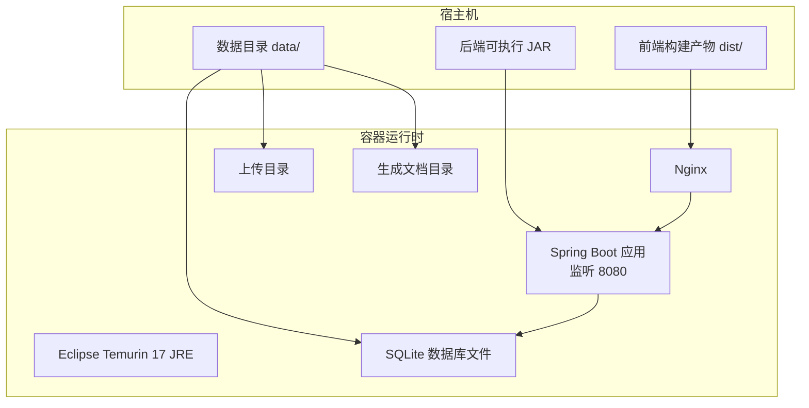
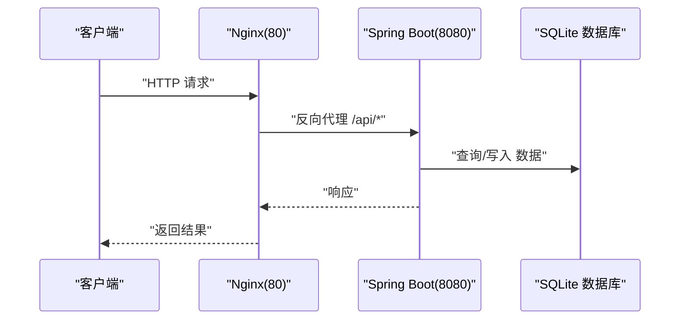
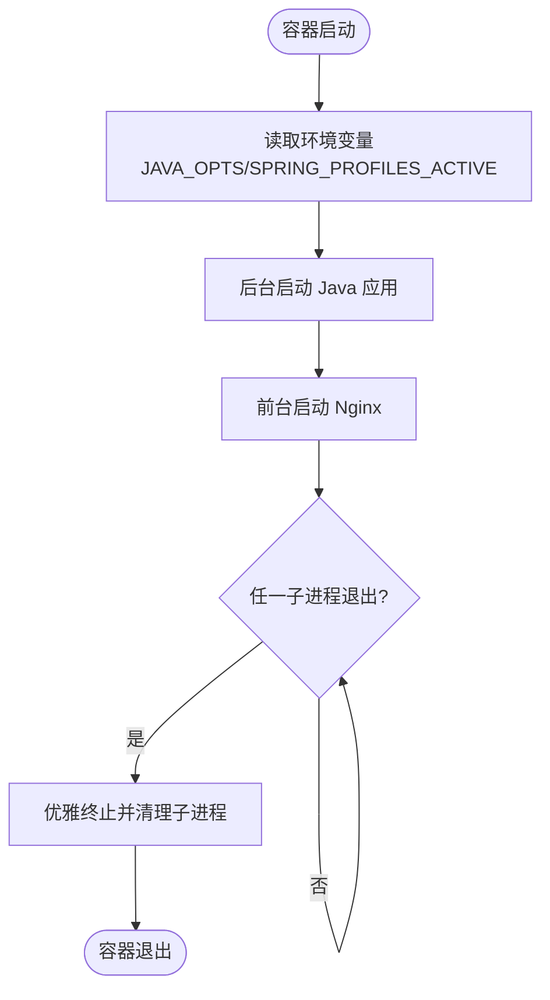
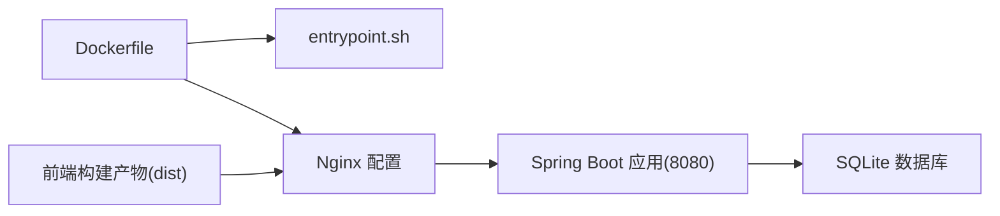

# Docker容器化部署

<cite>
**本文档引用的文件**
- [Dockerfile](file://Dockerfile)
- [docker/entrypoint.sh](file://docker/entrypoint.sh)
- [docker/proethos2](file://docker/proethos2)
- [docker/maven-settings.xml](file://docker/maven-settings.xml)
- [docker/maven-settings-sandbox.xml](file://docker/maven-settings-sandbox.xml)
- [pom.xml](file://pom.xml)
- [src/main/resources/application.yml](file://src/main/resources/application.yml)
- [frontend/package.json](file://frontend/package.json)
- [frontend/vite.config.js](file://frontend/vite.config.js)
- [deploy.py](file://deploy.py)
</cite>

## 目录
1. [简介](#简介)
2. [项目结构](#项目结构)
3. [核心组件](#核心组件)
4. [架构总览](#架构总览)
5. [详细组件分析](#详细组件分析)
6. [依赖关系分析](#依赖关系分析)
7. [性能考虑](#性能考虑)
8. [故障排除指南](#故障排除指南)
9. [结论](#结论)
10. [附录](#附录)

## 简介
本文件面向产品清单管理系统的Docker容器化部署，提供从镜像构建到运行时配置的完整说明。系统采用“运行时镜像 + 卷挂载”的架构：运行时镜像仅包含JRE与Nginx等运行环境，业务代码（Spring Boot JAR）、静态资源（前端dist）、数据库文件与上传目录均通过卷挂载注入，实现零停机热更新与最小化镜像体积。

## 项目结构
与容器化部署直接相关的目录与文件：
- 根级Dockerfile：定义运行时镜像，包含基础JRE、Nginx与入口脚本
- docker/entrypoint.sh：主进程管理脚本，同时启动Java应用与Nginx，并处理信号与退出
- docker/proethos2：Nginx站点配置，负责反向代理与静态资源分发
- docker/maven-settings*.xml：Maven镜像配置，用于构建阶段加速依赖下载
- pom.xml：后端构建配置，配合Spring Boot插件生成可执行JAR
- src/main/resources/application.yml：后端运行配置（端口、数据库、日志等）
- frontend/*：前端构建配置，产出静态资源供Nginx托管
- deploy.py：部署脚本，负责本地构建、制品上传与容器启动

图表来源
- [Dockerfile:1-38](file://Dockerfile#L1-L38)
- [docker/proethos2:1-75](file://docker/proethos2#L1-L75)
- [src/main/resources/application.yml:1-40](file://src/main/resources/application.yml#L1-L40)

章节来源
- [Dockerfile:1-38](file://Dockerfile#L1-L38)
- [docker/proethos2:1-75](file://docker/proethos2#L1-L75)
- [src/main/resources/application.yml:1-40](file://src/main/resources/application.yml#L1-L40)

## 核心组件
- 运行时镜像（基于Eclipse Temurin 17 JRE）：提供Java运行环境与Nginx，不包含业务代码
- Nginx反向代理：统一对外端口80，将/api/等路径转发至后端8080，静态资源由/usr/share/nginx/html提供
- 入口脚本（entrypoint.sh）：启动Java应用与Nginx，统一管理进程生命周期与信号处理
- 卷挂载策略：后端JAR、前端dist、数据库文件、上传与生成文档目录均通过宿主机目录挂载
- 健康检查：通过curl探测Nginx内部对后端/actuator/health的代理访问

章节来源
- [Dockerfile:1-38](file://Dockerfile#L1-L38)
- [docker/entrypoint.sh:1-22](file://docker/entrypoint.sh#L1-L22)
- [docker/proethos2:1-75](file://docker/proethos2#L1-L75)

## 架构总览
容器启动流程概览：入口脚本启动Java应用与Nginx，Nginx监听80端口并将/api/等请求转发至127.0.0.1:8080（Spring Boot）。数据库与文件存储通过卷挂载注入，实现持久化与热更新。

图表来源
- [docker/proethos2:18-34](file://docker/proethos2#L18-L34)
- [src/main/resources/application.yml:1-40](file://src/main/resources/application.yml#L1-L40)

## 详细组件分析

### Dockerfile构建过程
- 基础镜像选择：使用linux/amd64平台的eclipse-temurin:17-jre，确保跨平台兼容性与JDK 17运行时
- 系统依赖安装：安装bash、ca-certificates、curl、nginx；替换apt源为国内镜像以提升下载速度
- Nginx配置：删除默认站点，复制自定义站点配置并建立软链接启用
- 入口脚本：复制并赋予执行权限，创建缓存与运行目录
- 卷挂载约定：明确声明JAR、dist、数据库、上传与生成文档目录的挂载位置
- 环境变量：设置Spring Profile为prod，默认JAVA_OPTS为空
- 端口与健康检查：暴露80端口，配置健康检查探针
- 入口点：指定entrypoint.sh为容器入口

章节来源
- [Dockerfile:1-38](file://Dockerfile#L1-L38)

### 入口脚本（entrypoint.sh）作用与启动流程
- 环境准备：读取JAVA_OPTS与SPRING_PROFILES_ACTIVE，设置默认值
- 启动Java应用：以后台方式启动JAR，并记录PID
- 启动Nginx：以前台守护模式启动Nginx，并记录PID
- 信号处理：捕获INT/TERM信号，优雅终止两个子进程
- 进程等待：使用wait -n等待任一子进程退出，随后统一清理并退出

图表来源
- [docker/entrypoint.sh:1-22](file://docker/entrypoint.sh#L1-L22)

章节来源
- [docker/entrypoint.sh:1-22](file://docker/entrypoint.sh#L1-L22)

### Nginx配置（docker/proethos2）
- 监听80端口，根目录指向/usr/share/nginx/html
- 限流与安全：client_max_body_size限制上传大小
- 健康检查：/health代理到后端/actuator/health
- API代理：/api/、/actuator/、/swagger-ui/、/v3/api-docs/、/webjars/等路径转发至127.0.0.1:8080
- 静态回退：/路由使用try_files回退到index.html，支持前端单页路由

章节来源
- [docker/proethos2:1-75](file://docker/proethos2#L1-L75)

### Maven设置文件（docker/maven-settings*.xml）
- 生产镜像设置：全局镜像指向内网Nexus，适用于稳定网络环境
- 沙盒镜像设置：优先阿里云公共镜像，保留内网Nexus作为补充仓库，适合内外网混合场景
- 配置要点：通过profiles与activeProfiles激活默认仓库，避免拦截所有依赖请求

章节来源
- [docker/maven-settings.xml:1-12](file://docker/maven-settings.xml#L1-L12)
- [docker/maven-settings-sandbox.xml:1-46](file://docker/maven-settings-sandbox.xml#L1-L46)

### 后端运行配置（application.yml）
- 服务器端口：8080
- Tomcat连接超时：600000ms
- 日志级别：应用与安全模块DEBUG
- 文件上传限制：最大50MB
- 时区：Asia/Shanghai
- 数据源：SQLite，URL使用相对路径，连接池参数优化
- JPA：方言自定义，DDL自动更新，SQL格式化
- JWT：密钥与过期时间
- 文档存储路径：./generated-docs

章节来源
- [src/main/resources/application.yml:1-40](file://src/main/resources/application.yml#L1-L40)

### 前端构建配置（frontend）
- 构建脚本：dev、build、preview
- 开发服务器：Vite默认端口5173，配置/api代理至后端8080
- 依赖：Vue 3、Element Plus、Axios等

章节来源
- [frontend/package.json:1-28](file://frontend/package.json#L1-L28)
- [frontend/vite.config.js:1-20](file://frontend/vite.config.js#L1-L20)

### 部署脚本（deploy.py）
- 首次部署：本地编译前后端 → 上传制品（JAR+dist+数据）→ 远程加载镜像并启动容器
- 日常更新：本地编译 → 仅上传JAR+dist → 重启容器
- 数据更新：仅上传数据库与上传/文档目录
- 远程验证：通过curl探测容器内服务可用性

章节来源
- [deploy.py:1-315](file://deploy.py#L1-L315)

## 依赖关系分析
- Dockerfile依赖entrypoint.sh与Nginx配置文件
- Nginx配置依赖后端8080端口可达
- 后端依赖SQLite数据库文件与上传/文档目录
- 前端构建产物需挂载至Nginx根目录

图表来源
- [Dockerfile:1-38](file://Dockerfile#L1-L38)
- [docker/proethos2:1-75](file://docker/proethos2#L1-L75)
- [src/main/resources/application.yml:1-40](file://src/main/resources/application.yml#L1-L40)

章节来源
- [Dockerfile:1-38](file://Dockerfile#L1-L38)
- [docker/proethos2:1-75](file://docker/proethos2#L1-L75)
- [src/main/resources/application.yml:1-40](file://src/main/resources/application.yml#L1-L40)

## 性能考虑
- 镜像层优化：在Dockerfile中合并apt操作与清理缓存，减少层数与镜像体积
- 依赖下载加速：通过Maven镜像配置优先使用阿里云镜像，内网环境使用Nexus镜像
- 连接池与超时：后端连接池最大连接数与超时设置，Tomcat连接超时较长以适应长任务
- 上传限制：Nginx与后端上传大小限制，避免过大文件导致内存压力
- 日志级别：生产环境建议调整为INFO或WARN，降低I/O开销

## 故障排除指南
- 容器无法启动
  - 检查JAR是否成功挂载且可执行
  - 查看entrypoint.sh是否正确启动Java与Nginx
  - 使用docker logs查看错误信息
- 服务不可达
  - 确认Nginx配置中/api/等路径已正确代理至8080
  - 检查容器健康检查是否通过（/health）
- 数据库异常
  - 确认数据库文件已挂载且路径正确
  - 检查JPA方言与DDL策略配置
- 上传失败
  - 检查Nginx client_max_body_size与后端multipart大小限制
  - 确认上传目录挂载权限

章节来源
- [docker/entrypoint.sh:1-22](file://docker/entrypoint.sh#L1-L22)
- [docker/proethos2:1-75](file://docker/proethos2#L1-L75)
- [src/main/resources/application.yml:1-40](file://src/main/resources/application.yml#L1-L40)

## 结论
该容器化方案通过“运行时镜像 + 卷挂载”实现了最小化镜像与业务解耦，结合Nginx反向代理与健康检查，提供了稳定的运行环境。配合部署脚本，可实现快速构建、上传与重启，满足日常运维需求。

## 附录

### 完整容器构建与运行命令
- 构建运行时镜像（如需自定义镜像）
  - docker build -t product-list-runtime .
- 启动容器（示例）
  - docker run -d \
    --name product-list-app \
    --network host \
    -v /opt/productlist/app.jar:/app/app.jar:ro \
    -v /opt/productlist/dist:/usr/share/nginx/html:ro \
    -v /opt/productlist/data/superpower.db:/app/superpower.db \
    -v /opt/productlist/data/uploads:/app/uploads \
    -v /opt/productlist/data/docs:/app/generated-docs \
    product-list-runtime

- 关键参数说明
  - --network host：使用主机网络简化Nginx与后端通信
  - -v ...:/app/app.jar:ro：只读挂载JAR
  - -v ...:/usr/share/nginx/html:ro：只读挂载前端dist
  - -v ...:/app/superpower.db：数据库文件挂载
  - -v ...:/app/uploads：上传目录挂载
  - -v ...:/app/generated-docs：生成文档目录挂载

章节来源
- [Dockerfile:25-30](file://Dockerfile#L25-L30)
- [deploy.py:294-297](file://deploy.py#L294-L297)

### 环境变量与Maven配置
- 环境变量
  - SPRING_PROFILES_ACTIVE：默认prod
  - JAVA_OPTS：默认空，可在运行时传入JVM参数
- Maven设置
  - 生产环境：docker/maven-settings.xml（全局镜像）
  - 沙盒环境：docker/maven-settings-sandbox.xml（优先阿里云，保留内网Nexus）

章节来源
- [Dockerfile:32-33](file://Dockerfile#L32-L33)
- [docker/maven-settings.xml:1-12](file://docker/maven-settings.xml#L1-L12)
- [docker/maven-settings-sandbox.xml:1-46](file://docker/maven-settings-sandbox.xml#L1-L46)

### 健康检查、资源限制与日志
- 健康检查：容器内置健康检查探针，通过curl探测Nginx内部对后端/actuator/health的代理
- 资源限制：可通过docker run的--memory、--cpus等参数进行限制
- 日志输出：后端日志级别已在配置中设置，可通过docker logs查看

章节来源
- [Dockerfile:36](file://Dockerfile#L36)
- [src/main/resources/application.yml:6-9](file://src/main/resources/application.yml#L6-L9)