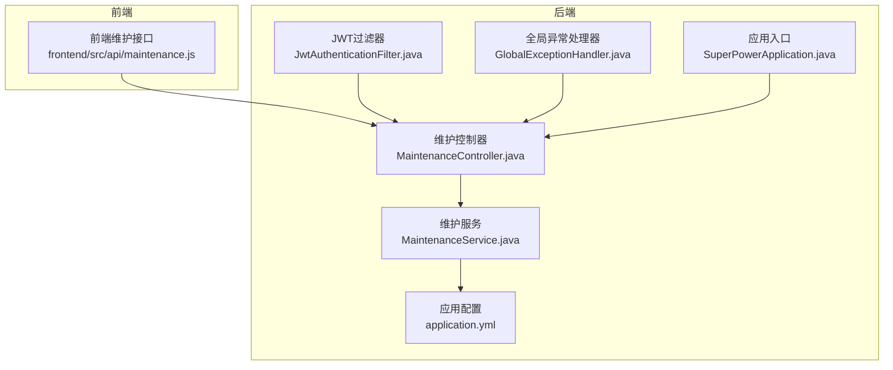
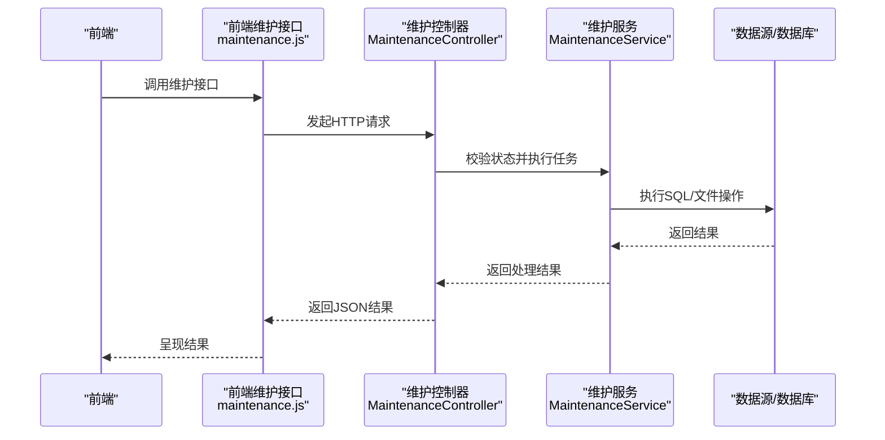
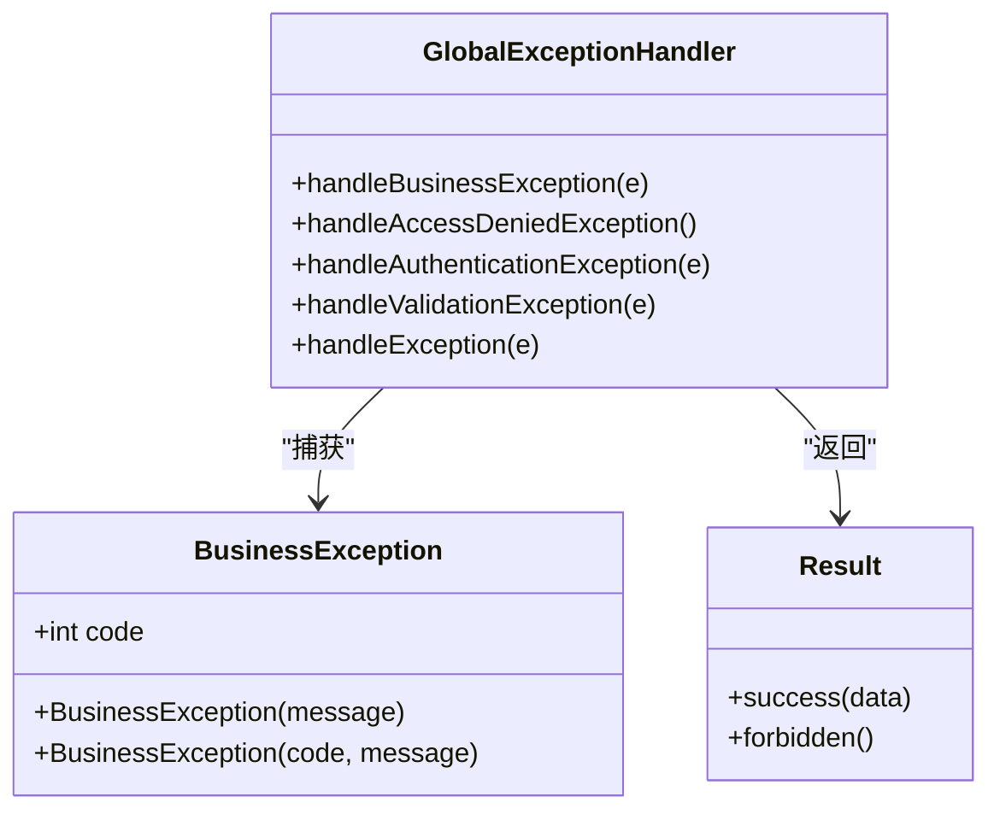
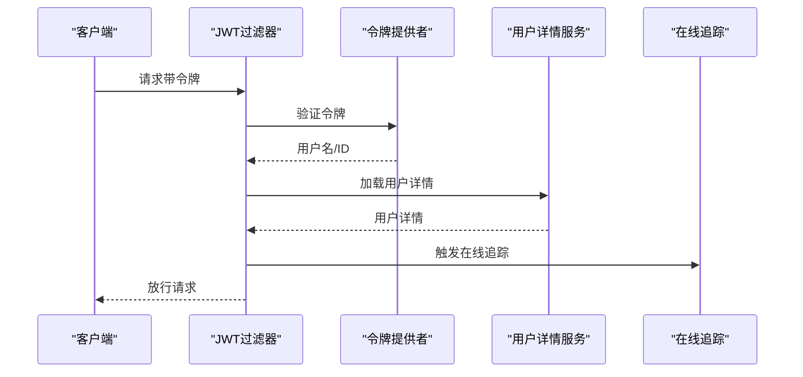
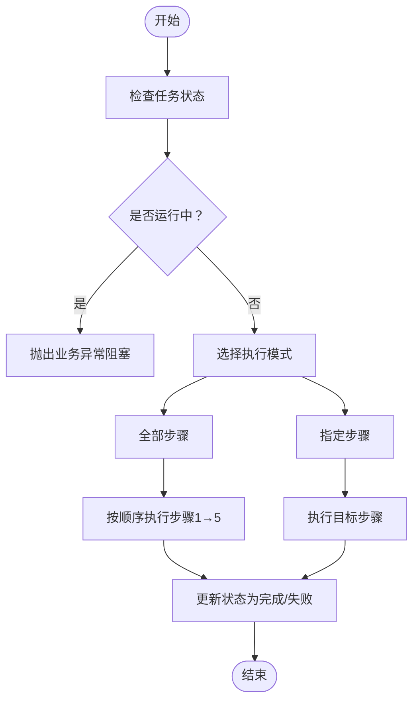
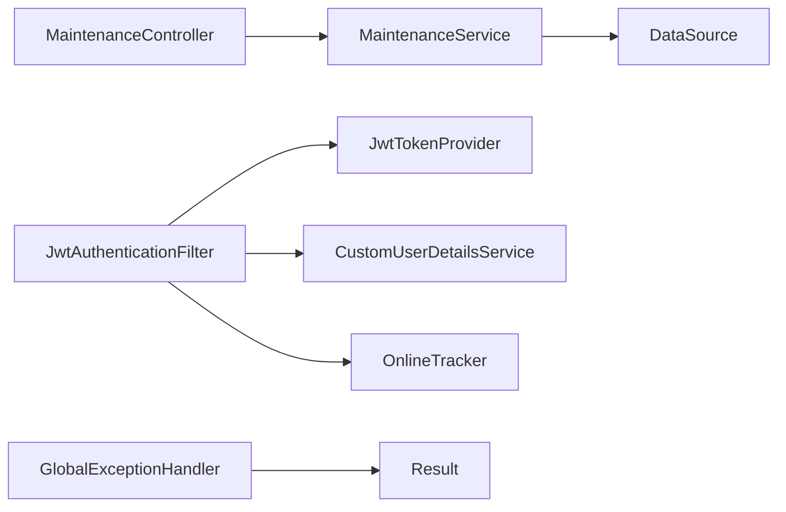

# 故障排除与维护

<cite>
**本文引用的文件**
- [application.yml](file://src/main/resources/application.yml)
- [SuperPowerApplication.java](file://src/main/java/com/superpower/SuperPowerApplication.java)
- [GlobalExceptionHandler.java](file://src/main/java/com/superpower/common/GlobalExceptionHandler.java)
- [BusinessException.java](file://src/main/java/com/superpower/common/BusinessException.java)
- [JwtAuthenticationFilter.java](file://src/main/java/com/superpower/security/JwtAuthenticationFilter.java)
- [MaintenanceController.java](file://src/main/java/com/superpower/modules/system/controller/MaintenanceController.java)
- [MaintenanceService.java](file://src/main/java/com/superpower/modules/system/service/MaintenanceService.java)
- [maintenance.js](file://frontend/src/api/maintenance.js)
- [V1.0.10_cleanup_5_6_2_images.sql](file://db_changes/V1.0.10_cleanup_5_6_2_images.sql)
- [init.sql](file://src/main/resources/db/init.sql)
</cite>

## 目录
1. [简介](#简介)
2. [项目结构](#项目结构)
3. [核心组件](#核心组件)
4. [架构总览](#架构总览)
5. [详细组件分析](#详细组件分析)
6. [依赖关系分析](#依赖关系分析)
7. [性能考量](#性能考量)
8. [故障排除指南](#故障排除指南)
9. [结论](#结论)
10. [附录](#附录)

## 简介
本指南面向运维与开发工程师，围绕产品清单管理系统的启动失败、数据库连接问题、权限认证故障、性能瓶颈等常见问题，提供系统化的诊断与处置方法。同时覆盖数据库迁移脚本的使用与回滚策略、全局异常处理器工作机制与自定义异常最佳实践、日志分析技巧、内存泄漏检测、数据库性能优化、备份恢复与灾难恢复流程以及安全加固措施，帮助一线人员快速定位并解决问题，提升系统的稳定性与可维护性。

## 项目结构
系统采用前后端分离架构：后端基于 Spring Boot，前端基于 Vue3 + Vite。数据库默认使用 SQLite（生产环境建议替换为更稳健的关系型数据库）。运维相关的维护接口集中在系统模块下，涵盖图片迁移、文件名同步、引用 ID 修复、SQL 执行与图片 product_id 填充等功能。

图表来源
- [SuperPowerApplication.java:17-42](file://src/main/java/com/superpower/SuperPowerApplication.java#L17-L42)
- [application.yml:11-34](file://src/main/resources/application.yml#L11-L34)
- [JwtAuthenticationFilter.java:17-61](file://src/main/java/com/superpower/security/JwtAuthenticationFilter.java#L17-L61)
- [MaintenanceController.java:18-131](file://src/main/java/com/superpower/modules/system/controller/MaintenanceController.java#L18-L131)
- [MaintenanceService.java:26-52](file://src/main/java/com/superpower/modules/system/service/MaintenanceService.java#L26-L52)
- [GlobalExceptionHandler.java:14-48](file://src/main/java/com/superpower/common/GlobalExceptionHandler.java#L14-L48)
- [maintenance.js:1-50](file://frontend/src/api/maintenance.js#L1-L50)

章节来源
- [application.yml:1-40](file://src/main/resources/application.yml#L1-L40)
- [SuperPowerApplication.java:17-82](file://src/main/java/com/superpower/SuperPowerApplication.java#L17-L82)
- [JwtAuthenticationFilter.java:17-61](file://src/main/java/com/superpower/security/JwtAuthenticationFilter.java#L17-L61)
- [MaintenanceController.java:18-131](file://src/main/java/com/superpower/modules/system/controller/MaintenanceController.java#L18-L131)
- [MaintenanceService.java:26-52](file://src/main/java/com/superpower/modules/system/service/MaintenanceService.java#L26-L52)
- [GlobalExceptionHandler.java:14-48](file://src/main/java/com/superpower/common/GlobalExceptionHandler.java#L14-L48)
- [maintenance.js:1-50](file://frontend/src/api/maintenance.js#L1-L50)

## 核心组件
- 应用配置与数据库连接
  - 默认使用 SQLite，连接池为 HikariCP，最大连接数较小，适合演示环境，生产需评估并发与持久化方案。
- 全局异常处理器
  - 统一捕获业务异常、访问拒绝、认证异常、参数校验异常与通用异常，返回标准化结果。
- JWT 认证过滤器
  - 提取请求中的令牌，验证并通过用户详情设置安全上下文，支持在线追踪。
- 维护控制器与服务
  - 提供图片迁移、文件名同步、引用 ID 修复、SQL 执行、填充图片 product_id 等运维能力，并记录操作日志。

章节来源
- [application.yml:11-34](file://src/main/resources/application.yml#L11-L34)
- [GlobalExceptionHandler.java:14-48](file://src/main/java/com/superpower/common/GlobalExceptionHandler.java#L14-L48)
- [JwtAuthenticationFilter.java:17-61](file://src/main/java/com/superpower/security/JwtAuthenticationFilter.java#L17-L61)
- [MaintenanceController.java:18-131](file://src/main/java/com/superpower/modules/system/controller/MaintenanceController.java#L18-L131)
- [MaintenanceService.java:26-52](file://src/main/java/com/superpower/modules/system/service/MaintenanceService.java#L26-L52)

## 架构总览
系统通过前端调用后端维护接口，后端控制器接收请求并委派给维护服务执行具体任务。服务层通过数据源直连数据库，执行 SQL 或文件系统操作，并在必要时进行事务控制与异步执行。全局异常处理器统一拦截异常，保证对外响应的一致性。

图表来源
- [maintenance.js:1-50](file://frontend/src/api/maintenance.js#L1-L50)
- [MaintenanceController.java:33-131](file://src/main/java/com/superpower/modules/system/controller/MaintenanceController.java#L33-L131)
- [MaintenanceService.java:70-123](file://src/main/java/com/superpower/modules/system/service/MaintenanceService.java#L70-L123)

## 详细组件分析

### 全局异常处理器
- 功能要点
  - 捕获业务异常并返回业务码与消息。
  - 处理访问拒绝、认证异常与参数校验异常，返回标准化错误。
  - 捕获通用异常并返回内部错误码。
- 最佳实践
  - 保持错误码与消息的可读性与一致性。
  - 对敏感信息脱敏，避免泄露内部细节。
  - 结合日志记录异常堆栈以便排查。

图表来源
- [GlobalExceptionHandler.java:14-48](file://src/main/java/com/superpower/common/GlobalExceptionHandler.java#L14-L48)
- [BusinessException.java:6-22](file://src/main/java/com/superpower/common/BusinessException.java#L6-L22)

章节来源
- [GlobalExceptionHandler.java:14-48](file://src/main/java/com/superpower/common/GlobalExceptionHandler.java#L14-L48)
- [BusinessException.java:6-22](file://src/main/java/com/superpower/common/BusinessException.java#L6-L22)

### JWT 认证过滤器
- 功能要点
  - 支持 Authorization 头与查询参数两种令牌传递方式。
  - 验证令牌并加载用户详情，设置安全上下文。
  - 触发在线追踪，便于审计与会话管理。
- 故障排查
  - 核对令牌格式与签名密钥是否匹配。
  - 检查请求头与参数是否正确传递。
  - 关注令牌过期与用户状态变化导致的认证失败。

图表来源
- [JwtAuthenticationFilter.java:32-48](file://src/main/java/com/superpower/security/JwtAuthenticationFilter.java#L32-L48)

章节来源
- [JwtAuthenticationFilter.java:17-61](file://src/main/java/com/superpower/security/JwtAuthenticationFilter.java#L17-L61)

### 维护控制器与服务
- 维护控制器
  - 提供图片迁移、分步迁移、状态查询与重置。
  - 提供文件名同步、状态查询与重置。
  - 提供引用 ID 修复、状态查询与重置。
  - 提供 SQL 执行与图片 product_id 填充。
- 维护服务
  - 异步执行各类维护任务，记录进度与状态。
  - 步骤化迁移：备份数据库、复制文件、更新数据库、去重、清理旧文件。
  - 文件名同步：规范化存储文件名并同步引用。
  - 引用 ID 修复：根据 URL 与存储名映射修复 data-id 引用。
  - SQL 执行：拆分多条语句，限制查询返回行数，记录耗时与结果。

图表来源
- [MaintenanceController.java:33-131](file://src/main/java/com/superpower/modules/system/controller/MaintenanceController.java#L33-L131)
- [MaintenanceService.java:63-123](file://src/main/java/com/superpower/modules/system/service/MaintenanceService.java#L63-L123)

章节来源
- [MaintenanceController.java:18-131](file://src/main/java/com/superpower/modules/system/controller/MaintenanceController.java#L18-L131)
- [MaintenanceService.java:26-52](file://src/main/java/com/superpower/modules/system/service/MaintenanceService.java#L26-L52)
- [MaintenanceService.java:70-123](file://src/main/java/com/superpower/modules/system/service/MaintenanceService.java#L70-L123)
- [MaintenanceService.java:125-144](file://src/main/java/com/superpower/modules/system/service/MaintenanceService.java#L125-L144)
- [MaintenanceService.java:292-340](file://src/main/java/com/superpower/modules/system/service/MaintenanceService.java#L292-L340)
- [MaintenanceService.java:409-433](file://src/main/java/com/superpower/modules/system/service/MaintenanceService.java#L409-L433)
- [MaintenanceService.java:435-458](file://src/main/java/com/superpower/modules/system/service/MaintenanceService.java#L435-L458)
- [MaintenanceService.java:497-587](file://src/main/java/com/superpower/modules/system/service/MaintenanceService.java#L497-L587)
- [MaintenanceService.java:646-739](file://src/main/java/com/superpower/modules/system/service/MaintenanceService.java#L646-L739)
- [MaintenanceService.java:759-800](file://src/main/java/com/superpower/modules/system/service/MaintenanceService.java#L759-L800)

## 依赖关系分析
- 组件耦合
  - 控制器依赖服务层，服务层依赖仓库与数据源。
  - 过滤器依赖令牌提供者与用户详情服务，用于认证与授权。
  - 全局异常处理器对业务异常进行统一处理。
- 外部依赖
  - 数据库：默认 SQLite，生产建议 PostgreSQL/MySQL。
  - 日志：DEBUG 级别开启，便于问题定位。
  - 安全：JWT 令牌与 Spring Security 集成。

图表来源
- [MaintenanceController.java:23-31](file://src/main/java/com/superpower/modules/system/controller/MaintenanceController.java#L23-L31)
- [MaintenanceService.java:32-51](file://src/main/java/com/superpower/modules/system/service/MaintenanceService.java#L32-L51)
- [JwtAuthenticationFilter.java:20-30](file://src/main/java/com/superpower/security/JwtAuthenticationFilter.java#L20-L30)
- [GlobalExceptionHandler.java:14-48](file://src/main/java/com/superpower/common/GlobalExceptionHandler.java#L14-L48)

章节来源
- [application.yml:11-34](file://src/main/resources/application.yml#L11-L34)
- [JwtAuthenticationFilter.java:17-61](file://src/main/java/com/superpower/security/JwtAuthenticationFilter.java#L17-L61)
- [GlobalExceptionHandler.java:14-48](file://src/main/java/com/superpower/common/GlobalExceptionHandler.java#L14-L48)

## 性能考量
- 数据库连接池
  - 当前最大连接数较小，高并发场景可能成为瓶颈。建议根据业务峰值调整最大连接数与连接超时。
- 查询与事务
  - 大批量更新与查询应分批执行，避免长时间锁表。
  - 使用事务包裹相关写操作，确保一致性。
- IO 密集型任务
  - 图片迁移与文件同步为 IO 密集型，建议异步执行并监控磁盘空间与 IO 压力。
- 日志级别
  - 生产环境建议降低日志级别，减少 IO 开销。

章节来源
- [application.yml:21-24](file://src/main/resources/application.yml#L21-L24)
- [MaintenanceService.java:292-340](file://src/main/java/com/superpower/modules/system/service/MaintenanceService.java#L292-L340)
- [MaintenanceService.java:409-433](file://src/main/java/com/superpower/modules/system/service/MaintenanceService.java#L409-L433)

## 故障排除指南

### 启动失败
- 常见原因
  - Java 版本不兼容、端口被占用、数据库文件不可写。
- 排查步骤
  - 检查应用端口与容器/主机端口映射。
  - 确认数据库文件路径与权限，确保可读写。
  - 查看启动日志，定位初始化阶段异常。
- 参考配置
  - 端口、Tomcat 连接超时、日志级别、数据源与 JPA 配置。

章节来源
- [application.yml:1-40](file://src/main/resources/application.yml#L1-L40)
- [SuperPowerApplication.java:35-38](file://src/main/java/com/superpower/SuperPowerApplication.java#L35-L38)

### 数据库连接问题
- 症状
  - 连接超时、连接池耗尽、SQL 执行失败。
- 排查步骤
  - 检查数据源 URL、驱动类名与连接池参数。
  - 观察连接池指标，确认最大连接数与超时阈值是否合理。
  - 对于 SQLite，确认数据库文件存在且无并发写冲突。
- 建议
  - 生产环境使用 PostgreSQL/MySQL，启用连接池监控与慢查询日志。

章节来源
- [application.yml:18-24](file://src/main/resources/application.yml#L18-L24)
- [MaintenanceService.java:171-197](file://src/main/java/com/superpower/modules/system/service/MaintenanceService.java#L171-L197)

### 权限认证故障
- 症状
  - 401 未认证、403 禁止访问、令牌无效。
- 排查步骤
  - 确认请求头 Authorization 或查询参数携带令牌。
  - 校验令牌签名与有效期，检查用户状态与角色。
  - 关注全局异常处理器对认证异常的统一返回。
- 最佳实践
  - 严格管理密钥与过期时间，定期轮换。
  - 对敏感接口添加角色校验。

章节来源
- [JwtAuthenticationFilter.java:32-48](file://src/main/java/com/superpower/security/JwtAuthenticationFilter.java#L32-L48)
- [GlobalExceptionHandler.java:22-32](file://src/main/java/com/superpower/common/GlobalExceptionHandler.java#L22-L32)
- [MaintenanceController.java:20-31](file://src/main/java/com/superpower/modules/system/controller/MaintenanceController.java#L20-L31)

### 性能瓶颈
- 症状
  - 响应缓慢、CPU/IO 占用高、连接池紧张。
- 排查步骤
  - 分析慢查询与大结果集查询，限制返回行数。
  - 评估连接池参数，必要时扩容。
  - 对 IO 密集型任务（如图片迁移）进行分批与异步处理。
- 优化建议
  - 使用索引优化高频查询字段。
  - 缓存热点数据，减少重复查询。

章节来源
- [MaintenanceService.java:759-800](file://src/main/java/com/superpower/modules/system/service/MaintenanceService.java#L759-L800)
- [application.yml:21-24](file://src/main/resources/application.yml#L21-L24)

### 数据库迁移脚本使用与回滚
- 使用步骤
  - 图片版本隔离迁移：先复制物理文件，再执行 SQL 脚本，最后清理旧文件。
  - 文件名同步：规范化存储文件名并同步引用。
  - 引用 ID 修复：根据 URL 与存储名映射修复 data-id 引用。
- 回滚策略
  - 迁移前自动备份数据库，生成带时间戳的 .bak 文件。
  - 如遇失败，可使用备份文件恢复数据库。
  - 清理旧文件为最后一步，若失败可手动恢复。
- 参考脚本
  - 图片迁移修复脚本示例。

章节来源
- [MaintenanceService.java:171-197](file://src/main/java/com/superpower/modules/system/service/MaintenanceService.java#L171-L197)
- [MaintenanceService.java:435-458](file://src/main/java/com/superpower/modules/system/service/MaintenanceService.java#L435-L458)
- [V1.0.10_cleanup_5_6_2_images.sql:1-228](file://db_changes/V1.0.10_cleanup_5_6_2_images.sql#L1-L228)

### 自定义异常处理最佳实践
- 建议
  - 明确业务异常码与消息，便于前端统一提示。
  - 对外仅暴露必要信息，避免泄露内部实现细节。
  - 记录异常堆栈与上下文，支撑后续修复。
- 参考
  - 全局异常处理器对不同异常类型的处理策略。

章节来源
- [GlobalExceptionHandler.java:14-48](file://src/main/java/com/superpower/common/GlobalExceptionHandler.java#L14-L48)
- [BusinessException.java:6-22](file://src/main/java/com/superpower/common/BusinessException.java#L6-L22)

### 日志分析技巧
- 建议
  - 生产环境降低日志级别，聚焦 ERROR/ WARN。
  - 结合请求链路 ID 与用户上下文定位问题。
  - 定期巡检慢查询与异常日志，建立告警机制。

章节来源
- [application.yml:6-9](file://src/main/resources/application.yml#L6-L9)

### 内存泄漏检测
- 建议
  - 使用 JVM 堆分析工具识别常驻对象。
  - 关注长生命周期集合与静态缓存，避免持有请求上下文。
  - 定期重启应用以释放临时资源。

### 数据库性能优化
- 建议
  - 为高频查询字段建立索引。
  - 分页查询与限制单次处理数量。
  - 使用只读事务与连接池复用。

章节来源
- [init.sql:1-126](file://src/main/resources/db/init.sql#L1-L126)

### 备份恢复流程
- 流程
  - 迁移前自动备份数据库并执行 VACUUM 压缩。
  - 若迁移失败，使用备份文件恢复数据库。
  - 清理旧文件失败时，手动恢复对应目录。
- 建议
  - 将备份文件保存至独立存储，定期校验完整性。

章节来源
- [MaintenanceService.java:171-197](file://src/main/java/com/superpower/modules/system/service/MaintenanceService.java#L171-L197)
- [MaintenanceService.java:435-458](file://src/main/java/com/superpower/modules/system/service/MaintenanceService.java#L435-L458)

### 灾难恢复计划
- 建议
  - 制定 RTO/RPO 指标，明确恢复时间与数据丢失容忍度。
  - 定期演练恢复流程，验证备份可用性。
  - 多机房部署与异地容灾，确保业务连续性。

### 安全加固措施
- 建议
  - 强制 HTTPS 传输，限制明文协议。
  - 定期轮换 JWT 密钥，缩短令牌有效期。
  - 严格最小权限原则，限制维护接口访问角色。
  - 对 SQL 执行接口增加白名单与审计日志。

章节来源
- [application.yml:35-39](file://src/main/resources/application.yml#L35-L39)
- [MaintenanceController.java:20-31](file://src/main/java/com/superpower/modules/system/controller/MaintenanceController.java#L20-L31)

## 结论
通过统一的异常处理、完善的认证过滤、模块化的维护服务与规范的迁移脚本，系统具备了较强的可维护性与可扩展性。结合本文提供的故障排除与维护指南，运维人员可在启动失败、数据库连接、认证异常与性能瓶颈等方面快速定位并解决问题，配合备份恢复与安全加固，进一步提升系统的稳定性与安全性。

## 附录
- 前端维护接口一览
  - 图片迁移、分步迁移、状态查询与重置
  - 文件名同步、状态查询与重置
  - 引用 ID 修复、状态查询与重置
  - SQL 执行与图片 product_id 填充

章节来源
- [maintenance.js:1-50](file://frontend/src/api/maintenance.js#L1-L50)