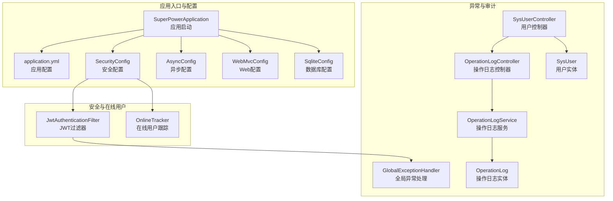
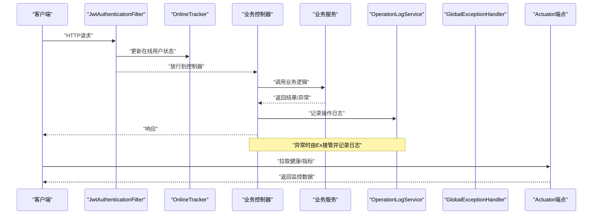
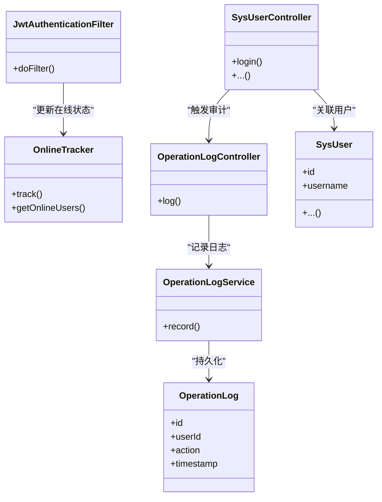
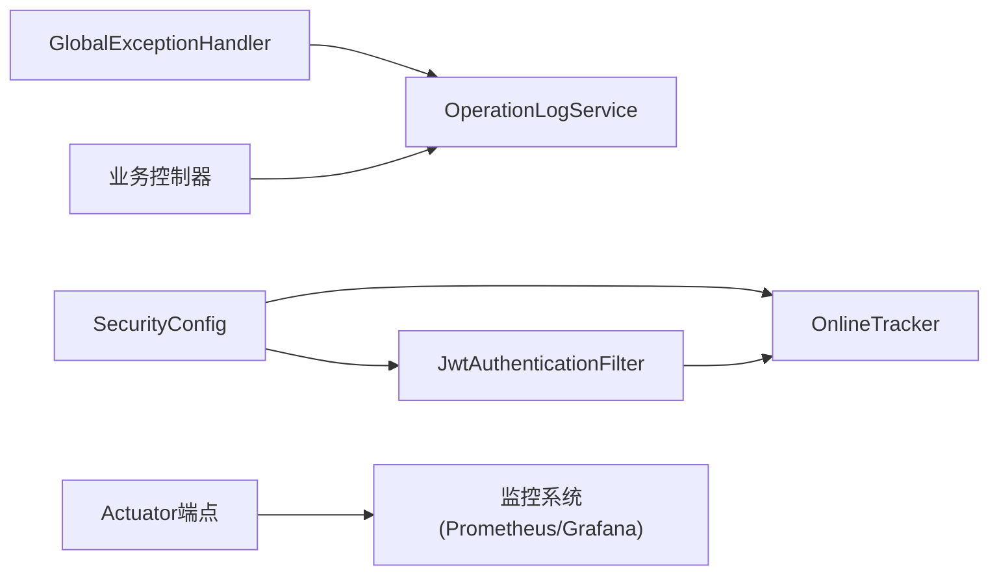

# 生产环境监控

<cite>
**本文引用的文件**
- [application.yml](file://src/main/resources/application.yml)
- [SuperPowerApplication.java](file://src/main/java/com/superpower/SuperPowerApplication.java)
- [SecurityConfig.java](file://src/main/java/com/superpower/config/SecurityConfig.java)
- [JwtAuthenticationFilter.java](file://src/main/java/com/superpower/security/JwtAuthenticationFilter.java)
- [OnlineTracker.java](file://src/main/java/com/superpower/security/OnlineTracker.java)
- [GlobalExceptionHandler.java](file://src/main/java/com/superpower/common/GlobalExceptionHandler.java)
- [SysUserController.java](file://src/main/java/com/superpower/modules/system/controller/SysUserController.java)
- [OperationLogController.java](file://src/main/java/com/superpower/modules/system/controller/OperationLogController.java)
- [OperationLogService.java](file://src/main/java/com/superpower/modules/system/service/OperationLogService.java)
- [OperationLog.java](file://src/main/java/com/superpower/modules/system/entity/OperationLog.java)
- [SysUser.java](file://src/main/java/com/superpower/modules/system/entity/SysUser.java)
- [AsyncConfig.java](file://src/main/java/com/superpower/config/AsyncConfig.java)
- [WebMvcConfig.java](file://src/main/java/com/superpower/config/WebMvcConfig.java)
- [SqliteConfig.java](file://src/main/java/com/superpower/config/SqliteConfig.java)
- [Dockerfile](file://Dockerfile)
- [pom.xml](file://pom.xml)
</cite>

## 目录
1. [简介](#简介)
2. [项目结构](#项目结构)
3. [核心组件](#核心组件)
4. [架构总览](#架构总览)
5. [详细组件分析](#详细组件分析)
6. [依赖分析](#依赖分析)
7. [性能考虑](#性能考虑)
8. [故障排查指南](#故障排查指南)
9. [结论](#结论)
10. [附录](#附录)

## 简介
本文件面向运维与开发团队，提供产品清单管理系统的生产环境监控配置指南。内容覆盖Spring Boot应用的健康检查端点、指标收集与性能监控、安全配置中的审计日志与访问日志、异常监控、在线用户跟踪机制、Prometheus/Grafana集成方案、告警规则建议、日志聚合思路以及性能基准测试方法，帮助建立完善的监控体系以保障系统稳定运行。

## 项目结构
后端采用Spring Boot多模块结构，核心监控相关组件分布如下：
- 应用入口与配置：SuperPowerApplication、application.yml、各配置类（SecurityConfig、AsyncConfig、WebMvcConfig、SqliteConfig）
- 安全与在线用户：JwtAuthenticationFilter、OnlineTracker
- 异常与审计：GlobalExceptionHandler、OperationLogController/Service/Entity、SysUserController
- 运行时与容器：Dockerfile、pom.xml

**图表来源**
- [SuperPowerApplication.java](file://src/main/java/com/superpower/SuperPowerApplication.java)
- [application.yml](file://src/main/resources/application.yml)
- [SecurityConfig.java](file://src/main/java/com/superpower/config/SecurityConfig.java)
- [AsyncConfig.java](file://src/main/java/com/superpower/config/AsyncConfig.java)
- [WebMvcConfig.java](file://src/main/java/com/superpower/config/WebMvcConfig.java)
- [SqliteConfig.java](file://src/main/java/com/superpower/config/SqliteConfig.java)
- [JwtAuthenticationFilter.java](file://src/main/java/com/superpower/security/JwtAuthenticationFilter.java)
- [OnlineTracker.java](file://src/main/java/com/superpower/security/OnlineTracker.java)
- [GlobalExceptionHandler.java](file://src/main/java/com/superpower/common/GlobalExceptionHandler.java)
- [OperationLogController.java](file://src/main/java/com/superpower/modules/system/controller/OperationLogController.java)
- [OperationLogService.java](file://src/main/java/com/superpower/modules/system/service/OperationLogService.java)
- [OperationLog.java](file://src/main/java/com/superpower/modules/system/entity/OperationLog.java)
- [SysUserController.java](file://src/main/java/com/superpower/modules/system/controller/SysUserController.java)
- [SysUser.java](file://src/main/java/com/superpower/modules/system/entity/SysUser.java)

**章节来源**
- [SuperPowerApplication.java](file://src/main/java/com/superpower/SuperPowerApplication.java)
- [application.yml](file://src/main/resources/application.yml)

## 核心组件
- 健康检查与指标端点：通过Spring Boot Actuator暴露健康检查、指标与应用信息端点，便于外部监控系统拉取。
- 安全与审计：基于JWT的认证过滤器与在线用户跟踪，结合操作日志服务实现审计与访问日志能力。
- 全局异常监控：统一异常处理，将未捕获异常纳入监控与日志体系。
- 异步与Web配置：异步任务与Web层配置影响请求处理与线程池资源使用，需纳入性能监控范围。
- 数据库配置：SQLite配置用于本地或轻量场景，生产建议使用关系型数据库并开启连接池与慢查询日志。

**章节来源**
- [SecurityConfig.java](file://src/main/java/com/superpower/config/SecurityConfig.java)
- [JwtAuthenticationFilter.java](file://src/main/java/com/superpower/security/JwtAuthenticationFilter.java)
- [OnlineTracker.java](file://src/main/java/com/superpower/security/OnlineTracker.java)
- [GlobalExceptionHandler.java](file://src/main/java/com/superpower/common/GlobalExceptionHandler.java)
- [OperationLogController.java](file://src/main/java/com/superpower/modules/system/controller/OperationLogController.java)
- [OperationLogService.java](file://src/main/java/com/superpower/modules/system/service/OperationLogService.java)
- [AsyncConfig.java](file://src/main/java/com/superpower/config/AsyncConfig.java)
- [WebMvcConfig.java](file://src/main/java/com/superpower/config/WebMvcConfig.java)
- [SqliteConfig.java](file://src/main/java/com/superpower/config/SqliteConfig.java)

## 架构总览
下图展示生产监控视角下的关键交互：客户端请求经由安全过滤器与在线用户跟踪，进入业务控制器；异常统一由全局处理器接管；操作日志服务记录审计事件；Actuator端点供Prometheus/Grafana采集。

**图表来源**
- [JwtAuthenticationFilter.java](file://src/main/java/com/superpower/security/JwtAuthenticationFilter.java)
- [OnlineTracker.java](file://src/main/java/com/superpower/security/OnlineTracker.java)
- [OperationLogService.java](file://src/main/java/com/superpower/modules/system/service/OperationLogService.java)
- [GlobalExceptionHandler.java](file://src/main/java/com/superpower/common/GlobalExceptionHandler.java)

## 详细组件分析

### 健康检查与指标端点
- 启用Actuator：在配置中启用健康检查、指标与应用信息端点，确保Prometheus/Grafana可拉取。
- 指标维度：JVM内存、GC、线程、HTTP请求、业务指标（如操作日志写入速率）。
- 访问控制：建议限制Actuator端口与路径访问，仅允许监控网络访问。

**章节来源**
- [application.yml](file://src/main/resources/application.yml)

### 安全配置与审计日志
- JWT认证过滤器：拦截请求，校验令牌并注入认证上下文，支持在线用户跟踪。
- 在线用户跟踪：维护在线用户集合，可用于统计在线人数、会话管理与异常登录检测。
- 操作日志：用户行为（登录、增删改查等）记录到OperationLog，支持审计与回溯。
- 用户控制器：提供用户相关接口，配合日志服务实现完整的审计闭环。

**图表来源**
- [JwtAuthenticationFilter.java](file://src/main/java/com/superpower/security/JwtAuthenticationFilter.java)
- [OnlineTracker.java](file://src/main/java/com/superpower/security/OnlineTracker.java)
- [OperationLogController.java](file://src/main/java/com/superpower/modules/system/controller/OperationLogController.java)
- [OperationLogService.java](file://src/main/java/com/superpower/modules/system/service/OperationLogService.java)
- [OperationLog.java](file://src/main/java/com/superpower/modules/system/entity/OperationLog.java)
- [SysUserController.java](file://src/main/java/com/superpower/modules/system/controller/SysUserController.java)
- [SysUser.java](file://src/main/java/com/superpower/modules/system/entity/SysUser.java)

**章节来源**
- [JwtAuthenticationFilter.java](file://src/main/java/com/superpower/security/JwtAuthenticationFilter.java)
- [OnlineTracker.java](file://src/main/java/com/superpower/security/OnlineTracker.java)
- [OperationLogController.java](file://src/main/java/com/superpower/modules/system/controller/OperationLogController.java)
- [OperationLogService.java](file://src/main/java/com/superpower/modules/system/service/OperationLogService.java)
- [OperationLog.java](file://src/main/java/com/superpower/modules/system/entity/OperationLog.java)
- [SysUserController.java](file://src/main/java/com/superpower/modules/system/controller/SysUserController.java)
- [SysUser.java](file://src/main/java/com/superpower/modules/system/entity/SysUser.java)

### 异常监控
- 全局异常处理：捕获未处理异常，统一返回格式并记录日志，便于监控系统识别错误率与错误类型。
- 建议：对高频异常类型建立告警阈值，结合日志聚合进行根因分析。

**章节来源**
- [GlobalExceptionHandler.java](file://src/main/java/com/superpower/common/GlobalExceptionHandler.java)

### 异步与Web配置
- 异步配置：定义线程池参数，影响异步任务吞吐与延迟，应纳入性能监控。
- Web配置：跨域、CORS、静态资源等配置影响请求处理链路，需关注异常与超时。

**章节来源**
- [AsyncConfig.java](file://src/main/java/com/superpower/config/AsyncConfig.java)
- [WebMvcConfig.java](file://src/main/java/com/superpower/config/WebMvcConfig.java)

### 数据库配置
- SQLite配置：适用于轻量场景，生产建议使用关系型数据库并开启连接池、慢查询日志与备份策略。
- 建议：将数据库指标（连接数、慢查询、锁等待）纳入监控。

**章节来源**
- [SqliteConfig.java](file://src/main/java/com/superpower/config/SqliteConfig.java)

## 依赖分析
- 组件耦合：安全过滤器依赖在线用户跟踪；控制器依赖日志服务；全局异常处理贯穿所有请求路径。
- 外部依赖：Actuator、数据库驱动、日志框架、容器镜像构建工具。
- 建议：避免循环依赖，确保监控相关组件独立且可替换。

**图表来源**
- [SecurityConfig.java](file://src/main/java/com/superpower/config/SecurityConfig.java)
- [JwtAuthenticationFilter.java](file://src/main/java/com/superpower/security/JwtAuthenticationFilter.java)
- [OnlineTracker.java](file://src/main/java/com/superpower/security/OnlineTracker.java)
- [OperationLogService.java](file://src/main/java/com/superpower/modules/system/service/OperationLogService.java)
- [GlobalExceptionHandler.java](file://src/main/java/com/superpower/common/GlobalExceptionHandler.java)

**章节来源**
- [pom.xml](file://pom.xml)
- [Dockerfile](file://Dockerfile)

## 性能考虑
- 线程池与异步任务：合理设置核心线程数、队列长度与拒绝策略，避免过载导致延迟飙升。
- 请求链路：关注过滤器、控制器、服务层与数据库的耗时分布，定位瓶颈。
- 缓存与连接池：对热点数据与频繁查询建立缓存与连接池优化。
- GC与内存：监控堆内存、GC频率与停顿时间，避免Full GC引发抖动。
- 并发与限流：结合在线用户跟踪与请求速率，设置合理的限流与熔断策略。

## 故障排查指南
- 健康检查：优先确认Actuator端点可用性与返回状态。
- 日志定位：结合全局异常处理与操作日志，快速定位异常类型与发生时间。
- 在线用户：核实在线人数是否异常波动，排查并发峰值与会话泄漏。
- 数据库：检查慢查询与连接池占用，必要时开启慢日志与备份验证。
- 配置核对：确认安全过滤器、在线跟踪与日志服务的开关与参数。

**章节来源**
- [application.yml](file://src/main/resources/application.yml)
- [GlobalExceptionHandler.java](file://src/main/java/com/superpower/common/GlobalExceptionHandler.java)
- [OperationLogService.java](file://src/main/java/com/superpower/modules/system/service/OperationLogService.java)
- [OnlineTracker.java](file://src/main/java/com/superpower/security/OnlineTracker.java)

## 结论
通过启用Actuator端点、完善安全与审计日志、建立异常监控与在线用户跟踪，并结合Prometheus/Grafana的指标采集与可视化，可形成覆盖健康度、性能与安全的完整监控体系。建议在生产环境中逐步落地上述配置与流程，持续优化告警阈值与日志聚合策略，确保系统稳定高效运行。

## 附录

### Prometheus/Grafana集成方案
- 拉取目标：在Prometheus配置中添加Actuator端点作为抓取目标，按需扩展业务指标。
- 可视化：在Grafana中创建仪表盘，展示健康状态、请求速率、错误率、在线用户、数据库指标与JVM指标。
- 告警规则示例（建议）：
  - 错误率：HTTP 5xx错误占比超过阈值
  - 响应时间：P95/P99响应时间超过阈值
  - 在线用户：异常波动或长时间无增长
  - 数据库：慢查询次数激增、连接池耗尽
  - 系统资源：CPU使用率、内存占用、磁盘空间告警

### 日志聚合与审计
- 日志输出：统一输出结构化日志，包含时间戳、级别、请求ID、用户ID、操作类型与耗时。
- 聚合平台：接入ELK/EFK或云日志服务，实现日志检索、聚合与告警。
- 审计范围：登录、权限变更、敏感操作均需记录并保留一定周期。

### 性能基准测试方法
- 压力测试：使用JMeter/Locust模拟并发用户，测量吞吐、延迟与错误率。
- 场景覆盖：登录、列表查询、详情读取、批量导入导出等关键路径。
- 指标观测：TPS、P95/P99延迟、错误率、数据库慢查询、GC与线程池状态。
- 回归对比：每次发布前后对比关键指标，确保性能不退化。