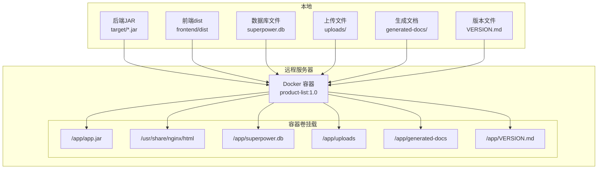
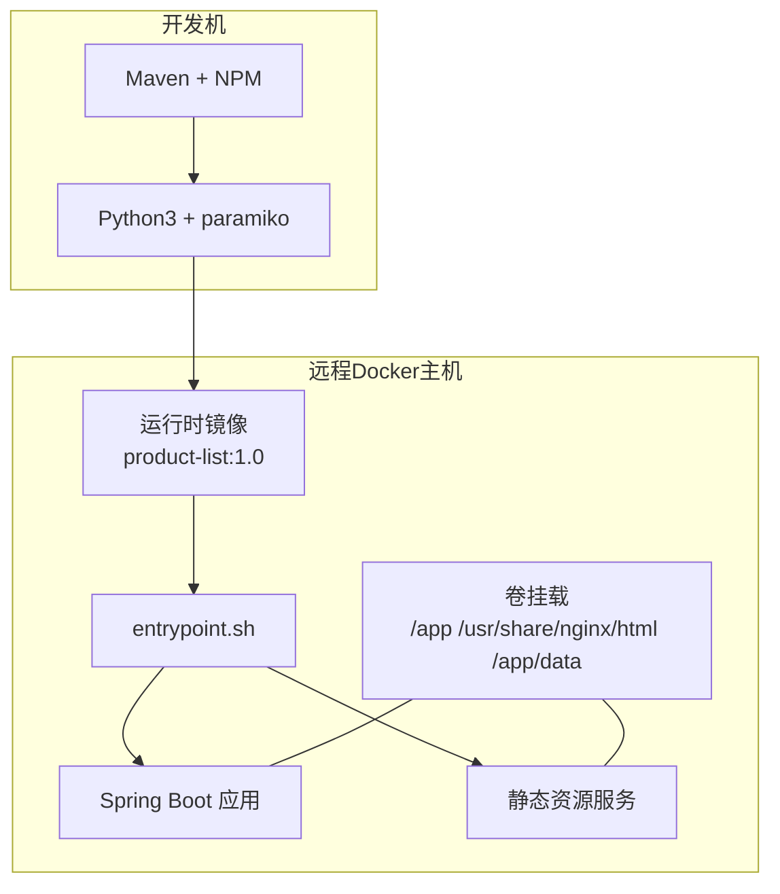
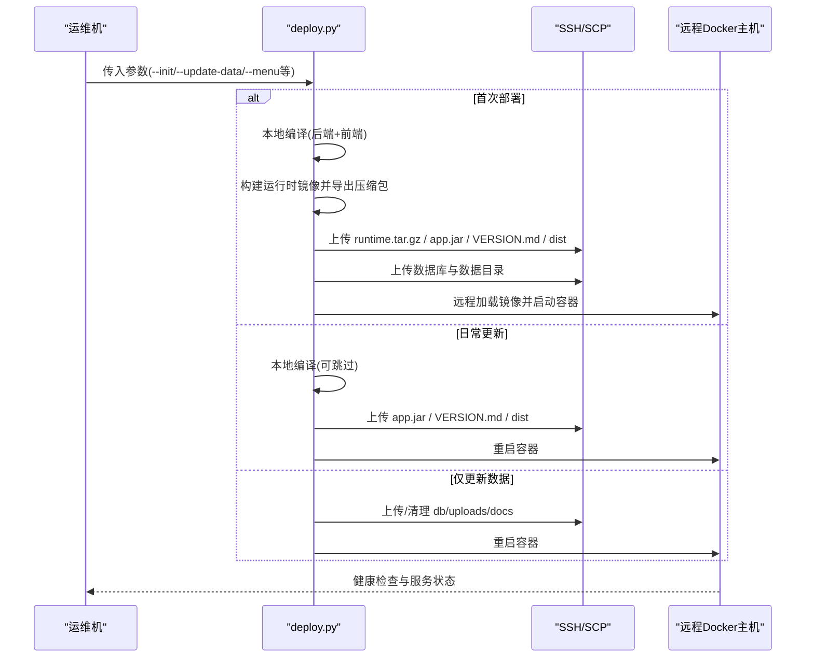
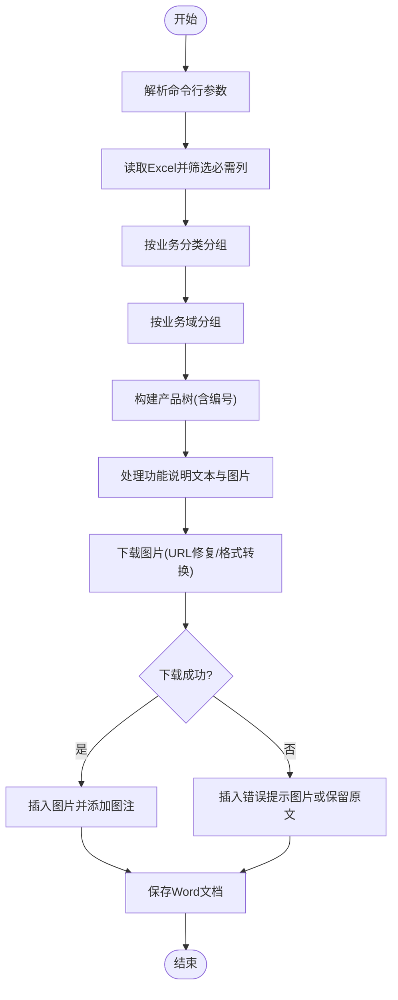
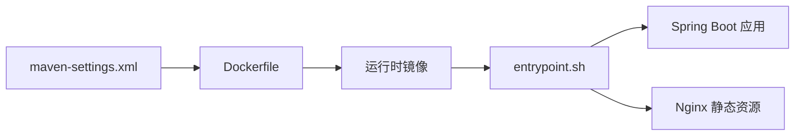

# 自动化部署脚本

<cite>
**本文引用的文件**
- [deploy.py](file://deploy.py)
- [generate_word.py](file://generate_word.py)
- [import_excel.py](file://import_excel.py)
- [import_hierarchy.py](file://import_hierarchy.py)
- [import_l3.py](file://import_l3.py)
- [import_shuzhidi.py](file://import_shuzhidi.py)
- [Dockerfile](file://Dockerfile)
- [docker/entrypoint.sh](file://docker/entrypoint.sh)
- [VERSION.md](file://VERSION.md)
- [docker/maven-settings.xml](file://docker/maven-settings.xml)
</cite>

## 更新摘要
**所做更改**
- 全面重构部署脚本功能，新增交互菜单模式与容器生命周期管理
- 新增跨平台命令执行支持，适配Windows/Linux/macOS环境
- 深度集成Docker容器化架构，优化镜像构建与容器重建流程
- 增强数据更新模式，支持版本文件、附件、文档的精细化更新
- 优化容器重建逻辑，集成健康检查与服务验证机制

## 目录
1. [简介](#简介)
2. [项目结构](#项目结构)
3. [核心组件](#核心组件)
4. [架构总览](#架构总览)
5. [详细组件分析](#详细组件分析)
6. [依赖分析](#依赖分析)
7. [性能考虑](#性能考虑)
8. [故障排查指南](#故障排查指南)
9. [结论](#结论)
10. [附录](#附录)

## 简介
本指南面向运维与数据工程师，系统讲解产品清单管理系统的自动化部署与数据导入脚本，涵盖以下内容：
- deploy.py 部署脚本：功能特性、参数配置、执行流程与交互菜单模式
- 数据导入脚本：import_excel.py、import_hierarchy.py、import_l3.py、import_shuzhidi.py 的使用方法、Excel数据格式要求、导入规则与错误处理
- 文档生成脚本：generate_word.py 的配置选项与批量处理能力
- 完整部署流程示例、参数调优建议与常见问题解决方案

## 项目结构
系统采用"运行时镜像 + 卷挂载"的部署架构：后端JAR、前端dist、数据库与附件/文档目录均通过Docker卷挂载注入，实现零停机热更新。

**图表来源**
- [Dockerfile:25-31](file://Dockerfile#L25-L31)
- [deploy.py:436-447](file://deploy.py#L436-L447)

**章节来源**
- [Dockerfile:1-38](file://Dockerfile#L1-L38)
- [deploy.py:252-298](file://deploy.py#L252-L298)

## 核心组件
- 部署脚本 deploy.py：负责本地编译、远程上传、镜像构建与容器重建，支持首次部署、日常更新、仅更新数据、跳过编译、交互菜单等多种模式。
- 文档生成脚本 generate_word.py：读取Excel，按业务分类/域/产品层级生成Word，支持图片下载、行列式布局与编号体系。
- 数据导入脚本：
  - import_excel.py：从Excel读取并写入SQLite，构建层级与字段映射。
  - import_hierarchy.py：通过API创建业务分类（L1）与业务域（L2）。
  - import_l3.py：通过API创建L3产品条目。
  - import_shuzhidi.py：针对特定分类（数智底座-数据）按编号前缀自动推导父子关系并导入。

**章节来源**
- [deploy.py:63-97](file://deploy.py#L63-L97)
- [generate_word.py:28-48](file://generate_word.py#L28-L48)
- [import_excel.py:88-252](file://import_excel.py#L88-L252)
- [import_hierarchy.py:8-84](file://import_hierarchy.py#L8-L84)
- [import_l3.py:8-91](file://import_l3.py#L8-L91)
- [import_shuzhidi.py:8-134](file://import_shuzhidi.py#L8-L134)

## 架构总览
部署与运行时架构强调"轻镜像、重挂载"：运行时镜像仅包含JRE与Nginx，业务代码与数据通过卷挂载注入，便于快速迭代与回滚。

**图表来源**
- [Dockerfile:1-38](file://Dockerfile#L1-L38)
- [docker/entrypoint.sh:1-22](file://docker/entrypoint.sh#L1-L22)
- [deploy.py:427-459](file://deploy.py#L427-L459)

## 详细组件分析

### 部署脚本 deploy.py 使用指南

**更新** 全面重构的部署脚本现已支持多种部署模式、交互菜单、跨平台命令执行和容器生命周期管理

- 功能特性
  - 首次部署：构建运行时镜像、导出压缩镜像、上传制品与数据、加载镜像并启动容器。
  - 日常更新：本地编译后仅上传JAR与dist，重启容器。
  - 仅更新数据：上传数据库、上传/清理uploads与docs目录，重建容器。
  - 跳过本地编译：直接使用已有制品。
  - 交互菜单：DOS风格菜单，支持选择动作、是否跳过编译、指定后端JAR路径等。
  - 跨平台命令执行：智能适配Windows/Linux/macOS环境的命令执行。
  - 容器生命周期管理：完整的容器创建、重启、状态监控与健康检查。
- 关键参数
  - 连接与远程：--host/--user/--password、--remote-dir/--image/--container/--port
  - 本地编译：--skip-build、--backend-jar
  - 模式：--init、--update-data、--data-items(all/db/uploads/docs)、--version、--db、--uploads、--docs、--menu
  - 新增：--platform linux/amd64（用于Docker镜像构建）
- 执行流程（首次部署）
  1) 本地编译：Maven打包后端，NPM构建前端
  2) 构建运行时镜像并导出压缩包（使用Python gzip，跨平台兼容）
  3) 远程创建目录并上传 runtime.tar.gz、app.jar、VERSION.md、dist
  4) 上传数据库与数据目录（uploads/docs），必要时清理
  5) 远程加载镜像并启动容器，等待健康检查
- 执行流程（日常更新）
  1) 本地编译（可跳过）
  2) 上传 app.jar、VERSION.md、dist
  3) 重启容器
- 执行流程（仅更新数据）
  1) 选择数据项（db/uploads/docs/all）
  2) 远程备份数据库（如存在）
  3) 上传/清理对应目录
  4) 重启容器

**图表来源**
- [deploy.py:229-309](file://deploy.py#L229-L309)
- [deploy.py:313-346](file://deploy.py#L313-L346)
- [deploy.py:360-424](file://deploy.py#L360-L424)
- [deploy.py:427-459](file://deploy.py#L427-L459)

**章节来源**
- [deploy.py:63-97](file://deploy.py#L63-L97)
- [deploy.py:229-309](file://deploy.py#L229-L309)
- [deploy.py:313-346](file://deploy.py#L313-L346)
- [deploy.py:360-424](file://deploy.py#L360-L424)
- [deploy.py:427-459](file://deploy.py#L427-L459)

### 文档生成脚本 generate_word.py 使用指南
- 功能概述
  - 读取Excel，按业务分类（H1）→业务域（H2）→产品树（H3-H9）生成Word
  - 自动生成多级编号（1, 1.1, 1.1.1…）
  - 支持图片下载与嵌入：连续竖图并排、横图单行居中
  - 设置宋体、1.5倍行距、首行缩进
- 配置与参数
  - 命令行：python generate_word.py <输入Excel文件路径> [输出Word文件路径]
  - 若未指定输出路径，默认与输入同名（扩展名.docx）
- 数据格式要求
  - 必须列：产品/系统、父记录、功能说明、业务分类、业务域
  - 功能说明列支持内嵌URL（以尖括号包裹），脚本会识别并下载图片
- 错误处理
  - URL修复：自动修复缺少扩展名分隔符、编码URL
  - 下载失败：记录错误原因（超时、SSL、非图片、需要登录等）
  - 图片格式：WebP自动转换为PNG
  - 降级策略：下载失败时插入错误提示图片或保留原文
- 批量处理能力
  - 通过命令行参数传入不同的Excel文件路径即可批量生成多个Word文档

**图表来源**
- [generate_word.py:28-48](file://generate_word.py#L28-L48)
- [generate_word.py:54-673](file://generate_word.py#L54-L673)

**章节来源**
- [generate_word.py:28-48](file://generate_word.py#L28-L48)
- [generate_word.py:54-673](file://generate_word.py#L54-L673)

### 数据导入脚本使用指南

#### import_excel.py（SQLite直连导入）
- 用途：从Excel读取数据，写入SQLite数据表（data_entry），构建层级与字段映射
- 数据格式要求
  - Excel工作表：筛选视图
  - 必须列：产品/系统、父记录、功能说明、业务分类、业务域
  - 其他列：版本划分、系列字段（曜/远/驰）、财务年份、成本与销量等
- 导入规则
  - 仅导入层级≥3的产品条目
  - 自动识别层级（通过编号前缀）
  - 业务分类（L1）与业务域（L2）去重并插入
  - 为每个条目设置level、parent_id、sort_order、is_leaf等
  - 统计校验：层级错误、孤立引用、重复条目
- 错误处理
  - 数值列清洗（千分位逗号去除、类型转换）
  - 版本划分字段解析（曜/远/驰系列识别）
  - 布尔字段标准化（是/否、true/false等）

**章节来源**
- [import_excel.py:88-252](file://import_excel.py#L88-L252)

#### import_hierarchy.py（API创建L1/L2）
- 用途：通过API创建业务分类（L1）与业务域（L2）
- 使用前提
  - 后端服务已启动并可访问
  - 已登录获取token
- 导入规则
  - 读取Excel，收集业务分类与业务域组合
  - 按顺序创建L1与L2，记录ID映射
- 错误处理
  - 接口返回非200时打印错误信息

**章节来源**
- [import_hierarchy.py:8-84](file://import_hierarchy.py#L8-L84)

#### import_l3.py（API创建L3）
- 用途：通过API创建L3产品条目
- 导入规则
  - 读取Excel，筛选标记为L3的行（依据特定列）
  - 通过L2映射确定父节点ID
  - 逐列映射字段并POST创建
- 错误处理
  - 未找到L2父节点时跳过并计数
  - 接口失败时打印行号与错误

**章节来源**
- [import_l3.py:56-91](file://import_l3.py#L56-L91)

#### import_shuzhidi.py（特定分类自动父子推导）
- 用途：针对"数智底座-数据"分类，按编号前缀自动推导父子关系并导入
- 导入规则
  - 仅处理目标分类
  - 通过产品名编号前缀（如1.1.1.1）推导父节点
  - 已存在的条目跳过
  - 自动识别层级（前缀段数）
- 错误处理
  - 未找到父节点时跳过并计数
  - 接口失败时打印产品名与错误

**章节来源**
- [import_shuzhidi.py:89-134](file://import_shuzhidi.py#L89-L134)

## 依赖分析
- 运行时镜像与入口脚本
  - Dockerfile声明运行时镜像包含JRE与Nginx，并通过卷挂载注入业务文件
  - entrypoint.sh 启动Java应用与Nginx，守护进程并处理信号
- 构建与仓库配置
  - Maven Settings配置镜像加速，便于CI/CD环境快速拉取依赖

**图表来源**
- [Dockerfile:1-38](file://Dockerfile#L1-L38)
- [docker/entrypoint.sh:1-22](file://docker/entrypoint.sh#L1-L22)
- [docker/maven-settings.xml:1-12](file://docker/maven-settings.xml#L1-L12)

**章节来源**
- [Dockerfile:1-38](file://Dockerfile#L1-L38)
- [docker/entrypoint.sh:1-22](file://docker/entrypoint.sh#L1-L22)
- [docker/maven-settings.xml:1-12](file://docker/maven-settings.xml#L1-L12)

## 性能考虑
- 部署脚本
  - 首次部署导出镜像使用Python gzip压缩，避免依赖系统gzip命令，跨平台稳定
  - 仅更新数据模式避免重复上传JAR与dist，缩短更新周期
  - 交互菜单模式减少误操作，适合非技术运维
  - 跨平台命令执行优化：Windows环境下自动使用shell=True模式
  - 容器生命周期管理：集成健康检查与服务验证，确保部署可靠性
- 文档生成
  - 图片下载设置超时与重试策略，避免长时间阻塞
  - 连续竖图并排布局减少表格边框，提升渲染性能
- 数据导入
  - SQLite批量插入与索引优化，建议在导入前关闭外键约束（脚本已显式关闭）
  - API导入按顺序创建L1/L2，减少跨域复杂度

## 故障排查指南
- 部署脚本
  - 依赖缺失：提示安装paramiko；确保Python3与pip可用
  - 远程命令失败：检查host/user/password与网络连通性
  - 首次部署失败：确认Docker环境、镜像构建权限与tar.gz导出路径
  - 服务不可达：检查容器健康检查与端口占用
  - 跨平台兼容性：Windows环境下自动适配命令执行模式
  - 容器重建失败：检查卷挂载路径与权限配置
- 文档生成
  - 图片下载失败：检查URL有效性、网络连通性与超时设置
  - WebP转换失败：确认Pillow可用与图片数据有效
  - 生成文件为空：检查Excel列名与必填列是否存在
- 数据导入
  - SQLite找不到表：确认init.sql已执行且数据库文件存在
  - 层级错误/孤立引用：参考脚本末尾统计输出，定位问题数据
  - API导入失败：检查后端服务状态、版本ID与权限

**章节来源**
- [deploy.py:38-43](file://deploy.py#L38-L43)
- [deploy.py:144-146](file://deploy.py#L144-L146)
- [generate_word.py:155-160](file://generate_word.py#L155-L160)
- [import_excel.py:221-249](file://import_excel.py#L221-L249)

## 结论
通过deploy.py、generate_word.py与四类数据导入脚本，系统实现了从部署到数据维护的全流程自动化。建议在生产环境中结合交互菜单模式与仅更新数据模式，以降低停机时间与操作风险；同时配合VERSION.md与卷挂载机制，实现快速回滚与版本管理。新的部署脚本增强了跨平台兼容性和容器管理能力，为现代化部署提供了更好的支持。

## 附录

### 部署流程示例
- 首次部署
  - 在本地执行：python deploy.py --init
  - 如需跳过本地编译：python deploy.py --init --skip-build --backend-jar <路径>
- 日常更新
  - 在本地执行：python deploy.py
  - 或仅更新数据：python deploy.py --update-data --data-items all
- 交互菜单
  - 在本地执行：python deploy.py --menu
  - 按提示选择动作与参数
- 跨平台部署
  - Windows环境：自动适配shell=True模式
  - Linux/macOS环境：使用原生命令执行

**章节来源**
- [deploy.py:8-22](file://deploy.py#L8-L22)
- [deploy.py:574-590](file://deploy.py#L574-L590)

### 参数调优建议
- 部署脚本
  - --skip-build：在制品已存在时启用，节省编译时间
  - --backend-jar：指定后端JAR路径，避免自动查找失败
  - --data-items：仅更新所需数据项，减少传输与重启次数
  - --platform：指定Docker镜像构建平台（默认linux/amd64）
- 文档生成
  - 控制图片尺寸与质量，平衡文档体积与清晰度
  - 批量生成时注意并发与磁盘空间
- 数据导入
  - 导入前备份数据库，导入后核对层级与重复条目统计

### 常见问题与解决方案
- 远程连接失败：检查host/user/password与防火墙
- 镜像构建失败：确认Docker环境与平台参数（--platform linux/amd64）
- 容器启动失败：查看容器日志与健康检查状态
- Excel列名不匹配：确保列名与脚本期望一致，或在脚本中调整映射
- 图片无法下载：检查URL有效性、网络代理与超时设置
- 跨平台命令执行失败：检查操作系统兼容性与权限设置
- 容器卷挂载失败：确认远程路径存在与权限配置正确