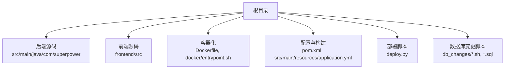
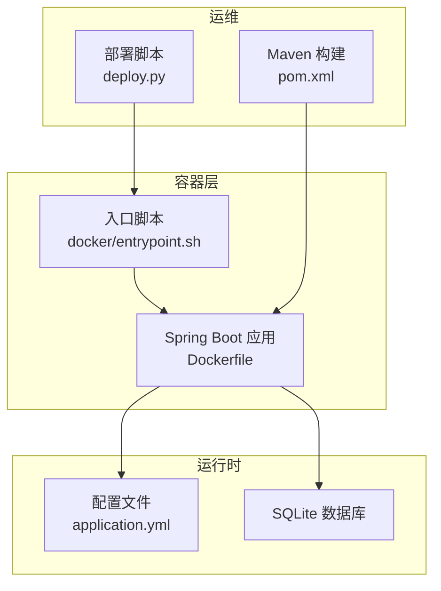
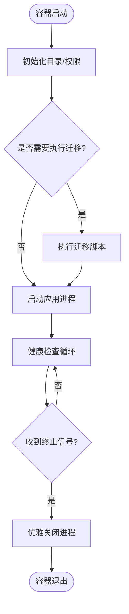
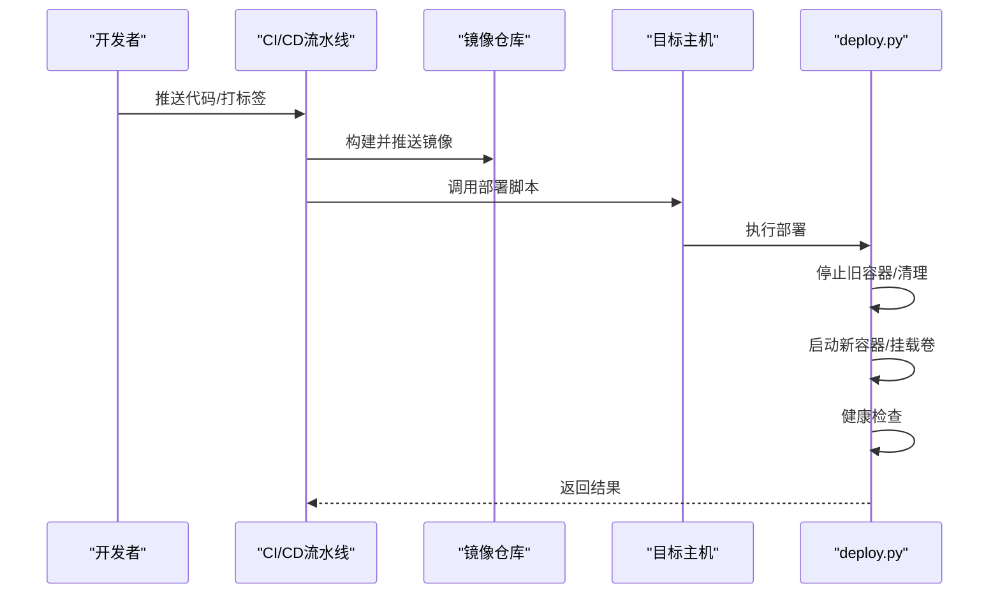
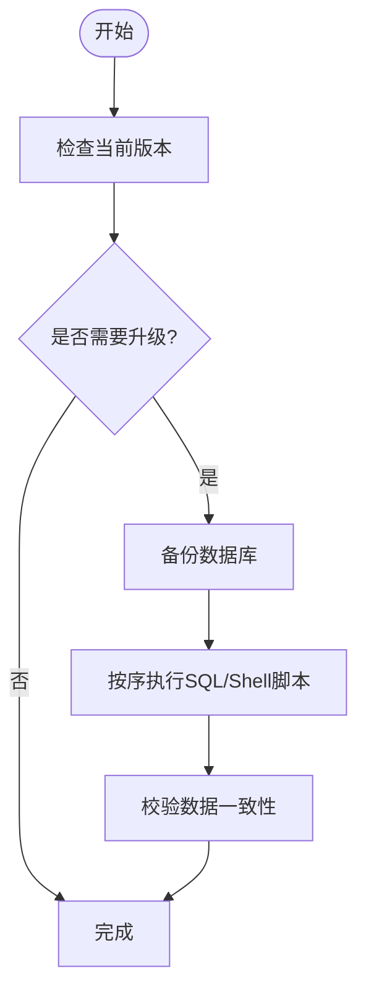
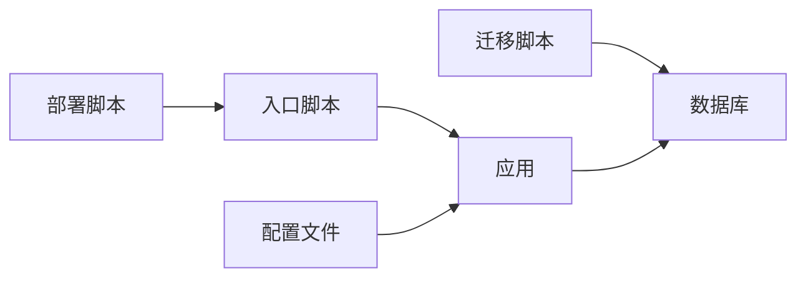

# 部署与运维

<cite>
**本文引用的文件**
- [Dockerfile](file://Dockerfile)
- [docker/entrypoint.sh](file://docker/entrypoint.sh)
- [src/main/resources/application.yml](file://src/main/resources/application.yml)
- [pom.xml](file://pom.xml)
- [deploy.py](file://deploy.py)
- [db_changes/V1.0.10_cleanup_5_6_2_images.sh](file://db_changes/V1.0.10_cleanup_5_6_2_images.sh)
- [db_changes/V1.0.7_migrate_image_files.sh](file://db_changes/V1.0.7_migrate_image_files.sh)
- [db_changes/V1.0.9_fix_l3_images_move.sh](file://db_changes/V1.0.9_fix_l3_images_move.sh)
</cite>

## 目录
1. [简介](#简介)
2. [项目结构](#项目结构)
3. [核心组件](#核心组件)
4. [架构总览](#架构总览)
5. [详细组件分析](#详细组件分析)
6. [依赖关系分析](#依赖关系分析)
7. [性能考虑](#性能考虑)
8. [故障排除指南](#故障排除指南)
9. [结论](#结论)
10. [附录](#附录)

## 简介
本文件面向运维工程师，提供产品清单管理系统的部署与运维全栈指南。内容覆盖容器化打包、运行时配置、自动化部署脚本、CI/CD集成建议、生产监控与日志、性能优化、故障排查、备份恢复与安全加固等，帮助在不同环境中稳定可靠地交付与维护系统。

## 项目结构
该仓库采用前后端分离与后端Spring Boot单体应用结合的结构：前端位于frontend目录，后端位于src目录；数据库迁移脚本集中在db_changes目录；容器化相关文件位于根目录与docker目录。

图表来源
- [Dockerfile](file://Dockerfile)
- [docker/entrypoint.sh](file://docker/entrypoint.sh)
- [src/main/resources/application.yml](file://src/main/resources/application.yml)
- [pom.xml](file://pom.xml)
- [deploy.py](file://deploy.py)
- [db_changes/V1.0.10_cleanup_5_6_2_images.sh](file://db_changes/V1.0.10_cleanup_5_6_2_images.sh)

章节来源
- [Dockerfile](file://Dockerfile)
- [docker/entrypoint.sh](file://docker/entrypoint.sh)
- [src/main/resources/application.yml](file://src/main/resources/application.yml)
- [pom.xml](file://pom.xml)
- [deploy.py](file://deploy.py)
- [db_changes/V1.0.10_cleanup_5_6_2_images.sh](file://db_changes/V1.0.10_cleanup_5_6_2_images.sh)

## 核心组件
- 容器镜像与入口脚本：通过Dockerfile定义镜像构建流程，entrypoint.sh负责启动前准备与进程托管。
- 应用配置：application.yml集中管理数据库、Web、安全与日志等运行参数。
- 构建与打包：Maven pom.xml定义依赖与插件，用于后端编译与打包。
- 自动化部署：deploy.py提供一键部署逻辑（如拉取镜像、停止旧容器、启动新容器、健康检查等）。
- 数据库迁移：db_changes目录包含SQL与Shell脚本，用于版本演进与数据修复。

章节来源
- [Dockerfile](file://Dockerfile)
- [docker/entrypoint.sh](file://docker/entrypoint.sh)
- [src/main/resources/application.yml](file://src/main/resources/application.yml)
- [pom.xml](file://pom.xml)
- [deploy.py](file://deploy.py)
- [db_changes/V1.0.10_cleanup_5_6_2_images.sh](file://db_changes/V1.0.10_cleanup_5_6_2_images.sh)

## 架构总览
系统以Spring Boot为核心，提供REST API；前端通过浏览器访问；数据库采用SQLite（由配置文件指定）。容器化后，入口脚本负责初始化与守护进程管理，部署脚本负责生命周期编排。

图表来源
- [Dockerfile](file://Dockerfile)
- [docker/entrypoint.sh](file://docker/entrypoint.sh)
- [src/main/resources/application.yml](file://src/main/resources/application.yml)
- [pom.xml](file://pom.xml)
- [deploy.py](file://deploy.py)

## 详细组件分析

### 容器镜像与入口脚本
- 镜像构建：基于Dockerfile进行多阶段构建或单一镜像打包，暴露服务端口，设置工作目录与用户。
- 入口脚本职责：
  - 初始化必要目录与权限
  - 执行数据库迁移（可选）
  - 启动Java进程并作为PID 1守护
  - 捕获信号优雅退出
- 运行时参数：
  - 通过环境变量注入数据库连接、日志级别、服务器端口等
  - 支持挂载持久化卷（如日志、上传文件、数据库文件）

图表来源
- [docker/entrypoint.sh](file://docker/entrypoint.sh)
- [db_changes/V1.0.7_migrate_image_files.sh](file://db_changes/V1.0.7_migrate_image_files.sh)
- [db_changes/V1.0.9_fix_l3_images_move.sh](file://db_changes/V1.0.9_fix_l3_images_move.sh)

章节来源
- [Dockerfile](file://Dockerfile)
- [docker/entrypoint.sh](file://docker/entrypoint.sh)

### 应用配置与环境变量
- 关键配置项（示例类别，具体键名以实际配置为准）：
  - 服务器端口与上下文路径
  - 数据库连接（SQLite文件路径、驱动与连接参数）
  - 日志级别与输出位置
  - 安全相关（JWT密钥、CORS、HTTPS证书路径等）
  - 文件上传与静态资源目录
- 环境变量映射：
  - 使用容器环境变量覆盖配置文件中的敏感或动态值
  - 建议通过Kubernetes ConfigMap/Secret或Docker环境文件管理

章节来源
- [src/main/resources/application.yml](file://src/main/resources/application.yml)

### 构建与打包
- Maven目标：
  - 清理、编译、测试、打包（生成可执行JAR或原生镜像）
  - 插件：Spring Boot Maven Plugin、Surefire/Failsafe、资源过滤
- 构建产物：
  - 可运行的JAR包，配合Dockerfile复制到镜像中
- 多模块/多环境：
  - 通过Maven profiles或Spring profiles区分开发/测试/生产

章节来源
- [pom.xml](file://pom.xml)

### 自动化部署脚本
- 功能概览（通用流程，具体实现以脚本为准）：
  - 拉取最新镜像
  - 停止并删除旧容器
  - 创建并启动新容器（绑定端口、挂载卷、设置环境变量）
  - 健康检查与就绪探针
  - 回滚策略（失败时恢复旧镜像/容器）
- 与CI/CD集成：
  - 触发条件：代码合并到主分支或打标签
  - 步骤：构建→推送镜像→部署脚本→验证→通知

图表来源
- [deploy.py](file://deploy.py)
- [Dockerfile](file://Dockerfile)

章节来源
- [deploy.py](file://deploy.py)

### 数据库迁移与版本演进
- 迁移策略：
  - SQL脚本按版本命名，按顺序执行
  - Shell脚本用于文件系统层面的修复与重命名
- 常见场景：
  - 图片目录层级修复与迁移
  - 历史数据清理与归档
  - 新增字段与索引优化
- 生产注意事项：
  - 在非高峰时段执行
  - 备份数据库后再执行
  - 使用事务包装或幂等脚本

图表来源
- [db_changes/V1.0.10_cleanup_5_6_2_images.sh](file://db_changes/V1.0.10_cleanup_5_6_2_images.sh)
- [db_changes/V1.0.7_migrate_image_files.sh](file://db_changes/V1.0.7_migrate_image_files.sh)
- [db_changes/V1.0.9_fix_l3_images_move.sh](file://db_changes/V1.0.9_fix_l3_images_move.sh)

章节来源
- [db_changes/V1.0.10_cleanup_5_6_2_images.sh](file://db_changes/V1.0.10_cleanup_5_6_2_images.sh)
- [db_changes/V1.0.7_migrate_image_files.sh](file://db_changes/V1.0.7_migrate_image_files.sh)
- [db_changes/V1.0.9_fix_l3_images_move.sh](file://db_changes/V1.0.9_fix_l3_images_move.sh)

## 依赖关系分析
- 组件耦合：
  - 入口脚本与应用：入口脚本负责应用启动与健康检查
  - 配置文件与应用：应用读取配置决定行为
  - 部署脚本与容器：部署脚本控制容器生命周期
  - 迁移脚本与数据库：迁移脚本影响数据结构与一致性
- 外部依赖：
  - Java运行时（由镜像提供）
  - SQLite（由配置与脚本共同决定）
  - 镜像仓库与目标主机网络

图表来源
- [docker/entrypoint.sh](file://docker/entrypoint.sh)
- [src/main/resources/application.yml](file://src/main/resources/application.yml)
- [deploy.py](file://deploy.py)
- [db_changes/V1.0.10_cleanup_5_6_2_images.sh](file://db_changes/V1.0.10_cleanup_5_6_2_images.sh)

章节来源
- [docker/entrypoint.sh](file://docker/entrypoint.sh)
- [src/main/resources/application.yml](file://src/main/resources/application.yml)
- [deploy.py](file://deploy.py)
- [db_changes/V1.0.10_cleanup_5_6_2_images.sh](file://db_changes/V1.0.10_cleanup_5_6_2_images.sh)

## 性能考虑
- JVM与GC调优（建议在生产环境通过JVM参数或容器资源限制实现）：
  - 设置堆大小下限与上限
  - 选择合适的GC算法
  - 避免频繁Full GC
- 数据库性能：
  - 为高频查询字段建立索引
  - 控制批量操作与事务大小
  - 使用只读副本分担查询压力
- 缓存与CDN：
  - 对静态资源启用缓存与CDN
  - 对热点数据引入Redis缓存
- 并发与线程池：
  - 合理配置异步任务线程池
  - 控制请求并发度，避免过载
- 监控指标：
  - CPU/内存/IO使用率
  - 数据库慢查询与连接数
  - 应用响应时间与错误率

## 故障排除指南
- 启动失败
  - 检查容器日志与应用日志
  - 核对环境变量与配置文件键名
  - 验证数据库文件权限与路径
- 健康检查失败
  - 查看部署脚本的健康检查逻辑
  - 检查端口占用与防火墙
- 数据库异常
  - 执行迁移脚本前先备份
  - 校验SQL语法与数据类型
  - 关注大事务与锁等待
- 性能问题
  - 分析慢查询与索引缺失
  - 检查JVM堆与GC日志
  - 评估并发与线程池配置
- 回滚策略
  - 使用部署脚本的回滚能力
  - 恢复数据库备份
  - 回滚到上一个可用镜像版本

章节来源
- [deploy.py](file://deploy.py)
- [src/main/resources/application.yml](file://src/main/resources/application.yml)
- [db_changes/V1.0.10_cleanup_5_6_2_images.sh](file://db_changes/V1.0.10_cleanup_5_6_2_images.sh)

## 结论
通过容器化、集中配置与自动化部署脚本，系统可在多环境中快速、一致地交付。配合完善的监控、日志与迁移机制，以及标准化的故障处理流程，可显著提升系统的稳定性与可维护性。建议在生产中进一步完善CI/CD流水线、蓝绿发布与自动扩缩容策略，并持续优化数据库与应用性能。

## 附录
- 安全加固建议
  - 最小权限原则：容器内非root运行，仅开放必要端口
  - 机密信息：使用密钥管理服务或环境变量注入
  - 网络隔离：通过防火墙与网络策略限制访问
  - 审计日志：开启操作审计与登录日志
- 备份与恢复
  - 数据库定期快照与增量备份
  - 配置与日志卷备份
  - 恢复演练与RTO/RPO目标
- 监控与日志
  - 指标采集：Prometheus + Grafana
  - 日志聚合：ELK/EFK 或云日志服务
  - 告警策略：阈值告警与异常检测