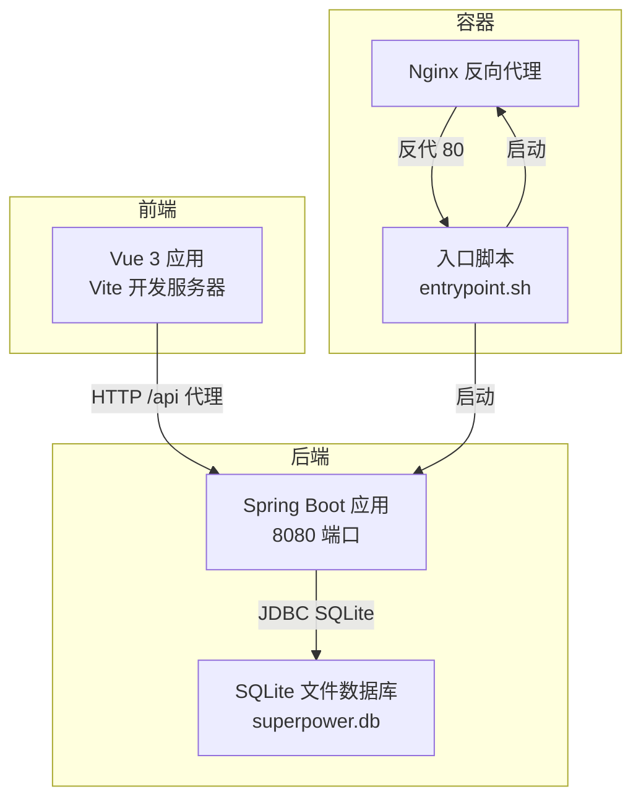
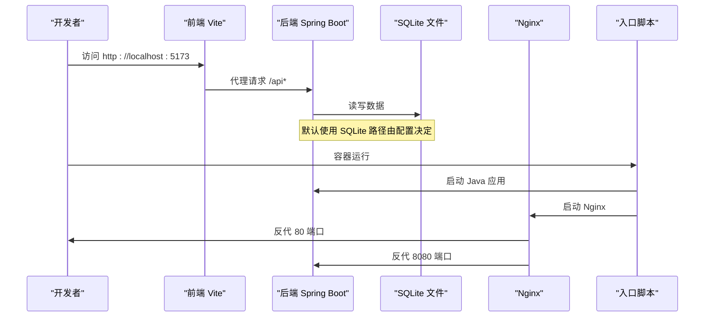
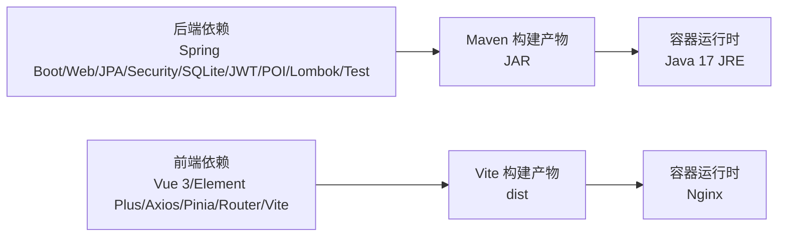

# 开发环境

<cite>
**本文引用的文件**
- [pom.xml](file://pom.xml)
- [application.yml](file://src/main/resources/application.yml)
- [init.sql](file://src/main/resources/db/init.sql)
- [package.json](file://frontend/package.json)
- [vite.config.js](file://frontend/vite.config.js)
- [Dockerfile](file://Dockerfile)
- [entrypoint.sh](file://docker/entrypoint.sh)
- [maven-settings.xml](file://docker/maven-settings.xml)
</cite>

## 目录
1. [简介](#简介)
2. [项目结构](#项目结构)
3. [核心组件](#核心组件)
4. [架构总览](#架构总览)
5. [详细组件分析](#详细组件分析)
6. [依赖分析](#依赖分析)
7. [性能考虑](#性能考虑)
8. [故障排查指南](#故障排查指南)
9. [结论](#结论)
10. [附录](#附录)

## 简介
本指南面向产品清单管理系统的开发者，提供从零搭建可运行开发环境的完整步骤与最佳实践。内容覆盖硬件与软件最低要求、项目克隆与依赖安装、数据库初始化与启动配置、IDE与代码规范建议、Docker容器化开发环境以及常见问题排查。目标是帮助开发者在最短时间内完成本地开发环境搭建并顺利运行前后端服务。

## 项目结构
该仓库采用“后端 Spring Boot + 前端 Vue 3 + SQLite 数据库”的分层架构：
- 后端：基于 Spring Boot 3.2.0，使用 Java 17，JPA/Hibernate 访问 SQLite，提供 REST 接口。
- 前端：基于 Vue 3 + Vite，通过代理访问后端接口。
- 数据库：默认使用 SQLite（文件型），生产可替换为 PostgreSQL（迁移脚本已提供）。
- 容器化：提供 Dockerfile 与 Nginx 入口脚本，支持将 JAR、静态资源、数据库与上传目录以卷挂载方式注入。

图表来源
- [application.yml:1-40](file://src/main/resources/application.yml#L1-L40)
- [Dockerfile:1-38](file://Dockerfile#L1-L38)
- [entrypoint.sh:1-22](file://docker/entrypoint.sh#L1-L22)

章节来源
- [pom.xml:1-116](file://pom.xml#L1-L116)
- [application.yml:1-40](file://src/main/resources/application.yml#L1-L40)
- [init.sql:1-126](file://src/main/resources/db/init.sql#L1-L126)
- [package.json:1-28](file://frontend/package.json#L1-L28)
- [vite.config.js:1-20](file://frontend/vite.config.js#L1-L20)
- [Dockerfile:1-38](file://Dockerfile#L1-L38)
- [entrypoint.sh:1-22](file://docker/entrypoint.sh#L1-L22)

## 核心组件
- 后端框架与语言
  - Spring Boot 版本：3.2.0
  - Java 版本：17
  - 依赖管理：Maven
- 数据库
  - 默认：SQLite（JDBC 驱动）
  - 生产可选：PostgreSQL（提供迁移脚本）
- 前端框架与工具
  - Vue 3 + Vite
  - 代理到后端 8080 端口
- 容器化
  - 运行时镜像：Eclipse Temurin 17 JRE
  - 入口脚本：同时启动 Java 应用与 Nginx
  - 卷挂载：JAR、dist、数据库、上传与生成文档目录

章节来源
- [pom.xml:6-19](file://pom.xml#L6-L19)
- [application.yml:18-34](file://src/main/resources/application.yml#L18-L34)
- [package.json:1-28](file://frontend/package.json#L1-L28)
- [vite.config.js:9-18](file://frontend/vite.config.js#L9-L18)
- [Dockerfile:5-37](file://Dockerfile#L5-L37)
- [entrypoint.sh:7-13](file://docker/entrypoint.sh#L7-L13)

## 架构总览
下图展示开发与容器两种运行模式的关键交互：

图表来源
- [vite.config.js:11-17](file://frontend/vite.config.js#L11-L17)
- [application.yml:1-40](file://src/main/resources/application.yml#L1-L40)
- [Dockerfile:32-37](file://Dockerfile#L32-L37)
- [entrypoint.sh:7-13](file://docker/entrypoint.sh#L7-L13)

## 详细组件分析

### 后端环境准备与启动
- 硬件与软件要求
  - 操作系统：Windows/macOS/Linux
  - Java：17（Spring Boot 3.2.0 要求）
  - Maven：3.6+（用于构建）
  - SQLite：随 JDBC 驱动自动使用文件型数据库
- 快速启动步骤
  1) 在项目根目录执行 Maven 构建，生成可运行 JAR。
  2) 直接运行生成的 JAR 或通过 IDE 启动主类。
  3) 默认监听端口 8080，日志级别已在配置中启用。
- 数据库初始化
  - 默认使用 SQLite 文件：路径由配置指定；首次启动会根据 JPA 设置自动更新表结构。
  - 如需使用 PostgreSQL，可参考迁移脚本创建数据库并执行建表语句。

章节来源
- [pom.xml:16-19](file://pom.xml#L16-L19)
- [application.yml:18-34](file://src/main/resources/application.yml#L18-L34)
- [init.sql:1-126](file://src/main/resources/db/init.sql#L1-L126)

### 前端环境准备与启动
- 硬件与软件要求
  - Node.js：建议使用 LTS 版本（具体版本号以包管理器生态为准）
  - 包管理器：npm/yarn/pnpm（按团队习惯选择）
- 快速启动步骤
  1) 在 frontend 目录安装依赖。
  2) 启动 Vite 开发服务器，默认端口 5173。
  3) 通过代理将 /api 请求转发至后端 8080 端口。
- 代理配置
  - 已内置代理规则，无需额外修改即可与后端联调。

章节来源
- [package.json:6-10](file://frontend/package.json#L6-L10)
- [vite.config.js:9-18](file://frontend/vite.config.js#L9-L18)

### 容器化开发环境
- 镜像与运行
  - 使用 Eclipse Temurin 17 JRE 运行时镜像。
  - 入口脚本同时启动 Java 应用与 Nginx，并进行健康检查。
- 卷挂载约定
  - /app/app.jar ← 主机映射 JAR
  - /usr/share/nginx/html ← 主机映射前端 dist
  - /app/superpower.db ← 主机映射数据库文件
  - /app/uploads ← 主机映射上传目录
  - /app/generated-docs ← 主机映射生成文档目录
- 环境变量
  - SPRING_PROFILES_ACTIVE=prod
  - JAVA_OPTS 可传入 JVM 参数

章节来源
- [Dockerfile:1-38](file://Dockerfile#L1-L38)
- [entrypoint.sh:1-22](file://docker/entrypoint.sh#L1-L22)

### 开发工具与代码规范建议
- IDE 推荐
  - IntelliJ IDEA / Eclipse / VS Code（任选其一）
- Java 规范
  - 使用 Lombok 注解处理器（Maven 插件已配置）
  - 编码统一为 UTF-8
- 前端规范
  - 使用 ESLint + Prettier（如团队有统一配置，建议在 IDE 中启用保存时格式化）
  - Vue 组件命名与目录结构遵循现有约定
- 调试配置
  - 后端：在 IDE 中以 Spring Boot 应用方式启动，或附加 JVM 调试端口
  - 前端：浏览器开发者工具 + Vue Devtools

章节来源
- [pom.xml:100-112](file://pom.xml#L100-L112)
- [package.json:1-28](file://frontend/package.json#L1-L28)

## 依赖分析
- 后端依赖要点
  - Web、JPA、Security、Validation、SQLite JDBC、JWT、Apache POI、Lombok、测试依赖
- 前端依赖要点
  - Vue 3、Element Plus、Axios、Pinia、Vue Router、ECharts、Vite 插件等
- 构建与镜像
  - Maven 编译插件与 Lombok 处理器路径
  - Dockerfile 使用多阶段思路（运行时镜像仅含 JRE）

图表来源
- [pom.xml:21-84](file://pom.xml#L21-L84)
- [package.json:11-26](file://frontend/package.json#L11-L26)
- [Dockerfile:5-11](file://Dockerfile#L5-L11)

章节来源
- [pom.xml:21-84](file://pom.xml#L21-L84)
- [package.json:11-26](file://frontend/package.json#L11-L26)
- [Dockerfile:5-11](file://Dockerfile#L5-L11)

## 性能考虑
- 数据库连接池
  - HikariCP 最大连接数与超时已配置，可根据并发场景调整
- 日志与 SQL 输出
  - 开发阶段建议开启 SQL 格式化与调试日志，生产关闭 SQL 输出
- 前端代理超时
  - Vite 代理已设置较长超时，适合大文件上传或长任务
- 容器健康检查
  - 健康检查间隔与重试策略已设定，便于容器编排

章节来源
- [application.yml:21-34](file://src/main/resources/application.yml#L21-L34)
- [vite.config.js:15-16](file://frontend/vite.config.js#L15-L16)
- [Dockerfile:35-37](file://Dockerfile#L35-L37)

## 故障排查指南
- 后端无法启动或端口占用
  - 检查 8080 端口是否被占用；确认 application.yml 中 server.port 配置
- 数据库连接失败
  - 确认 SQLite 文件路径存在且可写；如切换 PostgreSQL，请确保数据库已创建并执行迁移脚本
- 前端代理无效
  - 确认 Vite 代理配置指向 8080；浏览器控制台查看网络错误
- JWT 密钥或过期时间异常
  - 检查 application.yml 中 app.jwt.* 配置
- 容器启动后 404 或白屏
  - 确认 dist 目录已正确挂载到 Nginx 的站点目录
  - 确认 JAR、数据库、上传与生成文档目录均已挂载
- Maven 私有仓库镜像
  - 若网络受限，可使用提供的 Maven settings 镜像源

章节来源
- [application.yml:1-40](file://src/main/resources/application.yml#L1-L40)
- [vite.config.js:11-17](file://frontend/vite.config.js#L11-L17)
- [Dockerfile:25-30](file://Dockerfile#L25-L30)
- [maven-settings.xml:1-12](file://docker/maven-settings.xml#L1-L12)

## 结论
通过本指南，您可以在本地快速完成产品清单管理系统的开发环境搭建：后端使用 Java 17 + Spring Boot，前端使用 Vue 3 + Vite，数据库默认 SQLite，同时提供 Docker 容器化运行方案。遇到问题时，可依据故障排查章节逐项定位。建议在团队内统一 IDE 插件与格式化规则，提升协作效率。

## 附录

### 环境要求汇总
- 后端
  - Java：17
  - Maven：3.6+
  - 数据库：SQLite（默认）或 PostgreSQL（可选）
- 前端
  - Node.js：LTS
  - 包管理器：npm/yarn/pnpm
- 容器
  - Docker：用于构建与运行
  - 运行时镜像：Eclipse Temurin 17 JRE

章节来源
- [pom.xml:16-19](file://pom.xml#L16-L19)
- [application.yml:18-34](file://src/main/resources/application.yml#L18-L34)
- [Dockerfile:5-11](file://Dockerfile#L5-L11)