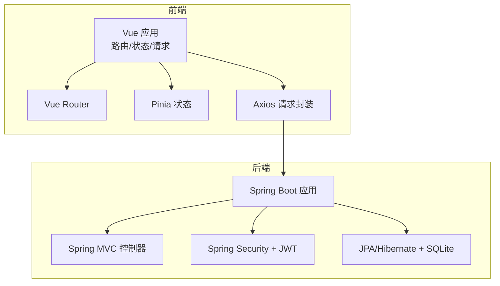
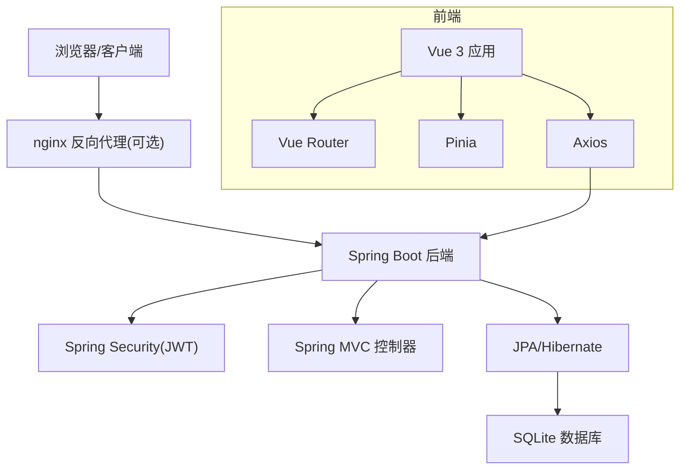
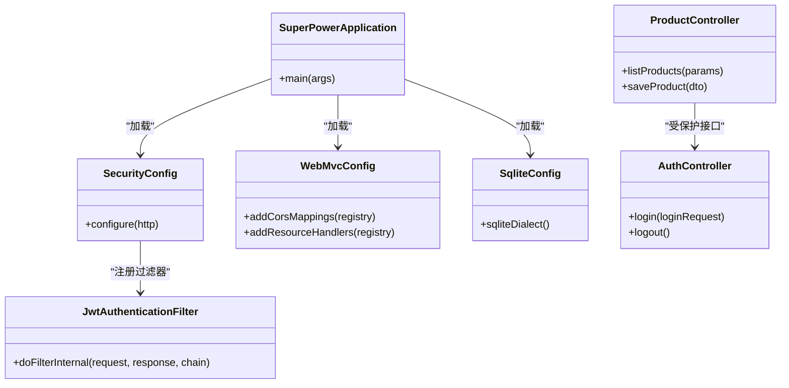
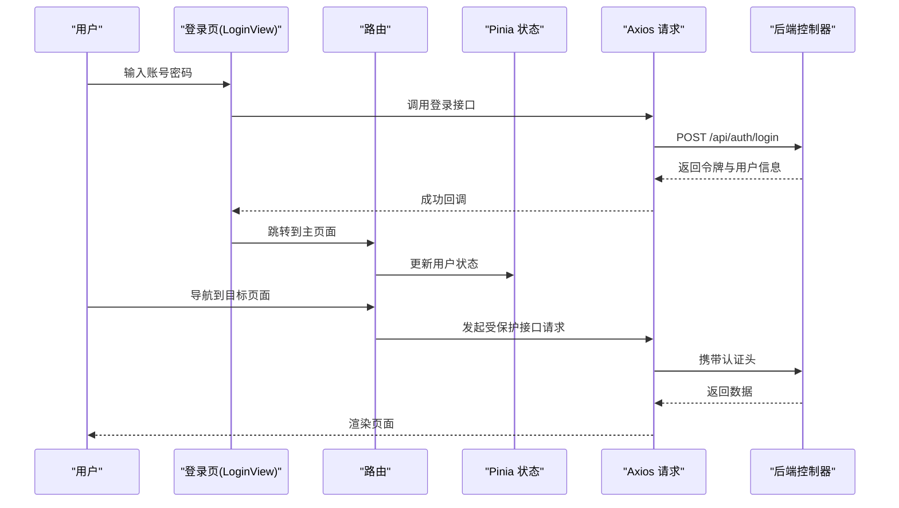
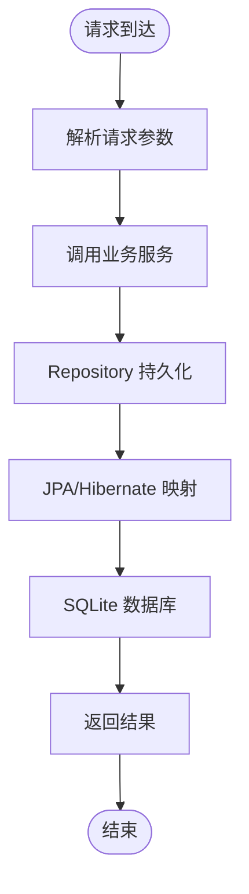
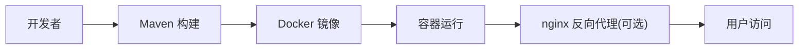

# 技术栈

<cite>
**本文引用的文件**
- [pom.xml](file://pom.xml)
- [application.yml](file://src/main/resources/application.yml)
- [Dockerfile](file://Dockerfile)
- [docker/maven-settings.xml](file://docker/maven-settings.xml)
- [frontend/package.json](file://frontend/package.json)
- [frontend/vite.config.js](file://frontend/vite.config.js)
- [src/main/java/com/superpower/SuperPowerApplication.java](file://src/main/java/com/superpower/SuperPowerApplication.java)
- [src/main/java/com/superpower/config/SecurityConfig.java](file://src/main/java/com/superpower/config/SecurityConfig.java)
- [src/main/java/com/superpower/config/SqliteConfig.java](file://src/main/java/com/superpower/config/SqliteConfig.java)
- [src/main/java/com/superpower/config/WebMvcConfig.java](file://src/main/java/com/superpower/config/WebMvcConfig.java)
- [src/main/java/com/superpower/security/JwtAuthenticationFilter.java](file://src/main/java/com/superpower/security/JwtAuthenticationFilter.java)
- [src/main/java/com/superpower/modules/category/controller/ProductController.java](file://src/main/java/com/superpower/modules/category/controller/ProductController.java)
- [src/main/java/com/superpower/modules/system/controller/AuthController.java](file://src/main/java/com/superpower/modules/system/controller/AuthController.java)
- [frontend/src/router/index.js](file://frontend/src/router/index.js)
- [frontend/src/store/auth.js](file://frontend/src/store/auth.js)
- [frontend/src/utils/request.js](file://frontend/src/utils/request.js)
- [frontend/src/views/login/LoginView.vue](file://frontend/src/views/login/LoginView.vue)
</cite>

## 目录
1. [简介](#简介)
2. [项目结构](#项目结构)
3. [核心组件](#核心组件)
4. [架构总览](#架构总览)
5. [详细组件分析](#详细组件分析)
6. [依赖分析](#依赖分析)
7. [性能考虑](#性能考虑)
8. [故障排查指南](#故障排查指南)
9. [结论](#结论)
10. [附录](#附录)

## 简介
本技术栈文档面向产品清单管理系统，系统采用前后端分离架构：后端基于 Spring Boot + Spring MVC + Spring Security + JPA/Hibernate + SQLite；前端基于 Vue 3 + Element Plus + Vue Router + Pinia + Axios；开发与交付通过 Maven、npm 与 Docker 完成，并可配合 nginx 进行反向代理部署。本文档提供技术选型依据、版本与兼容性要求、组件关系与数据流、以及常见问题排查建议。

## 项目结构
系统采用多模块分层组织：
- 后端（Java）：Spring Boot 应用，按功能域划分模块（如 category、system、version 等），统一在配置类中完成安全、Web、数据库适配等横切能力。
- 前端（JavaScript/Vue 3）：单页应用，路由驱动页面切换，状态通过 Pinia 管理，HTTP 请求封装于 Axios。
- 配置与资源：后端 application.yml 提供运行时配置；Dockerfile 与 docker/maven-settings.xml 支持容器化构建与依赖仓库配置。
- 开发工具：Maven 负责 Java 构建，npm 负责前端包管理与脚手架，Vite 作为构建工具。

**图表来源**
- [Dockerfile](file://Dockerfile)
- [frontend/vite.config.js](file://frontend/vite.config.js)
- [src/main/java/com/superpower/SuperPowerApplication.java](file://src/main/java/com/superpower/SuperPowerApplication.java)

**章节来源**
- [pom.xml](file://pom.xml)
- [application.yml](file://src/main/resources/application.yml)
- [frontend/package.json](file://frontend/package.json)
- [frontend/vite.config.js](file://frontend/vite.config.js)

## 核心组件
- 后端框架与技术
  - Spring Boot：应用启动与自动配置的核心容器。
  - Spring MVC：REST 接口层，控制器负责接收请求并返回响应。
  - Spring Security：认证授权与会话管理，集成 JWT 过滤器链。
  - JPA/Hibernate：对象关系映射与数据持久化，SQLite 作为嵌入式数据库。
- 前端技术栈
  - Vue 3：渐进式前端框架，组合式 API 与响应式系统。
  - Element Plus：桌面端组件库，提供丰富的 UI 组件。
  - Vue Router：官方路由，支持嵌套路由与导航守卫。
  - Pinia：状态管理库，替代 Vuex，提供更简洁的 API。
  - Axios：HTTP 客户端，封装统一请求与响应拦截。
- 开发与构建
  - Maven：Java 工程构建与依赖管理。
  - npm：前端包管理与脚手架工具链。
  - Vite：快速构建与热更新。
- 容器化与部署
  - Docker：镜像构建与运行环境隔离。
  - nginx：反向代理与静态资源服务（可选）。

**章节来源**
- [src/main/java/com/superpower/SuperPowerApplication.java](file://src/main/java/com/superpower/SuperPowerApplication.java)
- [src/main/java/com/superpower/config/SecurityConfig.java](file://src/main/java/com/superpower/config/SecurityConfig.java)
- [src/main/java/com/superpower/config/SqliteConfig.java](file://src/main/java/com/superpower/config/SqliteConfig.java)
- [frontend/src/router/index.js](file://frontend/src/router/index.js)
- [frontend/src/store/auth.js](file://frontend/src/store/auth.js)
- [frontend/src/utils/request.js](file://frontend/src/utils/request.js)

## 架构总览
系统采用前后端分离模式：前端通过 Axios 发起 HTTP 请求，后端以 Spring MVC 暴露 REST 接口，Spring Security 进行鉴权，JPA/Hibernate 访问 SQLite 数据库。容器化通过 Docker 将后端打包为可执行镜像，部署阶段可结合 nginx 实现反向代理与静态资源服务。

**图表来源**
- [Dockerfile](file://Dockerfile)
- [src/main/java/com/superpower/config/SecurityConfig.java](file://src/main/java/com/superpower/config/SecurityConfig.java)
- [src/main/java/com/superpower/config/SqliteConfig.java](file://src/main/java/com/superpower/config/SqliteConfig.java)

## 详细组件分析

### 后端技术栈与配置
- Spring Boot 应用入口与自动装配
  - 应用主类负责启动 Spring 上下文，加载配置与扫描组件。
- 安全与认证
  - 安全配置类定义过滤器链、访问规则与登录登出策略。
  - JWT 过滤器负责解析请求头中的令牌并注入认证信息。
- Web 层
  - WebMvc 配置类用于跨域、静态资源处理、视图解析等。
- 数据访问
  - SQLite 配置类与方言适配确保 Hibernate 在 SQLite 下正常工作。
  - JPA Repository 提供数据访问接口，Service 层编排业务逻辑。
- 典型控制器
  - 产品与分类模块控制器提供 REST 接口，系统模块控制器提供认证与用户管理接口。

**图表来源**
- [src/main/java/com/superpower/SuperPowerApplication.java](file://src/main/java/com/superpower/SuperPowerApplication.java)
- [src/main/java/com/superpower/config/SecurityConfig.java](file://src/main/java/com/superpower/config/SecurityConfig.java)
- [src/main/java/com/superpower/config/WebMvcConfig.java](file://src/main/java/com/superpower/config/WebMvcConfig.java)
- [src/main/java/com/superpower/config/SqliteConfig.java](file://src/main/java/com/superpower/config/SqliteConfig.java)
- [src/main/java/com/superpower/modules/category/controller/ProductController.java](file://src/main/java/com/superpower/modules/category/controller/ProductController.java)
- [src/main/java/com/superpower/modules/system/controller/AuthController.java](file://src/main/java/com/superpower/modules/system/controller/AuthController.java)

**章节来源**
- [src/main/java/com/superpower/SuperPowerApplication.java](file://src/main/java/com/superpower/SuperPowerApplication.java)
- [src/main/java/com/superpower/config/SecurityConfig.java](file://src/main/java/com/superpower/config/SecurityConfig.java)
- [src/main/java/com/superpower/config/WebMvcConfig.java](file://src/main/java/com/superpower/config/WebMvcConfig.java)
- [src/main/java/com/superpower/config/SqliteConfig.java](file://src/main/java/com/superpower/config/SqliteConfig.java)
- [src/main/java/com/superpower/modules/category/controller/ProductController.java](file://src/main/java/com/superpower/modules/category/controller/ProductController.java)
- [src/main/java/com/superpower/modules/system/controller/AuthController.java](file://src/main/java/com/superpower/modules/system/controller/AuthController.java)

### 前端技术栈与交互
- 路由与页面
  - Vue Router 定义页面级路由，支持嵌套路由与导航守卫。
  - 登录页 LoginView 作为入口，登录成功后进入主布局。
- 状态管理
  - Pinia 的 auth 模块保存用户态与权限信息，供全局组件使用。
- 请求封装
  - Axios 封装在 request 工具中，统一设置 baseURL、拦截器与错误处理。
- 组件与主题
  - Element Plus 提供基础组件库；样式文件定义主题变量与动画。

**图表来源**
- [frontend/src/views/login/LoginView.vue](file://frontend/src/views/login/LoginView.vue)
- [frontend/src/router/index.js](file://frontend/src/router/index.js)
- [frontend/src/store/auth.js](file://frontend/src/store/auth.js)
- [frontend/src/utils/request.js](file://frontend/src/utils/request.js)
- [src/main/java/com/superpower/modules/system/controller/AuthController.java](file://src/main/java/com/superpower/modules/system/controller/AuthController.java)

**章节来源**
- [frontend/src/router/index.js](file://frontend/src/router/index.js)
- [frontend/src/store/auth.js](file://frontend/src/store/auth.js)
- [frontend/src/utils/request.js](file://frontend/src/utils/request.js)
- [frontend/src/views/login/LoginView.vue](file://frontend/src/views/login/LoginView.vue)

### 数据库与持久化流程
- 数据模型
  - 产品与分类相关实体通过 JPA 注解映射到表，Repository 提供 CRUD。
- 访问流程
  - 控制器接收请求参数，Service 执行业务逻辑，Repository 调用 JPA/Hibernate 持久化。
- SQLite 配置
  - 通过自定义方言与配置类适配 SQLite，保证 SQL 方言兼容。

**图表来源**
- [src/main/java/com/superpower/config/SqliteConfig.java](file://src/main/java/com/superpower/config/SqliteConfig.java)
- [src/main/java/com/superpower/modules/category/controller/ProductController.java](file://src/main/java/com/superpower/modules/category/controller/ProductController.java)

**章节来源**
- [src/main/java/com/superpower/config/SqliteConfig.java](file://src/main/java/com/superpower/config/SqliteConfig.java)
- [src/main/java/com/superpower/modules/category/controller/ProductController.java](file://src/main/java/com/superpower/modules/category/controller/ProductController.java)

### 容器化与部署
- Docker 镜像构建
  - Dockerfile 描述镜像构建步骤，包含依赖缓存与多阶段优化。
- Maven 设置
  - docker/maven-settings.xml 提供私有仓库与镜像加速配置，提升构建稳定性。
- nginx 反向代理
  - 可选部署方式：将前端静态资源与后端 API 通过 nginx 聚合，实现跨域、缓存与负载均衡。

**图表来源**
- [Dockerfile](file://Dockerfile)
- [docker/maven-settings.xml](file://docker/maven-settings.xml)

**章节来源**
- [Dockerfile](file://Dockerfile)
- [docker/maven-settings.xml](file://docker/maven-settings.xml)

## 依赖分析
- 后端依赖
  - Spring 生态：Spring Boot Starter、Spring MVC、Spring Security、Spring Data JPA。
  - 数据库：SQLite JDBC 与方言适配。
  - JSON：Jackson 或其他序列化库（由 Spring Boot 自动引入）。
- 前端依赖
  - Vue 3 生态：@vue/runtime-core、@vue/router、pinia、axios。
  - UI 组件：element-plus 及其图标。
  - 构建工具：vite、@vitejs/plugin-vue。
- 版本与兼容性
  - Java 与 Spring Boot 版本需匹配，确保安全与性能特性可用。
  - Vue 3 与 Element Plus 版本需兼容，注意 Composition API 与 TypeScript 类型。
  - SQLite 与 Hibernate 版本需满足方言与函数支持。
  - Maven 与 npm 工具链版本需满足项目构建与依赖解析。

**章节来源**
- [pom.xml](file://pom.xml)
- [frontend/package.json](file://frontend/package.json)

## 性能考虑
- 后端
  - 使用分页查询与索引优化高频接口。
  - 合理缓存热点数据，避免重复 IO。
  - 异步任务处理耗时操作，降低请求延迟。
- 前端
  - 组件懒加载与路由按需加载，减少首屏体积。
  - 图片与静态资源 CDN 化，配合 nginx 缓存。
- 数据库
  - SQLite 适合中小规模数据，避免复杂事务与高并发写入场景。
  - 对关键字段建立索引，避免全表扫描。
- 容器化
  - 多阶段构建减小镜像体积，合理设置 JVM 参数与线程池大小。

## 故障排查指南
- 认证失败
  - 检查登录接口是否正确返回令牌，确认前端是否携带 Authorization 头。
  - 核对后端安全配置与 JWT 过滤器是否生效。
- 跨域问题
  - 确认 CORS 配置已启用，允许前端域名与方法。
- 数据库连接异常
  - 检查 SQLite 文件路径与权限，确认方言与驱动版本匹配。
- 构建失败
  - 检查 Maven Settings 是否正确指向私有仓库，网络连通性与代理设置。
- 前端请求错误
  - 查看 Axios 拦截器日志，确认 baseURL 与超时设置。

**章节来源**
- [src/main/java/com/superpower/config/SecurityConfig.java](file://src/main/java/com/superpower/config/SecurityConfig.java)
- [src/main/java/com/superpower/security/JwtAuthenticationFilter.java](file://src/main/java/com/superpower/security/JwtAuthenticationFilter.java)
- [frontend/src/utils/request.js](file://frontend/src/utils/request.js)
- [docker/maven-settings.xml](file://docker/maven-settings.xml)

## 结论
本系统通过 Spring Boot 与 Vue 3 构建现代化的前后端分离应用，结合 Spring Security 与 JWT 实现安全控制，JPA/Hibernate 与 SQLite 提供稳定的数据持久化能力。借助 Maven、npm 与 Docker，开发与交付效率得到显著提升。在生产环境中，建议配合 nginx 进行反向代理与静态资源优化，持续关注版本兼容性与性能指标。

## 附录
- 关键配置文件位置
  - 后端配置：application.yml
  - 前端配置：package.json、vite.config.js
  - 容器化：Dockerfile、maven-settings.xml
- 建议的版本范围（示例）
  - Java 17+ 与 Spring Boot 3.x
  - Vue 3.4+ 与 Element Plus 2.4+
  - Node.js 18+ 与 npm 8+
  - Maven 3.8+ 与 Docker 20+