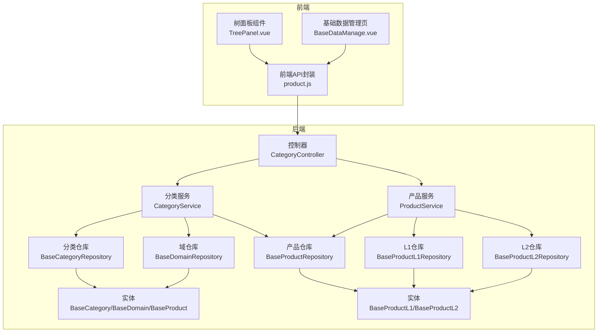
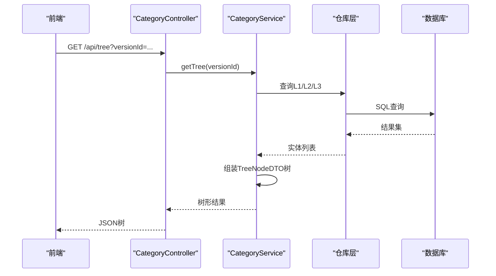
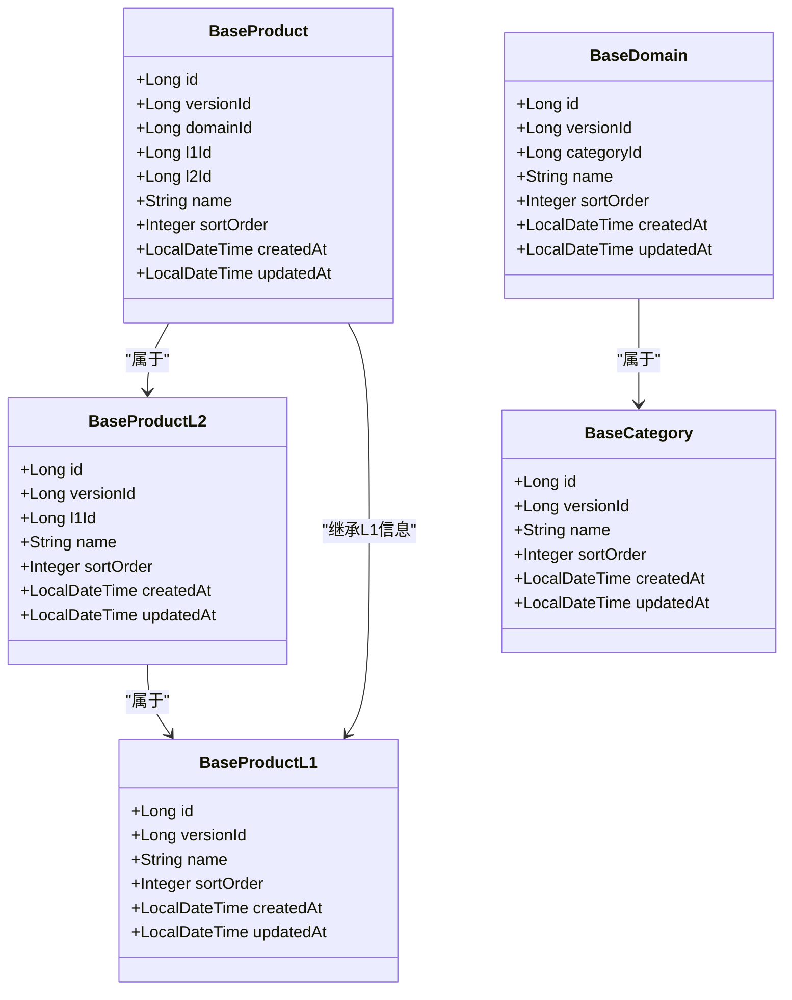
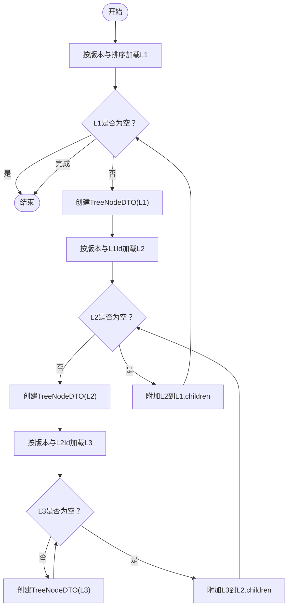
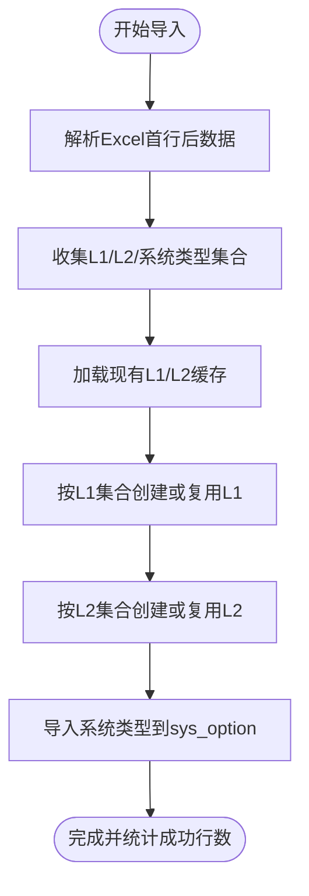
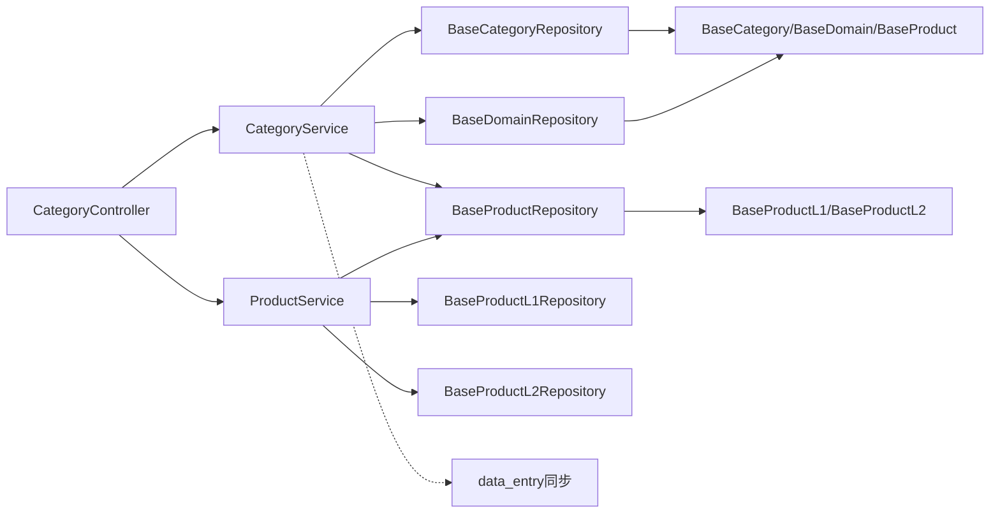

# 产品分类管理

<cite>
**本文档引用的文件**
- [CategoryController.java](file://src/main/java/com/superpower/modules/category/controller/CategoryController.java)
- [CategoryService.java](file://src/main/java/com/superpower/modules/category/service/CategoryService.java)
- [ProductService.java](file://src/main/java/com/superpower/modules/category/service/ProductService.java)
- [BaseCategory.java](file://src/main/java/com/superpower/modules/category/entity/BaseCategory.java)
- [BaseDomain.java](file://src/main/java/com/superpower/modules/category/entity/BaseDomain.java)
- [BaseProduct.java](file://src/main/java/com/superpower/modules/category/entity/BaseProduct.java)
- [BaseProductL1.java](file://src/main/java/com/superpower/modules/category/entity/BaseProductL1.java)
- [BaseProductL2.java](file://src/main/java/com/superpower/modules/category/entity/BaseProductL2.java)
- [BaseCategoryRepository.java](file://src/main/java/com/superpower/modules/category/repository/BaseCategoryRepository.java)
- [BaseDomainRepository.java](file://src/main/java/com/superpower/modules/category/repository/BaseDomainRepository.java)
- [BaseProductRepository.java](file://src/main/java/com/superpower/modules/category/repository/BaseProductRepository.java)
- [BaseProductL1Repository.java](file://src/main/java/com/superpower/modules/category/repository/BaseProductL1Repository.java)
- [BaseProductL2Repository.java](file://src/main/java/com/superpower/modules/category/repository/BaseProductL2Repository.java)
- [DataEntryService.java](file://src/main/java/com/superpower/modules/data/service/DataEntryService.java)
- [ImageResourceService.java](file://src/main/java/com/superpower/modules/image/service/ImageResourceService.java)
- [DataInitializer.java](file://src/main/java/com/superpower/modules/category/service/DataInitializer.java)
- [product.js](file://frontend/src/api/product.js)
- [TreePanel.vue](file://frontend/src/components/TreePanel.vue)
- [BaseDataManage.vue](file://frontend/src/views/system/BaseDataManage.vue)
- [V1.0.7_fix_image_directory_depth.sql](file://db_changes/V1.0.7_fix_image_directory_depth.sql)
- [20260602_add_base_product_table.sql](file://db_changes/20260602_add_base_product_table.sql)
- [V1.0.9_fix_l3_image_directory.py](file://db_changes/V1.0.9_fix_l3_image_directory.py)
</cite>

## 目录
1. [简介](#简介)
2. [项目结构](#项目结构)
3. [核心组件](#核心组件)
4. [架构总览](#架构总览)
5. [详细组件分析](#详细组件分析)
6. [依赖分析](#依赖分析)
7. [性能考虑](#性能考虑)
8. [故障排查指南](#故障排查指南)
9. [结论](#结论)
10. [附录](#附录)

## 简介
本技术文档围绕产品分类管理功能展开，系统采用三层分类体系：L1（统计分类）、L2（核心业务方向）、L3（核心业务产品）。后端以Spring Boot + JPA实现，数据库包含独立的维度表（base_category、base_domain、base_product）与历史数据映射表（data_entry）。前端提供树形面板与管理界面，支持分类的增删改查、排序、树形加载与动态联动。

## 项目结构
后端模块按领域划分，分类相关的核心位于category模块；数据入口通过controller暴露REST API；service层编排业务逻辑；repository层负责数据访问；entity层定义JPA实体。前端通过API封装调用后端接口。

图表来源
- [CategoryController.java:1-66](file://src/main/java/com/superpower/modules/category/controller/CategoryController.java#L1-L66)
- [CategoryService.java:1-273](file://src/main/java/com/superpower/modules/category/service/CategoryService.java#L1-L273)
- [ProductService.java:1-356](file://src/main/java/com/superpower/modules/category/service/ProductService.java#L1-L356)
- [BaseCategoryRepository.java:1-21](file://src/main/java/com/superpower/modules/category/repository/BaseCategoryRepository.java#L1-L21)
- [BaseDomainRepository.java:1-22](file://src/main/java/com/superpower/modules/category/repository/BaseDomainRepository.java#L1-L22)
- [BaseProductRepository.java:1-22](file://src/main/java/com/superpower/modules/category/repository/BaseProductRepository.java#L1-L22)
- [BaseProductL1Repository.java](file://src/main/java/com/superpower/modules/category/repository/BaseProductL1Repository.java)
- [BaseProductL2Repository.java](file://src/main/java/com/superpower/modules/category/repository/BaseProductL2Repository.java)

章节来源
- [CategoryController.java:1-66](file://src/main/java/com/superpower/modules/category/controller/CategoryController.java#L1-L66)
- [CategoryService.java:1-273](file://src/main/java/com/superpower/modules/category/service/CategoryService.java#L1-L273)
- [ProductService.java:1-356](file://src/main/java/com/superpower/modules/category/service/ProductService.java#L1-L356)

## 核心组件
- 控制器：提供树形结构查询、分类/域/产品的CRUD与排序接口。
- 服务层：
  - CategoryService：维护L1/L2/L3树形结构，支持排序、复制版本、与data_entry同步。
  - ProductService：维护L1/L2/L3的独立维度表，支持导入Excel、复制版本。
- 仓库层：基于JPA的Repository接口，提供按版本与层级的查询与批量删除。
- 实体层：BaseCategory、BaseDomain、BaseProduct、BaseProductL1、BaseProductL2。

章节来源
- [CategoryController.java:1-66](file://src/main/java/com/superpower/modules/category/controller/CategoryController.java#L1-L66)
- [CategoryService.java:1-273](file://src/main/java/com/superpower/modules/category/service/CategoryService.java#L1-L273)
- [ProductService.java:1-356](file://src/main/java/com/superpower/modules/category/service/ProductService.java#L1-L356)
- [BaseCategoryRepository.java:1-21](file://src/main/java/com/superpower/modules/category/repository/BaseCategoryRepository.java#L1-L21)
- [BaseDomainRepository.java:1-22](file://src/main/java/com/superpower/modules/category/repository/BaseDomainRepository.java#L1-L22)
- [BaseProductRepository.java:1-22](file://src/main/java/com/superpower/modules/category/repository/BaseProductRepository.java#L1-L22)

## 架构总览
系统采用分层架构：表现层（前端Vue组件与API封装）、控制层（Spring MVC控制器）、服务层（业务编排与事务）、持久层（JPA仓库与数据库）。分类树形结构由CategoryService统一构建，同时与历史数据映射表data_entry保持一致性。

图表来源
- [CategoryController.java:23-26](file://src/main/java/com/superpower/modules/category/controller/CategoryController.java#L23-L26)
- [CategoryService.java:36-78](file://src/main/java/com/superpower/modules/category/service/CategoryService.java#L36-L78)

## 详细组件分析

### 数据模型与继承关系
- L1（统计分类）：BaseProductL1，用于统计口径的顶层分类。
- L2（核心业务方向）：BaseProductL2，属于某个L1，作为L3的父节点。
- L3（核心业务产品）：BaseProduct，属于某个L2（域），作为叶子节点。
- 传统维度表：BaseCategory（L1）、BaseDomain（L2）、BaseProduct（L3），与data_entry映射并保持同步。

图表来源
- [BaseProductL1.java:1-30](file://src/main/java/com/superpower/modules/category/entity/BaseProductL1.java#L1-L30)
- [BaseProductL2.java:1-32](file://src/main/java/com/superpower/modules/category/entity/BaseProductL2.java#L1-L32)
- [BaseProduct.java:1-39](file://src/main/java/com/superpower/modules/category/entity/BaseProduct.java#L1-L39)
- [BaseCategory.java:1-30](file://src/main/java/com/superpower/modules/category/entity/BaseCategory.java#L1-L30)
- [BaseDomain.java:1-33](file://src/main/java/com/superpower/modules/category/entity/BaseDomain.java#L1-L33)

章节来源
- [BaseProductL1.java:1-30](file://src/main/java/com/superpower/modules/category/entity/BaseProductL1.java#L1-L30)
- [BaseProductL2.java:1-32](file://src/main/java/com/superpower/modules/category/entity/BaseProductL2.java#L1-L32)
- [BaseProduct.java:1-39](file://src/main/java/com/superpower/modules/category/entity/BaseProduct.java#L1-L39)
- [BaseCategory.java:1-30](file://src/main/java/com/superpower/modules/category/entity/BaseCategory.java#L1-L30)
- [BaseDomain.java:1-33](file://src/main/java/com/superpower/modules/category/entity/BaseDomain.java#L1-L33)

### 分类树形结构构建算法
- 从L1开始，按sort_order升序查询；
- 对每个L1，查询其下的L2（按sort_order升序）；
- 对每个L2，查询其下的L3（按sort_order升序）；
- 将L1/L2标记为非叶子，L3标记为叶子；
- 输出TreeNodeDTO树结构供前端渲染。

图表来源
- [CategoryService.java:36-78](file://src/main/java/com/superpower/modules/category/service/CategoryService.java#L36-L78)

章节来源
- [CategoryService.java:36-78](file://src/main/java/com/superpower/modules/category/service/CategoryService.java#L36-L78)

### 父子关系维护与层级约束
- 删除保护：
  - L1删除前需确保无L2子项；
  - L2删除前需确保无L3子项；
  - L2域删除前需确保无子级data_entry。
- 名称变更同步：
  - L1/L2名称变更时，同步更新data_entry中的对应列，保证树与历史数据一致。
- 层级一致性：
  - ProductService维护L1/L2/L3的独立维度表，CategoryService维护传统维度表，两者通过同步逻辑保持一致。

章节来源
- [ProductService.java:67-114](file://src/main/java/com/superpower/modules/category/service/ProductService.java#L67-L114)
- [CategoryService.java:137-164](file://src/main/java/com/superpower/modules/category/service/CategoryService.java#L137-L164)
- [CategoryService.java:203-231](file://src/main/java/com/superpower/modules/category/service/CategoryService.java#L203-L231)

### 排序优化策略
- 排序字段：各层级均维护sort_order，默认按升序排列；
- 批量更新：支持一次请求更新多个节点的排序；
- 性能建议：对version_id与sort_order建立复合索引，避免全表扫描。

章节来源
- [CategoryService.java:80-103](file://src/main/java/com/superpower/modules/category/service/CategoryService.java#L80-L103)
- [ProductService.java:153-185](file://src/main/java/com/superpower/modules/category/service/ProductService.java#L153-L185)

### RESTful API接口文档
- 获取树形结构
  - 方法：GET
  - 路径：/api/tree
  - 查询参数：versionId
  - 返回：TreeNodeDTO数组
- 更新排序
  - 方法：PUT
  - 路径：/api/category/sort
  - 请求体：包含type/id/sortOrder的对象数组
  - 说明：type可为category/domain/product
- 分类（L1）CRUD
  - 创建：POST /api/category
  - 更新：PUT /api/category/{id}
  - 删除：DELETE /api/category/{id}
  - 查询：GET /product/l1/list（前端封装）
- 域（L2）CRUD
  - 创建：POST /api/domain（需categoryId）
  - 更新：PUT /api/domain/{id}
  - 删除：DELETE /api/domain/{id}
  - 查询：GET /product/l2/list（前端封装）
- 产品（L3）CRUD
  - 创建：POST /product/l3（前端封装）
  - 更新：PUT /product/l3/{id}（前端封装）
  - 删除：DELETE /product/l3/{id}（前端封装）
  - 查询：GET /product/l3/list（前端封装）

章节来源
- [CategoryController.java:23-64](file://src/main/java/com/superpower/modules/category/controller/CategoryController.java#L23-L64)
- [product.js:1-64](file://frontend/src/api/product.js#L1-L64)

### 分类数据批量导入
- Excel导入流程：
  - 解析Excel首行起的数据行；
  - 收集L1（统计分类）、L2（核心业务产品=第3列）、系统类型（第4列）；
  - 读取现有L1/L2缓存，去重并生成排序序号；
  - 逐条创建L1、L2，并将系统类型写入sys_option；
  - 成功行数统计与错误收集。
- 复制版本：
  - ProductService支持按版本复制L1/L2/L3，生成新版本的ID映射。

图表来源
- [ProductService.java:235-348](file://src/main/java/com/superpower/modules/category/service/ProductService.java#L235-L348)

章节来源
- [ProductService.java:235-348](file://src/main/java/com/superpower/modules/category/service/ProductService.java#L235-L348)

### 分类树的动态加载与缓存策略
- 动态加载：前端通过GET /api/tree按版本拉取树，按需渲染；
- 缓存建议：后端可对常用版本的树进行内存缓存，设置失效时间；前端可在Store中缓存最近使用的版本树；
- 异步更新：排序与编辑完成后，前端触发重新拉取树，或局部刷新受影响节点。

章节来源
- [CategoryController.java:23-26](file://src/main/java/com/superpower/modules/category/controller/CategoryController.java#L23-L26)
- [TreePanel.vue](file://frontend/src/components/TreePanel.vue)

### 数据验证规则与异常处理
- 非空校验：name长度限制、versionId必填；
- 删除保护：存在子项时禁止删除；
- 业务异常：通过BusinessException抛出，由全局异常处理器统一返回标准响应。

章节来源
- [BaseCategory.java:15-19](file://src/main/java/com/superpower/modules/category/entity/BaseCategory.java#L15-L19)
- [BaseDomain.java:15-22](file://src/main/java/com/superpower/modules/category/entity/BaseDomain.java#L15-L22)
- [BaseProduct.java:15-28](file://src/main/java/com/superpower/modules/category/entity/BaseProduct.java#L15-L28)
- [ProductService.java:67-114](file://src/main/java/com/superpower/modules/category/service/ProductService.java#L67-L114)
- [CategoryService.java:137-164](file://src/main/java/com/superpower/modules/category/service/CategoryService.java#L137-L164)

## 依赖分析
- 控制器依赖服务层；
- 服务层依赖仓库层与实体；
- 仓库层依赖JPA与数据库；
- 服务层与data_entry存在双向同步逻辑，确保维度表与历史表一致。

图表来源
- [CategoryController.java:17-21](file://src/main/java/com/superpower/modules/category/controller/CategoryController.java#L17-L21)
- [CategoryService.java:21-34](file://src/main/java/com/superpower/modules/category/service/CategoryService.java#L21-L34)
- [ProductService.java:25-38](file://src/main/java/com/superpower/modules/category/service/ProductService.java#L25-L38)

章节来源
- [CategoryController.java:17-21](file://src/main/java/com/superpower/modules/category/controller/CategoryController.java#L17-L21)
- [CategoryService.java:21-34](file://src/main/java/com/superpower/modules/category/service/CategoryService.java#L21-L34)
- [ProductService.java:25-38](file://src/main/java/com/superpower/modules/category/service/ProductService.java#L25-L38)

## 性能考虑
- 索引优化：为version_id、sort_order、l1_id、domain_id等字段建立复合索引，减少查询成本；
- 分页与懒加载：树节点过大时采用懒加载，仅在展开时查询子节点；
- 缓存策略：对热点版本树进行缓存，设置合理TTL；
- 批量操作：排序与导入采用批量写入，减少事务次数。

## 故障排查指南
- 树不显示或排序错乱
  - 检查versionId是否正确传递；
  - 确认sort_order是否按升序存储；
  - 查看是否存在重复sort_order导致的排序异常。
- 删除报错“存在子项”
  - 先删除子项再删除父项；
  - 确认L1/L2删除前的子项检查逻辑。
- 名称变更未生效
  - 检查CategoryService的名称同步逻辑是否执行；
  - 确认data_entry对应列是否被更新。
- Excel导入失败
  - 检查Excel格式与列顺序；
  - 查看导入日志中的错误信息。

章节来源
- [CategoryService.java:137-164](file://src/main/java/com/superpower/modules/category/service/CategoryService.java#L137-L164)
- [ProductService.java:235-348](file://src/main/java/com/superpower/modules/category/service/ProductService.java#L235-L348)

## 结论
本系统通过独立维度表与历史映射表的双轨设计，实现了L1/L2/L3三层分类的灵活管理与历史数据兼容。服务层统一构建树形结构并维护父子关系，前端通过API实现动态加载与交互。通过合理的索引、缓存与批量操作策略，系统在功能完整性与性能之间取得平衡。

## 附录

### 数据库脚本要点
- 创建base_product表及索引，支持按version_id、domain_id、sort_order高效查询。
- 修复L3图片目录深度脚本，通过递归向上查找L3祖先，修正图片路径映射。

章节来源
- [20260602_add_base_product_table.sql:1-21](file://db_changes/20260602_add_base_product_table.sql#L1-L21)
- [V1.0.7_fix_image_directory_depth.sql:31-49](file://db_changes/V1.0.7_fix_image_directory_depth.sql#L31-L49)

### 前端集成点
- 树面板组件TreePanel.vue使用getCategoryTree API；
- 基础数据管理页面BaseDataManage.vue集成分类CRUD；
- product.js封装L1/L2/L3的查询与排序接口。

章节来源
- [TreePanel.vue](file://frontend/src/components/TreePanel.vue)
- [BaseDataManage.vue](file://frontend/src/views/system/BaseDataManage.vue)
- [product.js:1-64](file://frontend/src/api/product.js#L1-L64)