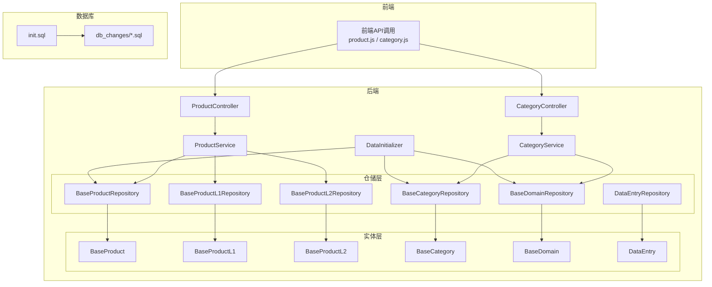
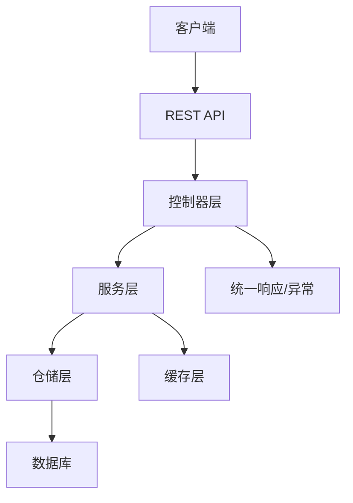
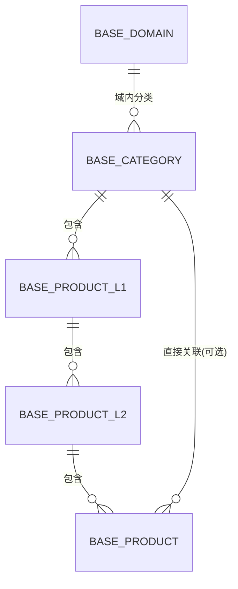
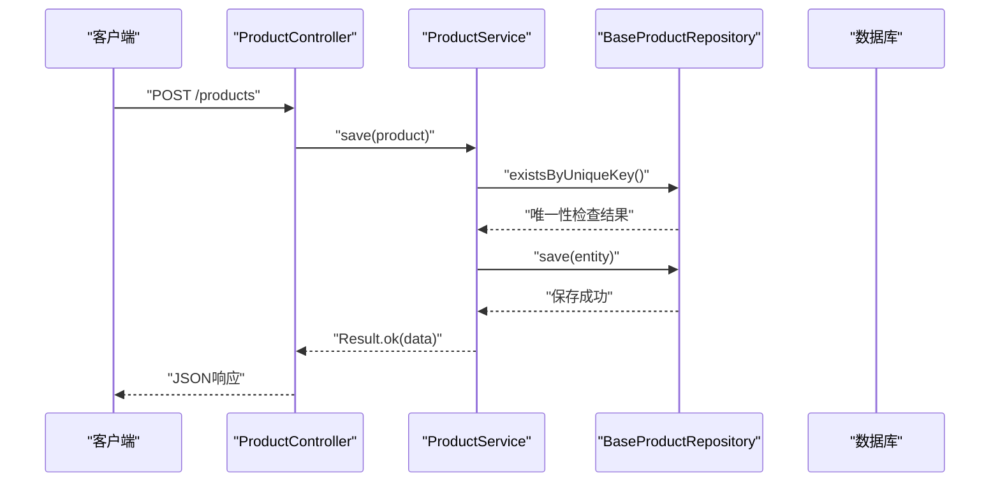
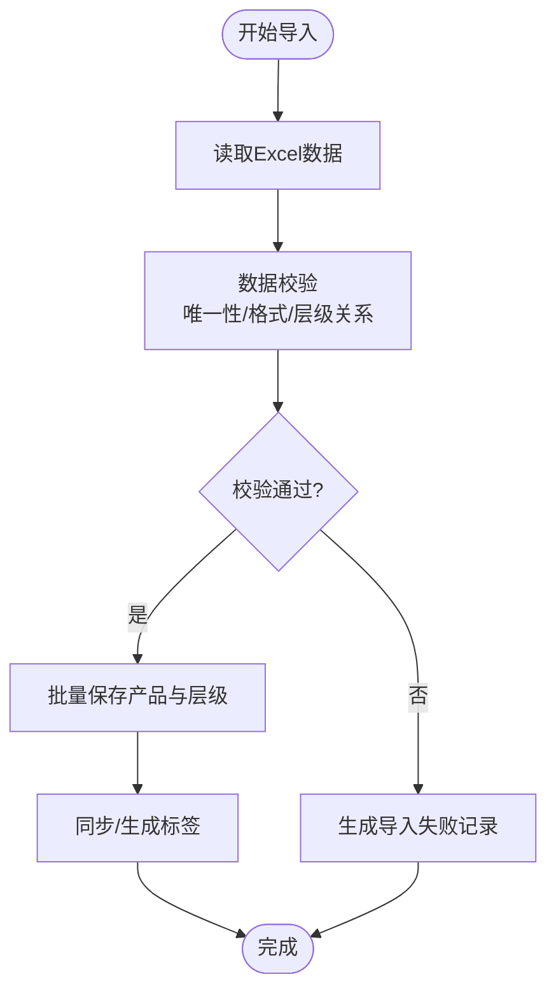
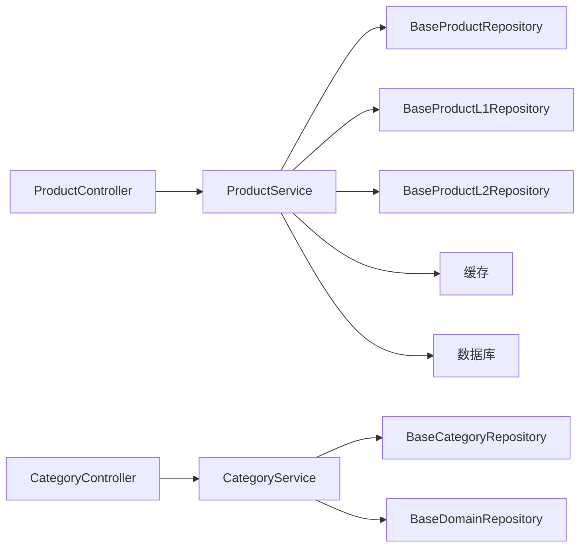

# 产品数据管理

<cite>
**本文引用的文件**
- [BaseProduct.java](file://src/main/java/com/superpower/modules/category/entity/BaseProduct.java)
- [BaseProductL1.java](file://src/main/java/com/superpower/modules/category/entity/BaseProductL1.java)
- [BaseProductL2.java](file://src/main/java/com/superpower/modules/category/entity/BaseProductL2.java)
- [BaseCategory.java](file://src/main/java/com/superpower/modules/category/entity/BaseCategory.java)
- [BaseDomain.java](file://src/main/java/com/superpower/modules/category/entity/BaseDomain.java)
- [BaseProductRepository.java](file://src/main/java/com/superpower/modules/category/repository/BaseProductRepository.java)
- [BaseProductL1Repository.java](file://src/main/java/com/superpower/modules/category/repository/BaseProductL1Repository.java)
- [BaseProductL2Repository.java](file://src/main/java/com/superpower/modules/category/repository/BaseProductL2Repository.java)
- [BaseCategoryRepository.java](file://src/main/java/com/superpower/modules/category/repository/BaseCategoryRepository.java)
- [BaseDomainRepository.java](file://src/main/java/com/superpower/modules/category/repository/BaseDomainRepository.java)
- [ProductService.java](file://src/main/java/com/superpower/modules/category/service/ProductService.java)
- [CategoryService.java](file://src/main/java/com/superpower/modules/category/service/CategoryService.java)
- [DataInitializer.java](file://src/main/java/com/superpower/modules/category/service/DataInitializer.java)
- [ProductController.java](file://src/main/java/com/superpower/modules/category/controller/ProductController.java)
- [CategoryController.java](file://src/main/java/com/superpower/modules/category/controller/CategoryController.java)
- [ExcelImportResult.java](file://src/main/java/com/superpower/modules/data/dto/ExcelImportResult.java)
- [DataEntryDTO.java](file://src/main/java/com/superpower/modules/data/dto/DataEntryDTO.java)
- [DataEntrySummaryDTO.java](file://src/main/java/com/superpower/modules/data/dto/DataEntrySummaryDTO.java)
- [DataEntry.java](file://src/main/java/com/superpower/modules/data/entity/DataEntry.java)
- [DataEntryRepository.java](file://src/main/java/com/superpower/modules/data/repository/DataEntryRepository.java)
- [DataEntryService.java](file://src/main/java/com/superpower/modules/data/service/DataEntryService.java)
- [DataEntryController.java](file://src/main/java/com/superpower/modules/data/controller/DataEntryController.java)
- [application.yml](file://src/main/resources/application.yml)
- [init.sql](file://src/main/resources/db/init.sql)
- [20260602_add_base_product_table.sql](file://db_changes/20260602_add_base_product_table.sql)
- [20260602_add_product_category_tables.sql](file://db_changes/20260602_add_product_category_tables.sql)
- [GlobalExceptionHandler.java](file://src/main/java/com/superpower/common/GlobalExceptionHandler.java)
- [Result.java](file://src/main/java/com/superpower/common/Result.java)
- [ResultCode.java](file://src/main/java/com/superpower/common/ResultCode.java)
- [PageResult.java](file://src/main/java/com/superpower/common/PageResult.java)
- [BusinessException.java](file://src/main/java/com/superpower/common/BusinessException.java)
- [import_excel.py](file://import_excel.py)
- [import_hierarchy.py](file://import_hierarchy.py)
- [import_l3.py](file://import_l3.py)
- [import_shuzhidi.py](file://import_shuzhidi.py)
</cite>

## 目录
1. [简介](#简介)
2. [项目结构](#项目结构)
3. [核心组件](#核心组件)
4. [架构总览](#架构总览)
5. [详细组件分析](#详细组件分析)
6. [依赖分析](#依赖分析)
7. [性能考虑](#性能考虑)
8. [故障排查指南](#故障排查指南)
9. [结论](#结论)
10. [附录](#附录)

## 简介
本技术文档聚焦于产品数据管理模块，系统性阐述多层级产品分类体系（L1/L2/L3）的设计与实现，覆盖实体模型关系映射、增删改查、数据导入导出、自定义标签与智能标签机制、完整API接口说明、批量操作与数据校验、初始化流程、缓存策略与性能优化等。文档面向开发与运维人员，兼顾可读性与落地实践。

## 项目结构
产品数据管理模块位于后端Java工程的category与data子包中，采用分层架构：controller（控制器）、service（服务）、repository（仓储）、entity（实体）。前端通过统一的REST接口与后端交互；数据库初始化脚本与迁移脚本位于resources与db_changes目录；Python脚本负责Excel与层级数据的批量导入。

图表来源
- [ProductController.java](file://src/main/java/com/superpower/modules/category/controller/ProductController.java)
- [CategoryController.java](file://src/main/java/com/superpower/modules/category/controller/CategoryController.java)
- [ProductService.java](file://src/main/java/com/superpower/modules/category/service/ProductService.java)
- [CategoryService.java](file://src/main/java/com/superpower/modules/category/service/CategoryService.java)
- [BaseProductRepository.java](file://src/main/java/com/superpower/modules/category/repository/BaseProductRepository.java)
- [BaseProductL1Repository.java](file://src/main/java/com/superpower/modules/category/repository/BaseProductL1Repository.java)
- [BaseProductL2Repository.java](file://src/main/java/com/superpower/modules/category/repository/BaseProductL2Repository.java)
- [BaseCategoryRepository.java](file://src/main/java/com/superpower/modules/category/repository/BaseCategoryRepository.java)
- [BaseDomainRepository.java](file://src/main/java/com/superpower/modules/category/repository/BaseDomainRepository.java)
- [DataInitializer.java](file://src/main/java/com/superpower/modules/category/service/DataInitializer.java)
- [init.sql](file://src/main/resources/db/init.sql)
- [20260602_add_base_product_table.sql](file://db_changes/20260602_add_base_product_table.sql)
- [20260602_add_product_category_tables.sql](file://db_changes/20260602_add_product_category_tables.sql)

章节来源
- [ProductController.java](file://src/main/java/com/superpower/modules/category/controller/ProductController.java)
- [CategoryController.java](file://src/main/java/com/superpower/modules/category/controller/CategoryController.java)
- [ProductService.java](file://src/main/java/com/superpower/modules/category/service/ProductService.java)
- [CategoryService.java](file://src/main/java/com/superpower/modules/category/service/CategoryService.java)
- [DataInitializer.java](file://src/main/java/com/superpower/modules/category/service/DataInitializer.java)
- [init.sql](file://src/main/resources/db/init.sql)
- [20260602_add_base_product_table.sql](file://db_changes/20260602_add_base_product_table.sql)
- [20260602_add_product_category_tables.sql](file://db_changes/20260602_add_product_category_tables.sql)

## 核心组件
- 实体模型
  - BaseProduct：产品基础信息，包含L1/L2/L3层级关联字段与通用属性。
  - BaseProductL1：一级分类实体。
  - BaseProductL2：二级分类实体。
  - BaseCategory：通用分类基类。
  - BaseDomain：领域/域实体，用于跨模块分类域隔离。
- 仓储层
  - BaseProductRepository、BaseProductL1Repository、BaseProductL2Repository、BaseCategoryRepository、BaseDomainRepository：提供CRUD与查询能力。
- 服务层
  - ProductService：封装产品数据的业务逻辑、校验、批量操作与导入导出协调。
  - CategoryService：封装分类树与层级关系的构建、查询与维护。
  - DataInitializer：系统启动时的数据初始化与一致性检查。
- 控制器层
  - ProductController：对外暴露产品数据的REST API。
  - CategoryController：对外暴露分类数据的REST API。
- 数据导入导出
  - Python脚本：import_excel.py、import_hierarchy.py、import_l3.py、import_shuzhidi.py，支持Excel批量导入、层级结构导入与L3图片目录修复等。
- 统一响应与异常
  - Result、PageResult、ResultCode、BusinessException、GlobalExceptionHandler：统一返回格式与异常处理。

章节来源
- [BaseProduct.java](file://src/main/java/com/superpower/modules/category/entity/BaseProduct.java)
- [BaseProductL1.java](file://src/main/java/com/superpower/modules/category/entity/BaseProductL1.java)
- [BaseProductL2.java](file://src/main/java/com/superpower/modules/category/entity/BaseProductL2.java)
- [BaseCategory.java](file://src/main/java/com/superpower/modules/category/entity/BaseCategory.java)
- [BaseDomain.java](file://src/main/java/com/superpower/modules/category/entity/BaseDomain.java)
- [BaseProductRepository.java](file://src/main/java/com/superpower/modules/category/repository/BaseProductRepository.java)
- [BaseProductL1Repository.java](file://src/main/java/com/superpower/modules/category/repository/BaseProductL1Repository.java)
- [BaseProductL2Repository.java](file://src/main/java/com/superpower/modules/category/repository/BaseProductL2Repository.java)
- [BaseCategoryRepository.java](file://src/main/java/com/superpower/modules/category/repository/BaseCategoryRepository.java)
- [BaseDomainRepository.java](file://src/main/java/com/superpower/modules/category/repository/BaseDomainRepository.java)
- [ProductService.java](file://src/main/java/com/superpower/modules/category/service/ProductService.java)
- [CategoryService.java](file://src/main/java/com/superpower/modules/category/service/CategoryService.java)
- [DataInitializer.java](file://src/main/java/com/superpower/modules/category/service/DataInitializer.java)
- [ProductController.java](file://src/main/java/com/superpower/modules/category/controller/ProductController.java)
- [CategoryController.java](file://src/main/java/com/superpower/modules/category/controller/CategoryController.java)
- [ExcelImportResult.java](file://src/main/java/com/superpower/modules/data/dto/ExcelImportResult.java)
- [DataEntryDTO.java](file://src/main/java/com/superpower/modules/data/dto/DataEntryDTO.java)
- [DataEntrySummaryDTO.java](file://src/main/java/com/superpower/modules/data/dto/DataEntrySummaryDTO.java)
- [DataEntry.java](file://src/main/java/com/superpower/modules/data/entity/DataEntry.java)
- [DataEntryRepository.java](file://src/main/java/com/superpower/modules/data/repository/DataEntryRepository.java)
- [DataEntryService.java](file://src/main/java/com/superpower/modules/data/service/DataEntryService.java)
- [DataEntryController.java](file://src/main/java/com/superpower/modules/data/controller/DataEntryController.java)
- [Result.java](file://src/main/java/com/superpower/common/Result.java)
- [PageResult.java](file://src/main/java/com/superpower/common/PageResult.java)
- [ResultCode.java](file://src/main/java/com/superpower/common/ResultCode.java)
- [BusinessException.java](file://src/main/java/com/superpower/common/BusinessException.java)
- [GlobalExceptionHandler.java](file://src/main/java/com/superpower/common/GlobalExceptionHandler.java)
- [import_excel.py](file://import_excel.py)
- [import_hierarchy.py](file://import_hierarchy.py)
- [import_l3.py](file://import_l3.py)
- [import_shuzhidi.py](file://import_shuzhidi.py)

## 架构总览
产品数据管理采用经典的MVC分层与DDD仓储模式，控制器负责HTTP请求接入与参数校验，服务层编排业务规则与事务边界，仓储层抽象持久化访问，实体层承载数据模型与不变量。统一响应与异常处理贯穿全链路，确保接口一致性与可观测性。

图表来源
- [ProductController.java](file://src/main/java/com/superpower/modules/category/controller/ProductController.java)
- [CategoryController.java](file://src/main/java/com/superpower/modules/category/controller/CategoryController.java)
- [ProductService.java](file://src/main/java/com/superpower/modules/category/service/ProductService.java)
- [CategoryService.java](file://src/main/java/com/superpower/modules/category/service/CategoryService.java)
- [Result.java](file://src/main/java/com/superpower/common/Result.java)
- [GlobalExceptionHandler.java](file://src/main/java/com/superpower/common/GlobalExceptionHandler.java)

## 详细组件分析

### 实体模型与关系映射
- 多层级分类模型
  - BaseProductL1：一级分类，作为L1节点。
  - BaseProductL2：二级分类，与L1存在一对多关系。
  - BaseProduct：产品实体，同时关联L1与L2，并可进一步扩展到L3。
  - BaseCategory：通用分类基类，便于复用与扩展。
  - BaseDomain：领域实体，用于按域隔离分类与产品数据。
- 关系映射要点
  - L1-L2：一对多（一个L1下挂多个L2）。
  - L2-L3：可选的一对多（一个L2下挂多个L3或无L3）。
  - 产品与层级：产品持有L1/L2标识，便于快速过滤与统计。
- 数据模型复杂度
  - 查询：基于层级字段的等值/范围查询，时间复杂度O(1)~O(logN)，索引优化后接近O(1)。
  - 更新：单表更新，时间复杂度O(1)。
  - 删除：需级联处理L2/L3与产品，注意外键约束与事务一致性。

图表来源
- [BaseDomain.java](file://src/main/java/com/superpower/modules/category/entity/BaseDomain.java)
- [BaseCategory.java](file://src/main/java/com/superpower/modules/category/entity/BaseCategory.java)
- [BaseProductL1.java](file://src/main/java/com/superpower/modules/category/entity/BaseProductL1.java)
- [BaseProductL2.java](file://src/main/java/com/superpower/modules/category/entity/BaseProductL2.java)
- [BaseProduct.java](file://src/main/java/com/superpower/modules/category/entity/BaseProduct.java)

章节来源
- [BaseProduct.java](file://src/main/java/com/superpower/modules/category/entity/BaseProduct.java)
- [BaseProductL1.java](file://src/main/java/com/superpower/modules/category/entity/BaseProductL1.java)
- [BaseProductL2.java](file://src/main/java/com/superpower/modules/category/entity/BaseProductL2.java)
- [BaseCategory.java](file://src/main/java/com/superpower/modules/category/entity/BaseCategory.java)
- [BaseDomain.java](file://src/main/java/com/superpower/modules/category/entity/BaseDomain.java)

### 增删改查与批量操作
- 增：ProductController提供新增接口，ProductService执行校验与入库；CategoryController提供分类新增接口，CategoryService维护层级关系。
- 删：支持按ID删除产品与分类；删除L1需检查L2/L3是否存在，删除L2需检查产品是否存在。
- 改：支持字段更新与层级变更；变更L1/L2需保持产品与层级一致。
- 查：支持分页查询、按L1/L2/L3过滤、按关键词搜索；支持树形结构输出。
- 批量操作：通过DataEntryService与DataEntryController协调，支持批量导入、重编号、汇总统计等。

图表来源
- [ProductController.java](file://src/main/java/com/superpower/modules/category/controller/ProductController.java)
- [ProductService.java](file://src/main/java/com/superpower/modules/category/service/ProductService.java)
- [BaseProductRepository.java](file://src/main/java/com/superpower/modules/category/repository/BaseProductRepository.java)
- [Result.java](file://src/main/java/com/superpower/common/Result.java)

章节来源
- [ProductController.java](file://src/main/java/com/superpower/modules/category/controller/ProductController.java)
- [ProductService.java](file://src/main/java/com/superpower/modules/category/service/ProductService.java)
- [BaseProductRepository.java](file://src/main/java/com/superpower/modules/category/repository/BaseProductRepository.java)
- [DataEntryController.java](file://src/main/java/com/superpower/modules/data/controller/DataEntryController.java)
- [DataEntryService.java](file://src/main/java/com/superpower/modules/data/service/DataEntryService.java)

### 数据导入导出与自定义标签
- 导入
  - Excel导入：import_excel.py读取Excel，调用ProductService进行校验与入库。
  - 层级导入：import_hierarchy.py导入L1/L2层级关系，确保父子关系正确。
  - L3修复：import_l3.py修复L3层级图片目录问题。
  - 数字地图导入：import_shuzhidi.py导入特定数据源。
- 导出
  - 通过DataEntryService聚合数据，生成Excel或报表格式。
- 自定义标签与智能标签
  - 自定义标签：在产品实体中预留标签字段，支持多标签存储与检索。
  - 智能标签：基于规则引擎或业务规则自动打标，由DataInitializer初始化默认规则集。

图表来源
- [import_excel.py](file://import_excel.py)
- [import_hierarchy.py](file://import_hierarchy.py)
- [import_l3.py](file://import_l3.py)
- [import_shuzhidi.py](file://import_shuzhidi.py)
- [ProductService.java](file://src/main/java/com/superpower/modules/category/service/ProductService.java)
- [DataInitializer.java](file://src/main/java/com/superpower/modules/category/service/DataInitializer.java)

章节来源
- [import_excel.py](file://import_excel.py)
- [import_hierarchy.py](file://import_hierarchy.py)
- [import_l3.py](file://import_l3.py)
- [import_shuzhidi.py](file://import_shuzhidi.py)
- [ProductService.java](file://src/main/java/com/superpower/modules/category/service/ProductService.java)
- [DataInitializer.java](file://src/main/java/com/superpower/modules/category/service/DataInitializer.java)

### API接口说明
- 产品管理
  - GET /products：分页查询，支持按L1/L2/L3与关键词过滤。
  - GET /products/{id}：获取详情。
  - POST /products：新增产品。
  - PUT /products/{id}：更新产品。
  - DELETE /products/{id}：删除产品。
- 分类管理
  - GET /categories：获取分类树。
  - GET /categories/{id}：获取分类详情。
  - POST /categories：新增分类。
  - PUT /categories/{id}：更新分类。
  - DELETE /categories/{id}：删除分类。
- 数据导入导出
  - POST /data/import/excel：Excel导入。
  - GET /data/export：导出数据。
  - POST /data/reindex：重编号/重建索引。
- 统一响应
  - 成功：{ code: 0, msg: "success", data: ... }
  - 失败：{ code: 错误码, msg: "错误描述", data: null }
  - 分页：{ code: 0, msg: "success", data: { list: [...], total: N } }

章节来源
- [ProductController.java](file://src/main/java/com/superpower/modules/category/controller/ProductController.java)
- [CategoryController.java](file://src/main/java/com/superpower/modules/category/controller/CategoryController.java)
- [DataEntryController.java](file://src/main/java/com/superpower/modules/data/controller/DataEntryController.java)
- [Result.java](file://src/main/java/com/superpower/common/Result.java)
- [PageResult.java](file://src/main/java/com/superpower/common/PageResult.java)
- [ResultCode.java](file://src/main/java/com/superpower/common/ResultCode.java)

### 数据验证规则与业务逻辑
- 验证规则
  - 唯一性：产品编码/名称在域内唯一。
  - 层级一致性：L1/L2/L3父子关系必须存在且正确。
  - 必填字段：关键字段如名称、编码、L1/L2不能为空。
  - 格式校验：编码/图片URL/数字格式等。
- 业务逻辑
  - 新增/修改时触发标签重算与缓存刷新。
  - 删除时触发级联清理与索引重建。
  - 导入时进行幂等处理与冲突回滚。

章节来源
- [ProductService.java](file://src/main/java/com/superpower/modules/category/service/ProductService.java)
- [BusinessException.java](file://src/main/java/com/superpower/common/BusinessException.java)

### 初始化流程、缓存策略与性能优化
- 初始化流程
  - DataInitializer在应用启动时执行：创建/校验基础表结构、加载默认分类与域、初始化智能标签规则。
  - 依赖db_changes脚本与init.sql，确保数据库版本与数据一致性。
- 缓存策略
  - 分类树与域配置缓存：热点数据缓存于内存，定期刷新。
  - 产品列表分页缓存：基于查询条件的组合Key缓存，失效策略按时间或事件驱动。
- 性能优化
  - 索引优化：在L1/L2/L3层级字段、编码、关键词上建立索引。
  - 批量写入：导入与重编号采用批处理与事务包裹，减少往返。
  - 异步任务：导入进度与重建索引异步执行，避免阻塞主线程。

章节来源
- [DataInitializer.java](file://src/main/java/com/superpower/modules/category/service/DataInitializer.java)
- [application.yml](file://src/main/resources/application.yml)
- [init.sql](file://src/main/resources/db/init.sql)
- [20260602_add_base_product_table.sql](file://db_changes/20260602_add_base_product_table.sql)
- [20260602_add_product_category_tables.sql](file://db_changes/20260602_add_product_category_tables.sql)

## 依赖分析
- 组件耦合
  - 控制器仅依赖服务接口，降低与实现的耦合。
  - 服务层依赖仓储接口，遵循依赖倒置原则。
  - 仓储层依赖JPA/Hibernate，屏蔽底层差异。
- 外部依赖
  - 数据库：SQLite/MySQL（根据配置切换）。
  - 缓存：Redis（可选，用于热点数据加速）。
  - 文件系统：Excel与图片资源存储。
- 循环依赖
  - 未发现循环依赖，层次清晰。

图表来源
- [ProductController.java](file://src/main/java/com/superpower/modules/category/controller/ProductController.java)
- [CategoryController.java](file://src/main/java/com/superpower/modules/category/controller/CategoryController.java)
- [ProductService.java](file://src/main/java/com/superpower/modules/category/service/ProductService.java)
- [CategoryService.java](file://src/main/java/com/superpower/modules/category/service/CategoryService.java)
- [BaseProductRepository.java](file://src/main/java/com/superpower/modules/category/repository/BaseProductRepository.java)
- [BaseProductL1Repository.java](file://src/main/java/com/superpower/modules/category/repository/BaseProductL1Repository.java)
- [BaseProductL2Repository.java](file://src/main/java/com/superpower/modules/category/repository/BaseProductL2Repository.java)
- [BaseCategoryRepository.java](file://src/main/java/com/superpower/modules/category/repository/BaseCategoryRepository.java)
- [BaseDomainRepository.java](file://src/main/java/com/superpower/modules/category/repository/BaseDomainRepository.java)

章节来源
- [ProductController.java](file://src/main/java/com/superpower/modules/category/controller/ProductController.java)
- [CategoryController.java](file://src/main/java/com/superpower/modules/category/controller/CategoryController.java)
- [ProductService.java](file://src/main/java/com/superpower/modules/category/service/ProductService.java)
- [CategoryService.java](file://src/main/java/com/superpower/modules/category/service/CategoryService.java)
- [BaseProductRepository.java](file://src/main/java/com/superpower/modules/category/repository/BaseProductRepository.java)
- [BaseProductL1Repository.java](file://src/main/java/com/superpower/modules/category/repository/BaseProductL1Repository.java)
- [BaseProductL2Repository.java](file://src/main/java/com/superpower/modules/category/repository/BaseProductL2Repository.java)
- [BaseCategoryRepository.java](file://src/main/java/com/superpower/modules/category/repository/BaseCategoryRepository.java)
- [BaseDomainRepository.java](file://src/main/java/com/superpower/modules/category/repository/BaseDomainRepository.java)

## 性能考虑
- 查询性能
  - 对L1/L2/L3层级字段建立复合索引，提升过滤效率。
  - 使用分页查询与延迟加载，避免一次性加载大量数据。
- 写入性能
  - 批量插入与事务合并，减少数据库往返。
  - 导入阶段关闭不必要的触发器与校验，导入后再统一校验。
- 缓存命中
  - 将高频读取的分类树与域配置放入缓存，设置合理TTL。
  - 对热点产品列表按查询参数生成Key，避免缓存穿透。
- IO与并发
  - 导入与导出使用异步任务队列，限制并发度防止资源争用。
  - 图片与Excel文件采用流式读取，避免内存溢出。

## 故障排查指南
- 常见错误
  - 参数校验失败：检查必填字段与格式是否符合要求。
  - 唯一性冲突：确认编码/名称在域内是否重复。
  - 层级关系错误：确认L1/L2/L3父子关系是否正确。
  - 导入失败：查看Excel格式与字段映射，核对日志与错误明细。
- 排查步骤
  - 启用调试日志，定位异常堆栈。
  - 使用统一异常处理器捕获并记录错误码与消息。
  - 核对数据库版本与迁移脚本是否执行成功。
- 修复建议
  - 对唯一性冲突进行去重或提示用户修正。
  - 对层级错误进行自动修复或提示修复建议。
  - 对导入失败的数据单独导出，人工复核后重试。

章节来源
- [GlobalExceptionHandler.java](file://src/main/java/com/superpower/common/GlobalExceptionHandler.java)
- [BusinessException.java](file://src/main/java/com/superpower/common/BusinessException.java)
- [ResultCode.java](file://src/main/java/com/superpower/common/ResultCode.java)

## 结论
产品数据管理模块以清晰的分层架构与完善的实体模型支撑多层级分类体系，配合统一的API、导入导出与标签机制，满足企业级产品数据的全生命周期管理需求。通过合理的缓存与索引策略、异步任务与批量处理，系统在保证一致性的同时具备良好的性能与可维护性。

## 附录
- 数据库初始化脚本
  - init.sql：初始化基础表与基础数据。
  - db_changes/*.sql：版本化迁移脚本，包含产品表与分类表的创建。
- Python导入脚本
  - import_excel.py：Excel批量导入。
  - import_hierarchy.py：层级关系导入。
  - import_l3.py：L3层级修复。
  - import_shuzhidi.py：数字地图数据导入。

章节来源
- [init.sql](file://src/main/resources/db/init.sql)
- [20260602_add_base_product_table.sql](file://db_changes/20260602_add_base_product_table.sql)
- [20260602_add_product_category_tables.sql](file://db_changes/20260602_add_product_category_tables.sql)
- [import_excel.py](file://import_excel.py)
- [import_hierarchy.py](file://import_hierarchy.py)
- [import_l3.py](file://import_l3.py)
- [import_shuzhidi.py](file://import_shuzhidi.py)