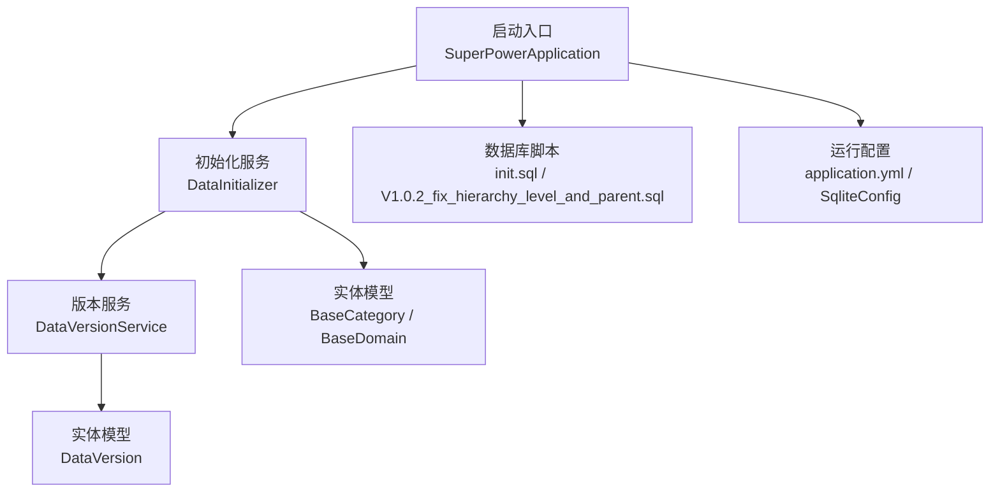
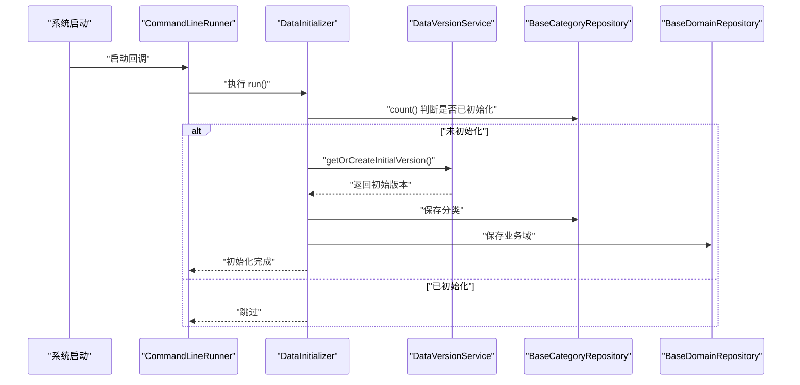
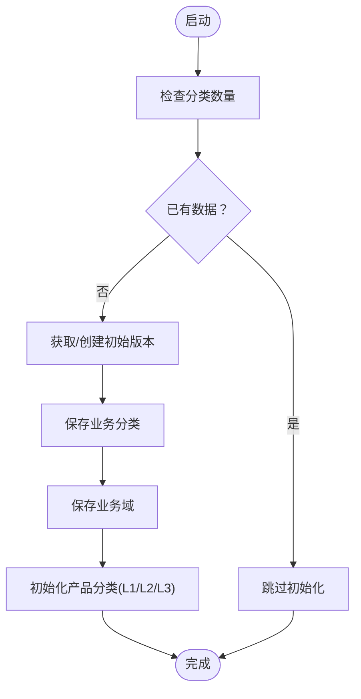
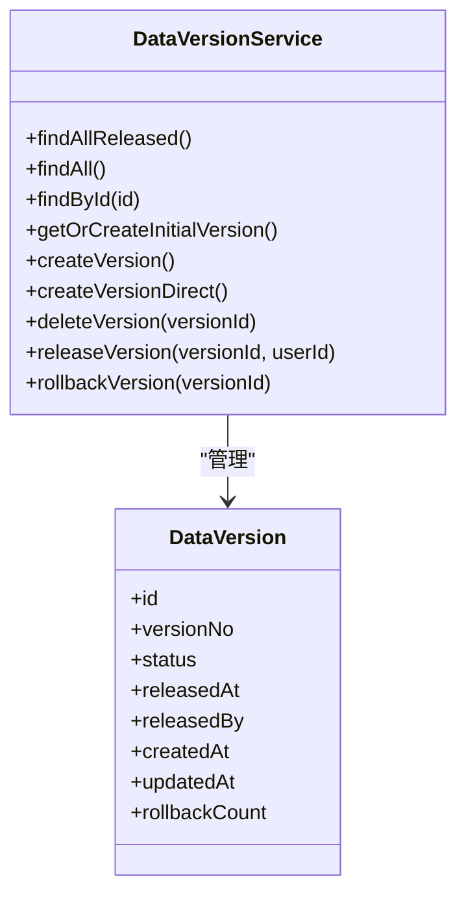
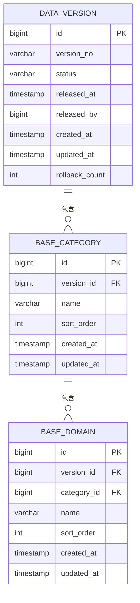
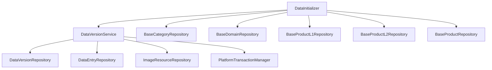

# 数据初始化

<cite>
**本文引用的文件**
- [DataInitializer.java](file://src/main/java/com/superpower/modules/category/service/DataInitializer.java)
- [DataVersionService.java](file://src/main/java/com/superpower/modules/version/service/DataVersionService.java)
- [DataVersion.java](file://src/main/java/com/superpower/modules/version/entity/DataVersion.java)
- [BaseCategory.java](file://src/main/java/com/superpower/modules/category/entity/BaseCategory.java)
- [BaseDomain.java](file://src/main/java/com/superpower/modules/category/entity/BaseDomain.java)
- [init.sql](file://src/main/resources/db/init.sql)
- [application.yml](file://src/main/resources/application.yml)
- [SqliteConfig.java](file://src/main/java/com/superpower/config/SqliteConfig.java)
- [SuperPowerApplication.java](file://src/main/java/com/superpower/SuperPowerApplication.java)
- [V1.0.2_fix_hierarchy_level_and_parent.sql](file://db_changes/V1.0.2_fix_hierarchy_level_and_parent.sql)
</cite>

## 目录
1. [简介](#简介)
2. [项目结构](#项目结构)
3. [核心组件](#核心组件)
4. [架构总览](#架构总览)
5. [详细组件分析](#详细组件分析)
6. [依赖分析](#依赖分析)
7. [性能考量](#性能考量)
8. [故障排查指南](#故障排查指南)
9. [结论](#结论)
10. [附录](#附录)

## 简介
本文件围绕“数据初始化”功能展开，系统性阐述 DataInitializer 服务的设计目的、实现原理与运行机制，覆盖系统启动时的基础数据准备流程、默认数据加载策略、初始化脚本执行顺序、数据依赖关系与错误处理策略。同时，结合实际代码路径，给出扩展初始化功能、添加新初始化数据与处理异常的实践建议，并说明初始化过程中的性能考虑、并发控制与数据一致性保障。

## 项目结构
数据初始化涉及的关键模块与文件如下：
- 初始化服务：DataInitializer（业务分类与产品分类初始化）
- 版本服务：DataVersionService（版本创建、初始版本获取、版本复制等）
- 实体模型：DataVersion、BaseCategory、BaseDomain（版本与基础分类数据模型）
- 数据库脚本：init.sql（DDL 脚本）、V1.0.2_fix_hierarchy_level_and_parent.sql（结构演进）
- 运行配置：application.yml（数据源、JPA、日志等）、SqliteConfig（SQLite 参数）
- 启动入口：SuperPowerApplication（系统启动时的默认角色与用户初始化）

**图表来源**
- [DataInitializer.java:44-89](file://src/main/java/com/superpower/modules/category/service/DataInitializer.java#L44-L89)
- [DataVersionService.java:476-504](file://src/main/java/com/superpower/modules/version/service/DataVersionService.java#L476-L504)
- [DataVersion.java:10-35](file://src/main/java/com/superpower/modules/version/entity/DataVersion.java#L10-L35)
- [BaseCategory.java:10-29](file://src/main/java/com/superpower/modules/category/entity/BaseCategory.java#L10-L29)
- [BaseDomain.java:10-32](file://src/main/java/com/superpower/modules/category/entity/BaseDomain.java#L10-L32)
- [init.sql:1-126](file://src/main/resources/db/init.sql#L1-L126)
- [application.yml:11-34](file://src/main/resources/application.yml#L11-L34)
- [SqliteConfig.java:21-38](file://src/main/java/com/superpower/config/SqliteConfig.java#L21-L38)

**章节来源**
- [DataInitializer.java:44-89](file://src/main/java/com/superpower/modules/category/service/DataInitializer.java#L44-L89)
- [DataVersionService.java:476-504](file://src/main/java/com/superpower/modules/version/service/DataVersionService.java#L476-L504)
- [init.sql:1-126](file://src/main/resources/db/init.sql#L1-L126)
- [application.yml:11-34](file://src/main/resources/application.yml#L11-L34)
- [SqliteConfig.java:21-38](file://src/main/java/com/superpower/config/SqliteConfig.java#L21-L38)

## 核心组件
- DataInitializer：实现 CommandLineRunner，在系统启动时进行一次性初始化，确保业务分类、业务域与产品分类的初始数据完整。
- DataVersionService：负责版本生命周期管理，提供初始版本获取与创建、版本复制、删除等能力，支撑初始化数据与后续版本演进。
- 实体模型：DataVersion、BaseCategory、BaseDomain 描述版本与基础分类的数据结构，确保初始化数据与业务模型一致。
- 数据库脚本：init.sql 定义系统基础表结构，V1.0.2_fix_hierarchy_level_and_parent.sql 体现结构演进与索引优化。
- 运行配置：application.yml 与 SqliteConfig 保障 SQLite 连接参数与 JPA 行为，确保初始化过程的稳定性。

**章节来源**
- [DataInitializer.java:20-42](file://src/main/java/com/superpower/modules/category/service/DataInitializer.java#L20-L42)
- [DataVersionService.java:37-102](file://src/main/java/com/superpower/modules/version/service/DataVersionService.java#L37-L102)
- [DataVersion.java:10-35](file://src/main/java/com/superpower/modules/version/entity/DataVersion.java#L10-L35)
- [BaseCategory.java:10-29](file://src/main/java/com/superpower/modules/category/entity/BaseCategory.java#L10-L29)
- [BaseDomain.java:10-32](file://src/main/java/com/superpower/modules/category/entity/BaseDomain.java#L10-L32)
- [init.sql:44-125](file://src/main/resources/db/init.sql#L44-L125)
- [application.yml:18-30](file://src/main/resources/application.yml#L18-L30)
- [SqliteConfig.java:21-38](file://src/main/java/com/superpower/config/SqliteConfig.java#L21-L38)

## 架构总览
初始化流程从系统启动开始，通过 CommandLineRunner 触发 DataInitializer，后者调用 DataVersionService 获取或创建初始版本，随后批量写入业务分类、业务域与产品分类数据。初始化完成后，系统具备可直接使用的默认基础数据。

**图表来源**
- [DataInitializer.java:44-89](file://src/main/java/com/superpower/modules/category/service/DataInitializer.java#L44-L89)
- [DataVersionService.java:476-504](file://src/main/java/com/superpower/modules/version/service/DataVersionService.java#L476-L504)

## 详细组件分析

### DataInitializer：启动时数据准备
- 设计目的：在首次启动时，为业务分类、业务域与产品分类建立初始数据，确保系统具备可用的分类体系。
- 关键行为：
  - 启动时检查分类数量，若已有数据则跳过初始化。
  - 通过 DataVersionService 获取或创建初始版本，作为所有初始化数据的版本归属。
  - 依次创建业务分类与对应业务域，并提取业务域名称中的排序号。
  - 初始化产品分类（L1/L2/L3），并建立 L2 与 L1 的父子关系，L3 与 L2 的归属关系。
- 错误处理策略：
  - 通过版本服务的事务封装与异常传播，保证初始化失败时不会产生部分数据。
  - 若存在已发布版本，创建新版本时会触发异步复制流程，避免阻塞启动。
- 扩展建议：
  - 如需新增分类或域，可在相应 Map 中追加条目，遵循现有命名与排序规则。
  - 如需新增产品分类层级，可在 initProductCategories 中按 L1/L2/L3 的模式扩展。

**图表来源**
- [DataInitializer.java:44-89](file://src/main/java/com/superpower/modules/category/service/DataInitializer.java#L44-L89)
- [DataInitializer.java:91-155](file://src/main/java/com/superpower/modules/category/service/DataInitializer.java#L91-L155)

**章节来源**
- [DataInitializer.java:44-89](file://src/main/java/com/superpower/modules/category/service/DataInitializer.java#L44-L89)
- [DataInitializer.java:91-155](file://src/main/java/com/superpower/modules/category/service/DataInitializer.java#L91-L155)

### DataVersionService：版本管理与初始版本
- 设计目的：统一管理数据版本生命周期，提供初始版本获取与创建、版本复制与删除等能力，支撑初始化与版本演进。
- 关键行为：
  - getOrCreateInitialVersion：若存在历史版本则返回首个版本，否则直接创建初始版本。
  - createVersion/createVersionDirect：创建新版本并处理版本号递增与状态流转。
  - 异步版本复制：在存在已发布版本时，异步执行复制清单、分类、产品、选项、图片与自定义清单等步骤。
- 并发与一致性：
  - 使用事务模板与单线程执行器，确保版本操作的串行化与原子性。
  - 复制过程中分步更新进度，便于监控与恢复。
- 错误处理：
  - 步骤失败时设置进度为 FAILED 并记录错误信息，避免部分复制导致的数据不一致。

**图表来源**
- [DataVersionService.java:37-102](file://src/main/java/com/superpower/modules/version/service/DataVersionService.java#L37-L102)
- [DataVersion.java:10-35](file://src/main/java/com/superpower/modules/version/entity/DataVersion.java#L10-L35)

**章节来源**
- [DataVersionService.java:476-504](file://src/main/java/com/superpower/modules/version/service/DataVersionService.java#L476-L504)
- [DataVersionService.java:152-203](file://src/main/java/com/superpower/modules/version/service/DataVersionService.java#L152-L203)
- [DataVersionService.java:205-474](file://src/main/java/com/superpower/modules/version/service/DataVersionService.java#L205-L474)

### 实体模型：版本与基础分类
- DataVersion：描述版本编号、状态、发布时间与更新时间等，作为初始化数据的版本归属。
- BaseCategory：描述业务分类，包含版本 ID、名称与排序。
- BaseDomain：描述业务域，包含版本 ID、分类 ID、名称与排序。
- 数据库脚本：init.sql 定义了 sys_user/sys_role/sys_menu 等系统表与 data_version/data_entry 等业务表；V1.0.2 脚本补充了层级与关联字段及索引。

**图表来源**
- [DataVersion.java:10-35](file://src/main/java/com/superpower/modules/version/entity/DataVersion.java#L10-L35)
- [BaseCategory.java:10-29](file://src/main/java/com/superpower/modules/category/entity/BaseCategory.java#L10-L29)
- [BaseDomain.java:10-32](file://src/main/java/com/superpower/modules/category/entity/BaseDomain.java#L10-L32)
- [init.sql:44-125](file://src/main/resources/db/init.sql#L44-L125)

**章节来源**
- [DataVersion.java:10-35](file://src/main/java/com/superpower/modules/version/entity/DataVersion.java#L10-L35)
- [BaseCategory.java:10-29](file://src/main/java/com/superpower/modules/category/entity/BaseCategory.java#L10-L29)
- [BaseDomain.java:10-32](file://src/main/java/com/superpower/modules/category/entity/BaseDomain.java#L10-L32)
- [init.sql:44-125](file://src/main/resources/db/init.sql#L44-L125)

### 初始化脚本与表结构验证
- init.sql：定义系统基础表结构，包括用户、角色、菜单、版本、版本变更记录与数据条目等。
- V1.0.2 脚本：新增业务分类与业务域关联字段、审批状态字段，并创建多处索引以提升查询性能。
- 表结构验证建议：
  - 在初始化前检查目标表是否存在，确保 DDL 已执行。
  - 对关键字段（如版本 ID、分类 ID、域 ID）进行外键约束与索引校验，避免初始化后出现引用缺失。

**章节来源**
- [init.sql:1-126](file://src/main/resources/db/init.sql#L1-L126)
- [V1.0.2_fix_hierarchy_level_and_parent.sql:1-28](file://db_changes/V1.0.2_fix_hierarchy_level_and_parent.sql#L1-L28)

### 初始化流程说明与状态管理
- 流程概览：
  - 启动阶段：CommandLineRunner 触发 DataInitializer。
  - 数据准备：DataVersionService 提供初始版本；DataInitializer 写入分类、域与产品分类。
  - 状态管理：通过 DataVersion 的状态字段（draft/released）与版本号递增策略，实现版本演进。
- 数据完整性检查：
  - 通过 count() 判断是否已初始化，避免重复写入。
  - 通过事务封装与异步复制，确保跨表数据的一致性。
- 初始化状态管理：
  - 初始版本创建后，状态为 draft；可通过 releaseVersion 发布，rollbackVersion 回退。

**章节来源**
- [DataInitializer.java:44-89](file://src/main/java/com/superpower/modules/category/service/DataInitializer.java#L44-L89)
- [DataVersionService.java:476-504](file://src/main/java/com/superpower/modules/version/service/DataVersionService.java#L476-L504)
- [DataVersionService.java:648-689](file://src/main/java/com/superpower/modules/version/service/DataVersionService.java#L648-L689)

### 扩展初始化功能与异常处理
- 扩展方式：
  - 在 DataInitializer 中新增分类/域/产品的映射与保存逻辑，遵循现有排序与层级规则。
  - 在 DataVersionService 中扩展版本复制或删除流程，确保新数据参与版本演进。
- 异常处理：
  - 使用事务模板包裹关键步骤，失败时回滚。
  - 对外部依赖（如文件存储）进行容错处理，避免阻断初始化主流程。

**章节来源**
- [DataInitializer.java:91-155](file://src/main/java/com/superpower/modules/category/service/DataInitializer.java#L91-L155)
- [DataVersionService.java:205-474](file://src/main/java/com/superpower/modules/version/service/DataVersionService.java#L205-L474)

## 依赖分析
- DataInitializer 依赖 DataVersionService 与多个仓库（分类、域、产品 L1/L2/L3），形成“服务-仓储”层次。
- DataVersionService 依赖多个仓储与事务管理器，承担版本生命周期与复制流程的协调。
- 运行时依赖 SQLite 数据源与 JPA/Hibernate，通过 application.yml 与 SqliteConfig 进行参数配置。

**图表来源**
- [DataInitializer.java:23-42](file://src/main/java/com/superpower/modules/category/service/DataInitializer.java#L23-L42)
- [DataVersionService.java:40-102](file://src/main/java/com/superpower/modules/version/service/DataVersionService.java#L40-L102)

**章节来源**
- [DataInitializer.java:23-42](file://src/main/java/com/superpower/modules/category/service/DataInitializer.java#L23-L42)
- [DataVersionService.java:40-102](file://src/main/java/com/superpower/modules/version/service/DataVersionService.java#L40-L102)

## 性能考量
- 初始化性能：
  - 使用批量保存减少事务开销；对大范围初始化采用分步策略，避免长时间占用数据库。
  - 利用索引（如版本+层级、版本+父节点+排序）提升查询效率。
- 并发控制：
  - 版本操作使用单线程执行器与事务模板，确保串行化与原子性。
  - 启动阶段的初始化通过 count() 快速判断，避免不必要的写入。
- 数据一致性：
  - 通过事务封装与异步复制，确保跨表数据的一致性与可恢复性。
  - 对外部资源（如图片存储）进行容错处理，防止初始化失败。

[本节为通用性能指导，不直接分析具体文件，故无“章节来源”]

## 故障排查指南
- 初始化未生效：
  - 检查分类数量判断逻辑，确认数据库中是否已有数据。
  - 核对 DataVersionService 的初始版本创建与状态流转。
- 版本复制异常：
  - 查看版本复制进度对象，定位失败步骤与错误信息。
  - 确认目标版本 ID 与源版本 ID 的映射关系是否正确。
- 数据库连接问题：
  - 检查 application.yml 中的数据库 URL 与驱动配置。
  - 通过 SqliteConfig 确认 SQLite 参数（如 journal_mode、busy_timeout）已正确设置。

**章节来源**
- [DataInitializer.java:44-89](file://src/main/java/com/superpower/modules/category/service/DataInitializer.java#L44-L89)
- [DataVersionService.java:117-150](file://src/main/java/com/superpower/modules/version/service/DataVersionService.java#L117-L150)
- [application.yml:18-30](file://src/main/resources/application.yml#L18-L30)
- [SqliteConfig.java:21-38](file://src/main/java/com/superpower/config/SqliteConfig.java#L21-L38)

## 结论
DataInitializer 与 DataVersionService 协同实现了系统启动时的基础数据准备与版本管理。通过事务封装、异步复制与状态管理，确保初始化过程的可靠性与一致性。结合数据库脚本与运行配置，系统能够在启动时快速具备可用的分类体系与版本能力。扩展初始化功能时，应遵循现有模式，关注数据依赖关系与异常处理，以维持系统的稳定演进。

[本节为总结性内容，不直接分析具体文件，故无“章节来源”]

## 附录
- 启动入口与默认角色初始化：SuperPowerApplication 在启动时检查角色数量，若为空则创建管理员、普通用户与高级用户角色及初始用户与初始版本。
- 运行配置要点：application.yml 指定 SQLite 数据源、JPA 行为与日志级别；SqliteConfig 设置 SQLite 参数以提升稳定性。

**章节来源**
- [SuperPowerApplication.java:35-81](file://src/main/java/com/superpower/SuperPowerApplication.java#L35-L81)
- [application.yml:11-34](file://src/main/resources/application.yml#L11-L34)
- [SqliteConfig.java:21-38](file://src/main/java/com/superpower/config/SqliteConfig.java#L21-L38)