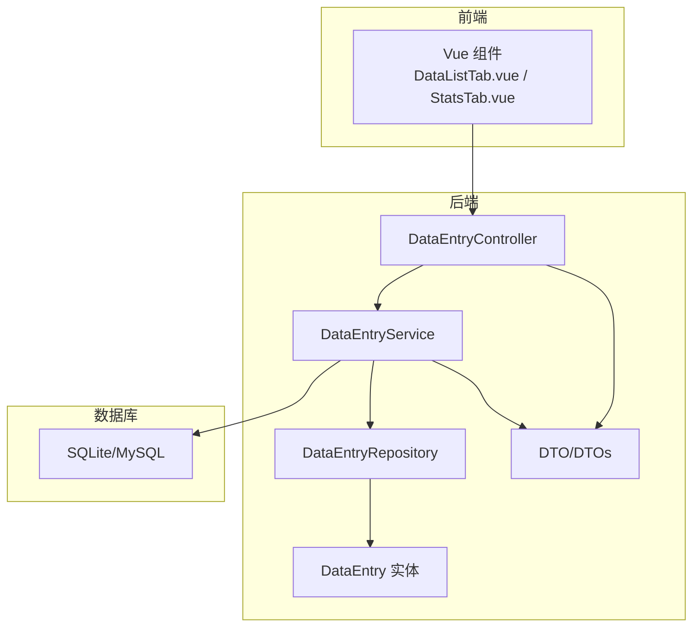
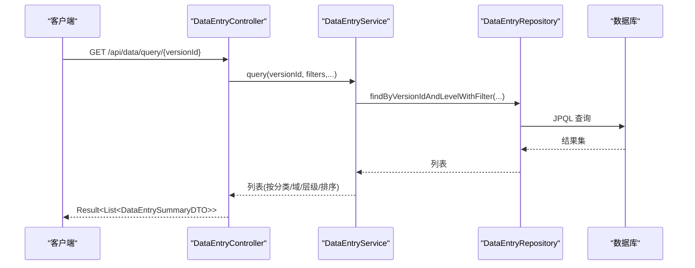
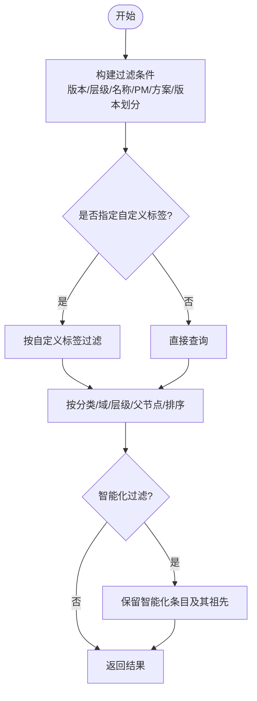
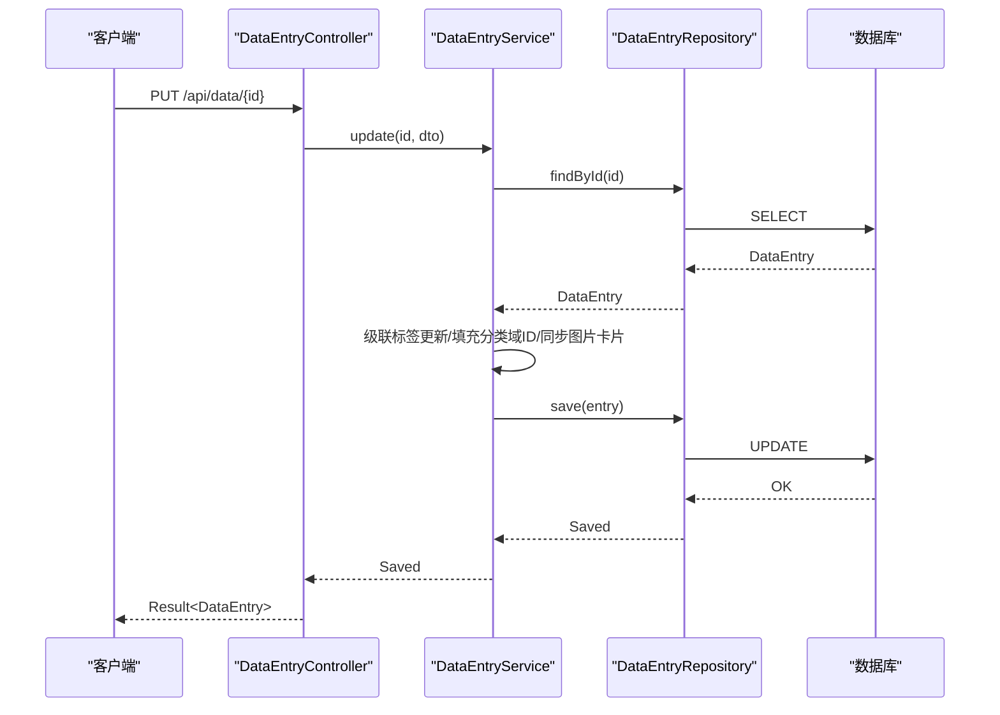
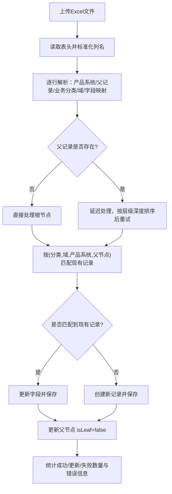
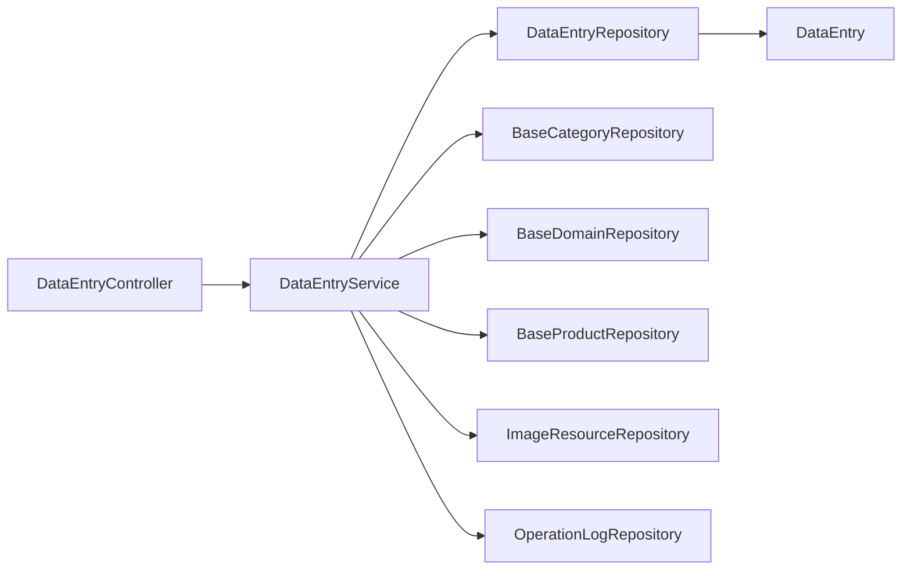

# 数据实体管理

<cite>
**本文引用的文件**
- [DataEntry.java](file://src/main/java/com/superpower/modules/data/entity/DataEntry.java)
- [DataEntryDTO.java](file://src/main/java/com/superpower/modules/data/dto/DataEntryDTO.java)
- [DataEntrySummaryDTO.java](file://src/main/java/com/superpower/modules/data/dto/DataEntrySummaryDTO.java)
- [TreeNodeDTO.java](file://src/main/java/com/superpower/modules/data/dto/TreeNodeDTO.java)
- [ExcelImportResult.java](file://src/main/java/com/superpower/modules/data/dto/ExcelImportResult.java)
- [DataEntryRepository.java](file://src/main/java/com/superpower/modules/data/repository/DataEntryRepository.java)
- [DataEntryService.java](file://src/main/java/com/superpower/modules/data/service/DataEntryService.java)
- [DataEntryController.java](file://src/main/java/com/superpower/modules/data/controller/DataEntryController.java)
- [import_excel.py](file://import_excel.py)
- [generate_word.py](file://generate_word.py)
</cite>

## 目录
1. [简介](#简介)
2. [项目结构](#项目结构)
3. [核心组件](#核心组件)
4. [架构总览](#架构总览)
5. [详细组件分析](#详细组件分析)
6. [依赖分析](#依赖分析)
7. [性能考虑](#性能考虑)
8. [故障排查指南](#故障排查指南)
9. [结论](#结论)
10. [附录](#附录)

## 简介
本技术文档围绕“数据实体管理”功能展开，聚焦于 DataEntry 核心数据实体的设计与实现，覆盖字段定义、数据类型选择、业务含义；详述增删改查、复杂查询条件构建、分页与排序策略；解释 Excel 导入导出机制、数据校验与批量处理策略；提供完整 API 接口说明（含批量操作、验证、冲突处理与事务管理）；并通过 DTO 转换、数据摘要统计与报表生成示例展示实际应用；最后总结缓存策略、性能优化与大数据量处理方案。

## 项目结构
该模块位于后端 Spring Boot 工程的 data 包下，采用经典的分层架构：
- 控制器层：DataEntryController 提供 REST API
- 服务层：DataEntryService 实现业务逻辑、事务控制与复杂流程
- 数据访问层：DataEntryRepository 基于 Spring Data JPA
- 实体与 DTO：DataEntry、DataEntryDTO、DataEntrySummaryDTO、TreeNodeDTO、ExcelImportResult
- Python 辅助工具：import_excel.py（批量导入）、generate_word.py（Word 报表生成）

图表来源
- [DataEntryController.java:27-413](file://src/main/java/com/superpower/modules/data/controller/DataEntryController.java#L27-L413)
- [DataEntryService.java:44-74](file://src/main/java/com/superpower/modules/data/service/DataEntryService.java#L44-L74)
- [DataEntryRepository.java:11-152](file://src/main/java/com/superpower/modules/data/repository/DataEntryRepository.java#L11-L152)
- [DataEntry.java:12-267](file://src/main/java/com/superpower/modules/data/entity/DataEntry.java#L12-L267)

章节来源
- [DataEntryController.java:27-413](file://src/main/java/com/superpower/modules/data/controller/DataEntryController.java#L27-L413)
- [DataEntryService.java:44-74](file://src/main/java/com/superpower/modules/data/service/DataEntryService.java#L44-L74)
- [DataEntryRepository.java:11-152](file://src/main/java/com/superpower/modules/data/repository/DataEntryRepository.java#L11-L152)
- [DataEntry.java:12-267](file://src/main/java/com/superpower/modules/data/entity/DataEntry.java#L12-L267)

## 核心组件
- DataEntry 实体：承载产品/系统清单的完整字段集合，支持层级结构、业务分类与域、排序、叶子节点标记、审批状态等。
- DataEntryDTO/DataEntrySummaryDTO：面向传输的轻量对象，前者用于创建/更新，后者用于列表摘要展示。
- TreeNodeDTO：树形结构节点，用于前端渲染树与导航。
- DataEntryRepository：基于命名查询与原生 JPQL 的复杂检索、聚合与过滤。
- DataEntryService：事务边界内的业务编排、Excel 导入、图片资源同步、层级修复、重编号、复制/移动等。
- DataEntryController：REST API 入口，负责参数校验、权限检查、日志记录与响应封装。

章节来源
- [DataEntry.java:12-267](file://src/main/java/com/superpower/modules/data/entity/DataEntry.java#L12-L267)
- [DataEntryDTO.java:6-65](file://src/main/java/com/superpower/modules/data/dto/DataEntryDTO.java#L6-L65)
- [DataEntrySummaryDTO.java:9-123](file://src/main/java/com/superpower/modules/data/dto/DataEntrySummaryDTO.java#L9-L123)
- [TreeNodeDTO.java:6-16](file://src/main/java/com/superpower/modules/data/dto/TreeNodeDTO.java#L6-L16)
- [DataEntryRepository.java:11-152](file://src/main/java/com/superpower/modules/data/repository/DataEntryRepository.java#L11-L152)
- [DataEntryService.java:44-74](file://src/main/java/com/superpower/modules/data/service/DataEntryService.java#L44-L74)
- [DataEntryController.java:27-413](file://src/main/java/com/superpower/modules/data/controller/DataEntryController.java#L27-L413)

## 架构总览
数据实体管理遵循典型的 MVC + 分层架构，控制器负责请求接入与响应封装，服务层承担业务规则与事务控制，仓库层抽象持久化访问，实体模型映射数据库表结构。复杂查询通过 JPQL 与原生 SQL 实现，同时结合 DTO 进行前后端数据转换。

图表来源
- [DataEntryController.java:115-131](file://src/main/java/com/superpower/modules/data/controller/DataEntryController.java#L115-L131)
- [DataEntryService.java:204-240](file://src/main/java/com/superpower/modules/data/service/DataEntryService.java#L204-L240)
- [DataEntryRepository.java:22-37](file://src/main/java/com/superpower/modules/data/repository/DataEntryRepository.java#L22-L37)

## 详细组件分析

### DataEntry 实体设计与字段语义
- 主键与版本：id 自增主键；versionId 关联版本维度。
- 层级与父子：level 表示层级；parentId 指向父节点；isLeaf 标记是否叶子；sortOrder 控制同级顺序。
- 审批状态：approvalStatus 默认“待提交”，用于流程控制。
- 业务维度：colBizCategory、colBizDomain、categoryId、domainId 映射基础分类与域。
- 产品标识：colProductSystem、colProductSysId、colModuleId、productId。
- 文档与图片：colFeatureDesc、colBidParamDesc、多张控标点截图字段、软著、备注等。
- 财务与销售：各财年金额、研发成本合计、销量、出厂价等。
- 元信息：创建/更新时间、更新人等。

字段类型选择与业务含义要点
- 字符串类：大量 TEXT 字段用于富文本描述与长文本存储，长度限制用于索引友好性。
- 数值类：BigDecimal 用于财务金额，Integer 用于销量与排序序号。
- 时间类：LocalDateTime 记录创建与更新时间。
- 布尔语义：通过字符串“是/否/1/0”或业务标签表达布尔含义（如智能化标记）。

章节来源
- [DataEntry.java:12-267](file://src/main/java/com/superpower/modules/data/entity/DataEntry.java#L12-L267)

### DTO 转换与摘要统计
- DataEntryDTO：用于创建/更新的最小必要字段集合，便于前后端契约稳定。
- DataEntrySummaryDTO：列表摘要展示字段集合，减少传输体积。
- TreeNodeDTO：树节点结构，包含 id、parentId、level、label、sortOrder、isLeaf、children。
- DTO 转换：服务层将实体转换为摘要 DTO 返回，避免暴露敏感字段。

章节来源
- [DataEntryDTO.java:6-65](file://src/main/java/com/superpower/modules/data/dto/DataEntryDTO.java#L6-L65)
- [DataEntrySummaryDTO.java:9-123](file://src/main/java/com/superpower/modules/data/dto/DataEntrySummaryDTO.java#L9-L123)
- [TreeNodeDTO.java:6-16](file://src/main/java/com/superpower/modules/data/dto/TreeNodeDTO.java#L6-L16)

### 复杂查询与排序策略
- 多维过滤：支持按版本、层级、名称模糊匹配、产品经理、解决方案标记、版本划分等条件组合过滤。
- 树形查询：按 level=1 的根节点构建树，再递归查询子节点；支持按分类/域顺序排序。
- 全量查询：支持自定义标签过滤、业务域/分类过滤、层级过滤、智能化过滤等。
- 排序策略：优先按分类/域排序，其次按层级、父节点、sortOrder 排序，确保稳定的展示顺序。

图表来源
- [DataEntryService.java:204-240](file://src/main/java/com/superpower/modules/data/service/DataEntryService.java#L204-L240)
- [DataEntryRepository.java:56-78](file://src/main/java/com/superpower/modules/data/repository/DataEntryRepository.java#L56-L78)

章节来源
- [DataEntryRepository.java:22-78](file://src/main/java/com/superpower/modules/data/repository/DataEntryRepository.java#L22-L78)
- [DataEntryService.java:271-285](file://src/main/java/com/superpower/modules/data/service/DataEntryService.java#L271-L285)

### 增删改查实现与事务管理
- 创建：自动分配排序序号、设置 isLeaf=true、若父节点存在则置为非叶子。
- 更新：支持级联标签更新（跨 L1/L2/L3 的一致性）、同步图片卡片文件名与 URL。
- 删除：支持单条与批量删除，自动收集子孙节点并一次性删除。
- 排序：支持拖拽排序与全量重排，按产品系统名称的数字前缀进行智能排序。
- 去重：支持按版本去重与深度去重（去除名称差异但核心部分相同的数据）。
- 层级修复：根据产品系统名称的数字前缀自动修正层级、父子关系与叶子标记。
- 移动/复制：支持移动到同域下级或同级相邻位置，自动调整排序与级联层级；支持复制并可选择克隆图片资源。

图表来源
- [DataEntryController.java:153-166](file://src/main/java/com/superpower/modules/data/controller/DataEntryController.java#L153-L166)
- [DataEntryService.java:318-334](file://src/main/java/com/superpower/modules/data/service/DataEntryService.java#L318-L334)
- [DataEntryRepository.java:11-152](file://src/main/java/com/superpower/modules/data/repository/DataEntryRepository.java#L11-L152)

章节来源
- [DataEntryController.java:133-166](file://src/main/java/com/superpower/modules/data/controller/DataEntryController.java#L133-L166)
- [DataEntryService.java:287-334](file://src/main/java/com/superpower/modules/data/service/DataEntryService.java#L287-L334)
- [DataEntryRepository.java:11-152](file://src/main/java/com/superpower/modules/data/repository/DataEntryRepository.java#L11-L152)

### Excel 导入与数据校验
- 文件解析：使用 Apache POI 读取 Excel 第一个工作表，第一行为表头。
- 列映射：将表头标准化（如“招标参数/说明”、“解决方案标记/其他解决方案标记”），映射到实体字段。
- 数据清洗：清理多行文本、规范化数字前缀、默认产品经理为空时填充“未指定”。
- 层级推断：根据产品系统名称的数字前缀推断层级；父记录缺失时延迟处理并按层级深度排序后重试。
- 去重与更新：按业务分类、业务域、产品系统与父节点匹配现有记录，存在则更新，否则新增。
- 事务与幂等：导入过程在事务内执行，失败时回滚；重复导入同一版本会覆盖旧数据。

图表来源
- [DataEntryService.java:1782-2014](file://src/main/java/com/superpower/modules/data/service/DataEntryService.java#L1782-L2014)
- [import_excel.py:88-256](file://import_excel.py#L88-L256)

章节来源
- [DataEntryService.java:1782-2014](file://src/main/java/com/superpower/modules/data/service/DataEntryService.java#L1782-L2014)
- [import_excel.py:88-256](file://import_excel.py#L88-L256)

### 报表生成与图片资源同步
- 预览 HTML：根据条目构建导航与正文，支持“功能说明/招标参数”两种模式，自动识别图片卡片与 URL，生成带编号的目录与图片网格。
- Word 报表：Python 脚本读取 Excel，按业务分类/域/层级生成带编号的 Word 文档，自动下载并插入图片，处理竖版截图与错误提示。
- 图片资源同步：当条目分类/域/产品变更时，同步图片资源的分类/域/产品信息与文件路径，事务完成后异步移动物理文件，保证一致性。

章节来源
- [DataEntryService.java:2076-2833](file://src/main/java/com/superpower/modules/data/service/DataEntryService.java#L2076-L2833)
- [generate_word.py:584-674](file://generate_word.py#L584-L674)

### API 接口文档
- 获取树形结构
  - GET /api/data/tree/{versionId}?name=&status=[]&productManager=&solution=&versionTag=
  - 返回：Result<List<TreeNodeDTO>>
- 获取子节点
  - GET /api/data/children/{versionId}/{parentId}?name=&status=[]&productManager=&solution=&versionTag=
  - 返回：Result<List<DataEntry>>
- 获取详情
  - GET /api/data/{id}
  - 返回：Result<DataEntry>
- 预览（HTML）
  - GET /api/data/{id}/preview?mode=
  - 返回：HTML
- 预览下载（Word）
  - GET /api/data/{id}/preview-download?mode=&includeImages=
  - 返回：application/octet-stream
- 批量查询（摘要）
  - GET /api/data/query/{versionId}?customTabId=&name=&status=[]&productManager=&solution=&versionTag=&bizCategory=&bizDomain=&level=&intelligent=
  - 返回：Result<List<DataEntrySummaryDTO>>
- 新增
  - POST /api/data
  - 请求体：DataEntryDTO
  - 返回：Result<DataEntry>
- 更新
  - PUT /api/data/{id}
  - 请求体：DataEntryDTO
  - 返回：Result<DataEntry>
- 批量排序
  - PUT /api/data/sort
  - 请求体：[{id, sortOrder}, ...]
  - 返回：Result<Void>
- 全量重排
  - PUT /api/data/reorder/{versionId}
  - 返回：Result<Void>
- 去重
  - DELETE /api/data/dedup/{versionId}
  - 返回：Result<Integer>
- 深度去重
  - DELETE /api/data/dedup-deep/{versionId}
  - 返回：Result<Integer>
- 层级提升/下降
  - PUT /api/data/{id}/level-up
  - PUT /api/data/{id}/level-down
  - 返回：Result<Void>
- 上移/下移
  - PUT /api/data/{id}/move-up
  - PUT /api/data/{id}/move-down
  - 返回：Result<Void>
- 移动到下级/同级
  - PUT /api/data/{id}/move-to-parent
  - PUT /api/data/{id}/move-to-sibling
  - 请求体：{newParentId/targetId}
  - 返回：Result<Void>
- 删除
  - DELETE /api/data/{id}
  - 返回：Result<Void>
- 批量删除
  - POST /api/data/batch-delete?versionId=&ids[]
  - 返回：Result<Void>
- 获取域树
  - GET /api/data/domain-tree/{versionId}?domainId=&categoryId=
  - 返回：Result<List<TreeNodeDTO>>
- 获取子树
  - GET /api/data/sub-tree/{versionId}/{parentId}
  - 返回：Result<List<TreeNodeDTO>>
- 批量修改分类/域/产品
  - PUT /api/data/batch-category
  - 请求体：{versionId, entryIds[], categoryId, domainId, productId, parentId}
  - 返回：Result<Integer>
- 修复层级结构
  - PUT /api/data/fix-hierarchy/{versionId}
  - 返回：Result<Map<String,Object>>
- 重编号
  - PUT /api/data/renumber
  - 请求体：{items:[{entryId,newPrefix,newName?}]}
  - 返回：Result<Void>
- 复制条目
  - POST /api/data/entries/copy
  - 请求体：{sourceIds[], targetId, mode=("child"|"sibling"), customTabId?}
  - 返回：Result<Void>
- 移动条目
  - POST /api/data/entries/move
  - 请求体：{sourceIds[], targetId, mode=("child"|"sibling"), customTabId?}
  - 返回：Result<Void>
- Excel 导入
  - POST /api/data/import-excel?versionId=&file=
  - 返回：Result<ExcelImportResult>

章节来源
- [DataEntryController.java:58-413](file://src/main/java/com/superpower/modules/data/controller/DataEntryController.java#L58-L413)
- [ExcelImportResult.java:7-15](file://src/main/java/com/superpower/modules/data/dto/ExcelImportResult.java#L7-L15)

## 依赖分析
- 控制器依赖服务层，服务层依赖仓库层与基础数据仓库（分类/域/产品/用户/图片资源），仓库层依赖 JPA/Hibernate 与数据库。
- 实体与 DTO 之间通过服务层进行转换，避免控制器直接暴露实体细节。
- 导入与导出流程分别由 Java 服务与 Python 脚本支撑，形成前后端协作的完整闭环。

图表来源
- [DataEntryController.java:31-45](file://src/main/java/com/superpower/modules/data/controller/DataEntryController.java#L31-L45)
- [DataEntryService.java:47-74](file://src/main/java/com/superpower/modules/data/service/DataEntryService.java#L47-L74)
- [DataEntryRepository.java:11-152](file://src/main/java/com/superpower/modules/data/repository/DataEntryRepository.java#L11-L152)

章节来源
- [DataEntryController.java:31-45](file://src/main/java/com/superpower/modules/data/controller/DataEntryController.java#L31-L45)
- [DataEntryService.java:47-74](file://src/main/java/com/superpower/modules/data/service/DataEntryService.java#L47-L74)
- [DataEntryRepository.java:11-152](file://src/main/java/com/superpower/modules/data/repository/DataEntryRepository.java#L11-L152)

## 性能考虑
- 查询优化
  - 使用 JPQL 与 LEFT JOIN 优化树形与多维过滤查询，避免 N+1 查询。
  - 通过分类/域排序映射与 COALESCE 排序，减少排序开销。
- 排序与分页
  - 使用 sortOrder 字段与层级/父节点组合排序，确保稳定顺序。
  - 大数据量场景建议前端分页与服务端分页结合，避免一次性加载过多数据。
- 事务与批量
  - 批量删除/移动/复制使用一次性收集与批量保存，降低事务开销。
  - 图片文件移动采用 afterCommit 同步策略，避免事务回滚导致的不一致。
- 缓存策略
  - 建议对分类/域排序映射进行短期缓存，减少重复查询。
  - 对常用树结构与过滤结果进行缓存（需注意版本切换时的失效策略）。

## 故障排查指南
- 版本状态限制
  - 已发版版本禁止修改清单，需先切换到草稿状态。
- 层级与父子关系异常
  - 使用“修复层级结构”接口自动修正层级、父子关系与叶子标记。
- 图片资源不一致
  - 同步图片分类/域/产品信息后，事务提交后再移动物理文件；若出现不一致，检查 afterCommit 日志。
- 导入失败
  - 检查 Excel 表头标准化、父记录匹配、数值字段转换与重复项处理。
- 预览/导出异常
  - 检查图片 URL 编码、网络可达性与 Word 模板渲染逻辑。

章节来源
- [DataEntryService.java:650-656](file://src/main/java/com/superpower/modules/data/service/DataEntryService.java#L650-L656)
- [DataEntryService.java:2644-2776](file://src/main/java/com/superpower/modules/data/service/DataEntryService.java#L2644-L2776)
- [DataEntryService.java:1433-1451](file://src/main/java/com/superpower/modules/data/service/DataEntryService.java#L1433-L1451)
- [DataEntryService.java:1864-1867](file://src/main/java/com/superpower/modules/data/service/DataEntryService.java#L1864-L1867)
- [generate_word.py:135-161](file://generate_word.py#L135-L161)

## 结论
本模块以 DataEntry 为核心实体，围绕树形结构、多维过滤、批量操作与导入导出构建了完整的数据实体管理体系。通过严格的事务控制、DTO 转换与图片资源同步机制，实现了高一致性与可维护性。配合 Python 辅助工具，形成从前端到后端再到报表的完整链路。建议在生产环境中结合缓存与分页策略进一步优化性能，并持续完善异常监控与日志审计。

## 附录
- Python 导入脚本：import_excel.py
  - 功能：从 Excel 批量导入数据，自动推断层级、建立父子关系、写入数据库。
  - 适用场景：首次初始化或批量迁移。
- Python 报表脚本：generate_word.py
  - 功能：根据 Excel 生成 Word 报表，自动下载并插入图片，支持竖版截图网格布局。
  - 适用场景：文档生成与归档。

章节来源
- [import_excel.py:88-256](file://import_excel.py#L88-L256)
- [generate_word.py:584-674](file://generate_word.py#L584-L674)