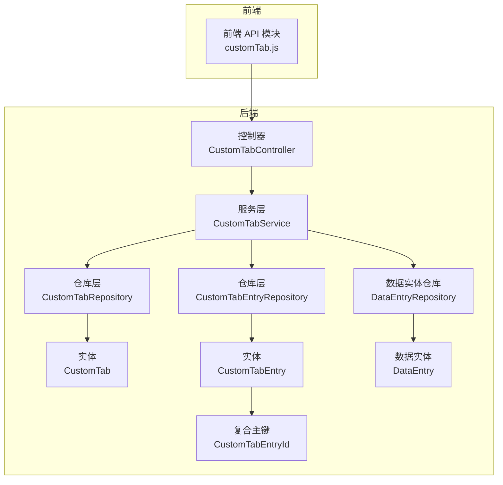
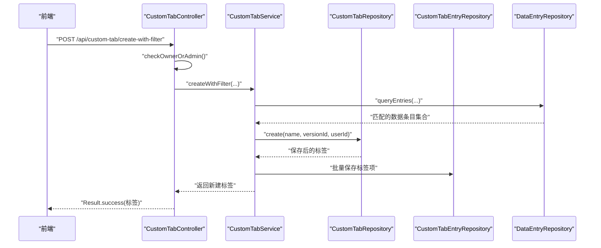
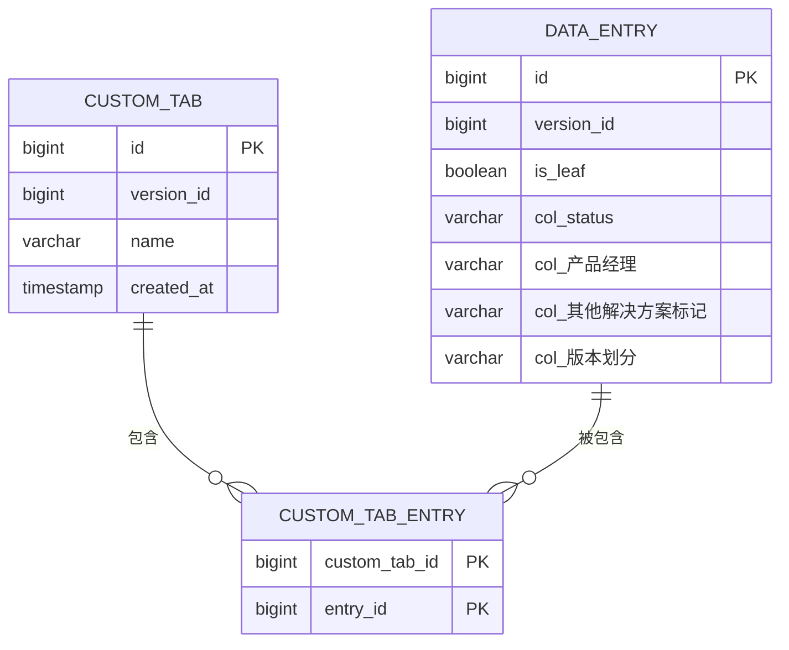
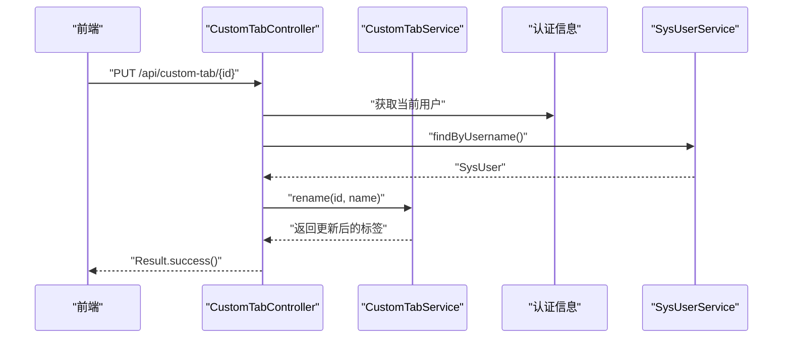
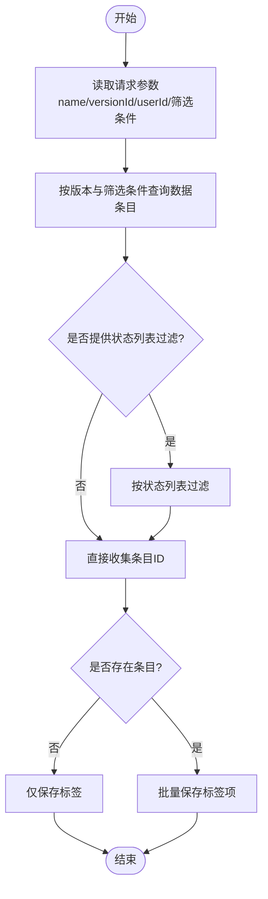
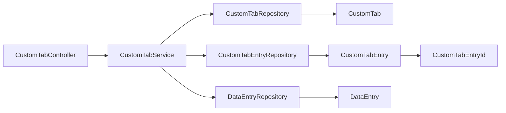

# 自定义标签系统

<cite>
**本文引用的文件**
- [CustomTab.java](file://src/main/java/com/superpower/modules/customtab/entity/CustomTab.java)
- [CustomTabEntry.java](file://src/main/java/com/superpower/modules/customtab/entity/CustomTabEntry.java)
- [CustomTabEntryId.java](file://src/main/java/com/superpower/modules/customtab/entity/CustomTabEntryId.java)
- [CustomTabController.java](file://src/main/java/com/superpower/modules/customtab/controller/CustomTabController.java)
- [CustomTabService.java](file://src/main/java/com/superpower/modules/customtab/service/CustomTabService.java)
- [CustomTabRepository.java](file://src/main/java/com/superpower/modules/customtab/repository/CustomTabRepository.java)
- [CustomTabEntryRepository.java](file://src/main/java/com/superpower/modules/customtab/repository/CustomTabEntryRepository.java)
- [customTab.js](file://frontend/src/api/customTab.js)
- [application.yml](file://src/main/resources/application.yml)
- [init.sql](file://src/main/resources/db/init.sql)
- [20260531_historical_schema_changes.sql](file://db_changes/20260531_historical_schema_changes.sql)
- [DataEntryRepository.java](file://src/main/java/com/superpower/modules/data/repository/DataEntryRepository.java)
- [DataEntry.java](file://src/main/java/com/superpower/modules/data/entity/DataEntry.java)
- [DataEntrySummaryDTO.java](file://src/main/java/com/superpower/modules/data/dto/DataEntrySummaryDTO.java)
- [CustomTabServiceTest.java](file://src/test/java/com/superpower/modules/customtab/service/CustomTabServiceTest.java)
</cite>

## 目录
1. [简介](#简介)
2. [项目结构](#项目结构)
3. [核心组件](#核心组件)
4. [架构总览](#架构总览)
5. [详细组件分析](#详细组件分析)
6. [依赖分析](#依赖分析)
7. [性能考虑](#性能考虑)
8. [故障排查指南](#故障排查指南)
9. [结论](#结论)
10. [附录](#附录)

## 简介
本文件为“自定义标签系统”的技术文档，围绕 CustomTab 与 CustomTabEntry 实体的设计理念与实现进行深入解析，覆盖标签定义、标签项关联、数据模型关系、创建/编辑/删除/查询、标签树形结构管理与动态标签生成机制、标签与数据实体的关联映射策略（含多对多关系与搜索优化）、完整 API 接口文档（含批量操作与聚合统计思路）、扩展性设计、权限控制、实时同步、缓存策略、性能监控与可维护性设计。

## 项目结构
自定义标签系统位于后端 Spring Boot 模块中，采用分层架构：controller 层负责权限校验与请求编排；service 层封装业务逻辑与事务边界；repository 层提供数据访问；JPA 实体定义数据模型；前端通过统一的 API 模块对接后端。

图表来源
- [CustomTabController.java:1-104](file://src/main/java/com/superpower/modules/customtab/controller/CustomTabController.java#L1-L104)
- [CustomTabService.java:1-111](file://src/main/java/com/superpower/modules/customtab/service/CustomTabService.java#L1-L111)
- [CustomTabRepository.java:1-22](file://src/main/java/com/superpower/modules/customtab/repository/CustomTabRepository.java#L1-L22)
- [CustomTabEntryRepository.java:1-27](file://src/main/java/com/superpower/modules/customtab/repository/CustomTabEntryRepository.java#L1-L27)
- [CustomTab.java:1-28](file://src/main/java/com/superpower/modules/customtab/entity/CustomTab.java#L1-L28)
- [CustomTabEntry.java:1-21](file://src/main/java/com/superpower/modules/customtab/entity/CustomTabEntry.java#L1-L21)
- [CustomTabEntryId.java:1-16](file://src/main/java/com/superpower/modules/customtab/entity/CustomTabEntryId.java#L1-L16)
- [DataEntryRepository.java](file://src/main/java/com/superpower/modules/data/repository/DataEntryRepository.java)
- [DataEntry.java](file://src/main/java/com/superpower/modules/data/entity/DataEntry.java)

章节来源
- [CustomTabController.java:1-104](file://src/main/java/com/superpower/modules/customtab/controller/CustomTabController.java#L1-L104)
- [CustomTabService.java:1-111](file://src/main/java/com/superpower/modules/customtab/service/CustomTabService.java#L1-L111)
- [CustomTabRepository.java:1-22](file://src/main/java/com/superpower/modules/customtab/repository/CustomTabRepository.java#L1-L22)
- [CustomTabEntryRepository.java:1-27](file://src/main/java/com/superpower/modules/customtab/repository/CustomTabEntryRepository.java#L1-L27)
- [CustomTab.java:1-28](file://src/main/java/com/superpower/modules/customtab/entity/CustomTab.java#L1-L28)
- [CustomTabEntry.java:1-21](file://src/main/java/com/superpower/modules/customtab/entity/CustomTabEntry.java#L1-L21)
- [CustomTabEntryId.java:1-16](file://src/main/java/com/superpower/modules/customtab/entity/CustomTabEntryId.java#L1-L16)
- [DataEntryRepository.java](file://src/main/java/com/superpower/modules/data/repository/DataEntryRepository.java)
- [DataEntry.java](file://src/main/java/com/superpower/modules/data/entity/DataEntry.java)

## 核心组件
- 实体层
  - CustomTab：自定义标签定义，包含版本号、名称、创建时间等字段。
  - CustomTabEntry：标签与数据条目的多对多关联，使用复合主键。
  - CustomTabEntryId：复合主键类，由 custom_tab_id 与 entry_id 组成。
- 仓储层
  - CustomTabRepository：按版本查询标签列表、去重校验、按版本批量删除等。
  - CustomTabEntryRepository：按标签查询条目、按标签批量清理、按标签+条目删除。
- 服务层
  - CustomTabService：创建标签、按筛选条件动态生成标签项、重命名、删除、批量添加/移除标签项。
- 控制器层
  - CustomTabController：鉴权与权限校验（仅创建人或管理员），提供标签 CRUD 与标签项增删改查 API。
- 前端 API
  - customTab.js：封装后端 REST 接口调用，供前端组件使用。

章节来源
- [CustomTab.java:1-28](file://src/main/java/com/superpower/modules/customtab/entity/CustomTab.java#L1-L28)
- [CustomTabEntry.java:1-21](file://src/main/java/com/superpower/modules/customtab/entity/CustomTabEntry.java#L1-L21)
- [CustomTabEntryId.java:1-16](file://src/main/java/com/superpower/modules/customtab/entity/CustomTabEntryId.java#L1-L16)
- [CustomTabRepository.java:1-22](file://src/main/java/com/superpower/modules/customtab/repository/CustomTabRepository.java#L1-L22)
- [CustomTabEntryRepository.java:1-27](file://src/main/java/com/superpower/modules/customtab/repository/CustomTabEntryRepository.java#L1-L27)
- [CustomTabService.java:1-111](file://src/main/java/com/superpower/modules/customtab/service/CustomTabService.java#L1-L111)
- [CustomTabController.java:1-104](file://src/main/java/com/superpower/modules/customtab/controller/CustomTabController.java#L1-L104)
- [customTab.js:1-30](file://frontend/src/api/customTab.js#L1-L30)

## 架构总览
系统遵循典型的三层架构：前端通过 HTTP 调用后端 API；控制器负责鉴权与参数校验；服务层封装业务规则与事务；仓储层负责数据持久化；JPA 实体映射数据库表。

图表来源
- [CustomTabController.java:50-63](file://src/main/java/com/superpower/modules/customtab/controller/CustomTabController.java#L50-L63)
- [CustomTabService.java:31-53](file://src/main/java/com/superpower/modules/customtab/service/CustomTabService.java#L31-L53)
- [DataEntryRepository.java](file://src/main/java/com/superpower/modules/data/repository/DataEntryRepository.java)
- [CustomTabRepository.java:1-22](file://src/main/java/com/superpower/modules/customtab/repository/CustomTabRepository.java#L1-L22)
- [CustomTabEntryRepository.java:1-27](file://src/main/java/com/superpower/modules/customtab/repository/CustomTabEntryRepository.java#L1-L27)

## 详细组件分析

### 数据模型与关系
- 实体关系
  - CustomTab：一个版本下可有多个标签，标签由用户创建。
  - CustomTabEntry：标签与数据条目之间的多对多关联，使用复合主键保证唯一性。
- 关系图

图表来源
- [CustomTab.java:1-28](file://src/main/java/com/superpower/modules/customtab/entity/CustomTab.java#L1-L28)
- [CustomTabEntry.java:1-21](file://src/main/java/com/superpower/modules/customtab/entity/CustomTabEntry.java#L1-L21)
- [init.sql:68-125](file://src/main/resources/db/init.sql#L68-L125)
- [20260531_historical_schema_changes.sql:41-55](file://db_changes/20260531_historical_schema_changes.sql#L41-L55)

章节来源
- [CustomTab.java:1-28](file://src/main/java/com/superpower/modules/customtab/entity/CustomTab.java#L1-L28)
- [CustomTabEntry.java:1-21](file://src/main/java/com/superpower/modules/customtab/entity/CustomTabEntry.java#L1-L21)
- [init.sql:68-125](file://src/main/resources/db/init.sql#L68-L125)
- [20260531_historical_schema_changes.sql:41-55](file://db_changes/20260531_historical_schema_changes.sql#L41-L55)

### 权限控制与鉴权流程
- 控制器在关键操作前进行权限校验：
  - 仅标签创建者或管理员可执行删除/重命名。
  - 通过认证主体获取当前用户 ID，并与标签所属用户比对。
- 鉴权序列图

图表来源
- [CustomTabController.java:36-43](file://src/main/java/com/superpower/modules/customtab/controller/CustomTabController.java#L36-L43)
- [CustomTabService.java:77-85](file://src/main/java/com/superpower/modules/customtab/service/CustomTabService.java#L77-L85)

章节来源
- [CustomTabController.java:36-43](file://src/main/java/com/superpower/modules/customtab/controller/CustomTabController.java#L36-L43)
- [CustomTabService.java:77-85](file://src/main/java/com/superpower/modules/customtab/service/CustomTabService.java#L77-L85)

### 动态标签生成机制
- 服务层支持“基于筛选条件创建标签”，流程如下：
  - 根据版本号与筛选条件查询数据条目集合。
  - 对状态列表进行过滤。
  - 将匹配的条目 ID 批量写入标签项关联表。
- 流程图

图表来源
- [CustomTabService.java:31-53](file://src/main/java/com/superpower/modules/customtab/service/CustomTabService.java#L31-L53)
- [DataEntryRepository.java](file://src/main/java/com/superpower/modules/data/repository/DataEntryRepository.java)

章节来源
- [CustomTabService.java:31-53](file://src/main/java/com/superpower/modules/customtab/service/CustomTabService.java#L31-L53)
- [DataEntryRepository.java](file://src/main/java/com/superpower/modules/data/repository/DataEntryRepository.java)

### 标签项的增删改查与批量操作
- 增加标签项
  - 去重插入：先查询已有条目 ID 集合，跳过重复后再保存。
- 删除标签项
  - 支持单条删除与批量删除（通过仓储提供的 IN 查询）。
- 查询标签项
  - 提供按标签查询所有条目 ID 的方法。
- 批量操作
  - 前端提供批量添加标签项的接口，后端按需扩展批量删除接口。

章节来源
- [CustomTabEntryRepository.java:14-26](file://src/main/java/com/superpower/modules/customtab/repository/CustomTabEntryRepository.java#L14-L26)
- [CustomTabService.java:92-109](file://src/main/java/com/superpower/modules/customtab/service/CustomTabService.java#L92-L109)
- [customTab.js:23-29](file://frontend/src/api/customTab.js#L23-L29)

### 标签与数据实体的关联映射策略
- 多对多关系
  - 使用中间表 custom_tab_entry 维护标签与数据条目的多对多关系。
- 搜索优化
  - 在服务层根据版本号与筛选条件一次性查询匹配条目，避免多次往返数据库。
  - 可在数据条目表上建立索引以提升筛选效率（建议在 col_status、col_产品经理、col_其他解决方案标记、col_版本划分等高频筛选字段上建立索引）。

章节来源
- [CustomTabEntry.java:1-21](file://src/main/java/com/superpower/modules/customtab/entity/CustomTabEntry.java#L1-L21)
- [CustomTabEntryRepository.java:14-26](file://src/main/java/com/superpower/modules/customtab/repository/CustomTabEntryRepository.java#L14-L26)
- [init.sql:68-125](file://src/main/resources/db/init.sql#L68-L125)

### API 接口文档
- 获取标签列表
  - GET /api/custom-tab/{versionId}
  - 返回指定版本下的标签列表
- 创建标签
  - POST /api/custom-tab
  - 请求体包含 name、versionId、userId（可选）
- 基于筛选条件创建标签
  - POST /api/custom-tab/create-with-filter
  - 请求体包含 name、versionId、userId（可选）、entryName、statusList、productManager、solution、versionTag
- 删除标签
  - DELETE /api/custom-tab/{id}
  - 仅创建人或管理员可操作
- 重命名标签
  - PUT /api/custom-tab/{id}
  - 请求体包含 name
- 批量添加标签项
  - POST /api/custom-tab/{id}/entries
  - 请求体包含 entryIds 数组
- 移除标签项
  - DELETE /api/custom-tab/{id}/entries/{entryId}

章节来源
- [CustomTabController.java:45-102](file://src/main/java/com/superpower/modules/customtab/controller/CustomTabController.java#L45-L102)
- [customTab.js:1-30](file://frontend/src/api/customTab.js#L1-L30)

### 扩展性设计
- 模块化
  - 控制器、服务、仓储职责清晰，便于独立扩展与替换。
- 复合主键
  - 使用 CustomTabEntryId 明确区分标签与条目 ID，降低耦合度。
- 事务边界
  - 关键操作（创建、删除、批量添加）均在事务内执行，保证一致性。
- 可扩展筛选
  - createWithFilter 方法预留筛选参数，便于后续扩展更多维度。

章节来源
- [CustomTabEntryId.java:1-16](file://src/main/java/com/superpower/modules/customtab/entity/CustomTabEntryId.java#L1-L16)
- [CustomTabService.java:31-53](file://src/main/java/com/superpower/modules/customtab/service/CustomTabService.java#L31-L53)

### 标签树形结构管理
- 当前实现聚焦“标签-条目”多对多关系，未见专门的树形结构实体。
- 若需要树形结构，可在 CustomTab 中增加 parentId 字段，并在服务层提供层级构建与查询能力；同时在前端渲染 TreePanel 组件时按层级展开。

章节来源
- [CustomTab.java:1-28](file://src/main/java/com/superpower/modules/customtab/entity/CustomTab.java#L1-L28)
- [TreePanel.vue](file://frontend/src/components/TreePanel.vue)

### 标签数据的实时同步
- 后端通过事务保障标签项的原子性写入。
- 前端在调用批量添加/删除接口后，应刷新本地缓存或重新拉取标签列表，确保视图一致。
- 可引入消息队列或 WebSocket 实现实时通知（建议在后续版本扩展）。

章节来源
- [CustomTabService.java:92-109](file://src/main/java/com/superpower/modules/customtab/service/CustomTabService.java#L92-L109)
- [customTab.js:23-29](file://frontend/src/api/customTab.js#L23-L29)

### 缓存策略与性能监控
- 缓存策略
  - 标签列表：按版本维度缓存，版本切换时失效。
  - 标签项：按标签 ID 缓存条目集合，批量操作后失效。
- 性能监控
  - 建议在服务层埋点统计 createWithFilter 的查询耗时与批量写入耗时。
  - 在仓储层开启慢查询日志（SQLite 可通过日志配置）。

章节来源
- [application.yml:1-40](file://src/main/resources/application.yml#L1-L40)

## 依赖分析
- 组件耦合
  - 控制器依赖服务层与用户服务；服务层依赖仓储层与数据实体仓库；仓储层依赖 JPA。
- 外部依赖
  - SQLite 数据库、Spring Data JPA、Spring Security。
- 循环依赖
  - 未发现循环依赖迹象，分层清晰。

图表来源
- [CustomTabController.java:1-104](file://src/main/java/com/superpower/modules/customtab/controller/CustomTabController.java#L1-L104)
- [CustomTabService.java:1-111](file://src/main/java/com/superpower/modules/customtab/service/CustomTabService.java#L1-L111)
- [CustomTabRepository.java:1-22](file://src/main/java/com/superpower/modules/customtab/repository/CustomTabRepository.java#L1-L22)
- [CustomTabEntryRepository.java:1-27](file://src/main/java/com/superpower/modules/customtab/repository/CustomTabEntryRepository.java#L1-L27)
- [CustomTab.java:1-28](file://src/main/java/com/superpower/modules/customtab/entity/CustomTab.java#L1-L28)
- [CustomTabEntry.java:1-21](file://src/main/java/com/superpower/modules/customtab/entity/CustomTabEntry.java#L1-L21)
- [CustomTabEntryId.java:1-16](file://src/main/java/com/superpower/modules/customtab/entity/CustomTabEntryId.java#L1-L16)
- [DataEntryRepository.java](file://src/main/java/com/superpower/modules/data/repository/DataEntryRepository.java)
- [DataEntry.java](file://src/main/java/com/superpower/modules/data/entity/DataEntry.java)

章节来源
- [CustomTabController.java:1-104](file://src/main/java/com/superpower/modules/customtab/controller/CustomTabController.java#L1-L104)
- [CustomTabService.java:1-111](file://src/main/java/com/superpower/modules/customtab/service/CustomTabService.java#L1-L111)
- [CustomTabRepository.java:1-22](file://src/main/java/com/superpower/modules/customtab/repository/CustomTabRepository.java#L1-L22)
- [CustomTabEntryRepository.java:1-27](file://src/main/java/com/superpower/modules/customtab/repository/CustomTabEntryRepository.java#L1-L27)
- [CustomTab.java:1-28](file://src/main/java/com/superpower/modules/customtab/entity/CustomTab.java#L1-L28)
- [CustomTabEntry.java:1-21](file://src/main/java/com/superpower/modules/customtab/entity/CustomTabEntry.java#L1-L21)
- [CustomTabEntryId.java:1-16](file://src/main/java/com/superpower/modules/customtab/entity/CustomTabEntryId.java#L1-L16)
- [DataEntryRepository.java](file://src/main/java/com/superpower/modules/data/repository/DataEntryRepository.java)
- [DataEntry.java](file://src/main/java/com/superpower/modules/data/entity/DataEntry.java)

## 性能考虑
- 数据库层面
  - 在 data_entry 的高频筛选字段上建立索引，如 col_status、col_产品经理、col_其他解决方案标记、col_版本划分。
  - 批量插入 custom_tab_entry 时使用批量写入策略，减少事务次数。
- 应用层面
  - 标签列表与标签项集合按版本/标签 ID 缓存，避免重复查询。
  - 对 createWithFilter 的查询结果进行分页或限制最大返回数量，防止超大数据集导致内存压力。
- 配置层面
  - SQLite 连接池大小与超时设置需根据并发量调整；生产环境建议使用更高性能的数据库。

章节来源
- [init.sql:68-125](file://src/main/resources/db/init.sql#L68-L125)
- [application.yml:18-30](file://src/main/resources/application.yml#L18-L30)
- [CustomTabService.java:31-53](file://src/main/java/com/superpower/modules/customtab/service/CustomTabService.java#L31-L53)

## 故障排查指南
- 常见异常
  - 清单名称已存在：创建/重命名时若同版本下名称冲突会抛出业务异常。
  - 清单不存在：查询详情或更新时若标签不存在会抛出业务异常。
  - 权限不足：非创建人或非管理员尝试删除/重命名标签会抛出业务异常。
- 单元测试参考
  - 测试用例覆盖了名称重复创建失败、正常创建成功、批量添加标签项、删除时级联清理等场景。
- 建议排查步骤
  - 检查版本号与名称组合是否唯一。
  - 确认当前用户是否为标签创建人或管理员。
  - 核对标签项 ID 是否存在于数据条目表中。

章节来源
- [CustomTabService.java:61-63](file://src/main/java/com/superpower/modules/customtab/service/CustomTabService.java#L61-L63)
- [CustomTabService.java:89-90](file://src/main/java/com/superpower/modules/customtab/service/CustomTabService.java#L89-L90)
- [CustomTabController.java:36-43](file://src/main/java/com/superpower/modules/customtab/controller/CustomTabController.java#L36-L43)
- [CustomTabServiceTest.java:32-77](file://src/test/java/com/superpower/modules/customtab/service/CustomTabServiceTest.java#L32-L77)

## 结论
自定义标签系统以清晰的分层架构与明确的实体关系实现了标签定义、筛选生成、标签项管理与权限控制。通过复合主键与事务保障数据一致性，结合前端 API 的统一调用，满足了多对多关联与动态筛选需求。建议后续在树形结构、实时同步、缓存与性能监控方面持续演进，以进一步提升用户体验与系统稳定性。

## 附录
- 数据模型补充
  - DataEntrySummaryDTO 用于数据条目的摘要映射，便于在标签筛选与展示时复用字段。

章节来源
- [DataEntrySummaryDTO.java:65-92](file://src/main/java/com/superpower/modules/data/dto/DataEntrySummaryDTO.java#L65-L92)