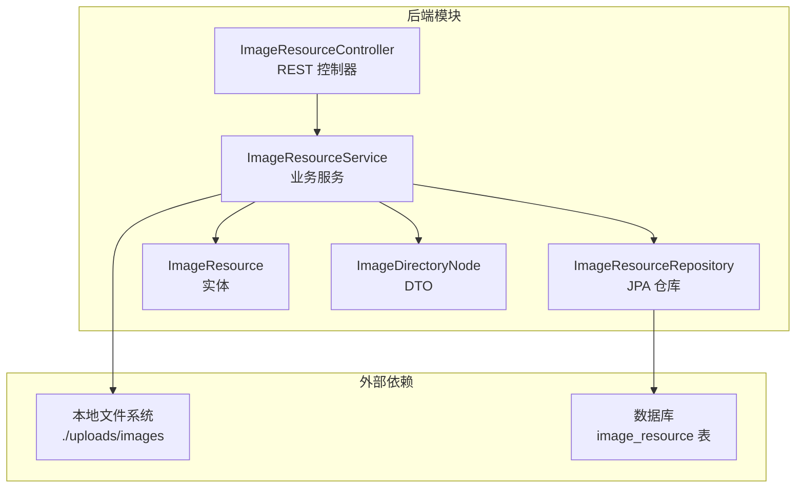
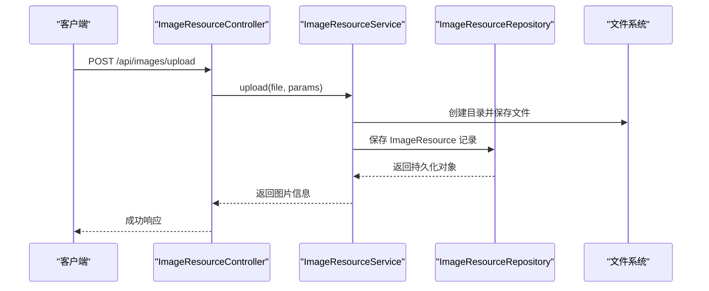
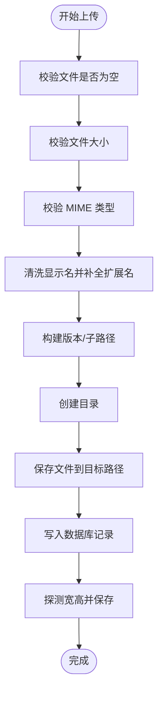
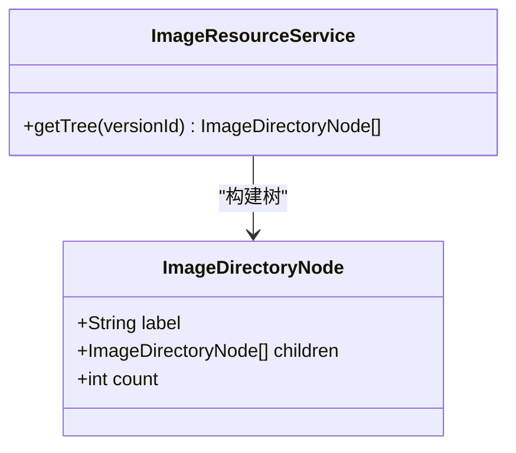
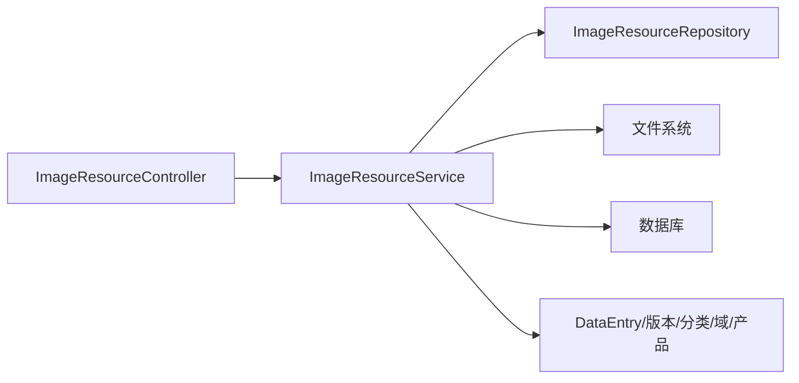

# 图床资源管理

<cite>
**本文引用的文件**
- [ImageResource.java](file://src/main/java/com/superpower/modules/image/entity/ImageResource.java)
- [ImageDirectoryNode.java](file://src/main/java/com/superpower/modules/image/dto/ImageDirectoryNode.java)
- [ImageResourceController.java](file://src/main/java/com/superpower/modules/image/controller/ImageResourceController.java)
- [ImageResourceService.java](file://src/main/java/com/superpower/modules/image/service/ImageResourceService.java)
- [ImageResourceRepository.java](file://src/main/java/com/superpower/modules/image/repository/ImageResourceRepository.java)
- [DataVersionService.java](file://src/main/java/com/superpower/modules/version/service/DataVersionService.java)
- [DataEntryService.java](file://src/main/java/com/superpower/modules/data/service/DataEntryService.java)
- [MaintenanceService.java](file://src/main/java/com/superpower/modules/system/service/MaintenanceService.java)
- [V1.0.9_fix_l3_images.sql](file://db_changes/V1.0.9_fix_l3_images.sql)
- [2026-06-09-sync-filename-plan.md](file://docs/superpowers/plans/2026-06-09-sync-filename-plan.md)
- [import_l3.py](file://import_l3.py)
- [import_shuzhidi.py](file://import_shuzhidi.py)
- [application.yml](file://src/main/resources/application.yml)
</cite>

## 目录
1. [引言](#引言)
2. [项目结构](#项目结构)
3. [核心组件](#核心组件)
4. [架构总览](#架构总览)
5. [详细组件分析](#详细组件分析)
6. [依赖分析](#依赖分析)
7. [性能考虑](#性能考虑)
8. [故障排查指南](#故障排查指南)
9. [结论](#结论)
10. [附录](#附录)

## 引言
本技术文档围绕图床资源管理系统进行系统性梳理，重点覆盖以下方面：
- ImageResource 实体设计与图片存储策略（文件命名、目录结构、访问路径）
- 图片上传处理流程（校验、格式限制、尺寸探测、存储落盘）
- 图片目录树结构实现（ImageDirectoryNode DTO、层级导航）
- 完整 API 接口定义（上传、下载、删除、批量操作、引用查询）
- 自动化导入流程（import_l3.py、import_shuzhidi.py）
- 缓存与 CDN 集成建议、性能优化措施
- 最佳实践与常见问题解决方案

## 项目结构
后端采用 Spring Boot + JPA 架构，图片模块位于 com.superpower.modules.image 包下，包含实体、DTO、仓库、服务与控制器。前端通过统一的 /api/images 前缀调用后端接口。

图表来源
- [ImageResourceController.java:1-152](file://src/main/java/com/superpower/modules/image/controller/ImageResourceController.java#L1-L152)
- [ImageResourceService.java:1-1304](file://src/main/java/com/superpower/modules/image/service/ImageResourceService.java#L1-L1304)
- [ImageResourceRepository.java:1-39](file://src/main/java/com/superpower/modules/image/repository/ImageResourceRepository.java#L1-L39)
- [ImageResource.java:1-59](file://src/main/java/com/superpower/modules/image/entity/ImageResource.java#L1-L59)
- [ImageDirectoryNode.java:1-11](file://src/main/java/com/superpower/modules/image/dto/ImageDirectoryNode.java#L1-L11)

章节来源
- [ImageResourceController.java:1-152](file://src/main/java/com/superpower/modules/image/controller/ImageResourceController.java#L1-L152)
- [ImageResourceService.java:1-1304](file://src/main/java/com/superpower/modules/image/service/ImageResourceService.java#L1-L1304)
- [ImageResourceRepository.java:1-39](file://src/main/java/com/superpower/modules/image/repository/ImageResourceRepository.java#L1-L39)
- [ImageResource.java:1-59](file://src/main/java/com/superpower/modules/image/entity/ImageResource.java#L1-L59)
- [ImageDirectoryNode.java:1-11](file://src/main/java/com/superpower/modules/image/dto/ImageDirectoryNode.java#L1-L11)

## 核心组件
- 实体 ImageResource：描述图片元数据（文件名、存储名、路径、URL、尺寸、MIME、归属分类/域/产品、版本号、上传人等）
- DTO ImageDirectoryNode：用于构建图片目录树（标签、子节点、计数）
- 仓库 ImageResourceRepository：基于 JPA 的查询接口
- 服务 ImageResourceService：上传、删除、重命名、替换文件、目录树构建、引用查询、异步迁移
- 控制器 ImageResourceController：对外暴露 REST API

章节来源
- [ImageResource.java:1-59](file://src/main/java/com/superpower/modules/image/entity/ImageResource.java#L1-L59)
- [ImageDirectoryNode.java:1-11](file://src/main/java/com/superpower/modules/image/dto/ImageDirectoryNode.java#L1-L11)
- [ImageResourceRepository.java:1-39](file://src/main/java/com/superpower/modules/image/repository/ImageResourceRepository.java#L1-L39)
- [ImageResourceService.java:1-1304](file://src/main/java/com/superpower/modules/image/service/ImageResourceService.java#L1-L1304)
- [ImageResourceController.java:1-152](file://src/main/java/com/superpower/modules/image/controller/ImageResourceController.java#L1-L152)

## 架构总览
系统采用分层架构：控制器负责请求接入与鉴权，服务层封装业务逻辑（含文件系统与数据库交互），仓库层负责数据持久化。上传时先写入文件系统，再写入数据库；删除时先删记录，再删文件；重命名时先更新数据库，再在事务完成后移动物理文件，并同步引用中的 URL/名称。

图表来源
- [ImageResourceController.java:52-65](file://src/main/java/com/superpower/modules/image/controller/ImageResourceController.java#L52-L65)
- [ImageResourceService.java:78-184](file://src/main/java/com/superpower/modules/image/service/ImageResourceService.java#L78-L184)
- [ImageResourceRepository.java:12-39](file://src/main/java/com/superpower/modules/image/repository/ImageResourceRepository.java#L12-L39)

## 详细组件分析

### 实体设计与存储策略
- 字段设计要点
  - filename：展示用文件名（可能不含扩展名）
  - storedName：实际存储文件名（含扩展名）
  - path：物理存储绝对路径
  - url：对外访问 URL（包含版本目录）
  - category/domain/product：三级分类标识
  - versionId：版本隔离
  - width/height：尺寸信息（上传时探测）
  - mimeType/size：媒体类型与字节数
  - uploadedBy：上传人
- 存储路径与访问路径
  - 默认存储根：由配置项指定（默认 ./uploads/images）
  - 路径结构：根目录/版本号/category/domain/product/文件名
  - URL 前缀：/api/images/file/ 或 /api/requirements/file/（需求类图片）
  - 版本目录：0 表示未绑定版本
- 文件命名规则
  - 优先使用用户提供的显示名，否则使用原始文件名
  - 清洗非法字符，确保扩展名正确拼接
  - 同一版本+目录下不允许同名文件
- 尺寸探测
  - 上传时读取图像尺寸并写入实体

章节来源
- [ImageResource.java:10-59](file://src/main/java/com/superpower/modules/image/entity/ImageResource.java#L10-L59)
- [ImageResourceService.java:78-184](file://src/main/java/com/superpower/modules/image/service/ImageResourceService.java#L78-L184)
- [application.yml](file://src/main/resources/application.yml)

### 图片上传处理流程
- 输入参数
  - file：必填，multipart 文件
  - category/domain/product/versionId/filename：可选
- 校验与清洗
  - 空文件校验
  - 大小限制（默认 5MB）
  - MIME 类型白名单（jpg/png/gif/webp）
  - 显示名清洗与扩展名补全
- 目录与路径
  - 按 category/domain/product 组合构建子路径
  - 需求类图片使用特殊存储根与 URL 前缀
  - 版本目录隔离
- 写入与记录
  - 创建目录并复制文件
  - 生成 url 与 path，写入数据库
  - 探测宽高并保存
- 错误处理
  - 目录创建失败、文件保存失败、重复文件名等异常均抛出业务异常

图表来源
- [ImageResourceService.java:78-184](file://src/main/java/com/superpower/modules/image/service/ImageResourceService.java#L78-L184)

章节来源
- [ImageResourceService.java:78-184](file://src/main/java/com/superpower/modules/image/service/ImageResourceService.java#L78-L184)

### 图片目录树结构与层级导航
- DTO 设计
  - label：显示文本（含计数）
  - children：子节点列表
  - count：该节点下的图片总数（直接+间接）
- 构建逻辑
  - 依据版本或全量数据提取 category/domain/product 层级
  - 统计每个产品的直接图片数量与间接引用数量（来自富文本描述）
  - 生成树形结构，支持三级展开
- 关键点
  - 间接引用统计基于 URL 匹配，排除直接图片集合
  - 产品维度按 L3 产品系统字段聚合

图表来源
- [ImageDirectoryNode.java:1-11](file://src/main/java/com/superpower/modules/image/dto/ImageDirectoryNode.java#L1-L11)
- [ImageResourceService.java:484-707](file://src/main/java/com/superpower/modules/image/service/ImageResourceService.java#L484-L707)

章节来源
- [ImageDirectoryNode.java:1-11](file://src/main/java/com/superpower/modules/image/dto/ImageDirectoryNode.java#L1-L11)
- [ImageResourceService.java:484-707](file://src/main/java/com/superpower/modules/image/service/ImageResourceService.java#L484-L707)

### API 接口文档
- 上传图片
  - 方法：POST
  - 路径：/api/images/upload
  - 参数：file（必填）、category、domain、product、versionId、filename
  - 权限：登录用户
  - 响应：返回新增的图片资源对象
- 获取目录树
  - 方法：GET
  - 路径：/api/images/tree
  - 参数：versionId（可选）
  - 响应：树形结构（ImageDirectoryNode 列表）
- 查询图片列表
  - 方法：GET
  - 路径：/api/images
  - 参数：category、domain、product、productId、versionId、includeReferenced（默认 true）
  - 响应：图片资源列表
- 删除单张图片
  - 方法：DELETE
  - 路径：/api/images/{id}
  - 权限：ADMIN
  - 响应：成功
- 批量删除
  - 方法：POST
  - 路径：/api/images/batch-delete
  - 权限：ADMIN
  - 请求体：id 列表
  - 响应：成功
- 更新图片信息（重命名/移动）
  - 方法：PUT
  - 路径：/api/images/{id}
  - 权限：登录用户
  - 请求体：可部分更新 filename/category/domain/product
  - 响应：更新后的图片资源
- 替换文件内容
  - 方法：PUT
  - 路径：/api/images/{id}/file
  - 权限：登录用户
  - 参数：file（必填）
  - 响应：更新后的图片资源
- 迁移外部图片任务
  - 方法：POST
  - 路径：/api/images/migrate-external-images
  - 权限：ADMIN
  - 请求体：DataEntry 主键列表
  - 响应：任务 ID
- 查询迁移进度
  - 方法：GET
  - 路径：/api/images/migrate-task/{taskId}
  - 响应：迁移进度对象
- 查询引用（当前版本）
  - 方法：GET
  - 路径：/api/images/{id}/references
  - 响应：引用该图片的 DataEntry 列表
- 查询全部版本引用
  - 方法：GET
  - 路径：/api/images/{id}/all-references
  - 响应：包含版本号的引用列表
- 批量查询引用
  - 方法：POST
  - 路径：/api/images/batch-references
  - 请求体：id 列表
  - 响应：id 到引用列表的映射
- 查询需求引用
  - 方法：GET
  - 路径：/api/images/{id}/req-references
  - 响应：引用该图片的 ReqItem 列表

章节来源
- [ImageResourceController.java:52-152](file://src/main/java/com/superpower/modules/image/controller/ImageResourceController.java#L52-L152)

### 自动化导入流程（Python 脚本）
- import_l3.py
  - 功能：导入 L3 产品体系相关图片数据，修正产品字段与路径
  - 影响：更新 image_resource 的 product、category、domain、url、path 字段
- import_shuzhidi.py
  - 功能：导入“数之堤”相关图片资源，建立与版本、产品的关系
  - 影响：批量写入 image_resource 记录，确保 URL 与路径正确
- 数据库脚本配合
  - V1.0.9_fix_l3_images.sql：针对特定图片修复 product 与路径，保证一致性
  - 作用：在导入后对历史数据进行纠偏，避免路径/URL 不一致

章节来源
- [import_l3.py](file://import_l3.py)
- [import_shuzhidi.py](file://import_shuzhidi.py)
- [V1.0.9_fix_l3_images.sql:151-153](file://db_changes/V1.0.9_fix_l3_images.sql#L151-L153)

### 引用同步与重命名机制
- 重命名策略
  - 先更新数据库（filename/storedName/url/path）
  - 在事务完成后移动物理文件
  - 同步引用中的 URL 与显示名（富文本卡片属性、img 标签、image-name）
- 一次性迁移
  - MaintenanceService 提供批量同步文件名能力
  - 逐条比对 storedName 与 filename 的期望值，必要时移动文件并更新引用

章节来源
- [ImageResourceService.java:294-400](file://src/main/java/com/superpower/modules/image/service/ImageResourceService.java#L294-L400)
- [2026-06-09-sync-filename-plan.md:10-44](file://docs/superpowers/plans/2026-06-09-sync-filename-plan.md#L10-L44)
- [MaintenanceService.java:521-552](file://src/main/java/com/superpower/modules/system/service/MaintenanceService.java#L521-L552)

### 版本迁移与路径重建
- DataVersionService 在版本复制/迁移时会同步更新图片 URL 与路径
- 依据存储根与版本号重建新路径，保持 URL 前缀不变

章节来源
- [DataVersionService.java:309-329](file://src/main/java/com/superpower/modules/version/service/DataVersionService.java#L309-L329)

## 依赖分析
- 控制器依赖服务与仓库，服务依赖仓库与文件系统
- 服务内部通过事务边界控制数据库与文件系统的原子性
- 目录树构建依赖 DataEntry 与版本/分类/域/产品数据

图表来源
- [ImageResourceController.java:23-38](file://src/main/java/com/superpower/modules/image/controller/ImageResourceController.java#L23-L38)
- [ImageResourceService.java:42-76](file://src/main/java/com/superpower/modules/image/service/ImageResourceService.java#L42-L76)

章节来源
- [ImageResourceController.java:23-38](file://src/main/java/com/superpower/modules/image/controller/ImageResourceController.java#L23-L38)
- [ImageResourceService.java:42-76](file://src/main/java/com/superpower/modules/image/service/ImageResourceService.java#L42-L76)

## 性能考虑
- 上传限制
  - 单文件大小上限与 MIME 白名单，降低无效请求与存储压力
- 目录结构
  - 按版本/分类/域/产品分层，便于清理与检索
- 引用查询
  - 直接查询与间接引用（富文本）分离，避免全表扫描
- 异步迁移
  - 外部图片迁移使用任务 ID 与进度对象，避免阻塞主线程
- 建议
  - 引入 CDN 与缓存：对高频访问图片启用 CDN 加速；对目录树与引用结果做短期缓存
  - 图片压缩与多尺寸：在上传时生成缩略图与适配尺寸，减少首屏加载时间
  - 分页与懒加载：列表接口支持分页与懒加载，降低前端渲染压力

## 故障排查指南
- 上传报错“文件大小不能超过 5MB”
  - 检查客户端是否超过阈值，或服务端配置是否被覆盖
- 报错“只允许上传 jpg/png/gif/webp”
  - 检查文件 MIME 类型是否正确
- 报错“当前版本该目录下已存在同名文件”
  - 更换文件名或删除同名文件后重试
- 删除后文件仍存在
  - 确认删除接口权限与日志；检查文件系统权限
- 重命名后引用未更新
  - 检查引用同步逻辑是否执行；必要时触发一次性迁移
- 目录树计数异常
  - 检查富文本中 URL 是否与数据库记录一致；确认产品字段是否匹配

章节来源
- [ImageResourceService.java:84-90](file://src/main/java/com/superpower/modules/image/service/ImageResourceService.java#L84-L90)
- [ImageResourceService.java:112-120](file://src/main/java/com/superpower/modules/image/service/ImageResourceService.java#L112-L120)
- [ImageResourceService.java:274-284](file://src/main/java/com/superpower/modules/image/service/ImageResourceService.java#L274-L284)
- [ImageResourceService.java:402-430](file://src/main/java/com/superpower/modules/image/service/ImageResourceService.java#L402-L430)

## 结论
本系统以清晰的实体模型与严格的上传校验为基础，结合版本隔离与目录树结构，实现了可维护、可扩展的图床资源管理体系。通过事务与文件系统操作的解耦、引用同步与一次性迁移机制，保障了数据一致性与可运维性。建议后续引入 CDN 与缓存、多尺寸图片与分页策略，进一步提升性能与用户体验。

## 附录
- 配置项参考
  - app.image-storage-path：图片存储根目录（默认 ./uploads/images）
- 数据库脚本
  - V1.0.9_fix_l3_images.sql：修复 L3 图片路径与 URL
- 规划文档
  - 2026-06-09-sync-filename-plan.md：文件名同步改造与一次性迁移方案

章节来源
- [application.yml](file://src/main/resources/application.yml)
- [V1.0.9_fix_l3_images.sql:151-153](file://db_changes/V1.0.9_fix_l3_images.sql#L151-L153)
- [2026-06-09-sync-filename-plan.md:1-44](file://docs/superpowers/plans/2026-06-09-sync-filename-plan.md#L1-L44)