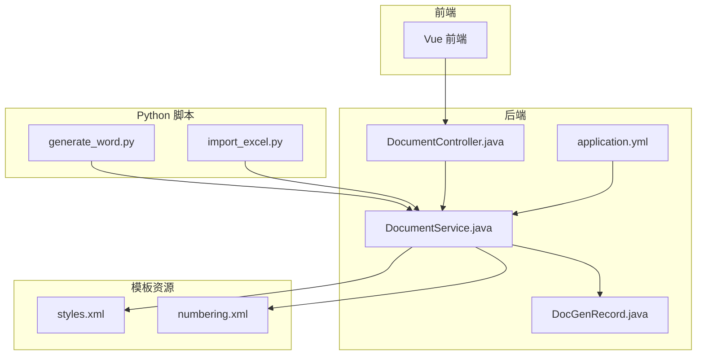
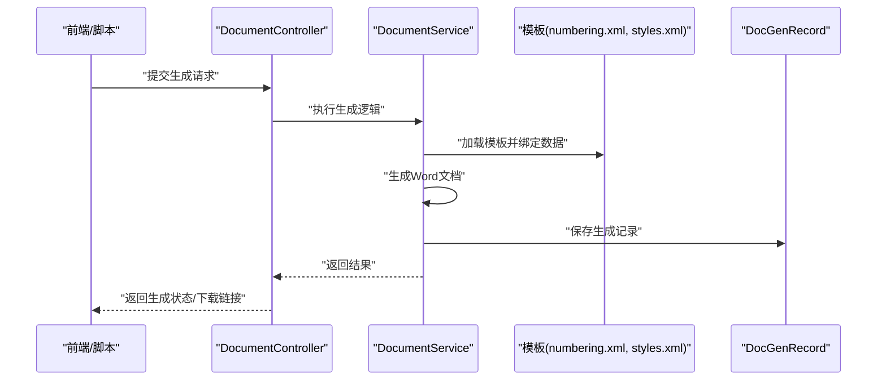
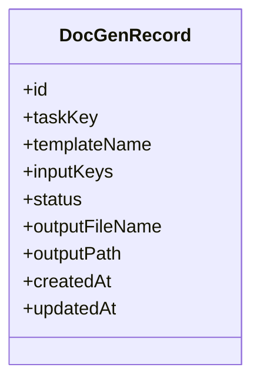
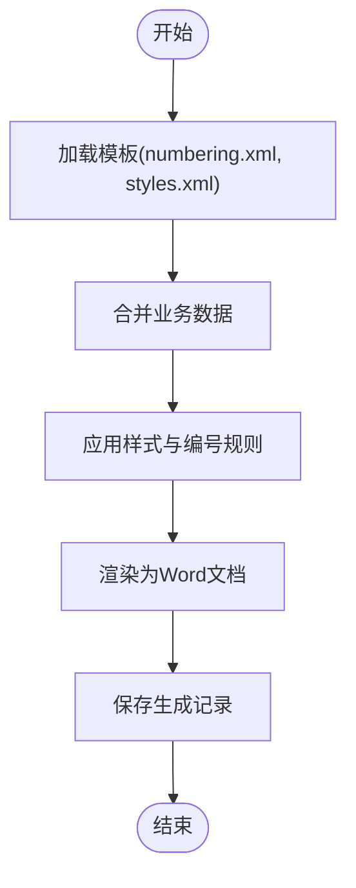
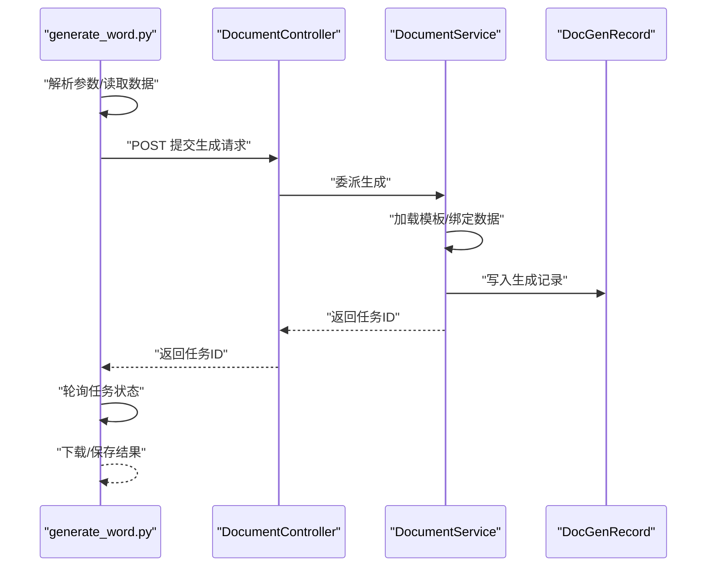
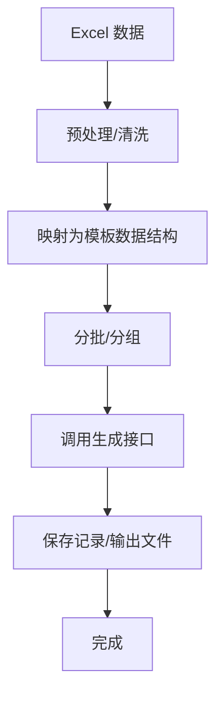
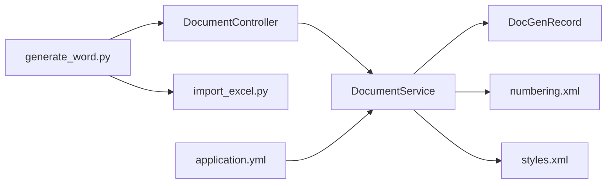

# 文档生成功能

<cite>
**本文引用的文件**
- [generate_word.py](file://generate_word.py)
- [import_excel.py](file://import_excel.py)
- [DocGenRecord.java](file://src/main/java/com/superpower/modules/document/entity/DocGenRecord.java)
- [DocumentService.java](file://src/main/java/com/superpower/modules/document/service/DocumentService.java)
- [DocumentController.java](file://src/main/java/com/superpower/modules/document/controller/DocumentController.java)
- [numbering.xml](file://src/main/resources/templates/word/numbering.xml)
- [styles.xml](file://src/main/resources/templates/word/styles.xml)
- [application.yml](file://src/main/resources/application.yml)
</cite>

## 目录
1. [引言](#引言)
2. [项目结构](#项目结构)
3. [核心组件](#核心组件)
4. [架构总览](#架构总览)
5. [详细组件分析](#详细组件分析)
6. [依赖关系分析](#依赖关系分析)
7. [性能考虑](#性能考虑)
8. [故障排查指南](#故障排查指南)
9. [结论](#结论)
10. [附录](#附录)

## 引言
本技术文档围绕“文档生成功能”展开，重点覆盖以下方面：
- Word文档生成引擎的实现原理与流程，包括DocGenRecord实体的设计与模板处理机制
- Word模板系统中numbering.xml与styles.xml的作用与自定义方法
- Python脚本generate_word.py的执行流程、参数配置与输出格式控制
- Excel数据导出功能的数据转换、格式化与批量处理机制
- 结合实际代码路径展示从数据准备到最终文档输出的完整流程
- 性能优化策略、错误处理机制与扩展性设计

## 项目结构
后端采用Spring Boot，前端Vue，根目录包含Python脚本用于数据导入与文档生成。核心模块位于src/main/java/com/superpower/modules/document，包含控制器、服务与实体；Word模板位于src/main/resources/templates/word。

图示来源
- [DocumentController.java](file://src/main/java/com/superpower/modules/document/controller/DocumentController.java)
- [DocumentService.java](file://src/main/java/com/superpower/modules/document/service/DocumentService.java)
- [DocGenRecord.java](file://src/main/java/com/superpower/modules/document/entity/DocGenRecord.java)
- [numbering.xml](file://src/main/resources/templates/word/numbering.xml)
- [styles.xml](file://src/main/resources/templates/word/styles.xml)
- [application.yml](file://src/main/resources/application.yml)

章节来源
- [DocumentController.java](file://src/main/java/com/superpower/modules/document/controller/DocumentController.java)
- [DocumentService.java](file://src/main/java/com/superpower/modules/document/service/DocumentService.java)
- [DocGenRecord.java](file://src/main/java/com/superpower/modules/document/entity/DocGenRecord.java)
- [numbering.xml](file://src/main/resources/templates/word/numbering.xml)
- [styles.xml](file://src/main/resources/templates/word/styles.xml)
- [application.yml](file://src/main/resources/application.yml)

## 核心组件
- DocGenRecord：文档生成记录实体，承载生成任务状态、模板信息、输出路径等元数据
- DocumentService：业务服务层，负责模板加载、数据绑定、Word生成与持久化
- DocumentController：REST接口入口，接收前端或脚本请求，调用服务层完成生成
- 模板系统：numbering.xml（编号样式）、styles.xml（样式定义），二者共同决定生成文档的编号与外观
- Python脚本：generate_word.py负责驱动生成流程；import_excel.py负责Excel数据导入与预处理

章节来源
- [DocGenRecord.java](file://src/main/java/com/superpower/modules/document/entity/DocGenRecord.java)
- [DocumentService.java](file://src/main/java/com/superpower/modules/document/service/DocumentService.java)
- [DocumentController.java](file://src/main/java/com/superpower/modules/document/controller/DocumentController.java)
- [generate_word.py](file://generate_word.py)
- [import_excel.py](file://import_excel.py)

## 架构总览
下图展示了从前端或Python脚本触发，到服务层处理与模板渲染，再到数据库持久化的整体流程。

图示来源
- [DocumentController.java](file://src/main/java/com/superpower/modules/document/controller/DocumentController.java)
- [DocumentService.java](file://src/main/java/com/superpower/modules/document/service/DocumentService.java)
- [DocGenRecord.java](file://src/main/java/com/superpower/modules/document/entity/DocGenRecord.java)
- [numbering.xml](file://src/main/resources/templates/word/numbering.xml)
- [styles.xml](file://src/main/resources/templates/word/styles.xml)

## 详细组件分析

### DocGenRecord 实体设计
- 角色与职责：记录一次文档生成任务的关键信息，如任务标识、模板名称、输入数据键、生成状态、输出文件名与路径、创建时间等
- 设计要点：
  - 字段命名清晰，便于前后端与脚本交互
  - 状态字段支持任务追踪与重试
  - 输出路径与文件名可配置，便于统一归档
- 扩展建议：
  - 可增加失败原因、重试次数、并发锁字段
  - 可引入版本号字段以支持多版本模板并行

图示来源
- [DocGenRecord.java](file://src/main/java/com/superpower/modules/document/entity/DocGenRecord.java)

章节来源
- [DocGenRecord.java](file://src/main/java/com/superpower/modules/document/entity/DocGenRecord.java)

### Word 模板系统与自定义
- numbering.xml：定义编号层级、编号格式、延续规则等，影响目录、图表、公式等的自动编号
- styles.xml：定义样式集合（标题、正文、表格、列表等）及其默认格式，影响生成文档的排版风格
- 自定义方法：
  - 在numbering.xml中新增abstractNum与num，调整编号类型、起始值、格式字符
  - 在styles.xml中新增style或修改现有style的rPr、pPr属性，控制字体、段落间距、对齐等
  - 通过服务层在生成时注入自定义样式与编号映射，确保与业务数据一致

图示来源
- [DocumentService.java](file://src/main/java/com/superpower/modules/document/service/DocumentService.java)
- [numbering.xml](file://src/main/resources/templates/word/numbering.xml)
- [styles.xml](file://src/main/resources/templates/word/styles.xml)

章节来源
- [DocumentService.java](file://src/main/java/com/superpower/modules/document/service/DocumentService.java)
- [numbering.xml](file://src/main/resources/templates/word/numbering.xml)
- [styles.xml](file://src/main/resources/templates/word/styles.xml)

### Python 脚本 generate_word.py 执行流程与参数
- 执行流程概览：
  - 解析命令行参数（模板名、输入数据键、输出路径等）
  - 读取Excel数据（由import_excel.py预处理或直接读取）
  - 调用后端接口提交生成任务
  - 轮询任务状态，等待完成后下载/保存结果
- 参数配置：
  - 模板选择：通过模板名指定numbering.xml与styles.xml组合
  - 数据键：指定需要绑定到模板的数据键集合
  - 输出格式：控制文件名、路径与扩展名
- 输出格式控制：
  - 通过服务层在生成时注入样式与编号，确保输出符合规范
  - 支持批量生成多个文档，并统一归档

图示来源
- [generate_word.py](file://generate_word.py)
- [DocumentController.java](file://src/main/java/com/superpower/modules/document/controller/DocumentController.java)
- [DocumentService.java](file://src/main/java/com/superpower/modules/document/service/DocumentService.java)
- [DocGenRecord.java](file://src/main/java/com/superpower/modules/document/entity/DocGenRecord.java)

章节来源
- [generate_word.py](file://generate_word.py)
- [DocumentController.java](file://src/main/java/com/superpower/modules/document/controller/DocumentController.java)
- [DocumentService.java](file://src/main/java/com/superpower/modules/document/service/DocumentService.java)
- [DocGenRecord.java](file://src/main/java/com/superpower/modules/document/entity/DocGenRecord.java)

### Excel 数据导出与批量处理
- 数据转换：
  - 将业务表数据转换为字典或结构化对象，供模板绑定
  - 对日期、数值、枚举等进行格式化，保证渲染一致性
- 格式化：
  - 使用styles.xml中的样式统一标题、正文、表格等格式
  - 编号通过numbering.xml统一管理，避免手动维护
- 批量处理：
  - import_excel.py按批次读取数据，分页写入或分组提交生成任务
  - 服务层支持并发生成，提高吞吐量
- 错误处理：
  - 导入阶段校验必填字段与格式
  - 生成阶段捕获模板缺失、数据异常、IO错误并回滚记录

图示来源
- [import_excel.py](file://import_excel.py)
- [DocumentService.java](file://src/main/java/com/superpower/modules/document/service/DocumentService.java)

章节来源
- [import_excel.py](file://import_excel.py)
- [DocumentService.java](file://src/main/java/com/superpower/modules/document/service/DocumentService.java)

## 依赖关系分析
- 控制器依赖服务层，服务层依赖模板资源与实体模型
- Python脚本通过HTTP接口与后端交互，不直接依赖模板
- 配置文件application.yml提供服务运行参数（如端口、日志级别等）

图示来源
- [DocumentController.java](file://src/main/java/com/superpower/modules/document/controller/DocumentController.java)
- [DocumentService.java](file://src/main/java/com/superpower/modules/document/service/DocumentService.java)
- [DocGenRecord.java](file://src/main/java/com/superpower/modules/document/entity/DocGenRecord.java)
- [numbering.xml](file://src/main/resources/templates/word/numbering.xml)
- [styles.xml](file://src/main/resources/templates/word/styles.xml)
- [generate_word.py](file://generate_word.py)
- [import_excel.py](file://import_excel.py)
- [application.yml](file://src/main/resources/application.yml)

章节来源
- [DocumentController.java](file://src/main/java/com/superpower/modules/document/controller/DocumentController.java)
- [DocumentService.java](file://src/main/java/com/superpower/modules/document/service/DocumentService.java)
- [DocGenRecord.java](file://src/main/java/com/superpower/modules/document/entity/DocGenRecord.java)
- [numbering.xml](file://src/main/resources/templates/word/numbering.xml)
- [styles.xml](file://src/main/resources/templates/word/styles.xml)
- [generate_word.py](file://generate_word.py)
- [import_excel.py](file://import_excel.py)
- [application.yml](file://src/main/resources/application.yml)

## 性能考虑
- 模板缓存：服务层对numbering.xml与styles.xml进行缓存，减少重复解析开销
- 并发生成：利用异步与线程池，支持多任务并行生成，提升吞吐
- 分批处理：Excel数据与生成任务分批提交，降低内存峰值与网络压力
- IO优化：输出文件先写临时目录，完成后原子移动至目标位置，避免部分生成文件污染
- 日志与监控：关键节点打点，便于定位瓶颈与异常

## 故障排查指南
- 生成失败：
  - 检查模板是否存在且可解析（numbering.xml、styles.xml）
  - 校验输入数据键是否与模板绑定一致
  - 查看服务日志与DocGenRecord.status字段
- 下载异常：
  - 确认输出路径与权限
  - 检查文件是否已生成完成（状态字段）
- 性能问题：
  - 合理设置并发度与批大小
  - 开启模板缓存与IO优化策略
- 配置问题：
  - 校验application.yml中的端口、日志级别等

章节来源
- [DocGenRecord.java](file://src/main/java/com/superpower/modules/document/entity/DocGenRecord.java)
- [DocumentService.java](file://src/main/java/com/superpower/modules/document/service/DocumentService.java)
- [application.yml](file://src/main/resources/application.yml)

## 结论
该文档生成功能以Spring Boot为核心，结合Python脚本与Word模板系统，实现了从Excel数据到标准化Word文档的自动化生成。通过DocGenRecord记录任务全生命周期，通过numbering.xml与styles.xml统一编号与样式，通过generate_word.py与import_excel.py支撑批量与灵活的生成场景。整体架构具备良好的扩展性与可维护性，适合在企业级产品文档管理中推广使用。

## 附录
- 关键实现参考路径：
  - [DocGenRecord.java](file://src/main/java/com/superpower/modules/document/entity/DocGenRecord.java)
  - [DocumentService.java](file://src/main/java/com/superpower/modules/document/service/DocumentService.java)
  - [DocumentController.java](file://src/main/java/com/superpower/modules/document/controller/DocumentController.java)
  - [numbering.xml](file://src/main/resources/templates/word/numbering.xml)
  - [styles.xml](file://src/main/resources/templates/word/styles.xml)
  - [generate_word.py](file://generate_word.py)
  - [import_excel.py](file://import_excel.py)
  - [application.yml](file://src/main/resources/application.yml)