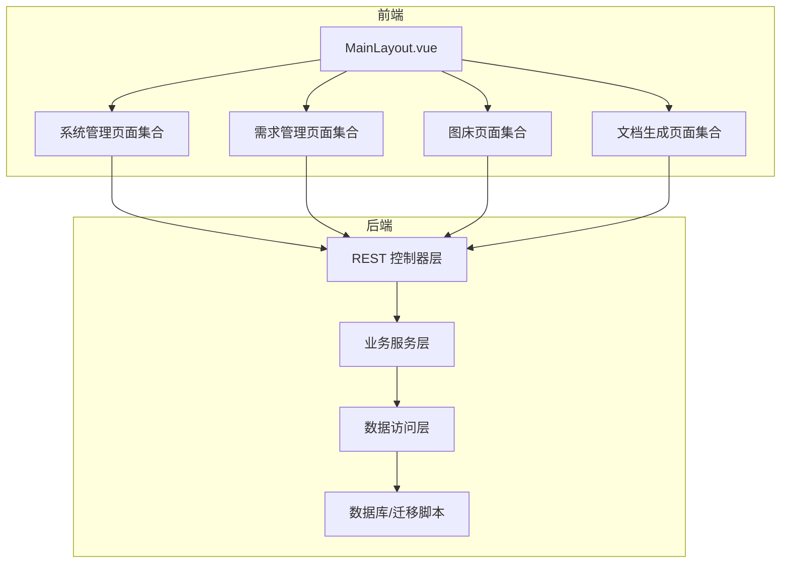
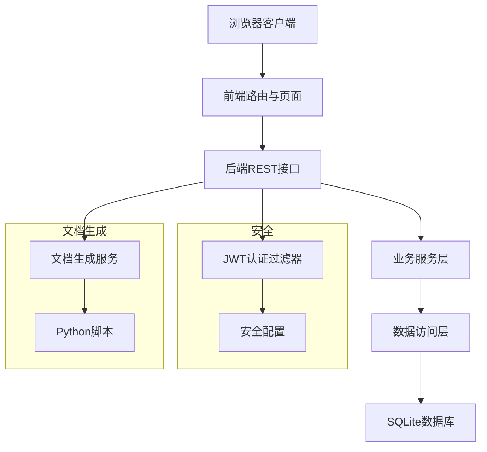
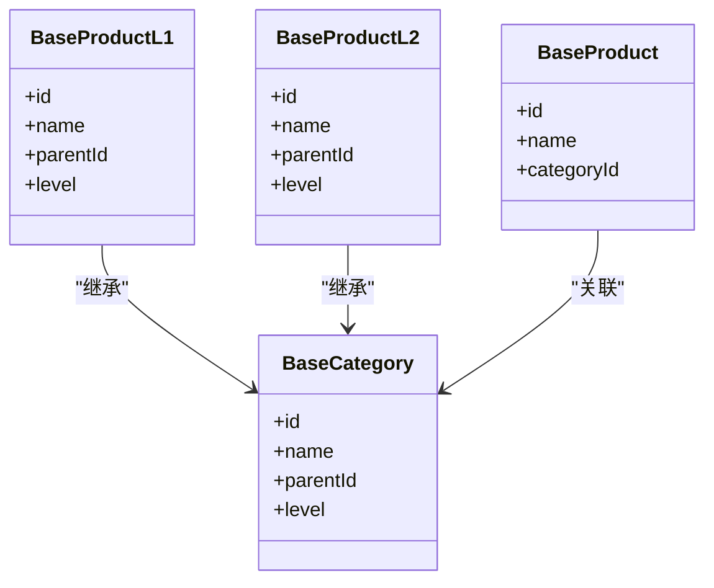
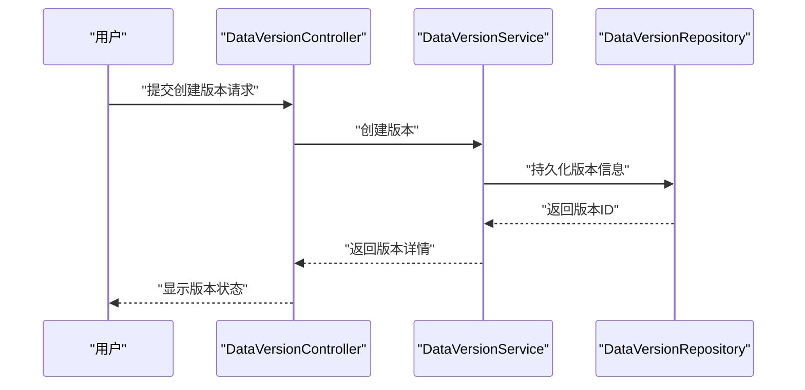
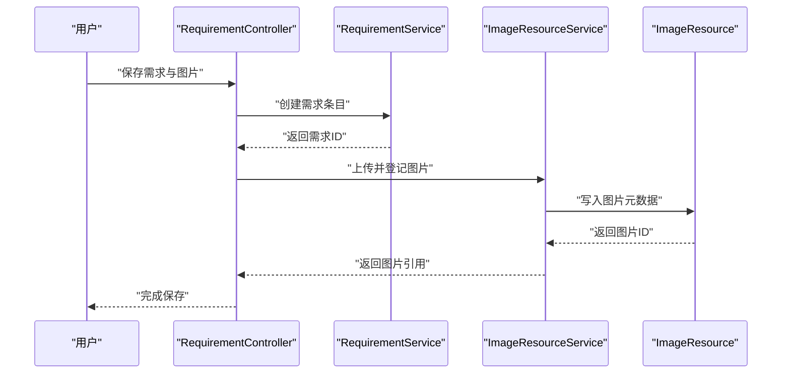
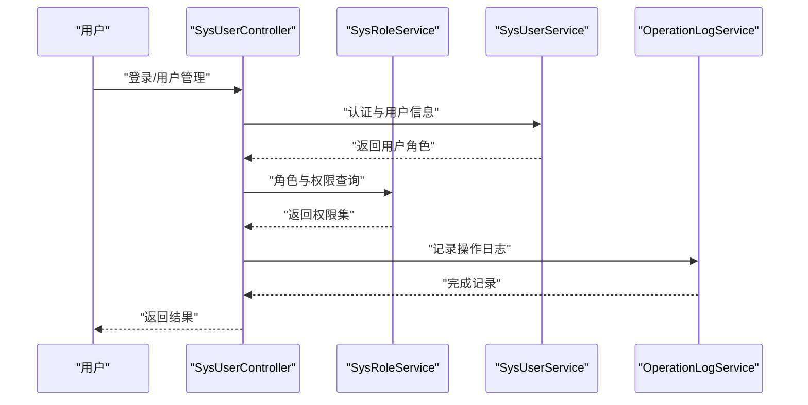
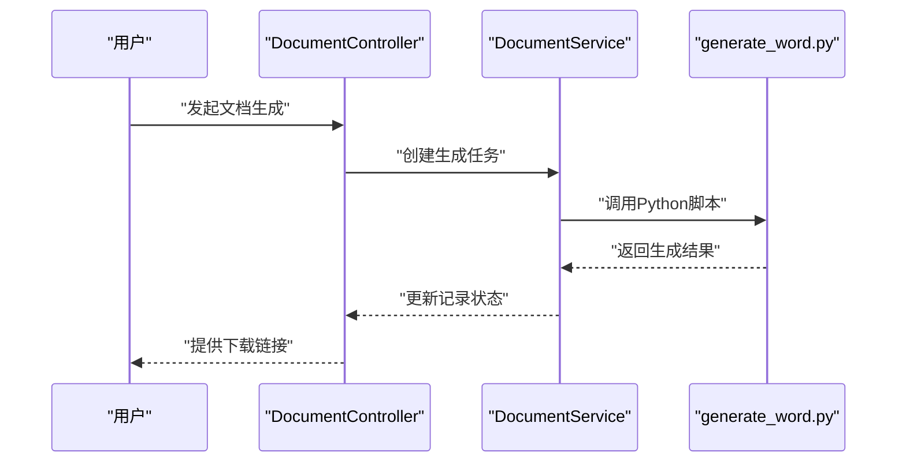
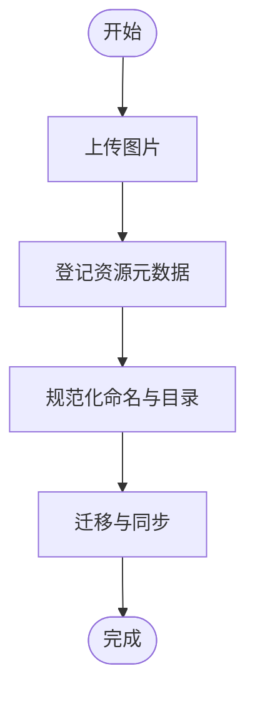
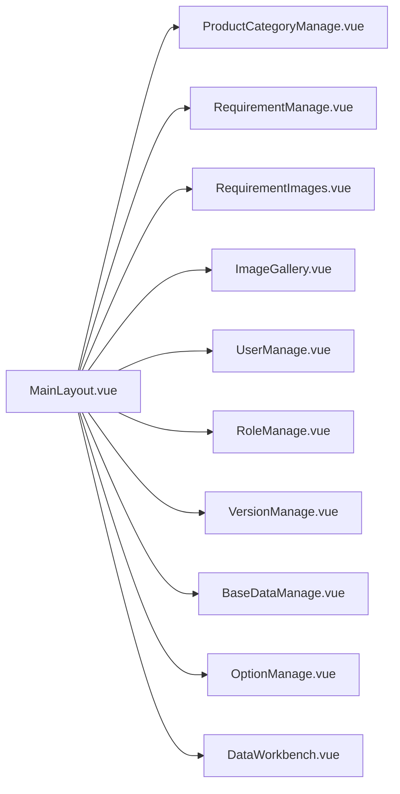
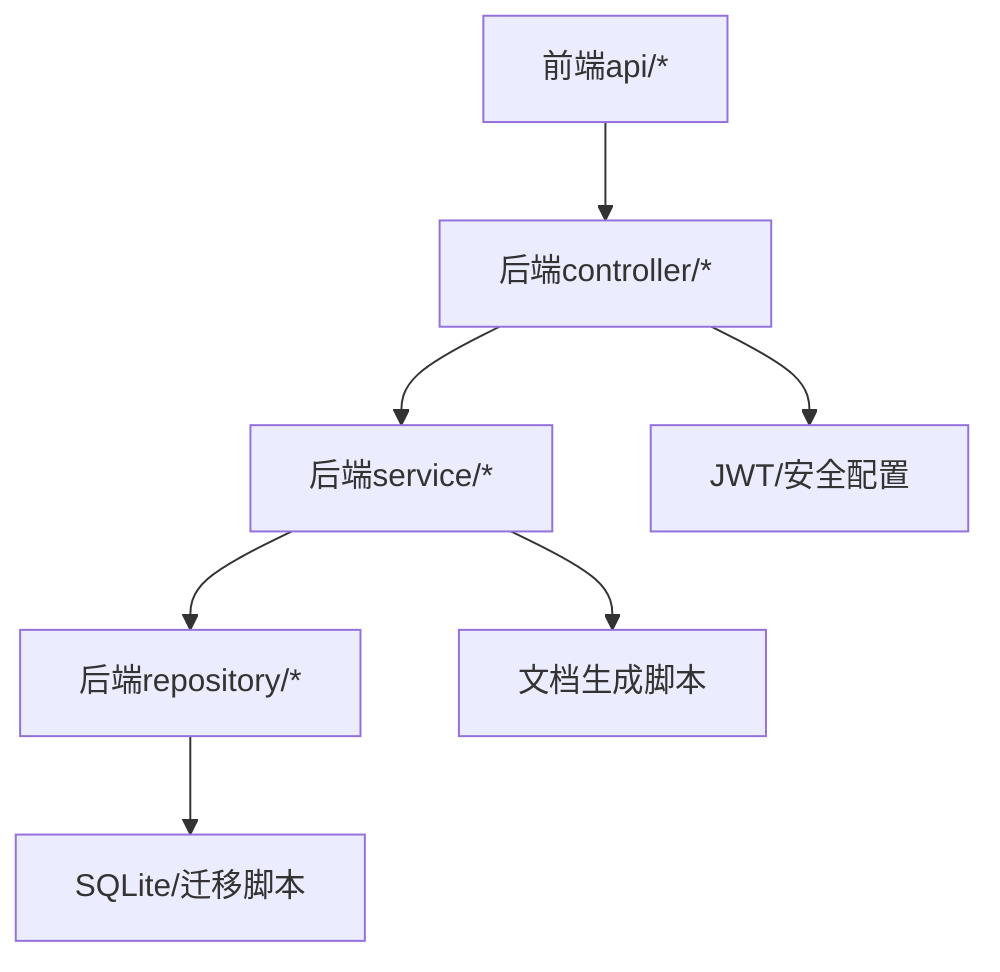

# 核心功能

<cite>
**本文引用的文件**
- [SuperPowerApplication.java](file://src/main/java/com/superpower/SuperPowerApplication.java)
- [SecurityConfig.java](file://src/main/java/com/superpower/config/SecurityConfig.java)
- [JwtAuthenticationFilter.java](file://src/main/java/com/superpower/security/JwtAuthenticationFilter.java)
- [CategoryController.java](file://src/main/java/com/superpower/modules/category/controller/CategoryController.java)
- [ProductController.java](file://src/main/java/com/superpower/modules/category/controller/ProductController.java)
- [BaseCategory.java](file://src/main/java/com/superpower/modules/category/entity/BaseCategory.java)
- [BaseProduct.java](file://src/main/java/com/superpower/modules/category/entity/BaseProduct.java)
- [BaseProductL1.java](file://src/main/java/com/superpower/modules/category/entity/BaseProductL1.java)
- [BaseProductL2.java](file://src/main/java/com/superpower/modules/category/entity/BaseProductL2.java)
- [CategoryService.java](file://src/main/java/com/superpower/modules/category/service/CategoryService.java)
- [ProductService.java](file://src/main/java/com/superpower/modules/category/service/ProductService.java)
- [RequirementController.java](file://src/main/java/com/superpower/modules/requirement/controller/RequirementController.java)
- [ReqItem.java](file://src/main/java/com/superpower/modules/requirement/entity/ReqItem.java)
- [RequirementService.java](file://src/main/java/com/superpower/modules/requirement/service/RequirementService.java)
- [ImageResourceController.java](file://src/main/java/com/superpower/modules/image/controller/ImageResourceController.java)
- [ImageResource.java](file://src/main/java/com/superpower/modules/image/entity/ImageResource.java)
- [ImageResourceService.java](file://src/main/java/com/superpower/modules/image/service/ImageResourceService.java)
- [DocumentController.java](file://src/main/java/com/superpower/modules/document/controller/DocumentController.java)
- [DocGenRecord.java](file://src/main/java/com/superpower/modules/document/entity/DocGenRecord.java)
- [DocumentService.java](file://src/main/java/com/superpower/modules/document/service/DocumentService.java)
- [AppVersionController.java](file://src/main/java/com/superpower/modules/version/controller/AppVersionController.java)
- [DataVersionController.java](file://src/main/java/com/superpower/modules/version/controller/DataVersionController.java)
- [DataVersion.java](file://src/main/java/com/superpower/modules/version/entity/DataVersion.java)
- [SysUserController.java](file://src/main/java/com/superpower/modules/system/controller/SysUserController.java)
- [SysRoleController.java](file://src/main/java/com/superpower/modules/system/controller/SysRoleController.java)
- [SysRoleService.java](file://src/main/java/com/superpower/modules/system/service/SysRoleService.java)
- [SysUserService.java](file://src/main/java/com/superpower/modules/system/service/SysUserService.java)
- [OperationLogController.java](file://src/main/java/com/superpower/modules/system/controller/OperationLogController.java)
- [OperationLogService.java](file://src/main/java/com/superpower/modules/system/service/OperationLogService.java)
- [MaintenanceController.java](file://src/main/java/com/superpower/modules/system/controller/MaintenanceController.java)
- [MaintenanceService.java](file://src/main/java/com/superpower/modules/system/service/MaintenanceService.java)
- [MainLayout.vue](file://frontend/src/layout/MainLayout.vue)
- [ProductCategoryManage.vue](file://frontend/src/views/system/ProductCategoryManage.vue)
- [RequirementManage.vue](file://frontend/src/views/requirement/RequirementManage.vue)
- [RequirementImages.vue](file://frontend/src/views/requirement/RequirementImages.vue)
- [ImageGallery.vue](file://frontend/src/views/system/ImageGallery.vue)
- [UserManage.vue](file://frontend/src/views/system/UserManage.vue)
- [RoleManage.vue](file://frontend/src/views/system/RoleManage.vue)
- [VersionManage.vue](file://frontend/src/views/system/VersionManage.vue)
- [BaseDataManage.vue](file://frontend/src/views/system/BaseDataManage.vue)
- [OptionManage.vue](file://frontend/src/views/system/OptionManage.vue)
- [DataWorkbench.vue](file://frontend/src/views/dashboard/DataWorkbench.vue)
- [DataEntryController.java](file://src/main/java/com/superpower/modules/data/controller/DataEntryController.java)
- [DataEntryService.java](file://src/main/java/com/superpower/modules/data/service/DataEntryService.java)
- [DataEntry.java](file://src/main/java/com/superpower/modules/data/entity/DataEntry.java)
- [CustomTabController.java](file://src/main/java/com/superpower/modules/customtab/controller/CustomTabController.java)
- [CustomTabService.java](file://src/main/java/com/superpower/modules/customtab/service/CustomTabService.java)
- [CustomTab.java](file://src/main/java/com/superpower/modules/customtab/entity/CustomTab.java)
- [CustomTabEntry.java](file://src/main/java/com/superpower/modules/customtab/entity/CustomTabEntry.java)
- [application.yml](file://src/main/resources/application.yml)
- [init.sql](file://src/main/resources/db/init.sql)
- [20260602_add_product_category_tables.sql](file://db_changes/20260602_add_product_category_tables.sql)
- [20260531_add_requirement_tables.sql](file://db_changes/20260531_add_requirement_tables.sql)
- [20260531_add_doc_gen_record_doc_name.sql](file://db_changes/20260531_add_doc_gen_record_doc_name.sql)
- [generate_word.py](file://generate_word.py)
- [import_excel.py](file://import_excel.py)
- [import_hierarchy.py](file://import_hierarchy.py)
- [import_l3.py](file://import_l3.py)
- [import_shuzhidi.py](file://import_shuzhidi.py)
</cite>

## 目录
1. [简介](#简介)
2. [项目结构](#项目结构)
3. [核心组件](#核心组件)
4. [架构总览](#架构总览)
5. [详细组件分析](#详细组件分析)
6. [依赖分析](#依赖分析)
7. [性能考虑](#性能考虑)
8. [故障排查指南](#故障排查指南)
9. [结论](#结论)
10. [附录](#附录)

## 简介
本系统是一个面向产品清单管理的全栈应用，围绕“产品数据管理（多层级分类L1/L2/L3）”、“版本控制系统（草稿/发布状态）”、“需求管理（需求清单与图片）”、“系统管理（用户、权限、基础数据）”、“文档生成（Word/Excel自动化）”和“图床管理（图片资源存储）”六大核心模块构建。系统通过前后端分离架构实现：后端采用Spring Boot提供REST服务与业务逻辑，前端基于Vue 3构建交互界面；数据库层支持SQLite初始化与迁移脚本，配合多处SQL变更记录保障数据演进；同时提供Python脚本用于批量导入与文档生成。

## 项目结构
系统采用典型的分层架构：
- 后端：按模块划分（category、requirement、image、document、version、system、data、customtab、approval），每个模块包含controller/dto/entity/repository/service等层次。
- 前端：layout、views、components、router、store、api等组织方式，页面覆盖系统管理、需求管理、图床、版本管理、工作台等。
- 资源与配置：application.yml、init.sql、db_changes下的SQL迁移脚本、模板与Python脚本。

**图表来源**
- [MainLayout.vue](file://frontend/src/layout/MainLayout.vue)
- [SysUserController.java](file://src/main/java/com/superpower/modules/system/controller/SysUserController.java)
- [RequirementController.java](file://src/main/java/com/superpower/modules/requirement/controller/RequirementController.java)
- [ImageResourceController.java](file://src/main/java/com/superpower/modules/image/controller/ImageResourceController.java)
- [DocumentController.java](file://src/main/java/com/superpower/modules/document/controller/DocumentController.java)

**章节来源**
- [SuperPowerApplication.java](file://src/main/java/com/superpower/SuperPowerApplication.java)
- [application.yml](file://src/main/resources/application.yml)
- [init.sql](file://src/main/resources/db/init.sql)

## 核心组件
- 产品数据管理（多层级分类L1/L2/L3）
  - 价值：统一产品族谱，支撑产品检索、统计与版本关联。
  - 关键实体：BaseCategory、BaseProduct、BaseProductL1、BaseProductL2。
  - 关键服务：CategoryService、ProductService。
- 版本控制系统（草稿/发布状态）
  - 价值：对产品与需求进行版本化管理，支持回滚与对比。
  - 关键实体：DataVersion。
  - 关键控制器：AppVersionController、DataVersionController。
- 需求管理（需求清单与图片）
  - 价值：集中管理需求条目与配套图片，支持图片归档与检索。
  - 关键实体：ReqItem、ImageResource。
  - 关键服务：RequirementService、ImageResourceService。
- 系统管理（用户、权限、基础数据）
  - 价值：用户与角色管理、操作日志、维护与基础数据治理。
  - 关键控制器：SysUserController、SysRoleController、OperationLogController、MaintenanceController。
  - 关键服务：SysUserService、SysRoleService、OperationLogService、MaintenanceService。
- 文档生成（Word/Excel自动化）
  - 价值：自动生成Word报告，支持进度跟踪与结果记录。
  - 关键实体：DocGenRecord。
  - 关键服务：DocumentService。
- 图床管理（图片资源存储）
  - 价值：图片上传、目录结构、重命名一致性与迁移。
  - 关键实体：ImageResource。
  - 关键服务：ImageResourceService。

**章节来源**
- [CategoryService.java](file://src/main/java/com/superpower/modules/category/service/CategoryService.java)
- [ProductService.java](file://src/main/java/com/superpower/modules/category/service/ProductService.java)
- [BaseCategory.java](file://src/main/java/com/superpower/modules/category/entity/BaseCategory.java)
- [BaseProduct.java](file://src/main/java/com/superpower/modules/category/entity/BaseProduct.java)
- [BaseProductL1.java](file://src/main/java/com/superpower/modules/category/entity/BaseProductL1.java)
- [BaseProductL2.java](file://src/main/java/com/superpower/modules/category/entity/BaseProductL2.java)
- [DataVersion.java](file://src/main/java/com/superpower/modules/version/entity/DataVersion.java)
- [ReqItem.java](file://src/main/java/com/superpower/modules/requirement/entity/ReqItem.java)
- [ImageResource.java](file://src/main/java/com/superpower/modules/image/entity/ImageResource.java)
- [DocGenRecord.java](file://src/main/java/com/superpower/modules/document/entity/DocGenRecord.java)
- [SysUserService.java](file://src/main/java/com/superpower/modules/system/service/SysUserService.java)
- [SysRoleService.java](file://src/main/java/com/superpower/modules/system/service/SysRoleService.java)
- [OperationLogService.java](file://src/main/java/com/superpower/modules/system/service/OperationLogService.java)
- [MaintenanceService.java](file://src/main/java/com/superpower/modules/system/service/MaintenanceService.java)

## 架构总览
系统采用前后端分离，后端以Spring Boot为核心，提供REST接口；前端Vue应用负责路由与页面渲染；安全通过JWT过滤器与Spring Security配置实现；数据库通过SQLite初始化与迁移脚本管理；文档生成由后端服务调用Python脚本完成。

**图表来源**
- [JwtAuthenticationFilter.java](file://src/main/java/com/superpower/security/JwtAuthenticationFilter.java)
- [SecurityConfig.java](file://src/main/java/com/superpower/config/SecurityConfig.java)
- [DocumentService.java](file://src/main/java/com/superpower/modules/document/service/DocumentService.java)
- [generate_word.py](file://generate_word.py)

**章节来源**
- [SuperPowerApplication.java](file://src/main/java/com/superpower/SuperPowerApplication.java)
- [SecurityConfig.java](file://src/main/java/com/superpower/config/SecurityConfig.java)
- [JwtAuthenticationFilter.java](file://src/main/java/com/superpower/security/JwtAuthenticationFilter.java)

## 详细组件分析

### 产品数据管理（多层级分类L1/L2/L3）
- 功能概述
  - 支持L1/L2/L3层级的产品分类与产品实体管理，提供树形结构展示与查询。
  - 通过CategoryController与ProductController提供增删改查与层级关系维护。
- 数据模型
  - BaseCategory：通用分类基类，承载层级与父子关系。
  - BaseProduct：产品实体，可绑定到L2/L3节点。
  - BaseProductL1/L2：继承自BaseCategory，分别对应L1/L2层级。
- 处理流程
  - 分类树加载 → 展示层级 → 选择节点 → 读取或编辑产品。
- 最佳实践
  - 维护层级唯一性与父子关系一致性。
  - 对大层级树建议懒加载与分页查询。

**图表来源**
- [BaseCategory.java](file://src/main/java/com/superpower/modules/category/entity/BaseCategory.java)
- [BaseProduct.java](file://src/main/java/com/superpower/modules/category/entity/BaseProduct.java)
- [BaseProductL1.java](file://src/main/java/com/superpower/modules/category/entity/BaseProductL1.java)
- [BaseProductL2.java](file://src/main/java/com/superpower/modules/category/entity/BaseProductL2.java)

**章节来源**
- [CategoryController.java](file://src/main/java/com/superpower/modules/category/controller/CategoryController.java)
- [ProductController.java](file://src/main/java/com/superpower/modules/category/controller/ProductController.java)
- [CategoryService.java](file://src/main/java/com/superpower/modules/category/service/CategoryService.java)
- [ProductService.java](file://src/main/java/com/superpower/modules/category/service/ProductService.java)

### 版本控制系统（草稿/发布状态）
- 功能概述
  - 对产品与需求进行版本化管理，支持草稿与发布状态切换、版本回滚与对比。
  - 通过AppVersionController与DataVersionController提供版本生命周期管理。
- 数据模型
  - DataVersion：版本元数据，包含版本号、状态、创建时间、关联对象等。
- 处理流程
  - 创建版本 → 编辑草稿 → 发布版本 → 回滚或对比。
- 最佳实践
  - 版本命名规范与发布前校验。
  - 回滚前备份与影响评估。

**图表来源**
- [DataVersionController.java](file://src/main/java/com/superpower/modules/version/controller/DataVersionController.java)
- [DataVersion.java](file://src/main/java/com/superpower/modules/version/entity/DataVersion.java)

**章节来源**
- [AppVersionController.java](file://src/main/java/com/superpower/modules/version/controller/AppVersionController.java)
- [DataVersionController.java](file://src/main/java/com/superpower/modules/version/controller/DataVersionController.java)
- [DataVersion.java](file://src/main/java/com/superpower/modules/version/entity/DataVersion.java)

### 需求管理（需求清单与图片）
- 功能概述
  - 需求条目管理与图片附件管理，支持图片上传、预览与归档。
  - RequirementController提供需求CRUD，RequirementService处理业务逻辑。
  - ImageResourceController与ImageResourceService负责图片资源存储与迁移。
- 数据模型
  - ReqItem：需求条目，可关联图片资源。
  - ImageResource：图片资源元数据，含路径、尺寸、归属等。
- 处理流程
  - 新建需求 → 上传图片 → 关联图片 → 列表展示与检索。
- 最佳实践
  - 图片命名与目录结构规范化，确保重命名一致性与引用同步。

**图表来源**
- [RequirementController.java](file://src/main/java/com/superpower/modules/requirement/controller/RequirementController.java)
- [RequirementService.java](file://src/main/java/com/superpower/modules/requirement/service/RequirementService.java)
- [ImageResourceController.java](file://src/main/java/com/superpower/modules/image/controller/ImageResourceController.java)
- [ImageResourceService.java](file://src/main/java/com/superpower/modules/image/service/ImageResourceService.java)
- [ReqItem.java](file://src/main/java/com/superpower/modules/requirement/entity/ReqItem.java)
- [ImageResource.java](file://src/main/java/com/superpower/modules/image/entity/ImageResource.java)

**章节来源**
- [RequirementController.java](file://src/main/java/com/superpower/modules/requirement/controller/RequirementController.java)
- [RequirementService.java](file://src/main/java/com/superpower/modules/requirement/service/RequirementService.java)
- [ImageResourceController.java](file://src/main/java/com/superpower/modules/image/controller/ImageResourceController.java)
- [ImageResourceService.java](file://src/main/java/com/superpower/modules/image/service/ImageResourceService.java)

### 系统管理（用户、权限、基础数据）
- 功能概述
  - 用户与角色管理、菜单权限分配、操作日志审计、系统维护与基础数据治理。
  - SysUserController、SysRoleController、OperationLogController、MaintenanceController提供相应能力。
- 数据模型
  - SysUser、SysRole、SysMenu、OperationLog等。
- 处理流程
  - 登录鉴权 → 权限校验 → 操作记录 → 结果返回。
- 最佳实践
  - 最小权限原则与定期审计日志。

**图表来源**
- [SysUserController.java](file://src/main/java/com/superpower/modules/system/controller/SysUserController.java)
- [SysRoleController.java](file://src/main/java/com/superpower/modules/system/controller/SysRoleController.java)
- [SysRoleService.java](file://src/main/java/com/superpower/modules/system/service/SysRoleService.java)
- [SysUserService.java](file://src/main/java/com/superpower/modules/system/service/SysUserService.java)
- [OperationLogController.java](file://src/main/java/com/superpower/modules/system/controller/OperationLogController.java)
- [OperationLogService.java](file://src/main/java/com/superpower/modules/system/service/OperationLogService.java)

**章节来源**
- [SysUserController.java](file://src/main/java/com/superpower/modules/system/controller/SysUserController.java)
- [SysRoleController.java](file://src/main/java/com/superpower/modules/system/controller/SysRoleController.java)
- [SysRoleService.java](file://src/main/java/com/superpower/modules/system/service/SysRoleService.java)
- [SysUserService.java](file://src/main/java/com/superpower/modules/system/service/SysUserService.java)
- [OperationLogController.java](file://src/main/java/com/superpower/modules/system/controller/OperationLogController.java)
- [OperationLogService.java](file://src/main/java/com/superpower/modules/system/service/OperationLogService.java)
- [MaintenanceController.java](file://src/main/java/com/superpower/modules/system/controller/MaintenanceController.java)
- [MaintenanceService.java](file://src/main/java/com/superpower/modules/system/service/MaintenanceService.java)

### 文档生成（Word/Excel自动化）
- 功能概述
  - 自动化生成Word报告，支持进度跟踪与结果记录，便于批量导出与归档。
  - DocumentController与DocumentService协调生成流程，generate_word.py作为底层执行脚本。
- 数据模型
  - DocGenRecord：记录生成任务、状态、输出文件名等。
- 处理流程
  - 提交生成请求 → 后端调度 → Python脚本执行 → 更新记录 → 下载结果。
- 最佳实践
  - 生成前参数校验与模板一致性检查。

**图表来源**
- [DocumentController.java](file://src/main/java/com/superpower/modules/document/controller/DocumentController.java)
- [DocumentService.java](file://src/main/java/com/superpower/modules/document/service/DocumentService.java)
- [DocGenRecord.java](file://src/main/java/com/superpower/modules/document/entity/DocGenRecord.java)
- [generate_word.py](file://generate_word.py)

**章节来源**
- [DocumentController.java](file://src/main/java/com/superpower/modules/document/controller/DocumentController.java)
- [DocumentService.java](file://src/main/java/com/superpower/modules/document/service/DocumentService.java)
- [DocGenRecord.java](file://src/main/java/com/superpower/modules/document/entity/DocGenRecord.java)
- [generate_word.py](file://generate_word.py)

### 图床管理（图片资源存储）
- 功能概述
  - 图片上传、目录结构管理、重命名一致性与迁移，确保引用与文件同步。
  - ImageResourceController与ImageResourceService负责资源登记与迁移进度跟踪。
- 数据模型
  - ImageResource：记录图片路径、尺寸、归属产品等。
- 处理流程
  - 上传 → 登记元数据 → 规范化命名与目录 → 迁移与同步。
- 最佳实践
  - 批量迁移时开启事务与一致性校验。

**图表来源**
- [ImageResourceController.java](file://src/main/java/com/superpower/modules/image/controller/ImageResourceController.java)
- [ImageResourceService.java](file://src/main/java/com/superpower/modules/image/service/ImageResourceService.java)
- [ImageResource.java](file://src/main/java/com/superpower/modules/image/entity/ImageResource.java)

**章节来源**
- [ImageResourceController.java](file://src/main/java/com/superpower/modules/image/controller/ImageResourceController.java)
- [ImageResourceService.java](file://src/main/java/com/superpower/modules/image/service/ImageResourceService.java)
- [ImageResource.java](file://src/main/java/com/superpower/modules/image/entity/ImageResource.java)

### 前端页面与模块协作
- 页面组织
  - MainLayout作为统一布局，系统管理、需求管理、图床、版本管理、工作台等页面分别位于views子目录。
- 协作关系
  - 前端通过api目录下的模块化接口与后端各模块控制器对接，实现数据流闭环。
- 使用流程
  - 登录 → 导航至目标页面 → 选择数据 → 执行操作 → 查看结果与日志。

**图表来源**
- [MainLayout.vue](file://frontend/src/layout/MainLayout.vue)
- [ProductCategoryManage.vue](file://frontend/src/views/system/ProductCategoryManage.vue)
- [RequirementManage.vue](file://frontend/src/views/requirement/RequirementManage.vue)
- [RequirementImages.vue](file://frontend/src/views/requirement/RequirementImages.vue)
- [ImageGallery.vue](file://frontend/src/views/system/ImageGallery.vue)
- [UserManage.vue](file://frontend/src/views/system/UserManage.vue)
- [RoleManage.vue](file://frontend/src/views/system/RoleManage.vue)
- [VersionManage.vue](file://frontend/src/views/system/VersionManage.vue)
- [BaseDataManage.vue](file://frontend/src/views/system/BaseDataManage.vue)
- [OptionManage.vue](file://frontend/src/views/system/OptionManage.vue)
- [DataWorkbench.vue](file://frontend/src/views/dashboard/DataWorkbench.vue)

**章节来源**
- [MainLayout.vue](file://frontend/src/layout/MainLayout.vue)
- [ProductCategoryManage.vue](file://frontend/src/views/system/ProductCategoryManage.vue)
- [RequirementManage.vue](file://frontend/src/views/requirement/RequirementManage.vue)
- [RequirementImages.vue](file://frontend/src/views/requirement/RequirementImages.vue)
- [ImageGallery.vue](file://frontend/src/views/system/ImageGallery.vue)
- [UserManage.vue](file://frontend/src/views/system/UserManage.vue)
- [RoleManage.vue](file://frontend/src/views/system/RoleManage.vue)
- [VersionManage.vue](file://frontend/src/views/system/VersionManage.vue)
- [BaseDataManage.vue](file://frontend/src/views/system/BaseDataManage.vue)
- [OptionManage.vue](file://frontend/src/views/system/OptionManage.vue)
- [DataWorkbench.vue](file://frontend/src/views/dashboard/DataWorkbench.vue)

## 依赖分析
- 内部依赖
  - 控制器依赖服务层，服务层依赖仓库层，仓库层依赖数据库。
  - 前端api模块与后端控制器一一对应，形成清晰的调用链。
- 外部依赖
  - 安全：JWT过滤器与安全配置。
  - 文档生成：后端服务调用Python脚本。
  - 数据库：SQLite初始化与迁移脚本。
- 优化建议
  - 对热点查询增加索引与缓存。
  - 对批量导入与生成任务采用异步与队列化。

**图表来源**
- [JwtAuthenticationFilter.java](file://src/main/java/com/superpower/security/JwtAuthenticationFilter.java)
- [SecurityConfig.java](file://src/main/java/com/superpower/config/SecurityConfig.java)
- [DocumentService.java](file://src/main/java/com/superpower/modules/document/service/DocumentService.java)
- [generate_word.py](file://generate_word.py)
- [init.sql](file://src/main/resources/db/init.sql)

**章节来源**
- [application.yml](file://src/main/resources/application.yml)
- [init.sql](file://src/main/resources/db/init.sql)

## 性能考虑
- 查询优化
  - 对树形结构与层级查询使用索引与分页。
  - 对图片与需求列表采用懒加载与虚拟滚动。
- 生成与导入
  - 文档生成与Excel导入采用异步任务与进度上报。
  - 批量操作使用事务与分批提交。
- 存储与迁移
  - 图片目录结构与重命名一致性需在迁移阶段做完整性校验。
- 缓存策略
  - 对基础数据与静态配置进行缓存，降低数据库压力。

## 故障排查指南
- 认证与权限
  - 检查JWT过滤器是否正确拦截与放行，确认安全配置无误。
- 文档生成
  - 若生成卡住，检查后端日志与Python脚本执行状态，确认模板与参数完整。
- 图片迁移
  - 若图片缺失或引用不同步，检查迁移任务进度与一致性校验结果。
- 版本管理
  - 若版本回滚失败，核对版本状态与依赖关系，必要时手动修复。
- 系统维护
  - 操作日志可用于定位问题，定期清理过期日志与缓存。

**章节来源**
- [JwtAuthenticationFilter.java](file://src/main/java/com/superpower/security/JwtAuthenticationFilter.java)
- [SecurityConfig.java](file://src/main/java/com/superpower/config/SecurityConfig.java)
- [OperationLogService.java](file://src/main/java/com/superpower/modules/system/service/OperationLogService.java)

## 结论
本系统通过六大核心模块实现了从产品分类、版本控制、需求与图片管理，到系统治理与文档生成的完整闭环。前后端分离与模块化设计提升了可维护性与扩展性；结合数据库迁移与Python脚本，满足了复杂业务场景下的自动化与一致性要求。建议在实际使用中遵循最佳实践，持续优化性能与稳定性。

## 附录
- 数据库初始化与迁移
  - 初始化脚本与多轮迁移脚本确保Schema演进与数据安全。
- 批量导入与处理脚本
  - 提供Excel导入、层级导入、L3导入、树状地导入等脚本，支持快速上线与数据迁移。

**章节来源**
- [init.sql](file://src/main/resources/db/init.sql)
- [20260602_add_product_category_tables.sql](file://db_changes/20260602_add_product_category_tables.sql)
- [20260531_add_requirement_tables.sql](file://db_changes/20260531_add_requirement_tables.sql)
- [20260531_add_doc_gen_record_doc_name.sql](file://db_changes/20260531_add_doc_gen_record_doc_name.sql)
- [import_excel.py](file://import_excel.py)
- [import_hierarchy.py](file://import_hierarchy.py)
- [import_l3.py](file://import_l3.py)
- [import_shuzhidi.py](file://import_shuzhidi.py)