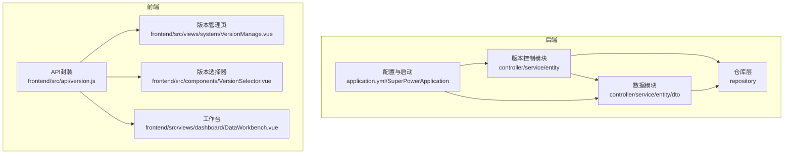
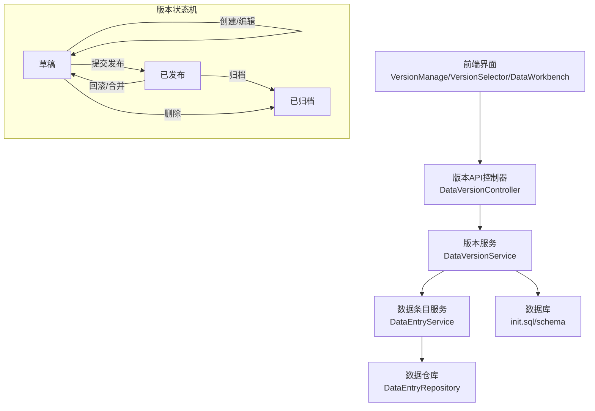
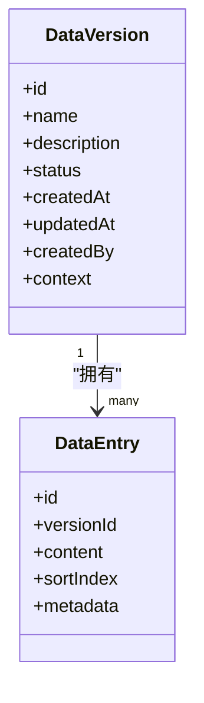
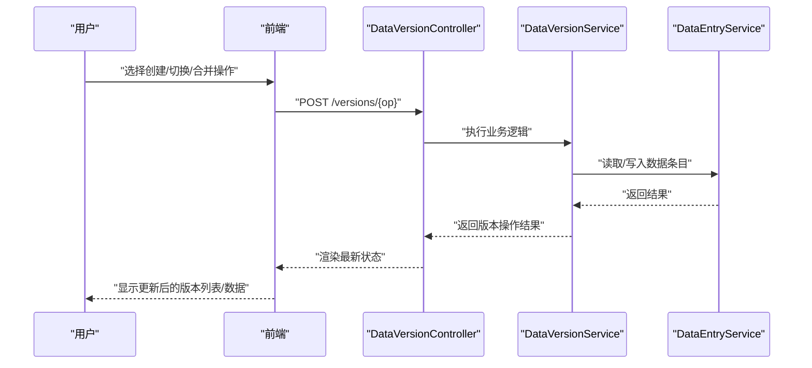
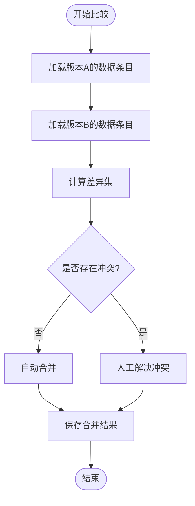
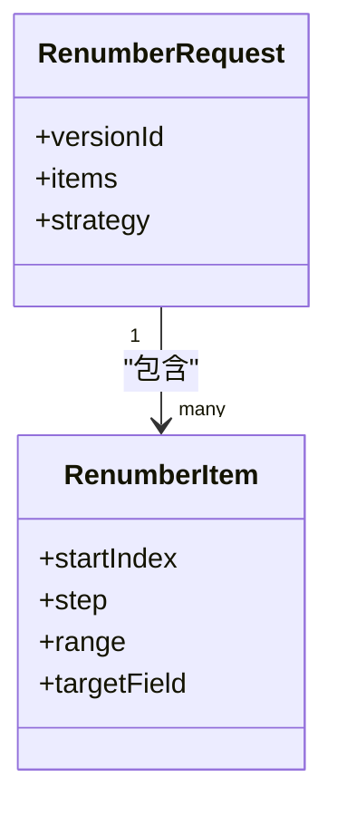
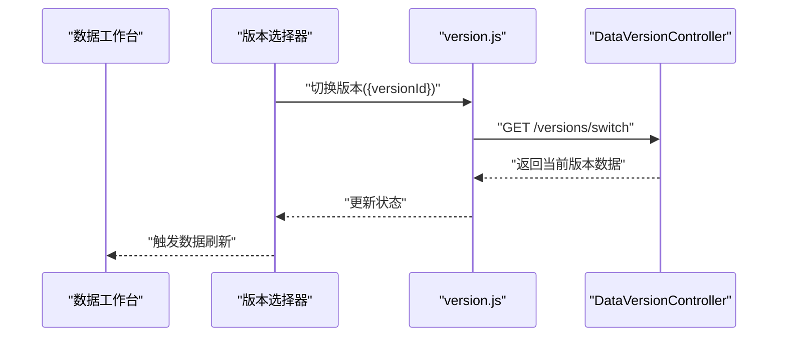
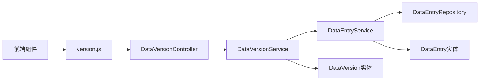

# 版本控制系统

<cite>
**本文引用的文件**
- [DataVersion.java](file://src/main/java/com/superpower/modules/version/entity/DataVersion.java)
- [DataVersionController.java](file://src/main/java/com/superpower/modules/version/controller/DataVersionController.java)
- [DataVersionService.java](file://src/main/java/com/superpower/modules/version/service/DataVersionService.java)
- [RenumberRequest.java](file://src/main/java/com/superpower/modules/data/dto/RenumberRequest.java)
- [RenumberItem.java](file://src/main/java/com/superpower/modules/data/dto/RenumberItem.java)
- [DataEntry.java](file://src/main/java/com/superpower/modules/data/entity/DataEntry.java)
- [DataEntryService.java](file://src/main/java/com/superpower/modules/data/service/DataEntryService.java)
- [version.js](file://frontend/src/api/version.js)
- [VersionManage.vue](file://frontend/src/views/system/VersionManage.vue)
- [VersionSelector.vue](file://frontend/src/components/VersionSelector.vue)
- [DataWorkbench.vue](file://frontend/src/views/dashboard/DataWorkbench.vue)
- [DataEntryController.java](file://src/main/java/com/superpower/modules/data/controller/DataEntryController.java)
- [DataEntryDTO.java](file://src/main/java/com/superpower/modules/data/dto/DataEntryDTO.java)
- [DataEntrySummaryDTO.java](file://src/main/java/com/superpower/modules/data/dto/DataEntrySummaryDTO.java)
- [DataEntryRepository.java](file://src/main/java/com/superpower/modules/data/repository/DataEntryRepository.java)
- [DataInitializer.java](file://src/main/java/com/superpower/modules/category/service/DataInitializer.java)
- [init.sql](file://src/main/resources/db/init.sql)
</cite>

## 目录
1. [简介](#简介)
2. [项目结构](#项目结构)
3. [核心组件](#核心组件)
4. [架构总览](#架构总览)
5. [详细组件分析](#详细组件分析)
6. [依赖关系分析](#依赖关系分析)
7. [性能考虑](#性能考虑)
8. [故障排查指南](#故障排查指南)
9. [结论](#结论)
10. [附录](#附录)

## 简介
本项目围绕“版本控制系统”构建，目标是为产品清单（数据条目）提供完整的版本生命周期管理能力，包括草稿与发布状态的转换、版本历史追踪、版本比较与冲突处理、版本回滚以及批量重编号等核心功能。系统采用前后端分离架构：后端基于Spring Boot提供REST API，前端Vue应用提供可视化界面与交互。

版本控制的关键价值在于：
- 在不破坏现有生产数据的前提下进行变更与验证
- 支持多版本并行管理与快速回滚
- 提供差异对比与冲突解决策略，保障数据一致性
- 通过批量重编号提升大规模数据整理效率

## 项目结构
后端模块按领域划分，版本控制相关代码集中在version模块；数据条目与重编号逻辑位于data模块；前端提供版本管理页面与版本选择器组件。

图表来源
- [DataVersionController.java:1-200](file://src/main/java/com/superpower/modules/version/controller/DataVersionController.java#L1-L200)
- [DataVersionService.java:1-300](file://src/main/java/com/superpower/modules/version/service/DataVersionService.java#L1-L300)
- [DataEntryController.java:1-200](file://src/main/java/com/superpower/modules/data/controller/DataEntryController.java#L1-L200)
- [version.js:1-200](file://frontend/src/api/version.js#L1-L200)
- [VersionManage.vue:1-200](file://frontend/src/views/system/VersionManage.vue#L1-L200)
- [VersionSelector.vue:1-200](file://frontend/src/components/VersionSelector.vue#L1-L200)
- [DataWorkbench.vue:1-200](file://frontend/src/views/dashboard/DataWorkbench.vue#L1-L200)

章节来源
- [DataVersionController.java:1-200](file://src/main/java/com/superpower/modules/version/controller/DataVersionController.java#L1-L200)
- [DataVersionService.java:1-300](file://src/main/java/com/superpower/modules/version/service/DataVersionService.java#L1-L300)
- [DataEntryController.java:1-200](file://src/main/java/com/superpower/modules/data/controller/DataEntryController.java#L1-L200)
- [version.js:1-200](file://frontend/src/api/version.js#L1-L200)

## 核心组件
- DataVersion 实体：承载版本元数据与状态，支持草稿、发布等状态流转及历史追踪
- DataVersionController 控制器：对外暴露版本管理API
- DataVersionService 服务：实现版本创建、切换、合并、回滚等业务逻辑
- RenumberRequest/RenumberItem DTO：批量重编号请求与单项定义
- DataEntry 数据条目实体：版本化数据的载体
- 前端版本管理页面与版本选择器：用户交互入口

章节来源
- [DataVersion.java:1-200](file://src/main/java/com/superpower/modules/version/entity/DataVersion.java#L1-L200)
- [DataVersionController.java:1-200](file://src/main/java/com/superpower/modules/version/controller/DataVersionController.java#L1-L200)
- [DataVersionService.java:1-300](file://src/main/java/com/superpower/modules/version/service/DataVersionService.java#L1-L300)
- [RenumberRequest.java:1-200](file://src/main/java/com/superpower/modules/data/dto/RenumberRequest.java#L1-L200)
- [RenumberItem.java:1-200](file://src/main/java/com/superpower/modules/data/dto/RenumberItem.java#L1-L200)
- [DataEntry.java:1-200](file://src/main/java/com/superpower/modules/data/entity/DataEntry.java#L1-L200)

## 架构总览
系统采用分层架构：表现层（前端Vue）、API层（Spring MVC）、服务层（业务逻辑）、数据访问层（JPA Repository）。版本控制贯穿数据层与服务层，确保对数据条目的所有变更都可被版本化追踪。

图表来源
- [DataVersionController.java:1-200](file://src/main/java/com/superpower/modules/version/controller/DataVersionController.java#L1-L200)
- [DataVersionService.java:1-300](file://src/main/java/com/superpower/modules/version/service/DataVersionService.java#L1-L300)
- [DataEntryService.java:1-200](file://src/main/java/com/superpower/modules/data/service/DataEntryService.java#L1-L200)
- [DataEntryRepository.java:1-200](file://src/main/java/com/superpower/modules/data/repository/DataEntryRepository.java#L1-L200)
- [init.sql:1-200](file://src/main/resources/db/init.sql#L1-L200)

## 详细组件分析

### DataVersion 实体设计
DataVersion作为版本控制的核心实体，负责：
- 维护版本标识、名称、描述与状态（草稿/发布/归档）
- 记录创建时间、修改时间、关联用户与上下文信息
- 与数据条目建立一对多关系，支撑版本化数据的存储与查询
- 支持版本历史排序与检索，便于UI展示与回滚操作

图表来源
- [DataVersion.java:1-200](file://src/main/java/com/superpower/modules/version/entity/DataVersion.java#L1-L200)
- [DataEntry.java:1-200](file://src/main/java/com/superpower/modules/data/entity/DataEntry.java#L1-L200)

章节来源
- [DataVersion.java:1-200](file://src/main/java/com/superpower/modules/version/entity/DataVersion.java#L1-L200)
- [DataEntry.java:1-200](file://src/main/java/com/superpower/modules/data/entity/DataEntry.java#L1-L200)

### 版本创建、切换与合并流程
- 创建：基于当前草稿或基线版本生成新版本，复制数据条目并分配唯一版本号
- 切换：在多个版本间切换，加载对应版本的数据条目集合
- 合并：将一个版本的变更合并到另一个版本，处理冲突与重复项

图表来源
- [DataVersionController.java:1-200](file://src/main/java/com/superpower/modules/version/controller/DataVersionController.java#L1-L200)
- [DataVersionService.java:1-300](file://src/main/java/com/superpower/modules/version/service/DataVersionService.java#L1-L300)
- [DataEntryService.java:1-200](file://src/main/java/com/superpower/modules/data/service/DataEntryService.java#L1-L200)

章节来源
- [DataVersionController.java:1-200](file://src/main/java/com/superpower/modules/version/controller/DataVersionController.java#L1-L200)
- [DataVersionService.java:1-300](file://src/main/java/com/superpower/modules/version/service/DataVersionService.java#L1-L300)
- [DataEntryService.java:1-200](file://src/main/java/com/superpower/modules/data/service/DataEntryService.java#L1-L200)

### 版本比较与冲突解决
- 差异检测：比较两个版本的数据条目集合，识别新增、删除、修改项
- 冲突判定：当同一数据条目在同一层级出现不同变更时标记冲突
- 解决策略：提供自动合并（如无冲突）与人工介入（冲突）两种路径
- 回滚机制：支持将当前版本回滚到指定历史版本，保证数据一致性

图表来源
- [DataVersionService.java:1-300](file://src/main/java/com/superpower/modules/version/service/DataVersionService.java#L1-L300)
- [DataEntryService.java:1-200](file://src/main/java/com/superpower/modules/data/service/DataEntryService.java#L1-L200)

章节来源
- [DataVersionService.java:1-300](file://src/main/java/com/superpower/modules/version/service/DataVersionService.java#L1-L300)
- [DataEntryService.java:1-200](file://src/main/java/com/superpower/modules/data/service/DataEntryService.java#L1-L200)

### 批量重编号（RenumberRequest/RenumberItem）
- RenumberRequest：封装批量重编号的请求参数，包含目标版本、排序规则、范围等
- RenumberItem：单个重编号任务项，定义起始索引、步长、目标范围等
- 执行流程：服务层根据请求解析每个RenumberItem，对目标范围内数据条目进行连续重排，保持排序字段唯一且有序

图表来源
- [RenumberRequest.java:1-200](file://src/main/java/com/superpower/modules/data/dto/RenumberRequest.java#L1-L200)
- [RenumberItem.java:1-200](file://src/main/java/com/superpower/modules/data/dto/RenumberItem.java#L1-L200)

章节来源
- [RenumberRequest.java:1-200](file://src/main/java/com/superpower/modules/data/dto/RenumberRequest.java#L1-L200)
- [RenumberItem.java:1-200](file://src/main/java/com/superpower/modules/data/dto/RenumberItem.java#L1-L200)

### 前端集成与用户界面
- 版本管理页：展示版本列表、状态、操作按钮（创建、切换、合并、回滚、删除）
- 版本选择器：在工作台中动态切换当前版本，实时刷新数据视图
- API封装：统一调用后端版本接口，处理错误与加载状态

图表来源
- [version.js:1-200](file://frontend/src/api/version.js#L1-L200)
- [VersionManage.vue:1-200](file://frontend/src/views/system/VersionManage.vue#L1-L200)
- [VersionSelector.vue:1-200](file://frontend/src/components/VersionSelector.vue#L1-L200)
- [DataWorkbench.vue:1-200](file://frontend/src/views/dashboard/DataWorkbench.vue#L1-L200)

章节来源
- [version.js:1-200](file://frontend/src/api/version.js#L1-L200)
- [VersionManage.vue:1-200](file://frontend/src/views/system/VersionManage.vue#L1-L200)
- [VersionSelector.vue:1-200](file://frontend/src/components/VersionSelector.vue#L1-L200)
- [DataWorkbench.vue:1-200](file://frontend/src/views/dashboard/DataWorkbench.vue#L1-L200)

## 依赖关系分析
- 控制器依赖服务层，服务层依赖仓库层与数据条目服务
- 版本实体与数据条目实体存在一对多关系，版本作为容器聚合数据条目
- 前端通过API封装与控制器交互，版本管理页与版本选择器共同驱动数据刷新

图表来源
- [DataVersionController.java:1-200](file://src/main/java/com/superpower/modules/version/controller/DataVersionController.java#L1-L200)
- [DataVersionService.java:1-300](file://src/main/java/com/superpower/modules/version/service/DataVersionService.java#L1-L300)
- [DataEntryService.java:1-200](file://src/main/java/com/superpower/modules/data/service/DataEntryService.java#L1-L200)
- [DataEntryRepository.java:1-200](file://src/main/java/com/superpower/modules/data/repository/DataEntryRepository.java#L1-L200)
- [DataVersion.java:1-200](file://src/main/java/com/superpower/modules/version/entity/DataVersion.java#L1-L200)
- [DataEntry.java:1-200](file://src/main/java/com/superpower/modules/data/entity/DataEntry.java#L1-L200)
- [version.js:1-200](file://frontend/src/api/version.js#L1-L200)

章节来源
- [DataVersionController.java:1-200](file://src/main/java/com/superpower/modules/version/controller/DataVersionController.java#L1-L200)
- [DataVersionService.java:1-300](file://src/main/java/com/superpower/modules/version/service/DataVersionService.java#L1-L300)
- [DataEntryService.java:1-200](file://src/main/java/com/superpower/modules/data/service/DataEntryService.java#L1-L200)
- [DataEntryRepository.java:1-200](file://src/main/java/com/superpower/modules/data/repository/DataEntryRepository.java#L1-L200)
- [DataVersion.java:1-200](file://src/main/java/com/superpower/modules/version/entity/DataVersion.java#L1-L200)
- [DataEntry.java:1-200](file://src/main/java/com/superpower/modules/data/entity/DataEntry.java#L1-L200)
- [version.js:1-200](file://frontend/src/api/version.js#L1-L200)

## 性能考虑
- 查询优化：版本切换与比较应使用分页与索引，避免全表扫描
- 写入优化：批量重编号建议事务内执行，减少锁竞争与回滚成本
- 缓存策略：热门版本可在内存缓存，降低频繁读取开销
- 并发控制：版本状态变更需加锁或乐观锁，防止竞态条件

## 故障排查指南
- 版本状态异常：检查状态机转换逻辑与数据库约束，确认草稿→发布→归档的合法性
- 比较冲突：优先人工介入，保留高优先级版本的变更，其余冲突项标记待处理
- 回滚失败：核对目标版本是否存在、数据条目是否被锁定，必要时清理临时状态
- 重编号异常：校验起始索引与步长，确保排序字段唯一性，避免跨版本覆盖

章节来源
- [DataVersionService.java:1-300](file://src/main/java/com/superpower/modules/version/service/DataVersionService.java#L1-L300)
- [DataEntryService.java:1-200](file://src/main/java/com/superpower/modules/data/service/DataEntryService.java#L1-L200)

## 结论
本版本控制系统以DataVersion为核心，结合DataEntry实现数据条目的版本化管理，提供从草稿到发布的完整生命周期支持，并通过比较与冲突解决保障数据一致性。批量重编号能力显著提升大规模数据整理效率。前端通过版本管理页与版本选择器实现无缝切换与可视化操作。建议在生产环境中完善并发控制与缓存策略，持续优化比较与回滚性能。

## 附录

### API 接口文档（概要）
- 获取版本列表
  - 方法：GET
  - 路径：/api/versions
  - 参数：无
  - 返回：版本列表（含状态、创建时间、描述）
- 创建版本
  - 方法：POST
  - 路径：/api/versions/create
  - 请求体：版本基础信息
  - 返回：新建版本信息
- 切换版本
  - 方法：POST
  - 路径：/api/versions/switch
  - 请求体：目标版本ID
  - 返回：当前版本数据
- 合并版本
  - 方法：POST
  - 路径：/api/versions/merge
  - 请求体：源版本ID、目标版本ID、冲突解决策略
  - 返回：合并结果
- 回滚版本
  - 方法：POST
  - 路径：/api/versions/rollback
  - 请求体：目标版本ID（回滚到的历史版本）
  - 返回：回滚结果
- 删除版本
  - 方法：DELETE
  - 路径：/api/versions/{id}
  - 返回：删除结果
- 批量重编号
  - 方法：POST
  - 路径：/api/versions/reindex
  - 请求体：RenumberRequest
  - 返回：重编号结果

章节来源
- [DataVersionController.java:1-200](file://src/main/java/com/superpower/modules/version/controller/DataVersionController.java#L1-L200)
- [version.js:1-200](file://frontend/src/api/version.js#L1-L200)

### 使用示例（场景与最佳实践）
- 场景一：产品清单草稿编辑
  - 在草稿状态下进行多次修改，完成后提交发布，确保不影响线上数据
- 场景二：版本间对比与合并
  - 对比两个版本的差异，自动合并无冲突部分，人工解决冲突项后再合并
- 场景三：批量重编号
  - 针对大量数据条目进行连续重排，设置合理的起始索引与步长，确保排序唯一性
- 最佳实践
  - 严格遵循草稿→发布的状态机，避免直接跳过关键步骤
  - 对重要版本启用归档策略，保留历史记录
  - 合并前先做差异预览，减少冲突概率
  - 回滚前做好备份与影响评估