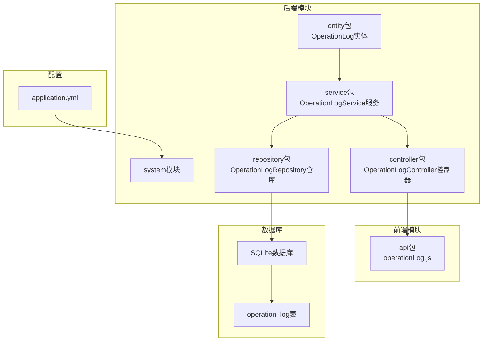
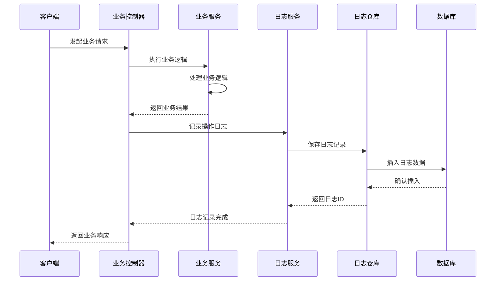
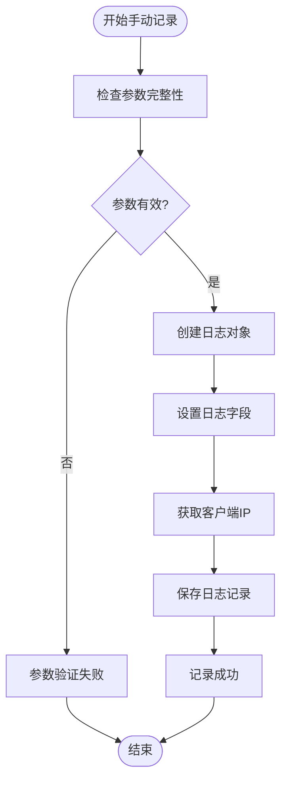
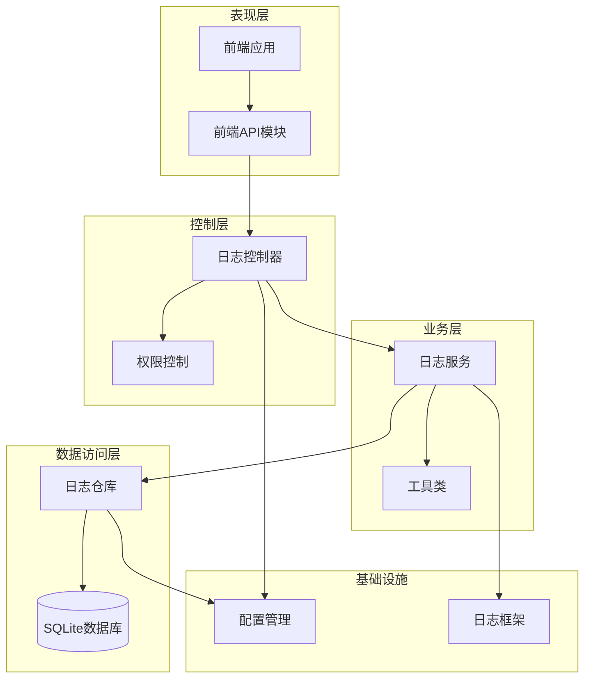
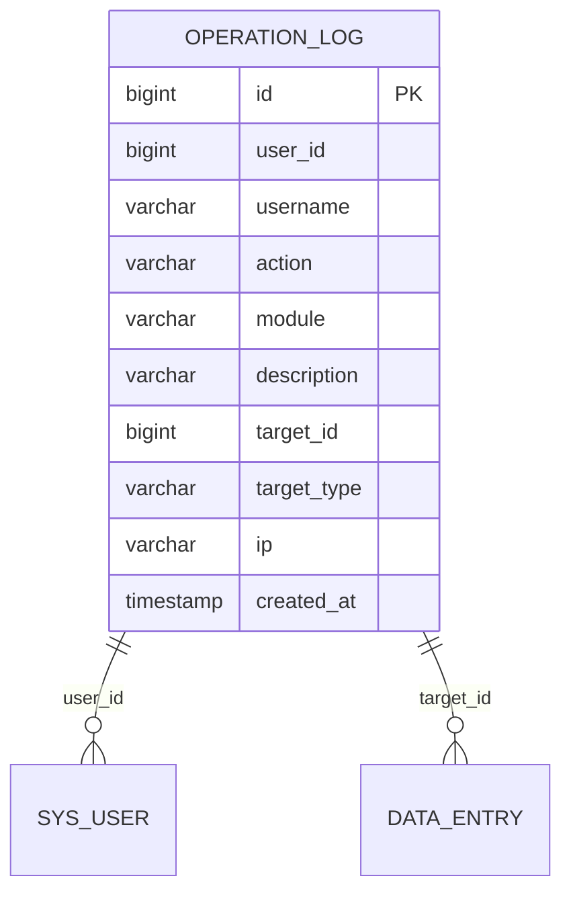
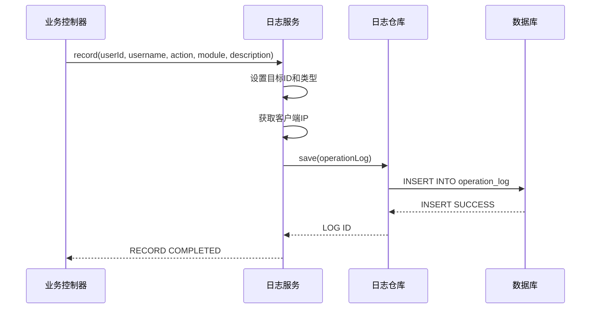
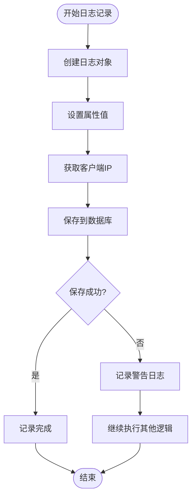
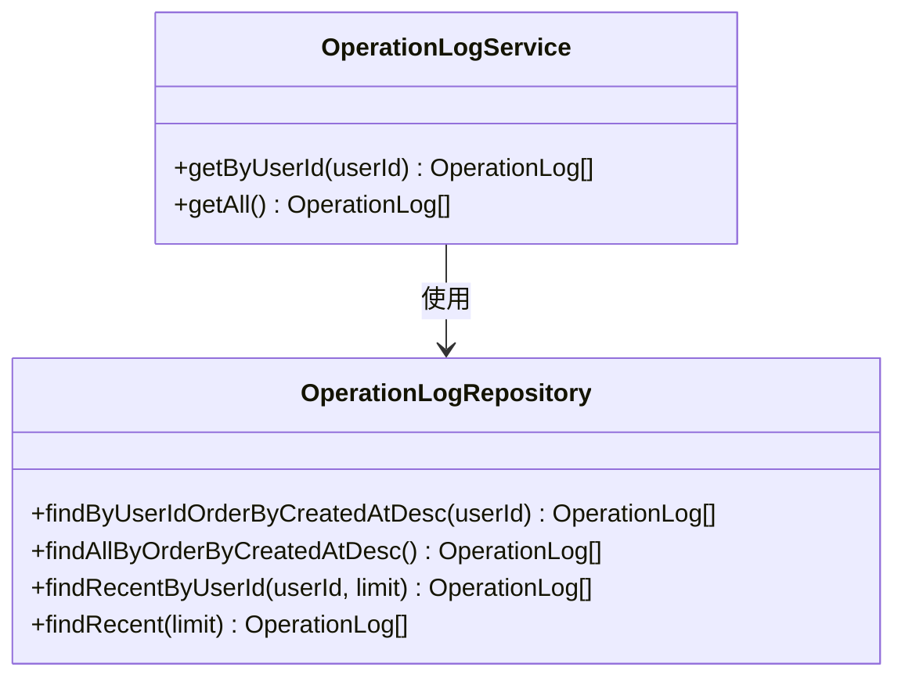
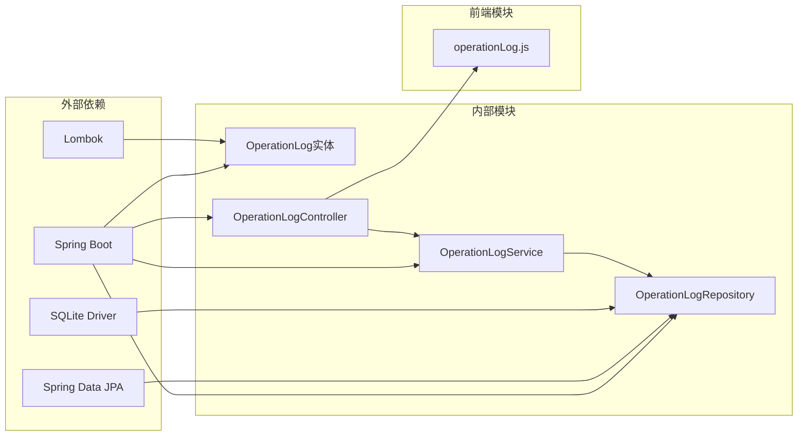
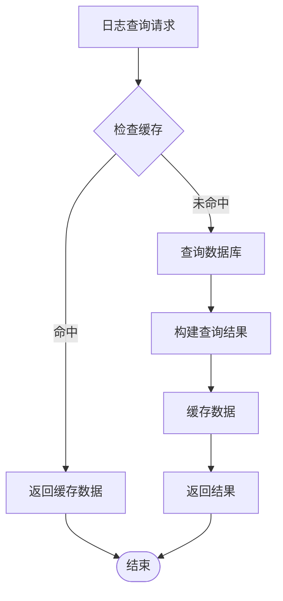

# 操作日志系统

<cite>
**本文档引用的文件**
- [OperationLog.java](file://src/main/java/com/superpower/modules/system/entity/OperationLog.java)
- [OperationLogService.java](file://src/main/java/com/superpower/modules/system/service/OperationLogService.java)
- [OperationLogController.java](file://src/main/java/com/superpower/modules/system/controller/OperationLogController.java)
- [OperationLogRepository.java](file://src/main/java/com/superpower/modules/system/repository/OperationLogRepository.java)
- [application.yml](file://src/main/resources/application.yml)
- [operationLog.js](file://frontend/src/api/operationLog.js)
- [DataEntryController.java](file://src/main/java/com/superpower/modules/data/controller/DataEntryController.java)
- [ApprovalController.java](file://src/main/java/com/superpower/modules/approval/controller/ApprovalController.java)
- [V1.0.6_add_last_login_at_and_operation_log.sql](file://db_changes/V1.0.6_add_last_login_at_and_operation_log.sql)
</cite>

## 目录
1. [简介](#简介)
2. [项目结构](#项目结构)
3. [核心组件](#核心组件)
4. [架构概览](#架构概览)
5. [详细组件分析](#详细组件分析)
6. [依赖关系分析](#依赖关系分析)
7. [性能考虑](#性能考虑)
8. [故障排除指南](#故障排除指南)
9. [结论](#结论)
10. [附录](#附录)

## 简介

操作日志系统是本项目中的重要组成部分，用于记录用户的操作行为、系统事件和异常情况。该系统提供了完整的日志记录、查询和审计功能，支持用户操作追踪、系统异常监控和合规性审计等应用场景。

系统采用Spring Boot + JPA + SQLite的技术栈，实现了轻量级但功能完备的日志管理方案。通过实体-服务-控制器三层架构，确保了日志数据的完整性和可追溯性。

## 项目结构

操作日志系统在项目中的组织结构如下：

**图表来源**
- [OperationLog.java:1-42](file://src/main/java/com/superpower/modules/system/entity/OperationLog.java#L1-L42)
- [OperationLogService.java:1-77](file://src/main/java/com/superpower/modules/system/service/OperationLogService.java#L1-L77)
- [OperationLogController.java:1-33](file://src/main/java/com/superpower/modules/system/controller/OperationLogController.java#L1-L33)
- [OperationLogRepository.java:1-20](file://src/main/java/com/superpower/modules/system/repository/OperationLogRepository.java#L1-L20)

**章节来源**
- [application.yml:1-40](file://src/main/resources/application.yml#L1-L40)

## 核心组件

### OperationLog实体设计

OperationLog实体是日志系统的核心数据模型，采用JPA注解进行映射：

| 字段名 | 类型 | 长度限制 | 描述 | 索引 |
|--------|------|----------|------|------|
| id | Long | 自增主键 | 日志唯一标识 | 主键 |
| userId | Long | 无 | 用户ID | 是 |
| username | String | 50字符 | 用户名 | 否 |
| action | String | 50字符 | 操作类型 | 否 |
| module | String | 50字符 | 所属模块 | 否 |
| description | String | 500字符 | 操作描述 | 否 |
| targetId | Long | 无 | 目标对象ID | 是 |
| targetType | String | 50字符 | 目标对象类型 | 否 |
| ip | String | 50字符 | 操作IP地址 | 否 |
| createdAt | LocalDateTime | 无 | 创建时间 | 是 |

实体设计特点：
- 使用Lombok注解简化代码
- 采用UTC时间存储，本地化显示
- 支持软删除标记（通过业务逻辑实现）
- 提供默认时间戳

**章节来源**
- [OperationLog.java:10-41](file://src/main/java/com/superpower/modules/system/entity/OperationLog.java#L10-L41)

### OperationLogService日志记录机制

OperationLogService提供了完整的日志记录功能，包括自动日志捕获和手动日志记录两种方式：

#### 自动日志捕获
系统通过在各个业务控制器中集成日志记录，实现了对用户操作的自动追踪：

**图表来源**
- [DataEntryController.java:133-140](file://src/main/java/com/superpower/modules/data/controller/DataEntryController.java#L133-L140)
- [OperationLogService.java:31-48](file://src/main/java/com/superpower/modules/system/service/OperationLogService.java#L31-L48)

#### 手动日志记录
系统提供了灵活的手动日志记录接口：

**图表来源**
- [OperationLogService.java:27-48](file://src/main/java/com/superpower/modules/system/service/OperationLogService.java#L27-L48)

**章节来源**
- [OperationLogService.java:17-77](file://src/main/java/com/superpower/modules/system/service/OperationLogService.java#L17-L77)

### OperationLogController API接口

系统提供了RESTful API接口用于日志查询和管理：

| 接口 | 方法 | 路径 | 权限要求 | 功能描述 |
|------|------|------|----------|----------|
| 获取用户日志 | GET | `/api/operation-logs/user/{userId}` | ADMIN | 查询指定用户的最近操作日志 |
| 获取所有日志 | GET | `/api/operation-logs` | ADMIN | 查询系统所有操作日志 |
| 导出日志 | GET | `/api/operation-logs/export` | ADMIN | 导出日志数据（扩展功能） |

**章节来源**
- [OperationLogController.java:21-31](file://src/main/java/com/superpower/modules/system/controller/OperationLogController.java#L21-L31)

## 架构概览

操作日志系统的整体架构采用分层设计，确保了高内聚低耦合：

**图表来源**
- [OperationLogController.java:11-33](file://src/main/java/com/superpower/modules/system/controller/OperationLogController.java#L11-L33)
- [OperationLogService.java:16-25](file://src/main/java/com/superpower/modules/system/service/OperationLogService.java#L16-L25)
- [OperationLogRepository.java:9-19](file://src/main/java/com/superpower/modules/system/repository/OperationLogRepository.java#L9-L19)

## 详细组件分析

### 数据模型设计

OperationLog实体采用了规范的数据库设计原则：

**图表来源**
- [V1.0.6_add_last_login_at_and_operation_log.sql:3-16](file://db_changes/V1.0.6_add_last_login_at_and_operation_log.sql#L3-L16)

#### 字段设计考量

1. **用户信息字段**：userId和username确保了用户身份的完整记录
2. **操作描述字段**：description字段支持详细的业务上下文记录
3. **目标追踪字段**：targetId和targetType实现了跨模块的目标追踪
4. **时间戳字段**：createdAt支持精确的时间定位和统计分析

**章节来源**
- [OperationLog.java:15-40](file://src/main/java/com/superpower/modules/system/entity/OperationLog.java#L15-L40)

### 日志记录流程

系统实现了多种日志记录场景：

#### 业务操作日志记录

**图表来源**
- [DataEntryController.java:137-139](file://src/main/java/com/superpower/modules/data/controller/DataEntryController.java#L137-L139)
- [OperationLogService.java:31-48](file://src/main/java/com/superpower/modules/system/service/OperationLogService.java#L31-L48)

#### 异常处理机制

日志记录包含了完善的异常处理：

**图表来源**
- [OperationLogService.java:45-47](file://src/main/java/com/superpower/modules/system/service/OperationLogService.java#L45-L47)

**章节来源**
- [OperationLogService.java:31-48](file://src/main/java/com/superpower/modules/system/service/OperationLogService.java#L31-L48)

### 查询功能实现

系统提供了灵活的日志查询功能：

#### 最近日志查询

**图表来源**
- [OperationLogRepository.java:9-19](file://src/main/java/com/superpower/modules/system/repository/OperationLogRepository.java#L9-L19)
- [OperationLogService.java:50-56](file://src/main/java/com/superpower/modules/system/service/OperationLogService.java#L50-L56)

**章节来源**
- [OperationLogRepository.java:14-18](file://src/main/java/com/superpower/modules/system/repository/OperationLogRepository.java#L14-L18)
- [OperationLogService.java:50-56](file://src/main/java/com/superpower/modules/system/service/OperationLogService.java#L50-L56)

## 依赖关系分析

操作日志系统的依赖关系清晰明确：

**图表来源**
- [OperationLog.java:3-5](file://src/main/java/com/superpower/modules/system/entity/OperationLog.java#L3-L5)
- [OperationLogService.java:3-12](file://src/main/java/com/superpower/modules/system/service/OperationLogService.java#L3-L12)
- [OperationLogController.java:3-7](file://src/main/java/com/superpower/modules/system/controller/OperationLogController.java#L3-L7)

**章节来源**
- [application.yml:18-34](file://src/main/resources/application.yml#L18-L34)

## 性能考虑

### 数据库性能优化

系统在数据库层面采用了多项优化措施：

1. **索引策略**：
   - user_id字段建立索引，支持用户维度查询
   - created_at字段建立索引，支持时间维度查询
   - 组合索引优化常用查询模式

2. **连接池配置**：
   - 最大连接数：3个
   - 连接超时：60秒
   - 泄漏检测阈值：30秒

3. **SQL优化**：
   - 使用LIMIT子句限制查询结果数量
   - 采用原生SQL查询提高性能
   - 避免N+1查询问题

### 缓存策略

系统当前未实现专门的日志缓存，但具备良好的扩展性：

### 内存管理

日志服务在内存管理方面采取了以下措施：

1. **事务隔离**：使用REQUIRES_NEW传播行为确保日志记录的独立性
2. **异常处理**：捕获并记录日志写入异常，不影响主业务流程
3. **资源释放**：确保数据库连接和事务的正确关闭

## 故障排除指南

### 常见问题及解决方案

#### 日志记录失败

**问题现象**：日志无法写入数据库

**可能原因**：
1. 数据库连接异常
2. 数据库表结构不匹配
3. 约束冲突
4. 权限不足

**解决步骤**：
1. 检查数据库连接配置
2. 验证operation_log表结构
3. 查看数据库日志
4. 确认数据库权限

#### IP地址获取失败

**问题现象**：日志中IP地址为空

**解决方法**：
1. 检查代理服务器配置
2. 验证请求头设置
3. 确认网络环境

**章节来源**
- [OperationLogService.java:58-75](file://src/main/java/com/superpower/modules/system/service/OperationLogService.java#L58-L75)

### 监控和调试

系统提供了完善的监控机制：

1. **日志级别**：DEBUG级别输出详细的操作日志
2. **异常捕获**：统一的异常处理和日志记录
3. **性能监控**：数据库连接池状态监控
4. **健康检查**：数据库连接可用性检查

## 结论

操作日志系统通过精心设计的架构和实现，为项目提供了完整、可靠、可扩展的日志管理能力。系统具有以下优势：

1. **完整性**：覆盖了用户操作、系统事件、异常情况等各类日志
2. **可追溯性**：通过目标追踪和时间戳确保操作的完整链路
3. **可扩展性**：模块化设计便于功能扩展和维护
4. **性能友好**：合理的数据库设计和查询优化
5. **安全可靠**：完善的权限控制和异常处理机制

该系统为用户操作追踪、系统异常监控和合规性审计提供了坚实的技术基础，能够满足现代企业对日志管理的各种需求。

## 附录

### 使用场景示例

#### 用户操作追踪
- 新建数据条目：记录创建操作和目标ID
- 更新数据条目：记录更新前后的差异
- 删除数据条目：记录删除操作和影响范围

#### 系统异常监控
- 数据库连接异常：记录异常类型和时间
- 权限验证失败：记录用户尝试和拒绝原因
- 业务逻辑异常：记录异常堆栈和上下文信息

#### 合规性审计
- 数据访问日志：记录敏感数据的访问情况
- 权限变更日志：记录角色和权限的变更历史
- 操作审计日志：记录关键业务操作的完整过程

### 最佳实践建议

1. **日志分级**：根据重要性设置不同的日志级别
2. **敏感信息保护**：避免记录密码等敏感信息
3. **性能监控**：定期监控日志系统的性能指标
4. **存储策略**：制定合理的日志保留和清理策略
5. **备份机制**：确保日志数据的安全备份