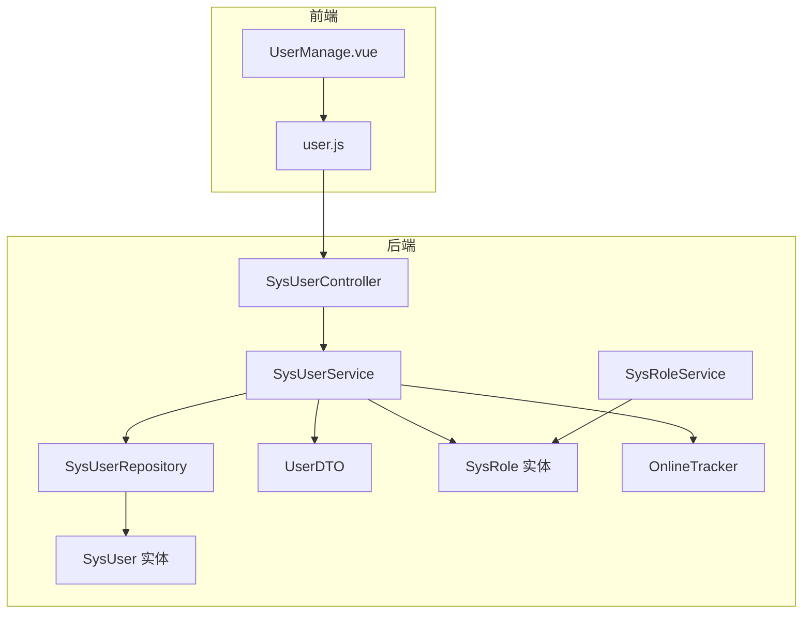
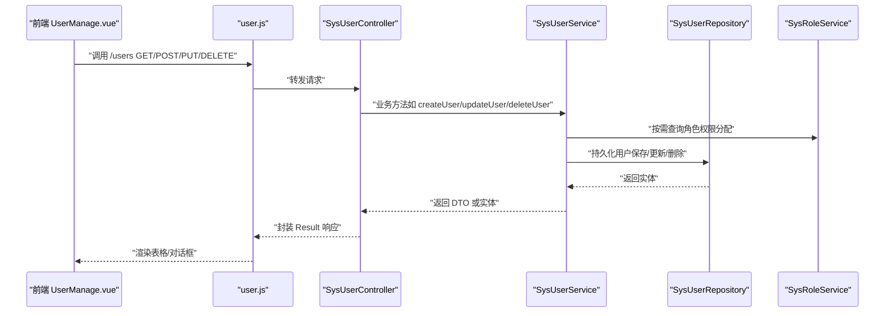
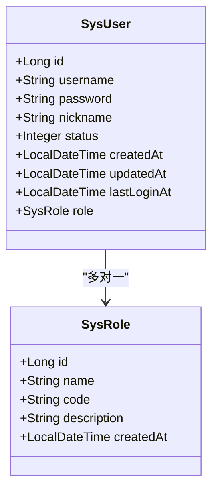
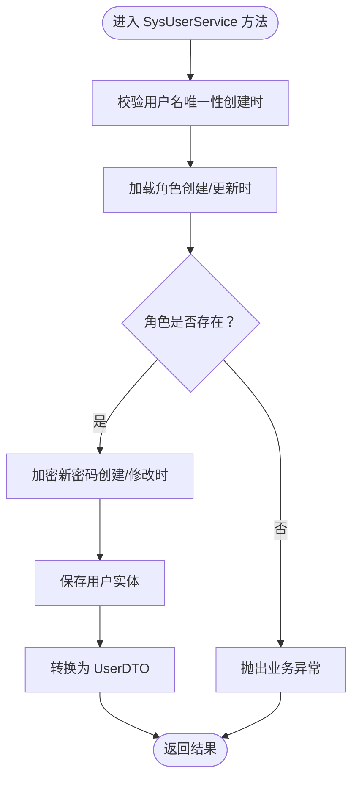
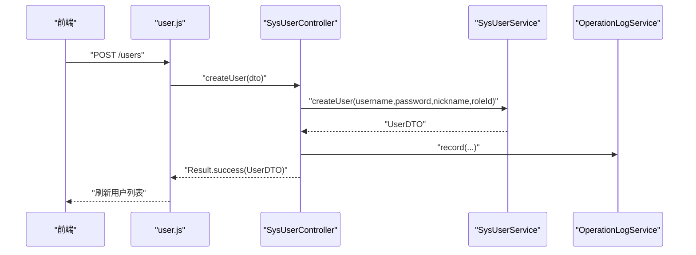
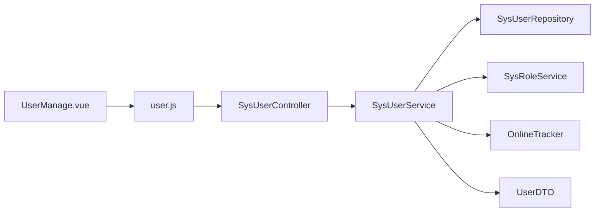

# 用户管理模块

<cite>
**本文引用的文件**
- [SysUser.java](file://src/main/java/com/superpower/modules/system/entity/SysUser.java)
- [SysUserService.java](file://src/main/java/com/superpower/modules/system/service/SysUserService.java)
- [SysUserController.java](file://src/main/java/com/superpower/modules/system/controller/SysUserController.java)
- [UserDTO.java](file://src/main/java/com/superpower/modules/system/dto/UserDTO.java)
- [SysUserRepository.java](file://src/main/java/com/superpower/modules/system/repository/SysUserRepository.java)
- [SysRole.java](file://src/main/java/com/superpower/modules/system/entity/SysRole.java)
- [SysRoleService.java](file://src/main/java/com/superpower/modules/system/service/SysRoleService.java)
- [OnlineTracker.java](file://src/main/java/com/superpower/security/OnlineTracker.java)
- [UserManage.vue](file://frontend/src/views/system/UserManage.vue)
- [user.js](file://frontend/src/api/user.js)
</cite>

## 目录
1. [简介](#简介)
2. [项目结构](#项目结构)
3. [核心组件](#核心组件)
4. [架构总览](#架构总览)
5. [详细组件分析](#详细组件分析)
6. [依赖关系分析](#依赖关系分析)
7. [性能与可扩展性](#性能与可扩展性)
8. [故障排查指南](#故障排查指南)
9. [结论](#结论)
10. [附录：最佳实践与安全建议](#附录最佳实践与安全建议)

## 简介
本技术文档聚焦于用户管理模块，系统化阐述以下内容：
- SysUser 实体的设计与字段语义（基本信息、账户状态、安全属性）
- SysUserService 服务层的实现要点（用户注册、登录校验前置条件、密码管理、用户信息更新）
- SysUserController 控制器的 API 接口定义（CRUD、批量导入导出现状、用户状态管理）
- UserDTO 数据传输对象的设计与用途
- 结合前端与后端代码路径，演示从“用户注册到权限分配”的完整流程
- 最佳实践与安全注意事项

## 项目结构
用户管理模块位于后端 Java 工程的 system 子包中，采用分层架构：控制器层负责对外暴露 REST API；服务层封装业务逻辑；仓储层负责数据持久化；实体与 DTO 描述数据模型。

图表来源
- [SysUserController.java:1-67](file://src/main/java/com/superpower/modules/system/controller/SysUserController.java#L1-L67)
- [SysUserService.java:1-114](file://src/main/java/com/superpower/modules/system/service/SysUserService.java#L1-L114)
- [SysUserRepository.java:1-13](file://src/main/java/com/superpower/modules/system/repository/SysUserRepository.java#L1-L13)
- [SysUser.java:1-40](file://src/main/java/com/superpower/modules/system/entity/SysUser.java#L1-L40)
- [UserDTO.java:1-18](file://src/main/java/com/superpower/modules/system/dto/UserDTO.java#L1-L18)
- [SysRole.java:1-27](file://src/main/java/com/superpower/modules/system/entity/SysRole.java#L1-L27)
- [SysRoleService.java:1-35](file://src/main/java/com/superpower/modules/system/service/SysRoleService.java#L1-L35)
- [OnlineTracker.java:1-43](file://src/main/java/com/superpower/security/OnlineTracker.java#L1-L43)
- [UserManage.vue:1-181](file://frontend/src/views/system/UserManage.vue#L1-L181)
- [user.js:1-18](file://frontend/src/api/user.js#L1-L18)

章节来源
- [SysUserController.java:1-67](file://src/main/java/com/superpower/modules/system/controller/SysUserController.java#L1-L67)
- [SysUserService.java:1-114](file://src/main/java/com/superpower/modules/system/service/SysUserService.java#L1-L114)
- [SysUserRepository.java:1-13](file://src/main/java/com/superpower/modules/system/repository/SysUserRepository.java#L1-L13)
- [SysUser.java:1-40](file://src/main/java/com/superpower/modules/system/entity/SysUser.java#L1-L40)
- [UserDTO.java:1-18](file://src/main/java/com/superpower/modules/system/dto/UserDTO.java#L1-L18)
- [SysRole.java:1-27](file://src/main/java/com/superpower/modules/system/entity/SysRole.java#L1-L27)
- [SysRoleService.java:1-35](file://src/main/java/com/superpower/modules/system/service/SysRoleService.java#L1-L35)
- [OnlineTracker.java:1-43](file://src/main/java/com/superpower/security/OnlineTracker.java#L1-L43)
- [UserManage.vue:1-181](file://frontend/src/views/system/UserManage.vue#L1-L181)
- [user.js:1-18](file://frontend/src/api/user.js#L1-L18)

## 核心组件
- 实体层
  - SysUser：用户实体，包含主键、用户名、密码、昵称、角色关联、状态、创建/更新时间、最近登录时间等字段
  - SysRole：角色实体，包含主键、名称、编码、描述、创建时间等字段
- 仓储层
  - SysUserRepository：基于 Spring Data JPA 提供按用户名查询与存在性检查
- 服务层
  - SysUserService：封装用户注册、更新、删除、密码修改、昵称更新、DTO 转换、在线状态判定
  - SysRoleService：角色查询与创建（用于权限分配）
  - OnlineTracker：在线用户追踪（用于 UserDTO.online 字段）
- 控制器层
  - SysUserController：提供用户列表、创建、更新、删除的 REST 接口，并记录操作日志
- 数据传输层
  - UserDTO：前后端交互的数据载体，包含用户基础信息、角色信息、状态、最近登录时间、在线标记

章节来源
- [SysUser.java:1-40](file://src/main/java/com/superpower/modules/system/entity/SysUser.java#L1-L40)
- [SysRole.java:1-27](file://src/main/java/com/superpower/modules/system/entity/SysRole.java#L1-L27)
- [SysUserRepository.java:1-13](file://src/main/java/com/superpower/modules/system/repository/SysUserRepository.java#L1-L13)
- [SysUserService.java:1-114](file://src/main/java/com/superpower/modules/system/service/SysUserService.java#L1-L114)
- [SysRoleService.java:1-35](file://src/main/java/com/superpower/modules/system/service/SysRoleService.java#L1-L35)
- [OnlineTracker.java:1-43](file://src/main/java/com/superpower/security/OnlineTracker.java#L1-L43)
- [SysUserController.java:1-67](file://src/main/java/com/superpower/modules/system/controller/SysUserController.java#L1-L67)
- [UserDTO.java:1-18](file://src/main/java/com/superpower/modules/system/dto/UserDTO.java#L1-L18)

## 架构总览
用户管理模块遵循典型的三层架构：
- 表现层：前端 Vue 组件通过 API 模块调用后端 REST 接口
- 控制器层：SysUserController 对外暴露 /api/users 下的 CRUD 接口
- 服务层：SysUserService 负责业务规则与领域模型处理
- 仓储层：SysUserRepository 委托 JPA 完成数据库访问
- 安全与在线状态：OnlineTracker 提供在线判定能力，配合 SysUserService 输出 UserDTO.online

图表来源
- [SysUserController.java:1-67](file://src/main/java/com/superpower/modules/system/controller/SysUserController.java#L1-L67)
- [SysUserService.java:1-114](file://src/main/java/com/superpower/modules/system/service/SysUserService.java#L1-L114)
- [SysUserRepository.java:1-13](file://src/main/java/com/superpower/modules/system/repository/SysUserRepository.java#L1-L13)
- [SysRoleService.java:1-35](file://src/main/java/com/superpower/modules/system/service/SysRoleService.java#L1-L35)
- [UserManage.vue:1-181](file://frontend/src/views/system/UserManage.vue#L1-L181)
- [user.js:1-18](file://frontend/src/api/user.js#L1-L18)

## 详细组件分析

### 实体：SysUser 设计与字段语义
- 主键与标识
  - id：自增主键
- 基本信息
  - username：非空、唯一、长度限制，作为登录凭据
  - password：非空、长度限制，存储经加密后的值
  - nickname：长度限制，用户显示名
- 角色关联
  - role：多对一关联至 SysRole，用于权限分配
- 账户状态与审计
  - status：整型状态码，默认启用
  - createdAt/updatedAt：自动填充创建与更新时间
  - lastLoginAt：最近一次登录时间（由登录流程或在线追踪间接影响）

图表来源
- [SysUser.java:1-40](file://src/main/java/com/superpower/modules/system/entity/SysUser.java#L1-L40)
- [SysRole.java:1-27](file://src/main/java/com/superpower/modules/system/entity/SysRole.java#L1-L27)

章节来源
- [SysUser.java:1-40](file://src/main/java/com/superpower/modules/system/entity/SysUser.java#L1-L40)
- [SysRole.java:1-27](file://src/main/java/com/superpower/modules/system/entity/SysRole.java#L1-L27)

### 服务：SysUserService 实现要点
- 用户查询
  - findByUsername/findById/findAll：提供按用户名、ID、全量查询能力
- 用户创建
  - createUser：校验用户名唯一性、角色存在性，使用 PasswordEncoder 加密密码，设置默认状态并保存，返回 UserDTO
- 用户更新
  - updateUser：支持更新昵称、角色、状态，均进行存在性校验后再保存
- 用户删除
  - deleteUser：委托仓库删除
- 密码管理
  - changePassword：校验旧密码匹配后进行加密更新
  - updateNickname：仅更新昵称
- DTO 转换与在线状态
  - toDTO：组装 UserDTO，包含角色名称/编码、状态、最近登录时间、在线标记（通过 OnlineTracker 判定）

图表来源
- [SysUserService.java:1-114](file://src/main/java/com/superpower/modules/system/service/SysUserService.java#L1-L114)

章节来源
- [SysUserService.java:1-114](file://src/main/java/com/superpower/modules/system/service/SysUserService.java#L1-L114)

### 控制器：SysUserController API 文档
- 基础路径：/api/users
- 认证与授权：使用 Spring Security 注解进行权限控制
- 接口定义
  - GET /api/users：获取全部用户，返回 UserDTO 列表
  - POST /api/users：创建用户，请求体为 UserDTO，创建后记录操作日志
  - PUT /api/users/{id}：更新用户，路径参数为 id，请求体为 UserDTO，更新后记录操作日志
  - DELETE /api/users/{id}：删除用户，删除后记录操作日志
- 日志记录：统一通过 OperationLogService 记录操作人、模块、动作、描述、目标类型与 ID

图表来源
- [SysUserController.java:1-67](file://src/main/java/com/superpower/modules/system/controller/SysUserController.java#L1-L67)
- [user.js:1-18](file://frontend/src/api/user.js#L1-L18)

章节来源
- [SysUserController.java:1-67](file://src/main/java/com/superpower/modules/system/controller/SysUserController.java#L1-L67)
- [user.js:1-18](file://frontend/src/api/user.js#L1-L18)

### 数据传输对象：UserDTO
- 字段组成
  - id、username、nickname：用户标识与显示信息
  - roleId、roleName、roleCode：角色标识与名称/编码
  - status：账户状态
  - lastLoginAt：最近登录时间
  - online：是否在线（由 OnlineTracker 判定）
- 用途
  - 在控制器与前端之间传递用户信息，避免直接暴露实体细节
  - 便于前端渲染用户列表、状态标签、在线标记等

章节来源
- [UserDTO.java:1-18](file://src/main/java/com/superpower/modules/system/dto/UserDTO.java#L1-L18)

### 前端集成：UserManage.vue 与 API
- 功能概览
  - 展示用户列表（ID、用户名、昵称、角色、状态、在线、最后登录时间）
  - 新增/编辑用户对话框（用户名（新建时必填）、昵称、角色、状态）
  - 删除确认与操作日志查看
- 关键交互
  - 加载用户与角色：getUsers、getRoles
  - 创建/更新：createUser、updateUser
  - 删除：deleteUser
  - 查看日志：getUserLogs

章节来源
- [UserManage.vue:1-181](file://frontend/src/views/system/UserManage.vue#L1-L181)
- [user.js:1-18](file://frontend/src/api/user.js#L1-L18)

## 依赖关系分析
- 控制器依赖服务：SysUserController 依赖 SysUserService 进行业务编排
- 服务依赖仓储与外部组件：SysUserService 依赖 SysUserRepository、SysRoleService、PasswordEncoder、OnlineTracker
- 实体与 DTO 的映射：SysUserService.toDTO 将实体映射为 DTO
- 前后端通信：前端通过 user.js 调用后端 /api/users 接口

图表来源
- [SysUserController.java:1-67](file://src/main/java/com/superpower/modules/system/controller/SysUserController.java#L1-L67)
- [SysUserService.java:1-114](file://src/main/java/com/superpower/modules/system/service/SysUserService.java#L1-L114)
- [SysUserRepository.java:1-13](file://src/main/java/com/superpower/modules/system/repository/SysUserRepository.java#L1-L13)
- [SysRoleService.java:1-35](file://src/main/java/com/superpower/modules/system/service/SysRoleService.java#L1-L35)
- [OnlineTracker.java:1-43](file://src/main/java/com/superpower/security/OnlineTracker.java#L1-L43)
- [UserDTO.java:1-18](file://src/main/java/com/superpower/modules/system/dto/UserDTO.java#L1-L18)
- [UserManage.vue:1-181](file://frontend/src/views/system/UserManage.vue#L1-L181)
- [user.js:1-18](file://frontend/src/api/user.js#L1-L18)

章节来源
- [SysUserController.java:1-67](file://src/main/java/com/superpower/modules/system/controller/SysUserController.java#L1-L67)
- [SysUserService.java:1-114](file://src/main/java/com/superpower/modules/system/service/SysUserService.java#L1-L114)
- [SysUserRepository.java:1-13](file://src/main/java/com/superpower/modules/system/repository/SysUserRepository.java#L1-L13)
- [SysRoleService.java:1-35](file://src/main/java/com/superpower/modules/system/service/SysRoleService.java#L1-L35)
- [OnlineTracker.java:1-43](file://src/main/java/com/superpower/security/OnlineTracker.java#L1-L43)
- [UserDTO.java:1-18](file://src/main/java/com/superpower/modules/system/dto/UserDTO.java#L1-L18)
- [UserManage.vue:1-181](file://frontend/src/views/system/UserManage.vue#L1-L181)
- [user.js:1-18](file://frontend/src/api/user.js#L1-L18)

## 性能与可扩展性
- 查询优化
  - 使用分页与排序（若后续扩展）以降低一次性加载压力
  - 对高频查询建立索引（如 username 唯一索引）
- 编解码成本
  - 密码加密在服务层集中处理，避免重复计算
- 在线状态
  - OnlineTracker 使用并发 Map 与阈值判断，适合中小规模在线统计
- 扩展点
  - 支持批量导入导出：可在现有 CRUD 基础上增加 Excel 导入/导出接口与批处理器
  - 权限细化：结合 SysRole 与菜单权限实现 RBAC

[本节为通用指导，无需列出具体文件来源]

## 故障排查指南
- 用户名冲突
  - 现象：创建用户时报“用户名已存在”
  - 处理：确保用户名唯一性，或调整策略
  - 参考实现位置：[SysUserService.java:50-66](file://src/main/java/com/superpower/modules/system/service/SysUserService.java#L50-L66)
- 角色不存在
  - 现象：更新用户时报“角色不存在”
  - 处理：确认角色 ID 正确或先创建角色
  - 参考实现位置：[SysUserService.java:68-79](file://src/main/java/com/superpower/modules/system/service/SysUserService.java#L68-L79)
- 当前密码不正确
  - 现象：修改密码时报“当前密码不正确”
  - 处理：核对旧密码输入
  - 参考实现位置：[SysUserService.java:85-92](file://src/main/java/com/superpower/modules/system/service/SysUserService.java#L85-L92)
- 用户不存在
  - 现象：按 ID 更新/删除时报“用户不存在”
  - 处理：确认 ID 正确或检查数据一致性
  - 参考实现位置：[SysUserService.java:33-40](file://src/main/java/com/superpower/modules/system/service/SysUserService.java#L33-L40)

章节来源
- [SysUserService.java:1-114](file://src/main/java/com/superpower/modules/system/service/SysUserService.java#L1-L114)

## 结论
用户管理模块以清晰的分层设计实现了用户生命周期管理：从实体建模、仓储访问、服务编排到控制器暴露与前端交互，形成完整的闭环。通过 UserDTO 与 OnlineTracker 的配合，既保证了数据安全与展示友好，也提供了在线状态等实用能力。后续可在现有基础上扩展批量导入导出与更细粒度的权限控制，进一步提升系统的可运维性与安全性。

[本节为总结性内容，无需列出具体文件来源]

## 附录：最佳实践与安全建议
- 密码安全
  - 强制使用强密码策略（长度、复杂度），服务层统一使用 PasswordEncoder
  - 定期轮换密码，支持历史密码校验避免重复使用
- 账户治理
  - 启用状态字段用于快速封禁/解封，避免物理删除造成审计缺失
  - 记录操作日志，便于审计与回溯
- 权限分配
  - 通过 SysRole 与 SysRoleService 管理角色，避免硬编码权限
  - 控制器层使用注解进行访问控制，最小权限原则
- 在线追踪
  - OnlineTracker 阈值可根据业务场景调整，兼顾准确性与性能
- 批量操作
  - 导入导出建议采用异步任务与进度反馈，避免阻塞主线程
- 前端体验
  - 表单校验与错误提示明确，删除操作增加二次确认
  - 日志面板支持分页与筛选，提升可观测性

[本节为通用指导，无需列出具体文件来源]