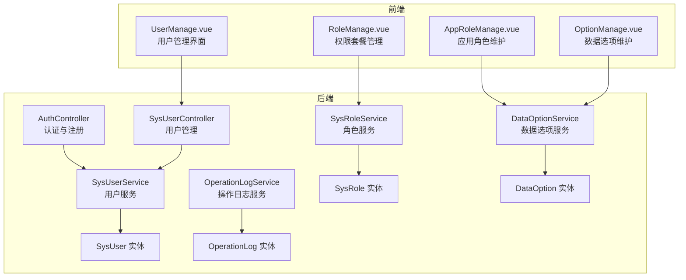
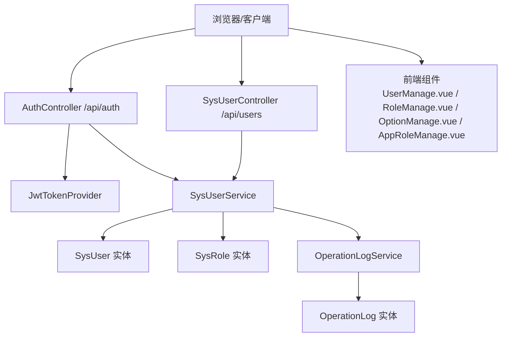
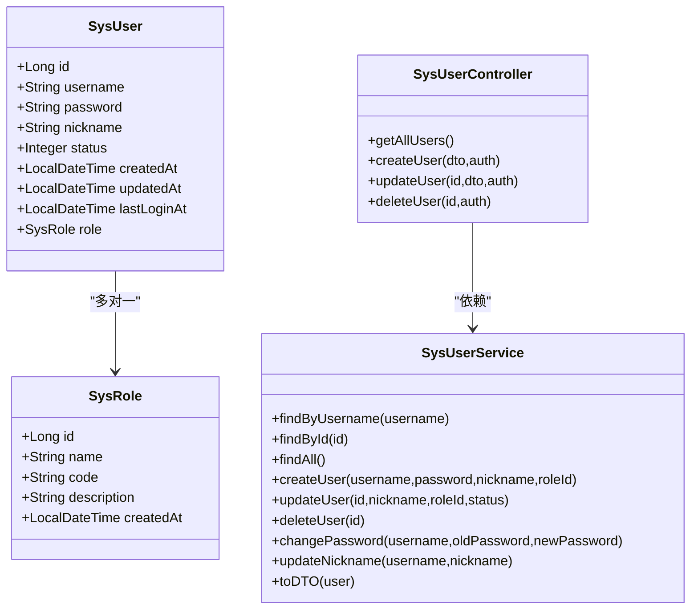
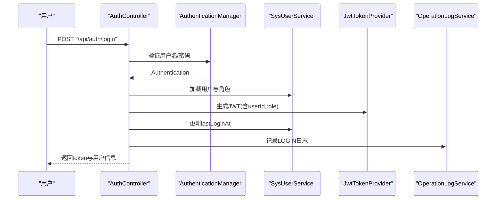
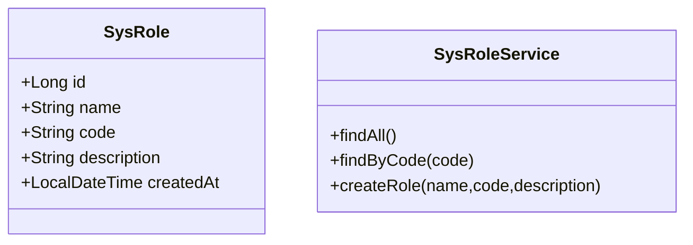
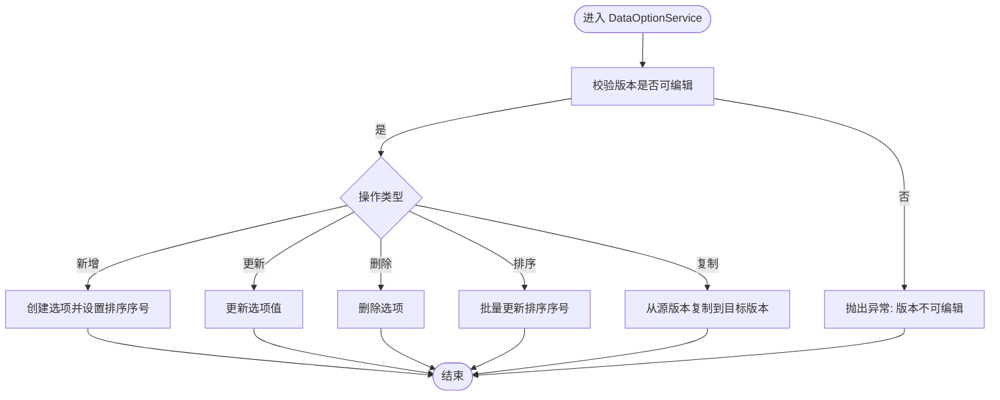
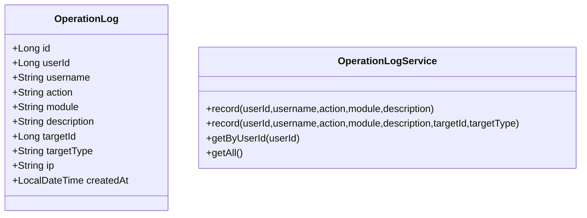
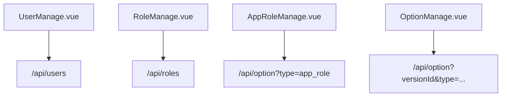
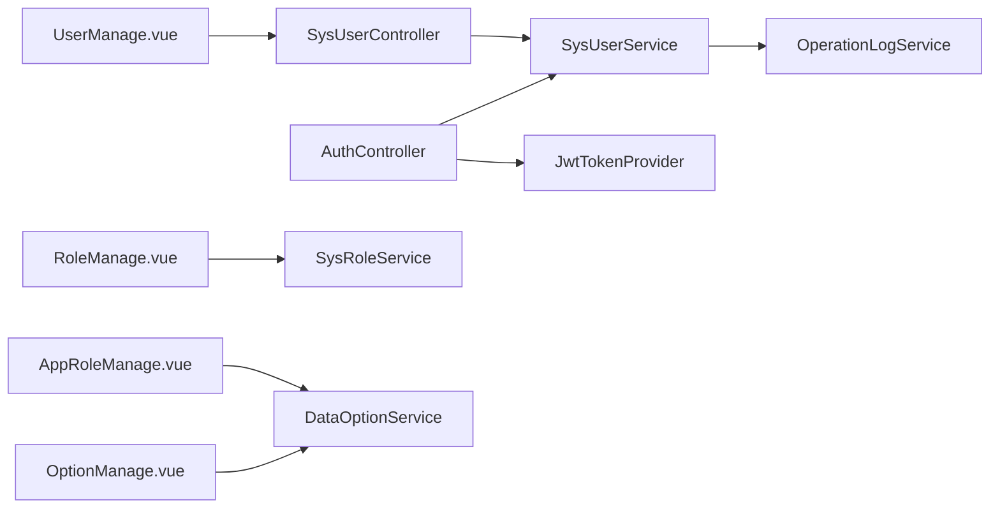

# 系统管理功能

<cite>
**本文引用的文件**
- [SysUser.java](file://src/main/java/com/superpower/modules/system/entity/SysUser.java)
- [SysRole.java](file://src/main/java/com/superpower/modules/system/entity/SysRole.java)
- [OperationLog.java](file://src/main/java/com/superpower/modules/system/entity/OperationLog.java)
- [DataOption.java](file://src/main/java/com/superpower/modules/option/entity/DataOption.java)
- [SysUserController.java](file://src/main/java/com/superpower/modules/system/controller/SysUserController.java)
- [SysUserService.java](file://src/main/java/com/superpower/modules/system/service/SysUserService.java)
- [SysRoleService.java](file://src/main/java/com/superpower/modules/system/service/SysRoleService.java)
- [OperationLogService.java](file://src/main/java/com/superpower/modules/system/service/OperationLogService.java)
- [DataOptionService.java](file://src/main/java/com/superpower/modules/option/service/DataOptionService.java)
- [AuthController.java](file://src/main/java/com/superpower/modules/system/controller/AuthController.java)
- [JwtTokenProvider.java](file://src/main/java/com/superpower/security/JwtTokenProvider.java)
- [UserManage.vue](file://frontend/src/views/system/UserManage.vue)
- [RoleManage.vue](file://frontend/src/views/system/RoleManage.vue)
- [AppRoleManage.vue](file://frontend/src/views/system/AppRoleManage.vue)
- [OptionManage.vue](file://frontend/src/views/system/OptionManage.vue)
</cite>

## 目录
1. [简介](#简介)
2. [项目结构](#项目结构)
3. [核心组件](#核心组件)
4. [架构总览](#架构总览)
5. [详细组件分析](#详细组件分析)
6. [依赖分析](#依赖分析)
7. [性能考量](#性能考量)
8. [故障排查指南](#故障排查指南)
9. [结论](#结论)
10. [附录](#附录)

## 简介
本技术文档围绕系统管理功能展开，重点覆盖用户管理、角色权限体系、系统配置与数据选项、操作日志与审计追踪，以及安全与最佳实践。文档以代码为依据，结合前后端界面与服务层实现，帮助开发者与运维人员快速理解并高效使用系统管理能力。

## 项目结构
系统管理相关代码主要分布在后端 Spring Boot 模块的 system 与 option 包中，前端 Vue 组件位于 frontend/src/views/system 下。整体采用分层架构：控制器层负责接口暴露，服务层封装业务逻辑，仓储层访问数据库，实体层映射表结构；前端通过 API 组件化页面，提供用户管理、角色管理、应用角色与数据选项维护等界面。

**图表来源**
- [SysUserController.java:1-67](file://src/main/java/com/superpower/modules/system/controller/SysUserController.java#L1-L67)
- [SysUserService.java:1-114](file://src/main/java/com/superpower/modules/system/service/SysUserService.java#L1-L114)
- [SysRoleService.java:1-35](file://src/main/java/com/superpower/modules/system/service/SysRoleService.java#L1-L35)
- [OperationLogService.java:1-77](file://src/main/java/com/superpower/modules/system/service/OperationLogService.java#L1-L77)
- [DataOptionService.java:1-93](file://src/main/java/com/superpower/modules/option/service/DataOptionService.java#L1-L93)
- [SysUser.java:1-40](file://src/main/java/com/superpower/modules/system/entity/SysUser.java#L1-L40)
- [SysRole.java:1-27](file://src/main/java/com/superpower/modules/system/entity/SysRole.java#L1-L27)
- [OperationLog.java:1-42](file://src/main/java/com/superpower/modules/system/entity/OperationLog.java#L1-L42)
- [DataOption.java:1-30](file://src/main/java/com/superpower/modules/option/entity/DataOption.java#L1-L30)
- [UserManage.vue:1-181](file://frontend/src/views/system/UserManage.vue#L1-L181)
- [RoleManage.vue:1-70](file://frontend/src/views/system/RoleManage.vue#L1-L70)
- [AppRoleManage.vue:1-88](file://frontend/src/views/system/AppRoleManage.vue#L1-L88)
- [OptionManage.vue:1-217](file://frontend/src/views/system/OptionManage.vue#L1-L217)

**章节来源**
- [SysUserController.java:1-67](file://src/main/java/com/superpower/modules/system/controller/SysUserController.java#L1-L67)
- [SysUserService.java:1-114](file://src/main/java/com/superpower/modules/system/service/SysUserService.java#L1-L114)
- [SysRoleService.java:1-35](file://src/main/java/com/superpower/modules/system/service/SysRoleService.java#L1-L35)
- [OperationLogService.java:1-77](file://src/main/java/com/superpower/modules/system/service/OperationLogService.java#L1-L77)
- [DataOptionService.java:1-93](file://src/main/java/com/superpower/modules/option/service/DataOptionService.java#L1-L93)
- [UserManage.vue:1-181](file://frontend/src/views/system/UserManage.vue#L1-L181)
- [RoleManage.vue:1-70](file://frontend/src/views/system/RoleManage.vue#L1-L70)
- [AppRoleManage.vue:1-88](file://frontend/src/views/system/AppRoleManage.vue#L1-L88)
- [OptionManage.vue:1-217](file://frontend/src/views/system/OptionManage.vue#L1-L217)

## 核心组件
- 用户管理模块：SysUser 实体承载用户信息，SysUserService 提供创建、更新、删除、改密、昵称更新与 DTO 转换；SysUserController 对外暴露 REST 接口并记录操作日志。
- 角色权限体系：SysRole 实体定义角色，SysRoleService 提供角色查询与创建；AuthController 登录时生成 JWT 并携带角色标识。
- 系统配置与数据选项：DataOption 实体用于基础数据维护，DataOptionService 支持按版本分组、排序、复制与校验版本可编辑性。
- 操作日志与审计：OperationLog 实体记录用户行为，OperationLogService 提供统一记录入口与 IP 解析，支持按用户或全局查询。
- 前端界面：UserManage.vue、RoleManage.vue、AppRoleManage.vue、OptionManage.vue 提供可视化管理界面。

**章节来源**
- [SysUser.java:1-40](file://src/main/java/com/superpower/modules/system/entity/SysUser.java#L1-L40)
- [SysRole.java:1-27](file://src/main/java/com/superpower/modules/system/entity/SysRole.java#L1-L27)
- [OperationLog.java:1-42](file://src/main/java/com/superpower/modules/system/entity/OperationLog.java#L1-L42)
- [DataOption.java:1-30](file://src/main/java/com/superpower/modules/option/entity/DataOption.java#L1-L30)
- [SysUserService.java:1-114](file://src/main/java/com/superpower/modules/system/service/SysUserService.java#L1-L114)
- [SysRoleService.java:1-35](file://src/main/java/com/superpower/modules/system/service/SysRoleService.java#L1-L35)
- [OperationLogService.java:1-77](file://src/main/java/com/superpower/modules/system/service/OperationLogService.java#L1-L77)
- [DataOptionService.java:1-93](file://src/main/java/com/superpower/modules/option/service/DataOptionService.java#L1-L93)
- [SysUserController.java:1-67](file://src/main/java/com/superpower/modules/system/controller/SysUserController.java#L1-L67)
- [UserManage.vue:1-181](file://frontend/src/views/system/UserManage.vue#L1-L181)
- [RoleManage.vue:1-70](file://frontend/src/views/system/RoleManage.vue#L1-L70)
- [AppRoleManage.vue:1-88](file://frontend/src/views/system/AppRoleManage.vue#L1-L88)
- [OptionManage.vue:1-217](file://frontend/src/views/system/OptionManage.vue#L1-L217)

## 架构总览
系统管理采用“控制器-服务-仓储-实体”的分层设计，配合 JWT 认证与操作日志审计，形成闭环的权限与安全体系。

**图表来源**
- [AuthController.java:1-98](file://src/main/java/com/superpower/modules/system/controller/AuthController.java#L1-L98)
- [SysUserController.java:1-67](file://src/main/java/com/superpower/modules/system/controller/SysUserController.java#L1-L67)
- [JwtTokenProvider.java:1-66](file://src/main/java/com/superpower/security/JwtTokenProvider.java#L1-L66)
- [SysUserService.java:1-114](file://src/main/java/com/superpower/modules/system/service/SysUserService.java#L1-L114)
- [OperationLogService.java:1-77](file://src/main/java/com/superpower/modules/system/service/OperationLogService.java#L1-L77)
- [SysUser.java:1-40](file://src/main/java/com/superpower/modules/system/entity/SysUser.java#L1-L40)
- [SysRole.java:1-27](file://src/main/java/com/superpower/modules/system/entity/SysRole.java#L1-L27)
- [OperationLog.java:1-42](file://src/main/java/com/superpower/modules/system/entity/OperationLog.java#L1-L42)
- [UserManage.vue:1-181](file://frontend/src/views/system/UserManage.vue#L1-L181)
- [RoleManage.vue:1-70](file://frontend/src/views/system/RoleManage.vue#L1-L70)
- [OptionManage.vue:1-217](file://frontend/src/views/system/OptionManage.vue#L1-L217)
- [AppRoleManage.vue:1-88](file://frontend/src/views/system/AppRoleManage.vue#L1-L88)

## 详细组件分析

### 用户管理模块
- 实体设计：SysUser 包含主键、用户名（唯一）、密码、昵称、角色关联、状态、创建/更新时间、最后登录时间等字段，采用 JPA 注解映射到 sys_user 表。
- 业务流程：
  - 创建用户：SysUserService 校验角色存在与用户名唯一，加密密码后持久化，返回 UserDTO。
  - 更新用户：支持修改昵称、角色与状态，保存前进行角色存在性校验。
  - 删除用户：直接删除对应 ID。
  - 密码与昵称变更：提供独立方法并进行旧密码匹配与长度校验。
  - DTO 转换：包含角色名称与编码、在线状态（依赖 OnlineTracker）。
- 控制器：SysUserController 提供列表、创建、更新、删除接口，并在每次变更后调用 OperationLogService 记录审计日志。

**图表来源**
- [SysUser.java:1-40](file://src/main/java/com/superpower/modules/system/entity/SysUser.java#L1-L40)
- [SysRole.java:1-27](file://src/main/java/com/superpower/modules/system/entity/SysRole.java#L1-L27)
- [SysUserService.java:1-114](file://src/main/java/com/superpower/modules/system/service/SysUserService.java#L1-L114)
- [SysUserController.java:1-67](file://src/main/java/com/superpower/modules/system/controller/SysUserController.java#L1-L67)

**章节来源**
- [SysUser.java:1-40](file://src/main/java/com/superpower/modules/system/entity/SysUser.java#L1-L40)
- [SysUserService.java:1-114](file://src/main/java/com/superpower/modules/system/service/SysUserService.java#L1-L114)
- [SysUserController.java:1-67](file://src/main/java/com/superpower/modules/system/controller/SysUserController.java#L1-L67)

### 登录与注册流程
- 登录：AuthController 使用 AuthenticationManager 进行凭证校验，获取用户与角色后通过 JwtTokenProvider 生成令牌，记录登录日志并标记在线状态。
- 注册：默认分配普通角色 ID，进行基础字段校验后调用 SysUserService.createUser 完成创建。
- 修改密码/昵称：提供独立接口，进行参数校验与业务校验后更新。

**图表来源**
- [AuthController.java:1-98](file://src/main/java/com/superpower/modules/system/controller/AuthController.java#L1-L98)
- [JwtTokenProvider.java:1-66](file://src/main/java/com/superpower/security/JwtTokenProvider.java#L1-L66)
- [SysUserService.java:1-114](file://src/main/java/com/superpower/modules/system/service/SysUserService.java#L1-L114)
- [OperationLogService.java:1-77](file://src/main/java/com/superpower/modules/system/service/OperationLogService.java#L1-L77)

**章节来源**
- [AuthController.java:1-98](file://src/main/java/com/superpower/modules/system/controller/AuthController.java#L1-L98)
- [JwtTokenProvider.java:1-66](file://src/main/java/com/superpower/security/JwtTokenProvider.java#L1-L66)
- [SysUserService.java:1-114](file://src/main/java/com/superpower/modules/system/service/SysUserService.java#L1-L114)
- [OperationLogService.java:1-77](file://src/main/java/com/superpower/modules/system/service/OperationLogService.java#L1-L77)

### 角色权限体系
- SysRole 实体包含角色名称、编码（唯一）、描述与创建时间；SysRoleService 提供查询与创建。
- 权限控制：登录时将角色编码写入 JWT 声明，后续可通过解析令牌获取角色标识，用于前端与后端的权限判断。

**图表来源**
- [SysRole.java:1-27](file://src/main/java/com/superpower/modules/system/entity/SysRole.java#L1-L27)
- [SysRoleService.java:1-35](file://src/main/java/com/superpower/modules/system/service/SysRoleService.java#L1-L35)

**章节来源**
- [SysRole.java:1-27](file://src/main/java/com/superpower/modules/system/entity/SysRole.java#L1-L27)
- [SysRoleService.java:1-35](file://src/main/java/com/superpower/modules/system/service/SysRoleService.java#L1-L35)

### 数据选项管理（DataOption）
- 实体设计：DataOption 包含类型、值、排序、版本号与创建时间，映射 sys_option 表。
- 业务能力：
  - 按版本与类型查询选项列表；
  - 新增时自动计算排序序号；
  - 更新/删除前校验目标版本处于草稿态；
  - 支持批量更新排序；
  - 支持从源版本复制选项到目标版本。

**图表来源**
- [DataOption.java:1-30](file://src/main/java/com/superpower/modules/option/entity/DataOption.java#L1-L30)
- [DataOptionService.java:1-93](file://src/main/java/com/superpower/modules/option/service/DataOptionService.java#L1-L93)

**章节来源**
- [DataOption.java:1-30](file://src/main/java/com/superpower/modules/option/entity/DataOption.java#L1-L30)
- [DataOptionService.java:1-93](file://src/main/java/com/superpower/modules/option/service/DataOptionService.java#L1-L93)

### 操作日志系统（OperationLog）
- 实体设计：记录用户 ID/名称、动作、模块、描述、目标类型与 ID、IP、时间等。
- 服务实现：
  - 提供带事务的新启事务记录方法，确保日志落库独立性；
  - 自动解析客户端 IP（兼容多种代理头）；
  - 提供按用户最近条数与全局最近条数查询。

**图表来源**
- [OperationLog.java:1-42](file://src/main/java/com/superpower/modules/system/entity/OperationLog.java#L1-L42)
- [OperationLogService.java:1-77](file://src/main/java/com/superpower/modules/system/service/OperationLogService.java#L1-L77)

**章节来源**
- [OperationLog.java:1-42](file://src/main/java/com/superpower/modules/system/entity/OperationLog.java#L1-L42)
- [OperationLogService.java:1-77](file://src/main/java/com/superpower/modules/system/service/OperationLogService.java#L1-L77)

### 前端系统管理界面
- 用户管理（UserManage.vue）：展示用户列表、在线状态、最后登录时间，支持新增/编辑/删除与查看操作日志。
- 权限套餐管理（RoleManage.vue）：展示角色列表，支持新增角色。
- 应用角色维护（AppRoleManage.vue）：基于 DataOption 类型 app_role 的选项维护。
- 数据选项维护（OptionManage.vue）：按版本分组的选项列表，支持拖拽排序、新增/编辑/删除。

**图表来源**
- [UserManage.vue:1-181](file://frontend/src/views/system/UserManage.vue#L1-L181)
- [RoleManage.vue:1-70](file://frontend/src/views/system/RoleManage.vue#L1-L70)
- [AppRoleManage.vue:1-88](file://frontend/src/views/system/AppRoleManage.vue#L1-L88)
- [OptionManage.vue:1-217](file://frontend/src/views/system/OptionManage.vue#L1-L217)

**章节来源**
- [UserManage.vue:1-181](file://frontend/src/views/system/UserManage.vue#L1-L181)
- [RoleManage.vue:1-70](file://frontend/src/views/system/RoleManage.vue#L1-L70)
- [AppRoleManage.vue:1-88](file://frontend/src/views/system/AppRoleManage.vue#L1-L88)
- [OptionManage.vue:1-217](file://frontend/src/views/system/OptionManage.vue#L1-L217)

## 依赖分析
- 控制器与服务：SysUserController 依赖 SysUserService；AuthController 依赖 SysUserService 与 JwtTokenProvider；OperationLogService 独立但被控制器与服务调用。
- 实体与仓储：SysUser 关联 SysRole；OperationLog 与 DataOption 分别对应各自实体与服务。
- 前端依赖：各页面组件依赖对应的 API 文件（如 user.js、role.js、operationLog.js、option.js），通过 axios 请求后端接口。

**图表来源**
- [SysUserController.java:1-67](file://src/main/java/com/superpower/modules/system/controller/SysUserController.java#L1-L67)
- [SysUserService.java:1-114](file://src/main/java/com/superpower/modules/system/service/SysUserService.java#L1-L114)
- [AuthController.java:1-98](file://src/main/java/com/superpower/modules/system/controller/AuthController.java#L1-L98)
- [JwtTokenProvider.java:1-66](file://src/main/java/com/superpower/security/JwtTokenProvider.java#L1-L66)
- [OperationLogService.java:1-77](file://src/main/java/com/superpower/modules/system/service/OperationLogService.java#L1-L77)
- [SysRoleService.java:1-35](file://src/main/java/com/superpower/modules/system/service/SysRoleService.java#L1-L35)
- [DataOptionService.java:1-93](file://src/main/java/com/superpower/modules/option/service/DataOptionService.java#L1-L93)
- [UserManage.vue:1-181](file://frontend/src/views/system/UserManage.vue#L1-L181)
- [RoleManage.vue:1-70](file://frontend/src/views/system/RoleManage.vue#L1-L70)
- [AppRoleManage.vue:1-88](file://frontend/src/views/system/AppRoleManage.vue#L1-L88)
- [OptionManage.vue:1-217](file://frontend/src/views/system/OptionManage.vue#L1-L217)

**章节来源**
- [SysUserController.java:1-67](file://src/main/java/com/superpower/modules/system/controller/SysUserController.java#L1-L67)
- [SysUserService.java:1-114](file://src/main/java/com/superpower/modules/system/service/SysUserService.java#L1-L114)
- [AuthController.java:1-98](file://src/main/java/com/superpower/modules/system/controller/AuthController.java#L1-L98)
- [JwtTokenProvider.java:1-66](file://src/main/java/com/superpower/security/JwtTokenProvider.java#L1-L66)
- [OperationLogService.java:1-77](file://src/main/java/com/superpower/modules/system/service/OperationLogService.java#L1-L77)
- [SysRoleService.java:1-35](file://src/main/java/com/superpower/modules/system/service/SysRoleService.java#L1-L35)
- [DataOptionService.java:1-93](file://src/main/java/com/superpower/modules/option/service/DataOptionService.java#L1-L93)
- [UserManage.vue:1-181](file://frontend/src/views/system/UserManage.vue#L1-L181)
- [RoleManage.vue:1-70](file://frontend/src/views/system/RoleManage.vue#L1-L70)
- [AppRoleManage.vue:1-88](file://frontend/src/views/system/AppRoleManage.vue#L1-L88)
- [OptionManage.vue:1-217](file://frontend/src/views/system/OptionManage.vue#L1-L217)

## 性能考量
- 日志写入：OperationLogService 在记录时开启独立事务，避免阻塞主业务事务，提升稳定性。
- 查询限制：按用户与全局查询均限制返回条数，防止大结果集影响性能。
- 前端交互：列表分页与懒加载策略建议结合实际数据规模评估，必要时增加分页参数。
- 密码处理：使用强哈希算法（由 PasswordEncoder 实现）存储密码，避免明文或弱加密。

[本节为通用性能建议，无需特定文件引用]

## 故障排查指南
- 用户名重复：创建用户时若用户名已存在会抛出业务异常，检查唯一约束与输入。
- 角色不存在：更新用户角色时若角色不存在会抛出异常，确认角色 ID 正确。
- 版本不可编辑：DataOptionService 在非草稿版本上禁止修改，需先切换到草稿版本。
- 日志写入失败：OperationLogService 内部捕获异常并记录告警，检查数据库连接与表结构。
- IP 解析异常：当请求头为空或格式异常时返回空字符串，检查代理配置与请求头。

**章节来源**
- [SysUserService.java:50-78](file://src/main/java/com/superpower/modules/system/service/SysUserService.java#L50-L78)
- [DataOptionService.java:59-65](file://src/main/java/com/superpower/modules/option/service/DataOptionService.java#L59-L65)
- [OperationLogService.java:45-47](file://src/main/java/com/superpower/modules/system/service/OperationLogService.java#L45-L47)
- [OperationLogService.java:58-75](file://src/main/java/com/superpower/modules/system/service/OperationLogService.java#L58-L75)

## 结论
系统管理功能以清晰的分层架构与完善的实体模型为基础，结合 JWT 认证与操作日志审计，实现了从用户管理、角色权限到系统配置与运行监控的全链路能力。前端组件化界面提升了可维护性与用户体验。建议在生产环境中强化安全配置（如 HTTPS、强密码策略、最小权限原则）与日志归档策略，持续优化性能与可用性。

[本节为总结性内容，无需特定文件引用]

## 附录
- 常用接口路径参考
  - 登录：POST /api/auth/login
  - 注册：POST /api/auth/register
  - 当前用户：GET /api/auth/me
  - 修改密码：PUT /api/auth/password
  - 修改昵称：PUT /api/auth/nickname
  - 用户列表：GET /api/users
  - 创建用户：POST /api/users
  - 更新用户：PUT /api/users/{id}
  - 删除用户：DELETE /api/users/{id}
  - 角色列表：GET /api/roles
  - 新增角色：POST /api/roles
  - 数据选项列表：GET /api/option?type=...
  - 新增选项：POST /api/option
  - 更新选项：PUT /api/option/{id}
  - 删除选项：DELETE /api/option/{id}
  - 批量更新排序：PUT /api/option/sort
  - 复制选项：POST /api/option/copy

[本节为接口路径汇总，无需特定文件引用]