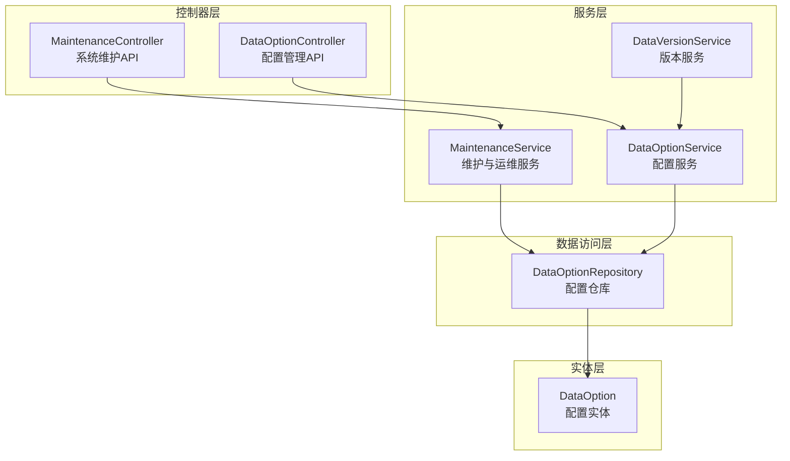
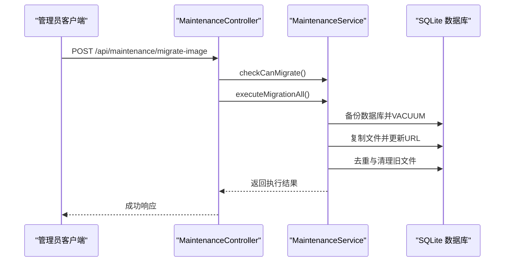
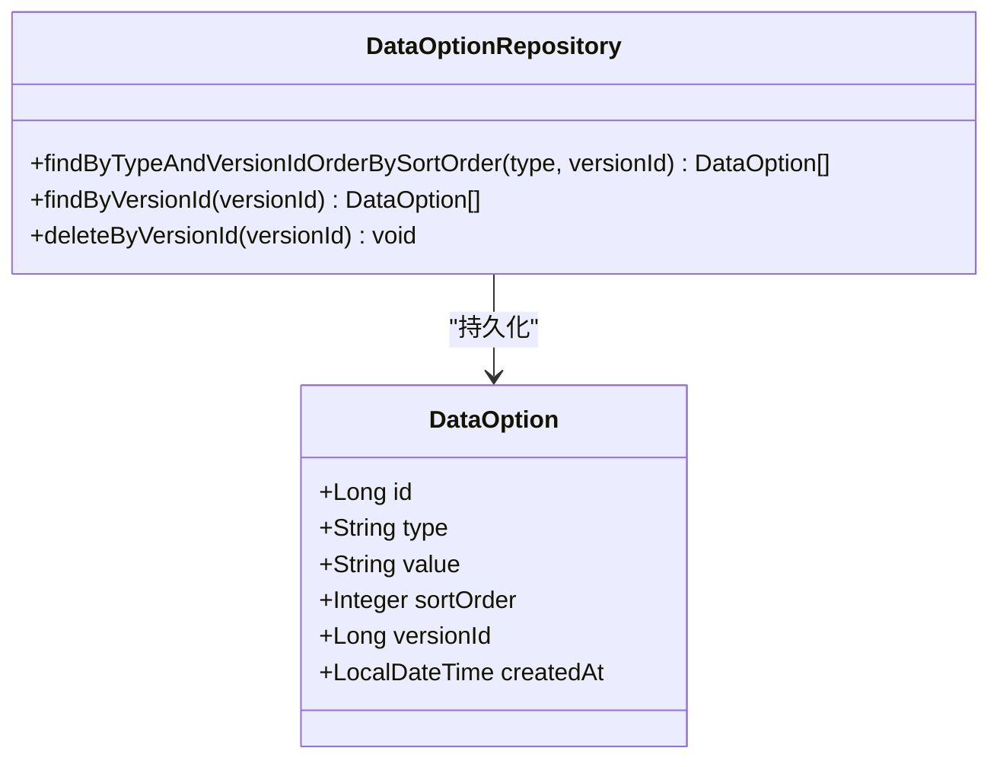
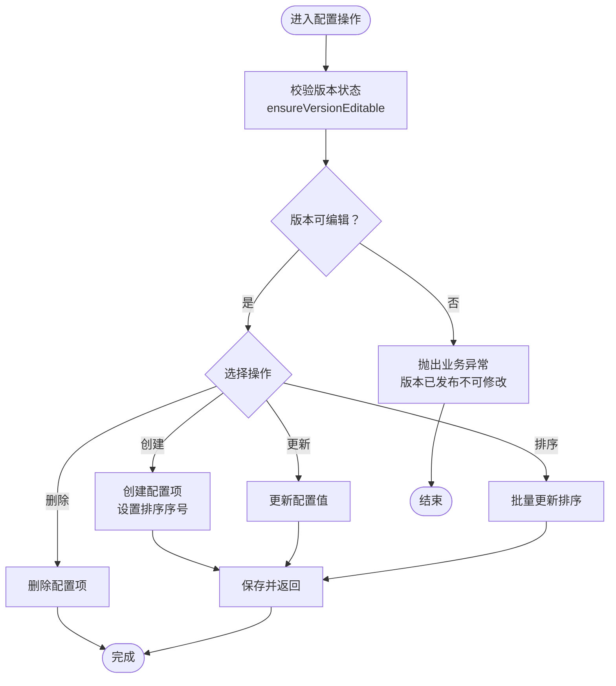
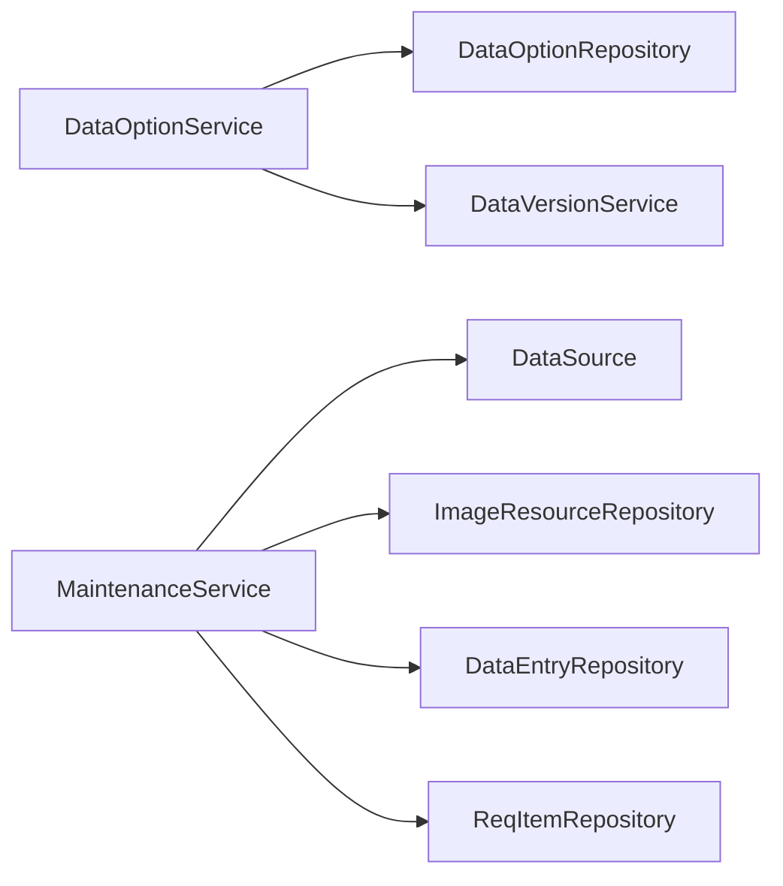

# 系统配置管理

<cite>
**本文档引用的文件**
- [DataOption.java](file://src/main/java/com/superpower/modules/option/entity/DataOption.java)
- [DataOptionService.java](file://src/main/java/com/superpower/modules/option/service/DataOptionService.java)
- [DataOptionRepository.java](file://src/main/java/com/superpower/modules/option/repository/DataOptionRepository.java)
- [DataOptionController.java](file://src/main/java/com/superpower/modules/option/controller/DataOptionController.java)
- [MaintenanceController.java](file://src/main/java/com/superpower/modules/system/controller/MaintenanceController.java)
- [MaintenanceService.java](file://src/main/java/com/superpower/modules/system/service/MaintenanceService.java)
- [DataVersionService.java](file://src/main/java/com/superpower/modules/version/service/DataVersionService.java)
- [2026-05-26-option-versioning-plan.md](file://docs/superpowers/plans/2026-05-26-option-versioning-plan.md)
</cite>

## 目录
1. [引言](#引言)
2. [项目结构](#项目结构)
3. [核心组件](#核心组件)
4. [架构总览](#架构总览)
5. [详细组件分析](#详细组件分析)
6. [依赖关系分析](#依赖关系分析)
7. [性能考量](#性能考量)
8. [故障排查指南](#故障排查指南)
9. [结论](#结论)
10. [附录](#附录)

## 引言
本文件围绕系统配置管理展开，重点解释系统维护功能的实现，涵盖数据库维护、缓存清理与系统监控等能力，并深入说明 DataOption 实体与 DataOptionService 的职责边界、版本化机制与动态配置更新流程。同时提供 MaintenanceController 的 API 接口文档，阐述系统配置的层次结构与作用域管理策略，并结合实际代码路径展示基础数据维护、系统参数设置与运行时配置更新的使用方法，最后给出安全考虑与版本管理策略建议。

## 项目结构
系统配置管理涉及三层：控制器层负责对外暴露 API 并进行权限控制；服务层承载业务逻辑与事务控制；数据访问层负责持久化与查询。配置数据以 DataOption 实体为核心，配合版本化机制实现多版本并行与发布锁定。

**图表来源**
- [MaintenanceController.java:1-131](file://src/main/java/com/superpower/modules/system/controller/MaintenanceController.java#L1-L131)
- [DataOptionController.java:1-48](file://src/main/java/com/superpower/modules/option/controller/DataOptionController.java#L1-L48)
- [MaintenanceService.java:1-909](file://src/main/java/com/superpower/modules/system/service/MaintenanceService.java#L1-L909)
- [DataOptionService.java:1-93](file://src/main/java/com/superpower/modules/option/service/DataOptionService.java#L1-L93)
- [DataOptionRepository.java:1-15](file://src/main/java/com/superpower/modules/option/repository/DataOptionRepository.java#L1-L15)
- [DataOption.java:1-30](file://src/main/java/com/superpower/modules/option/entity/DataOption.java#L1-L30)

**章节来源**
- [MaintenanceController.java:1-131](file://src/main/java/com/superpower/modules/system/controller/MaintenanceController.java#L1-L131)
- [DataOptionController.java:1-48](file://src/main/java/com/superpower/modules/option/controller/DataOptionController.java#L1-L48)
- [DataOptionService.java:1-93](file://src/main/java/com/superpower/modules/option/service/DataOptionService.java#L1-L93)
- [DataOptionRepository.java:1-15](file://src/main/java/com/superpower/modules/option/repository/DataOptionRepository.java#L1-L15)
- [DataOption.java:1-30](file://src/main/java/com/superpower/modules/option/entity/DataOption.java#L1-L30)

## 核心组件
- DataOption 实体：定义系统参数配置项的数据模型，包含类型、值、排序、版本号与创建时间等字段。
- DataOptionService：提供配置项的增删改查、排序更新与版本可编辑性校验，以及跨版本选项复制能力。
- DataOptionController：对外暴露配置管理 API，按版本与类型维度进行查询、创建、更新与排序调整。
- MaintenanceController：提供系统维护与运维能力的 API，包括图片迁移、文件名同步、ID 修复、SQL 执行与辅助数据填充等。
- MaintenanceService：实现图片版本隔离迁移的完整流程（备份、复制、数据库更新、去重、清理），并支持文件名同步与 ID 修复的异步执行与状态跟踪。
- DataVersionService：与配置版本化协同，负责在创建版本时复制选项数据，确保新版本继承历史配置。

**章节来源**
- [DataOption.java:1-30](file://src/main/java/com/superpower/modules/option/entity/DataOption.java#L1-L30)
- [DataOptionService.java:1-93](file://src/main/java/com/superpower/modules/option/service/DataOptionService.java#L1-L93)
- [DataOptionController.java:1-48](file://src/main/java/com/superpower/modules/option/controller/DataOptionController.java#L1-L48)
- [MaintenanceController.java:1-131](file://src/main/java/com/superpower/modules/system/controller/MaintenanceController.java#L1-L131)
- [MaintenanceService.java:1-909](file://src/main/java/com/superpower/modules/system/service/MaintenanceService.java#L1-L909)
- [DataVersionService.java:70-91](file://src/main/java/com/superpower/modules/version/service/DataVersionService.java#L70-L91)

## 架构总览
系统配置管理采用分层架构，控制器层统一鉴权与请求处理，服务层封装业务规则与事务边界，数据访问层屏蔽底层存储细节。配置数据通过版本号实现作用域隔离，确保已发布版本的配置不可直接修改，从而保证系统配置的稳定性与可追溯性。

**图表来源**
- [MaintenanceController.java:33-40](file://src/main/java/com/superpower/modules/system/controller/MaintenanceController.java#L33-L40)
- [MaintenanceService.java:70-123](file://src/main/java/com/superpower/modules/system/service/MaintenanceService.java#L70-L123)

## 详细组件分析

### DataOption 实体与仓库
DataOption 实体是系统参数配置的核心载体，包含类型、值、排序、版本号与创建时间等字段。仓库层提供基于类型与版本的查询、按版本删除与批量删除能力，支撑配置的多版本隔离与快速检索。

**图表来源**
- [DataOption.java:1-30](file://src/main/java/com/superpower/modules/option/entity/DataOption.java#L1-L30)
- [DataOptionRepository.java:1-15](file://src/main/java/com/superpower/modules/option/repository/DataOptionRepository.java#L1-L15)

**章节来源**
- [DataOption.java:1-30](file://src/main/java/com/superpower/modules/option/entity/DataOption.java#L1-L30)
- [DataOptionRepository.java:1-15](file://src/main/java/com/superpower/modules/option/repository/DataOptionRepository.java#L1-L15)

### DataOptionService 功能与版本化
DataOptionService 负责配置项的生命周期管理，包括：
- 查询：按版本与类型返回有序配置列表
- 创建：在指定版本下创建新配置项，自动分配排序序号
- 更新：对单个配置项进行值更新，并校验版本可编辑性
- 删除：删除指定配置项，并校验版本可编辑性
- 排序：批量更新配置项排序
- 版本复制：在创建新版本时复制历史配置

版本化通过 ensureVersionEditable 方法实现，仅允许草稿版本进行修改，已发布版本禁止变更，确保配置的稳定性与可追溯性。

**图表来源**
- [DataOptionService.java:59-65](file://src/main/java/com/superpower/modules/option/service/DataOptionService.java#L59-L65)
- [DataOptionService.java:30-49](file://src/main/java/com/superpower/modules/option/service/DataOptionService.java#L30-L49)
- [DataOptionService.java:67-78](file://src/main/java/com/superpower/modules/option/service/DataOptionService.java#L67-L78)

**章节来源**
- [DataOptionService.java:1-93](file://src/main/java/com/superpower/modules/option/service/DataOptionService.java#L1-L93)

### DataOptionController API 文档
DataOptionController 对外提供配置管理的 REST API，均需携带版本号与类型参数，确保配置的作用域明确。

- GET /api/options/{versionId}/{type}
  - 功能：按版本与类型查询配置列表
  - 请求参数：versionId（版本号）、type（配置类型）
  - 响应：配置项列表（按排序字段升序）

- POST /api/options/{versionId}/{type}
  - 功能：在指定版本下创建配置项
  - 请求体：{ value: "配置值" }
  - 响应：创建成功的配置项

- PUT /api/options/{id}
  - 功能：更新指定配置项的值
  - 请求体：{ value: "新值" }
  - 响应：更新后的配置项

- DELETE /api/options/{id}
  - 功能：删除指定配置项
  - 响应：空

- PUT /api/options/sort
  - 功能：批量更新配置项排序
  - 请求体：[{ id, sortOrder }, ...]
  - 响应：空

**章节来源**
- [DataOptionController.java:1-48](file://src/main/java/com/superpower/modules/option/controller/DataOptionController.java#L1-L48)

### MaintenanceController API 文档
MaintenanceController 提供系统维护与运维能力的 REST API，均要求 ADMIN 角色权限。

- POST /api/maintenance/migrate-image
  - 功能：启动全量图片版本隔离迁移
  - 响应：任务启动提示

- POST /api/maintenance/migrate-step/{step}
  - 功能：执行指定步骤的迁移（1-5）
  - 路径参数：step（步骤号）
  - 响应：步骤启动提示

- GET /api/maintenance/migration-status
  - 功能：查询迁移任务状态
  - 响应：ImageMigrationStatus

- POST /api/maintenance/migration-reset
  - 功能：重置迁移状态
  - 响应：空

- POST /api/maintenance/sync-filenames
  - 功能：启动文件名同步任务
  - 响应：任务启动提示

- GET /api/maintenance/sync-filenames-status
  - 功能：查询文件名同步状态
  - 响应：ImageMigrationStatus

- POST /api/maintenance/sync-filenames-reset
  - 功能：重置文件名同步状态
  - 响应：空

- POST /api/maintenance/fix-image-card-ids
  - 功能：修复图片卡片引用 ID
  - 响应：任务启动提示

- GET /api/maintenance/fix-image-card-ids-status
  - 功能：查询 ID 修复状态
  - 响应：ImageMigrationStatus

- POST /api/maintenance/fix-image-card-ids-reset
  - 功能：重置 ID 修复状态
  - 响应：空

- POST /api/maintenance/execute-sql
  - 功能：执行 SQL 脚本（支持多语句）
  - 请求体：{ sql: "SQL 内容" }
  - 响应：SqlExecutionResult 列表

- POST /api/maintenance/fill-image-product-id
  - 功能：填充图片的 product_id 字段统计
  - 响应：更新数量统计

**章节来源**
- [MaintenanceController.java:1-131](file://src/main/java/com/superpower/modules/system/controller/MaintenanceController.java#L1-L131)

### 系统配置的层次结构与作用域管理
- 层次结构
  - 控制器层：统一鉴权与请求入口，负责参数校验与日志记录
  - 服务层：封装业务规则、事务控制与异步执行，协调多个仓库与外部资源
  - 数据访问层：提供类型化查询与批量操作，支撑配置的多版本隔离
  - 实体层：配置项数据模型，包含版本号字段实现作用域隔离

- 作用域管理
  - 版本隔离：每个配置项绑定 versionId，查询与变更均需指定版本
  - 发布锁定：ensureVersionEditable 校验版本状态，仅草稿版本允许修改
  - 类型分组：同一类型下的配置项按排序字段有序排列，便于前端展示与维护

**章节来源**
- [DataOptionService.java:59-65](file://src/main/java/com/superpower/modules/option/service/DataOptionService.java#L59-L65)
- [DataOptionRepository.java:11-13](file://src/main/java/com/superpower/modules/option/repository/DataOptionRepository.java#L11-L13)

### 使用示例（基于代码路径）
- 基础数据维护
  - 通过 DataOptionController 的 GET/POST/PUT/DELETE 接口，按版本与类型维护配置项
  - 示例路径参考：[DataOptionController.java:21-41](file://src/main/java/com/superpower/modules/option/controller/DataOptionController.java#L21-L41)

- 系统参数设置
  - 在指定版本下创建或更新配置项，value 字段承载具体参数值
  - 示例路径参考：[DataOptionService.java:30-49](file://src/main/java/com/superpower/modules/option/service/DataOptionService.java#L30-L49)

- 运行时配置更新
  - 通过 PUT /api/options/sort 批量更新排序，或 PUT /api/options/{id} 更新单个值
  - 示例路径参考：[DataOptionController.java:43-47](file://src/main/java/com/superpower/modules/option/controller/DataOptionController.java#L43-L47)

- 图片迁移与维护
  - 通过 MaintenanceController 启动迁移、同步与修复任务，并查询状态
  - 示例路径参考：[MaintenanceController.java:33-129](file://src/main/java/com/superpower/modules/system/controller/MaintenanceController.java#L33-L129)

**章节来源**
- [DataOptionController.java:1-48](file://src/main/java/com/superpower/modules/option/controller/DataOptionController.java#L1-L48)
- [DataOptionService.java:1-93](file://src/main/java/com/superpower/modules/option/service/DataOptionService.java#L1-L93)
- [MaintenanceController.java:1-131](file://src/main/java/com/superpower/modules/system/controller/MaintenanceController.java#L1-L131)

## 依赖关系分析
DataOptionService 与 DataVersionService 协同实现配置的版本化复制与发布锁定；MaintenanceService 通过 DataSource 直接操作 SQLite，实现数据库备份、VACUUM 与 SQL 执行等运维能力。

**图表来源**
- [DataOptionService.java:17-24](file://src/main/java/com/superpower/modules/option/service/DataOptionService.java#L17-L24)
- [DataVersionService.java:70-91](file://src/main/java/com/superpower/modules/version/service/DataVersionService.java#L70-L91)
- [MaintenanceService.java:44-52](file://src/main/java/com/superpower/modules/system/service/MaintenanceService.java#L44-L52)

**章节来源**
- [DataOptionService.java:1-93](file://src/main/java/com/superpower/modules/option/service/DataOptionService.java#L1-L93)
- [DataVersionService.java:70-91](file://src/main/java/com/superpower/modules/version/service/DataVersionService.java#L70-L91)
- [MaintenanceService.java:1-909](file://src/main/java/com/superpower/modules/system/service/MaintenanceService.java#L1-L909)

## 性能考量
- 配置查询优化：按 type 与 versionId 的复合索引查询，避免全表扫描
- 批量操作：排序更新与选项复制采用批量处理，减少事务开销
- 异步执行：图片迁移、文件名同步与 ID 修复通过 @Async 异步执行，提升用户体验
- 数据库操作：迁移过程中的数据库备份与 VACUUM，有助于维护数据库健康状态

## 故障排查指南
- 版本状态异常
  - 现象：更新/删除配置时报错“版本已发布不可修改”
  - 处理：确认目标配置所在版本状态是否为草稿，必要时创建新版本后再进行修改
  - 参考路径：[DataOptionService.java:59-65](file://src/main/java/com/superpower/modules/option/service/DataOptionService.java#L59-L65)

- 迁移任务冲突
  - 现象：提示“迁移任务正在执行中，请等待完成”
  - 处理：等待当前任务完成后重试，或调用 reset 接口重置状态
  - 参考路径：[MaintenanceController.java:63-67](file://src/main/java/com/superpower/modules/system/controller/MaintenanceController.java#L63-L67)

- SQL 执行失败
  - 现象：execute-sql 返回失败信息
  - 处理：检查 SQL 语法与权限，分段执行以定位问题
  - 参考路径：[MaintenanceController.java:111-121](file://src/main/java/com/superpower/modules/system/controller/MaintenanceController.java#L111-L121), [MaintenanceService.java:759-800](file://src/main/java/com/superpower/modules/system/service/MaintenanceService.java#L759-L800)

**章节来源**
- [DataOptionService.java:59-65](file://src/main/java/com/superpower/modules/option/service/DataOptionService.java#L59-L65)
- [MaintenanceController.java:63-67](file://src/main/java/com/superpower/modules/system/controller/MaintenanceController.java#L63-L67)
- [MaintenanceController.java:111-121](file://src/main/java/com/superpower/modules/system/controller/MaintenanceController.java#L111-L121)
- [MaintenanceService.java:759-800](file://src/main/java/com/superpower/modules/system/service/MaintenanceService.java#L759-L800)

## 结论
系统配置管理通过 DataOption 实体与版本化机制实现了配置的多版本隔离与发布锁定，结合 DataOptionService 的严格校验与 DataOptionController 的清晰 API，提供了稳定可靠的配置管理能力。MaintenanceController 与 MaintenanceService 则覆盖了数据库维护、文件迁移与系统监控等关键运维场景，形成从配置到运维的完整闭环。

## 附录
- 版本化实施计划要点
  - 新增 versionId 字段，所有查询与删除增加版本过滤
  - 在创建新版本时复制选项数据，确保新版本继承历史配置
  - 通过 ensureVersionEditable 限制已发布版本的修改
  - 前端 API 与页面适配版本号参数传递

**章节来源**
- [2026-05-26-option-versioning-plan.md:1-98](file://docs/superpowers/plans/2026-05-26-option-versioning-plan.md#L1-L98)