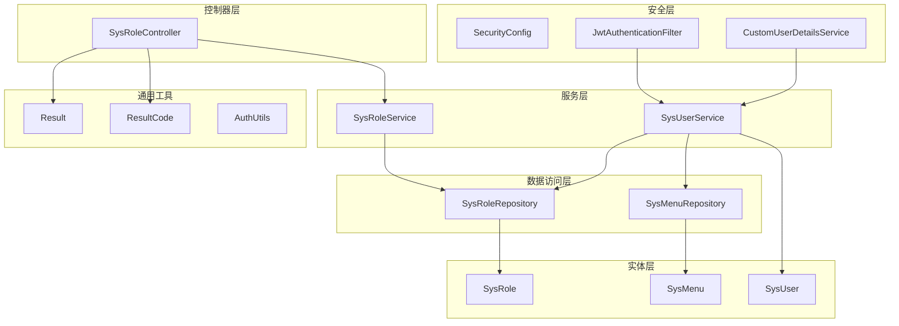
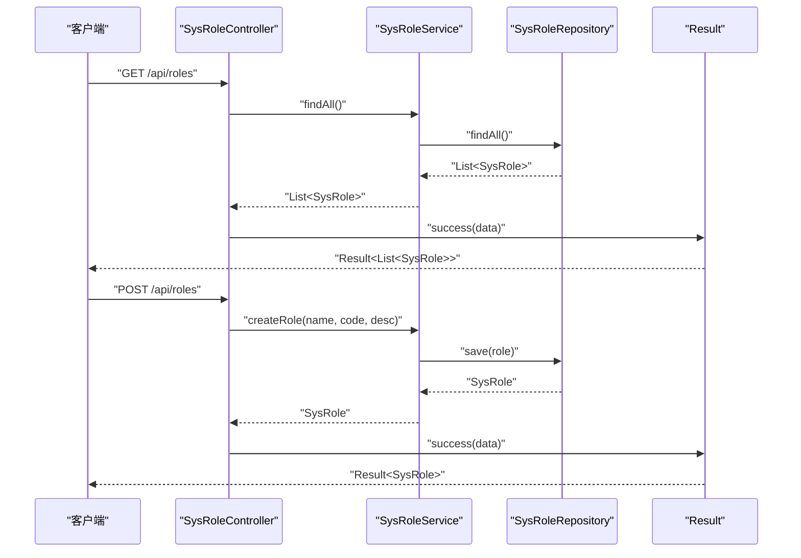
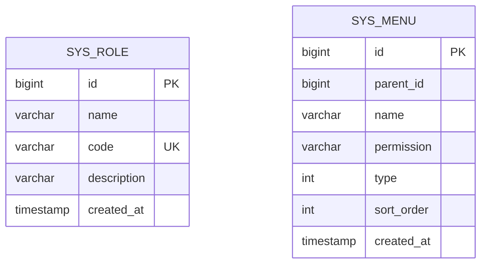
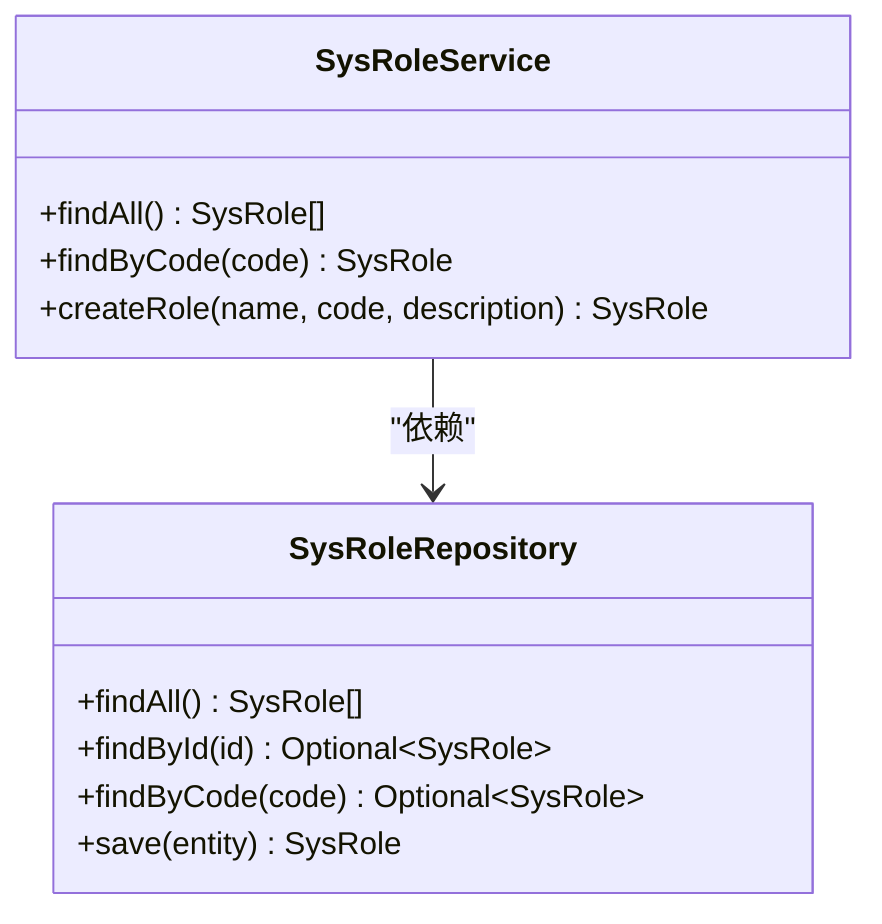
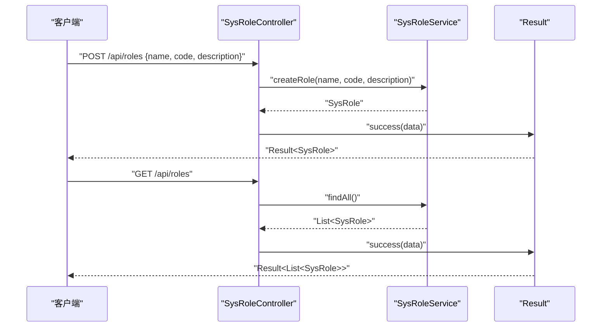
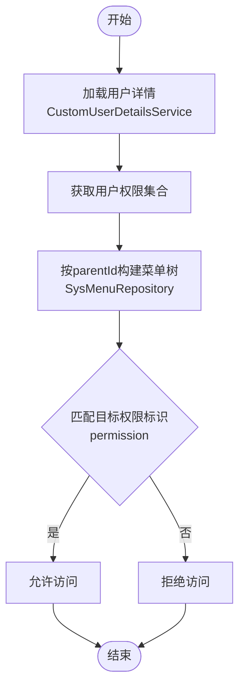
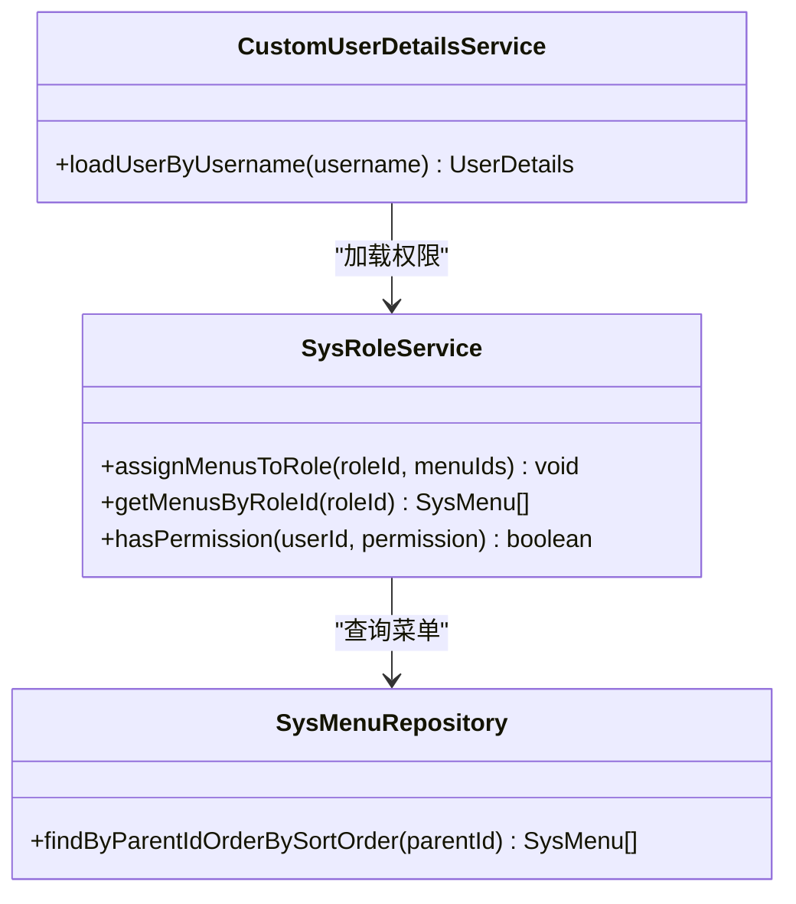
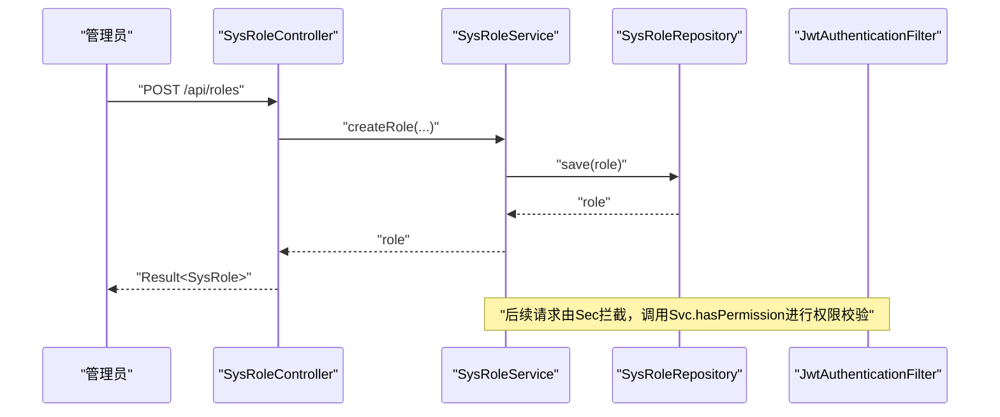
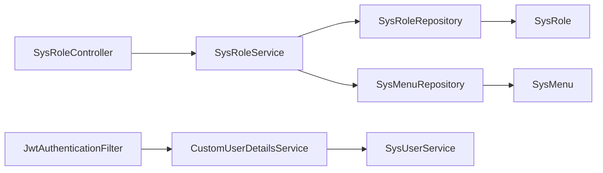

# 角色权限管理

<cite>
**本文引用的文件**
- [SysRole.java](file://src/main/java/com/superpower/modules/system/entity/SysRole.java)
- [SysMenu.java](file://src/main/java/com/superpower/modules/system/entity/SysMenu.java)
- [SysRoleService.java](file://src/main/java/com/superpower/modules/system/service/SysRoleService.java)
- [SysRoleController.java](file://src/main/java/com/superpower/modules/system/controller/SysRoleController.java)
- [SysRoleRepository.java](file://src/main/java/com/superpower/modules/system/repository/SysRoleRepository.java)
- [SysMenuRepository.java](file://src/main/java/com/superpower/modules/system/repository/SysMenuRepository.java)
- [SysUserService.java](file://src/main/java/com/superpower/modules/system/service/SysUserService.java)
- [SysUser.java](file://src/main/java/com/superpower/modules/system/entity/SysUser.java)
- [SecurityConfig.java](file://src/main/java/com/superpower/config/SecurityConfig.java)
- [JwtAuthenticationFilter.java](file://src/main/java/com/superpower/security/JwtAuthenticationFilter.java)
- [CustomUserDetailsService.java](file://src/main/java/com/superpower/security/CustomUserDetailsService.java)
- [AuthUtils.java](file://src/main/java/com/superpower/common/AuthUtils.java)
- [Result.java](file://src/main/java/com/superpower/common/Result.java)
- [ResultCode.java](file://src/main/java/com/superpower/common/ResultCode.java)
</cite>

## 目录
1. [引言](#引言)
2. [项目结构](#项目结构)
3. [核心组件](#核心组件)
4. [架构总览](#架构总览)
5. [详细组件分析](#详细组件分析)
6. [依赖分析](#依赖分析)
7. [性能考虑](#性能考虑)
8. [故障排查指南](#故障排查指南)
9. [结论](#结论)
10. [附录](#附录)

## 引言
本文件围绕角色权限管理模块进行系统化技术文档整理，重点覆盖以下方面：
- 实体设计：SysRole（角色）与SysMenu（菜单）的数据模型与字段语义
- 权限映射与菜单关联：当前代码中角色与菜单的直接映射关系尚未实现，本文给出设计建议与演进路径
- 服务层实现：SysRoleService 的角色创建、查询与扩展点
- 控制器接口：SysRoleController 的REST API定义与返回封装
- 菜单权限系统：基于菜单permission字段的权限标识设计与使用建议
- 安全策略与最佳实践：鉴权过滤、用户详情加载、权限验证与动态授权建议

## 项目结构
角色权限管理位于系统模块（system）下，采用经典的分层架构：
- 控制器层：SysRoleController 提供REST接口
- 服务层：SysRoleService 处理业务逻辑
- 数据访问层：SysRoleRepository、SysMenuRepository 基于Spring Data JPA
- 实体层：SysRole、SysMenu 描述角色与菜单数据结构
- 安全层：SecurityConfig、JwtAuthenticationFilter、CustomUserDetailsService 组成认证与授权基础设施

**图表来源**
- [SysRoleController.java:1-30](file://src/main/java/com/superpower/modules/system/controller/SysRoleController.java#L1-L30)
- [SysRoleService.java:1-35](file://src/main/java/com/superpower/modules/system/service/SysRoleService.java#L1-L35)
- [SysRoleRepository.java:1-12](file://src/main/java/com/superpower/modules/system/repository/SysRoleRepository.java#L1-L12)
- [SysMenuRepository.java:1-12](file://src/main/java/com/superpower/modules/system/repository/SysMenuRepository.java#L1-L12)
- [SysRole.java:1-27](file://src/main/java/com/superpower/modules/system/entity/SysRole.java#L1-L27)
- [SysMenu.java:1-33](file://src/main/java/com/superpower/modules/system/entity/SysMenu.java#L1-L33)
- [SysUserService.java](file://src/main/java/com/superpower/modules/system/service/SysUserService.java)
- [SysUser.java](file://src/main/java/com/superpower/modules/system/entity/SysUser.java)
- [SecurityConfig.java](file://src/main/java/com/superpower/config/SecurityConfig.java)
- [JwtAuthenticationFilter.java](file://src/main/java/com/superpower/security/JwtAuthenticationFilter.java)
- [CustomUserDetailsService.java](file://src/main/java/com/superpower/security/CustomUserDetailsService.java)
- [Result.java](file://src/main/java/com/superpower/common/Result.java)
- [ResultCode.java](file://src/main/java/com/superpower/common/ResultCode.java)

**章节来源**
- [SysRoleController.java:1-30](file://src/main/java/com/superpower/modules/system/controller/SysRoleController.java#L1-L30)
- [SysRoleService.java:1-35](file://src/main/java/com/superpower/modules/system/service/SysRoleService.java#L1-L35)
- [SysRoleRepository.java:1-12](file://src/main/java/com/superpower/modules/system/repository/SysRoleRepository.java#L1-L12)
- [SysMenuRepository.java:1-12](file://src/main/java/com/superpower/modules/system/repository/SysMenuRepository.java#L1-L12)
- [SysRole.java:1-27](file://src/main/java/com/superpower/modules/system/entity/SysRole.java#L1-L27)
- [SysMenu.java:1-33](file://src/main/java/com/superpower/modules/system/entity/SysMenu.java#L1-L33)
- [SysUserService.java](file://src/main/java/com/superpower/modules/system/service/SysUserService.java)
- [SysUser.java](file://src/main/java/com/superpower/modules/system/entity/SysUser.java)
- [SecurityConfig.java](file://src/main/java/com/superpower/config/SecurityConfig.java)
- [JwtAuthenticationFilter.java](file://src/main/java/com/superpower/security/JwtAuthenticationFilter.java)
- [CustomUserDetailsService.java](file://src/main/java/com/superpower/security/CustomUserDetailsService.java)
- [Result.java](file://src/main/java/com/superpower/common/Result.java)
- [ResultCode.java](file://src/main/java/com/superpower/common/ResultCode.java)

## 核心组件
- SysRole 实体：描述角色的基本属性（名称、编码、描述、创建时间），用于角色管理的基础数据存储
- SysMenu 实体：描述菜单树形结构（父节点、名称、权限标识、类型、排序、创建时间）
- SysRoleService：提供角色查询与创建能力；当前未包含角色-菜单映射与动态权限验证逻辑
- SysRoleController：提供角色列表查询与创建接口，统一返回Result包装
- SysRoleRepository：JPA仓库，提供按编码查询角色的能力
- SysMenuRepository：JPA仓库，提供按父节点排序查询菜单的能力
- 安全组件：SecurityConfig、JwtAuthenticationFilter、CustomUserDetailsService 构成认证与鉴权基础

**章节来源**
- [SysRole.java:1-27](file://src/main/java/com/superpower/modules/system/entity/SysRole.java#L1-L27)
- [SysMenu.java:1-33](file://src/main/java/com/superpower/modules/system/entity/SysMenu.java#L1-L33)
- [SysRoleService.java:1-35](file://src/main/java/com/superpower/modules/system/service/SysRoleService.java#L1-L35)
- [SysRoleController.java:1-30](file://src/main/java/com/superpower/modules/system/controller/SysRoleController.java#L1-L30)
- [SysRoleRepository.java:1-12](file://src/main/java/com/superpower/modules/system/repository/SysRoleRepository.java#L1-L12)
- [SysMenuRepository.java:1-12](file://src/main/java/com/superpower/modules/system/repository/SysMenuRepository.java#L1-L12)
- [SecurityConfig.java](file://src/main/java/com/superpower/config/SecurityConfig.java)
- [JwtAuthenticationFilter.java](file://src/main/java/com/superpower/security/JwtAuthenticationFilter.java)
- [CustomUserDetailsService.java](file://src/main/java/com/superpower/security/CustomUserDetailsService.java)

## 架构总览
角色权限管理遵循“控制器-服务-仓储-实体”的分层设计，配合安全层完成认证与鉴权。当前角色与菜单的直接映射关系尚未在代码中体现，但通过SysMenu.permission可作为权限标识使用。

**图表来源**
- [SysRoleController.java:20-28](file://src/main/java/com/superpower/modules/system/controller/SysRoleController.java#L20-L28)
- [SysRoleService.java:18-33](file://src/main/java/com/superpower/modules/system/service/SysRoleService.java#L18-L33)
- [SysRoleRepository.java:8-11](file://src/main/java/com/superpower/modules/system/repository/SysRoleRepository.java#L8-L11)
- [Result.java](file://src/main/java/com/superpower/common/Result.java)
- [ResultCode.java](file://src/main/java/com/superpower/common/ResultCode.java)

## 详细组件分析

### 实体设计：SysRole 与 SysMenu
- SysRole 字段要点
  - 主键id：自增主键
  - name：角色名称，非空且长度限制
  - code：角色编码，非空且唯一，用作外部识别码
  - description：角色描述
  - createdAt：创建时间，默认当前时间
- SysMenu 字段要点
  - 主键id：自增主键
  - parentId：父级菜单id，支持树形结构
  - name：菜单名称
  - permission：权限标识，用于动态权限匹配
  - type：菜单类型（默认值1）
  - sortOrder：排序序号
  - createdAt：创建时间，默认当前时间

**图表来源**
- [SysRole.java:10-26](file://src/main/java/com/superpower/modules/system/entity/SysRole.java#L10-L26)
- [SysMenu.java:10-32](file://src/main/java/com/superpower/modules/system/entity/SysMenu.java#L10-L32)

**章节来源**
- [SysRole.java:1-27](file://src/main/java/com/superpower/modules/system/entity/SysRole.java#L1-L27)
- [SysMenu.java:1-33](file://src/main/java/com/superpower/modules/system/entity/SysMenu.java#L1-L33)

### 服务实现：SysRoleService
- 查询全部角色：findAll()
- 按编码查询角色：findByCode(code)
- 创建角色：createRole(name, code, description)
- 当前缺失能力
  - 角色-菜单映射：未见角色与菜单的直接关联字段或方法
  - 动态权限验证：未见基于permission的权限校验逻辑
  - 角色继承：未见角色层级或继承链路

**图表来源**
- [SysRoleService.java:10-34](file://src/main/java/com/superpower/modules/system/service/SysRoleService.java#L10-L34)
- [SysRoleRepository.java:8-11](file://src/main/java/com/superpower/modules/system/repository/SysRoleRepository.java#L8-L11)

**章节来源**
- [SysRoleService.java:1-35](file://src/main/java/com/superpower/modules/system/service/SysRoleService.java#L1-L35)
- [SysRoleRepository.java:1-12](file://src/main/java/com/superpower/modules/system/repository/SysRoleRepository.java#L1-L12)

### 控制器接口：SysRoleController
- GET /api/roles：获取所有角色
- POST /api/roles：创建角色（请求体为SysRole对象）
- 返回封装：统一使用Result<T>进行成功/失败包装

**图表来源**
- [SysRoleController.java:20-28](file://src/main/java/com/superpower/modules/system/controller/SysRoleController.java#L20-L28)
- [Result.java](file://src/main/java/com/superpower/common/Result.java)
- [ResultCode.java](file://src/main/java/com/superpower/common/ResultCode.java)

**章节来源**
- [SysRoleController.java:1-30](file://src/main/java/com/superpower/modules/system/controller/SysRoleController.java#L1-L30)
- [Result.java](file://src/main/java/com/superpower/common/Result.java)
- [ResultCode.java](file://src/main/java/com/superpower/common/ResultCode.java)

### 菜单权限系统设计与实现
- 设计原理
  - SysMenu.permission 作为权限标识，用于动态权限匹配
  - SysMenu.parentId 支持树形菜单结构，便于构建前端导航与权限树
  - SysMenu.sortOrder 决定菜单显示顺序
- 实现方式
  - SysMenuRepository 提供按父节点排序查询菜单的方法，便于构建子菜单树
  - 安全层通过JwtAuthenticationFilter与CustomUserDetailsService加载用户与权限
  - 建议在服务层或工具类中增加基于permission的权限校验逻辑

**图表来源**
- [SysMenuRepository.java:8-11](file://src/main/java/com/superpower/modules/system/repository/SysMenuRepository.java#L8-L11)
- [SysMenu.java:10-32](file://src/main/java/com/superpower/modules/system/entity/SysMenu.java#L10-L32)
- [CustomUserDetailsService.java](file://src/main/java/com/superpower/security/CustomUserDetailsService.java)
- [JwtAuthenticationFilter.java](file://src/main/java/com/superpower/security/JwtAuthenticationFilter.java)

**章节来源**
- [SysMenuRepository.java:1-12](file://src/main/java/com/superpower/modules/system/repository/SysMenuRepository.java#L1-L12)
- [SysMenu.java:1-33](file://src/main/java/com/superpower/modules/system/entity/SysMenu.java#L1-L33)
- [CustomUserDetailsService.java](file://src/main/java/com/superpower/security/CustomUserDetailsService.java)
- [JwtAuthenticationFilter.java](file://src/main/java/com/superpower/security/JwtAuthenticationFilter.java)

### 角色权限映射与动态权限验证（设计建议）
当前代码未实现角色-菜单映射与动态权限验证，建议如下演进：
- 新增角色-菜单映射表（如 sys_role_menu），包含role_id 与 menu_id
- 在SysRoleService中增加：
  - 为角色分配菜单：assignMenusToRole(roleId, menuIds)
  - 获取角色菜单集合：getMenusByRoleId(roleId)
  - 动态权限验证：hasPermission(userId, permission)
- 在JwtAuthenticationFilter中集成权限校验，基于用户角色与菜单权限判断

**图表来源**
- [SysRoleService.java:10-34](file://src/main/java/com/superpower/modules/system/service/SysRoleService.java#L10-L34)
- [SysMenuRepository.java:8-11](file://src/main/java/com/superpower/modules/system/repository/SysMenuRepository.java#L8-L11)
- [CustomUserDetailsService.java](file://src/main/java/com/superpower/security/CustomUserDetailsService.java)

**章节来源**
- [SysRoleService.java:1-35](file://src/main/java/com/superpower/modules/system/service/SysRoleService.java#L1-L35)
- [SysMenuRepository.java:1-12](file://src/main/java/com/superpower/modules/system/repository/SysMenuRepository.java#L1-L12)
- [CustomUserDetailsService.java](file://src/main/java/com/superpower/security/CustomUserDetailsService.java)

### 角色权限完整生命周期（从创建到验证）
- 角色创建：SysRoleController -> SysRoleService.createRole -> SysRoleRepository.save
- 权限分配：建议新增接口/方法为角色绑定菜单（基于SysMenu.permission）
- 权限验证：JwtAuthenticationFilter在请求拦截时调用SysRoleService.hasPermission进行校验

**图表来源**
- [SysRoleController.java:25-28](file://src/main/java/com/superpower/modules/system/controller/SysRoleController.java#L25-L28)
- [SysRoleService.java:27-33](file://src/main/java/com/superpower/modules/system/service/SysRoleService.java#L27-L33)
- [SysRoleRepository.java:8-11](file://src/main/java/com/superpower/modules/system/repository/SysRoleRepository.java#L8-L11)
- [JwtAuthenticationFilter.java](file://src/main/java/com/superpower/security/JwtAuthenticationFilter.java)

**章节来源**
- [SysRoleController.java:1-30](file://src/main/java/com/superpower/modules/system/controller/SysRoleController.java#L1-L30)
- [SysRoleService.java:1-35](file://src/main/java/com/superpower/modules/system/service/SysRoleService.java#L1-L35)
- [SysRoleRepository.java:1-12](file://src/main/java/com/superpower/modules/system/repository/SysRoleRepository.java#L1-L12)
- [JwtAuthenticationFilter.java](file://src/main/java/com/superpower/security/JwtAuthenticationFilter.java)

## 依赖分析
- 控制器依赖服务：SysRoleController 依赖 SysRoleService
- 服务依赖仓储：SysRoleService 依赖 SysRoleRepository
- 仓储依赖实体：SysRoleRepository、SysMenuRepository 对应 SysRole、SysMenu
- 安全层依赖服务：JwtAuthenticationFilter 依赖 CustomUserDetailsService；CustomUserDetailsService 可进一步依赖 SysUserService 以加载用户与角色信息

**图表来源**
- [SysRoleController.java:14-18](file://src/main/java/com/superpower/modules/system/controller/SysRoleController.java#L14-L18)
- [SysRoleService.java:12-16](file://src/main/java/com/superpower/modules/system/service/SysRoleService.java#L12-L16)
- [SysRoleRepository.java:8-11](file://src/main/java/com/superpower/modules/system/repository/SysRoleRepository.java#L8-L11)
- [SysMenuRepository.java:8-11](file://src/main/java/com/superpower/modules/system/repository/SysMenuRepository.java#L8-L11)
- [CustomUserDetailsService.java](file://src/main/java/com/superpower/security/CustomUserDetailsService.java)
- [JwtAuthenticationFilter.java](file://src/main/java/com/superpower/security/JwtAuthenticationFilter.java)
- [SysUserService.java](file://src/main/java/com/superpower/modules/system/service/SysUserService.java)

**章节来源**
- [SysRoleController.java:1-30](file://src/main/java/com/superpower/modules/system/controller/SysRoleController.java#L1-L30)
- [SysRoleService.java:1-35](file://src/main/java/com/superpower/modules/system/service/SysRoleService.java#L1-L35)
- [SysRoleRepository.java:1-12](file://src/main/java/com/superpower/modules/system/repository/SysRoleRepository.java#L1-L12)
- [SysMenuRepository.java:1-12](file://src/main/java/com/superpower/modules/system/repository/SysMenuRepository.java#L1-L12)
- [CustomUserDetailsService.java](file://src/main/java/com/superpower/security/CustomUserDetailsService.java)
- [JwtAuthenticationFilter.java](file://src/main/java/com/superpower/security/JwtAuthenticationFilter.java)
- [SysUserService.java](file://src/main/java/com/superpower/modules/system/service/SysUserService.java)

## 性能考虑
- 查询优化
  - 使用分页查询避免一次性加载大量角色或菜单
  - 对SysMenuRepository的按父节点查询添加索引（parentId）
- 缓存策略
  - 将常用的角色-菜单映射缓存至Redis，减少数据库压力
- 过滤与排序
  - 在SysMenuRepository中保持按sortOrder排序，确保前端渲染效率
- 安全过滤
  - JwtAuthenticationFilter中对权限校验结果进行缓存，降低重复计算

## 故障排查指南
- 接口返回格式
  - 所有接口统一返回Result<T>，请检查Result.success与Result.error的使用是否正确
- 认证失败
  - 检查JwtAuthenticationFilter是否正确解析Token与用户信息
  - 确认CustomUserDetailsService是否正确加载用户与角色
- 权限不生效
  - 确认SysMenu.permission是否与期望一致
  - 检查角色-菜单映射是否正确建立（建议补充映射表与相关方法）

**章节来源**
- [Result.java](file://src/main/java/com/superpower/common/Result.java)
- [ResultCode.java](file://src/main/java/com/superpower/common/ResultCode.java)
- [JwtAuthenticationFilter.java](file://src/main/java/com/superpower/security/JwtAuthenticationFilter.java)
- [CustomUserDetailsService.java](file://src/main/java/com/superpower/security/CustomUserDetailsService.java)

## 结论
当前角色权限管理模块已具备基础的角色实体、控制器与服务层，能够完成角色的创建与查询。菜单权限系统通过SysMenu.permission提供权限标识，但角色-菜单映射与动态权限验证尚未在代码中实现。建议尽快引入角色-菜单映射与权限校验逻辑，并完善安全层的权限拦截与缓存策略，以支撑生产环境的权限控制需求。

## 附录
- API接口清单
  - GET /api/roles：获取所有角色
  - POST /api/roles：创建角色（请求体：SysRole）
- 安全相关
  - SecurityConfig：全局安全配置
  - JwtAuthenticationFilter：JWT鉴权过滤器
  - CustomUserDetailsService：用户详情加载

**章节来源**
- [SysRoleController.java:20-28](file://src/main/java/com/superpower/modules/system/controller/SysRoleController.java#L20-L28)
- [SecurityConfig.java](file://src/main/java/com/superpower/config/SecurityConfig.java)
- [JwtAuthenticationFilter.java](file://src/main/java/com/superpower/security/JwtAuthenticationFilter.java)
- [CustomUserDetailsService.java](file://src/main/java/com/superpower/security/CustomUserDetailsService.java)