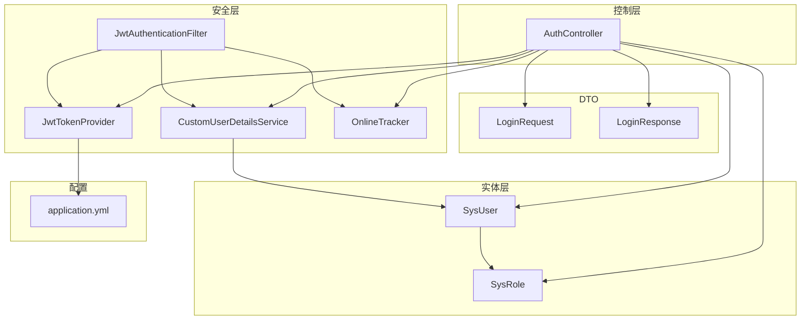
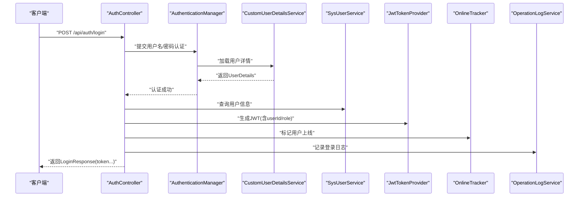
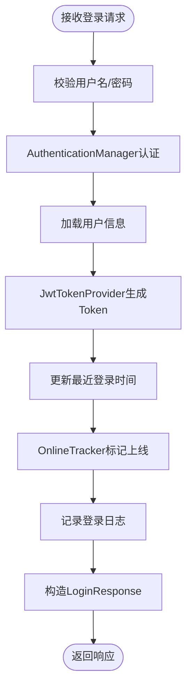
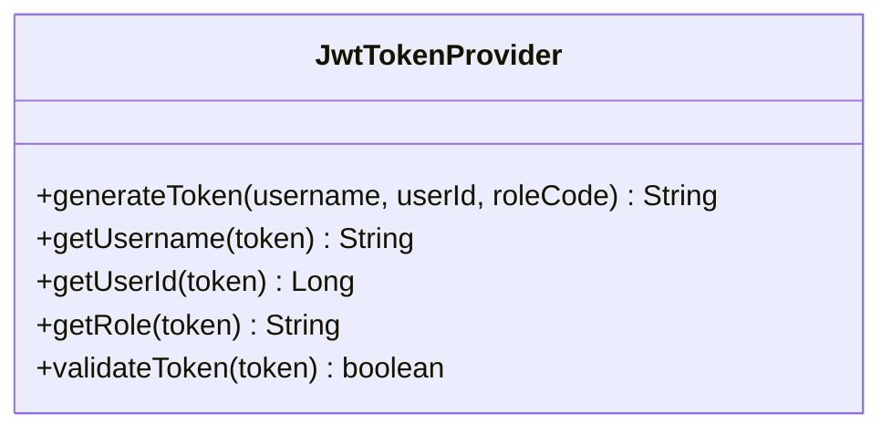
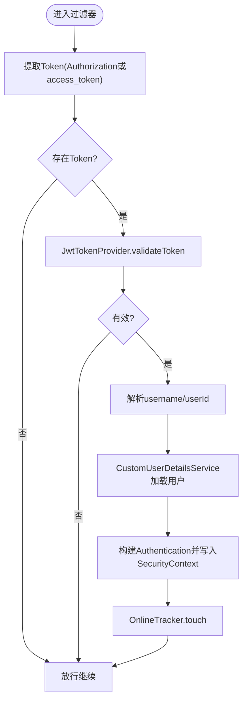
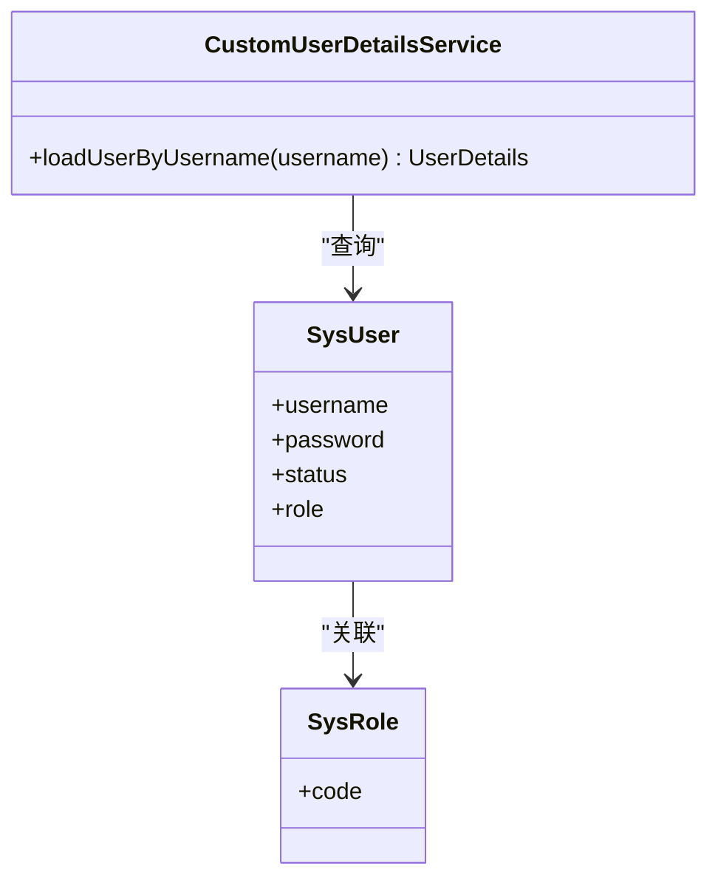
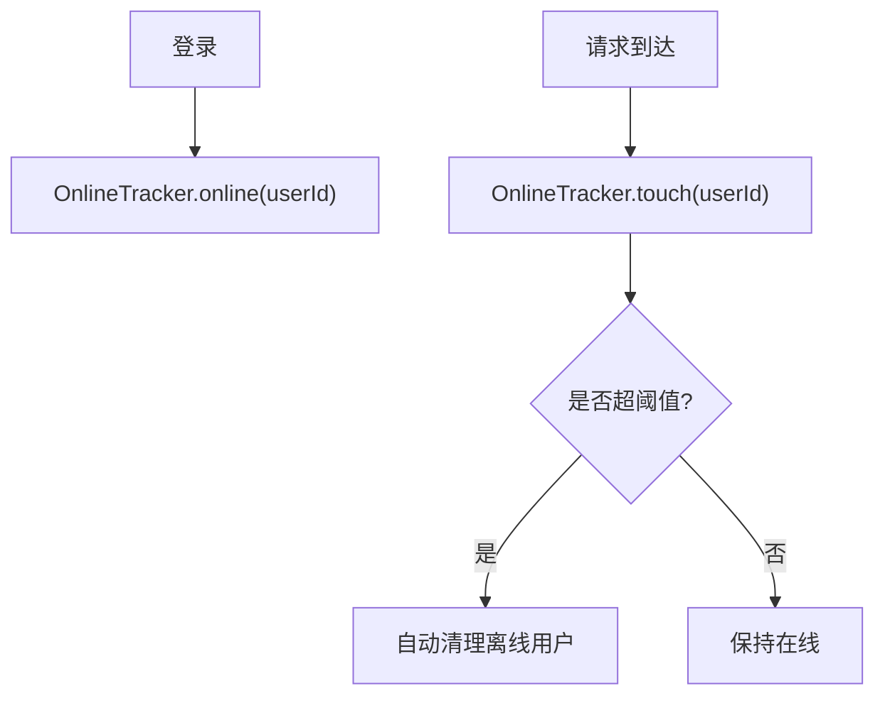
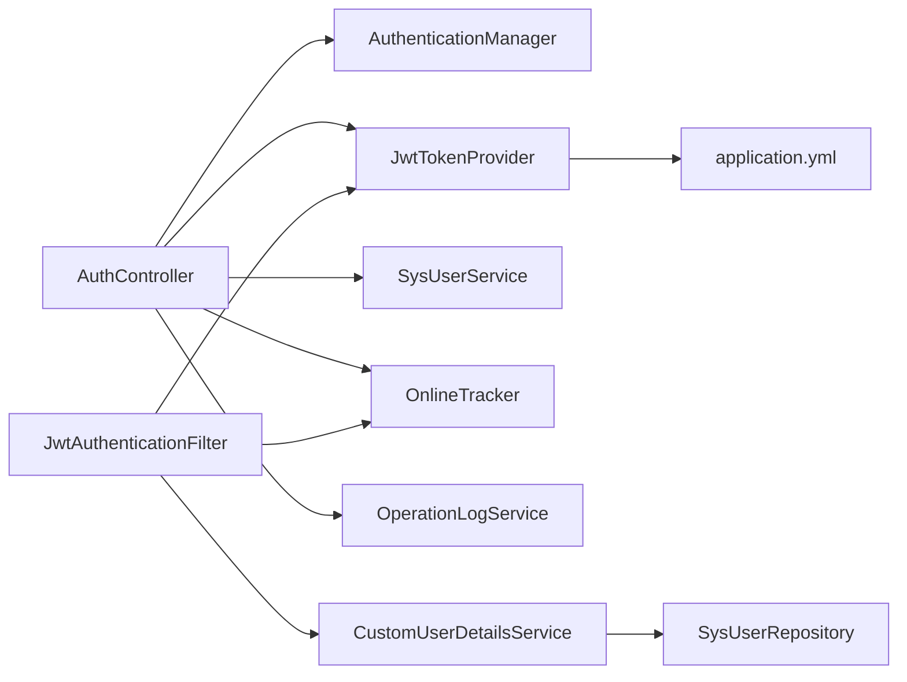

# 认证系统

<cite>
**本文引用的文件**
- [AuthController.java](file://src/main/java/com/superpower/modules/system/controller/AuthController.java)
- [LoginRequest.java](file://src/main/java/com/superpower/modules/system/dto/LoginRequest.java)
- [LoginResponse.java](file://src/main/java/com/superpower/modules/system/dto/LoginResponse.java)
- [JwtAuthenticationFilter.java](file://src/main/java/com/superpower/security/JwtAuthenticationFilter.java)
- [JwtTokenProvider.java](file://src/main/java/com/superpower/security/JwtTokenProvider.java)
- [CustomUserDetailsService.java](file://src/main/java/com/superpower/security/CustomUserDetailsService.java)
- [OnlineTracker.java](file://src/main/java/com/superpower/security/OnlineTracker.java)
- [SysUser.java](file://src/main/java/com/superpower/modules/system/entity/SysUser.java)
- [SysRole.java](file://src/main/java/com/superpower/modules/system/entity/SysRole.java)
- [application.yml](file://src/main/resources/application.yml)
</cite>

## 目录
1. [简介](#简介)
2. [项目结构](#项目结构)
3. [核心组件](#核心组件)
4. [架构总览](#架构总览)
5. [详细组件分析](#详细组件分析)
6. [依赖分析](#依赖分析)
7. [性能考虑](#性能考虑)
8. [故障排查指南](#故障排查指南)
9. [结论](#结论)
10. [附录](#附录)

## 简介
本文件面向认证系统的技术文档，聚焦于基于 JWT 的认证机制实现，涵盖 Token 生成、验证与拦截流程；详细说明 AuthController 登录接口的设计（用户名密码校验、Token 返回格式、会话管理）；给出 LoginRequest 与 LoginResponse 的数据结构说明；解析 JwtAuthenticationFilter 的过滤器实现与拦截机制；并通过序列图与流程图展示从用户登录到 Token 验证的完整过程；最后总结安全注意事项、Token 过期处理与异常场景的应对策略。

## 项目结构
认证相关代码主要分布在以下模块：
- 控制层：AuthController 提供登录、注册、修改密码等接口
- DTO 层：LoginRequest、LoginResponse 定义登录请求与响应数据结构
- 安全层：JwtTokenProvider 负责 Token 的签发与解析；JwtAuthenticationFilter 拦截请求进行 Token 校验；CustomUserDetailsService 实现 Spring Security 用户详情加载；OnlineTracker 维护在线状态
- 实体层：SysUser、SysRole 描述用户与角色模型
- 配置：application.yml 中定义 JWT 密钥与过期时间

图表来源
- [AuthController.java:1-98](file://src/main/java/com/superpower/modules/system/controller/AuthController.java#L1-L98)
- [JwtAuthenticationFilter.java:1-62](file://src/main/java/com/superpower/security/JwtAuthenticationFilter.java#L1-L62)
- [JwtTokenProvider.java:1-66](file://src/main/java/com/superpower/security/JwtTokenProvider.java#L1-L66)
- [CustomUserDetailsService.java:1-38](file://src/main/java/com/superpower/security/CustomUserDetailsService.java#L1-L38)
- [OnlineTracker.java:1-43](file://src/main/java/com/superpower/security/OnlineTracker.java#L1-L43)
- [SysUser.java:1-40](file://src/main/java/com/superpower/modules/system/entity/SysUser.java#L1-L40)
- [SysRole.java:1-27](file://src/main/java/com/superpower/modules/system/entity/SysRole.java#L1-L27)
- [application.yml:35-38](file://src/main/resources/application.yml#L35-L38)

章节来源
- [AuthController.java:1-98](file://src/main/java/com/superpower/modules/system/controller/AuthController.java#L1-L98)
- [application.yml:1-40](file://src/main/resources/application.yml#L1-L40)

## 核心组件
- AuthController：提供 /api/auth/login 登录接口，使用 AuthenticationManager 执行用户名密码认证，随后调用 JwtTokenProvider 生成 Token，并记录登录日志与在线状态
- LoginRequest：包含用户名与密码字段，使用非空校验
- LoginResponse：包含 token、用户名、用户ID、昵称、角色编码与角色名称
- JwtTokenProvider：负责基于密钥与过期时间生成与解析 JWT，提取用户信息与角色信息
- JwtAuthenticationFilter：在每个请求进入时尝试从 Authorization 头或查询参数中提取 Bearer Token，校验通过后将认证信息写入 SecurityContext
- CustomUserDetailsService：根据用户名加载用户详情，构建带角色权限的 UserDetails，并处理用户状态
- OnlineTracker：维护用户在线状态，支持上线、心跳更新与离线清理
- SysUser/SysRole：持久化用户与角色模型，用于登录与鉴权

章节来源
- [AuthController.java:44-60](file://src/main/java/com/superpower/modules/system/controller/AuthController.java#L44-L60)
- [LoginRequest.java:1-14](file://src/main/java/com/superpower/modules/system/dto/LoginRequest.java#L1-L14)
- [LoginResponse.java:1-16](file://src/main/java/com/superpower/modules/system/dto/LoginResponse.java#L1-L16)
- [JwtTokenProvider.java:25-64](file://src/main/java/com/superpower/security/JwtTokenProvider.java#L25-L64)
- [JwtAuthenticationFilter.java:32-48](file://src/main/java/com/superpower/security/JwtAuthenticationFilter.java#L32-L48)
- [CustomUserDetailsService.java:23-36](file://src/main/java/com/superpower/security/CustomUserDetailsService.java#L23-L36)
- [OnlineTracker.java:17-41](file://src/main/java/com/superpower/security/OnlineTracker.java#L17-L41)
- [SysUser.java:10-38](file://src/main/java/com/superpower/modules/system/entity/SysUser.java#L10-L38)
- [SysRole.java:10-19](file://src/main/java/com/superpower/modules/system/entity/SysRole.java#L10-L19)

## 架构总览
下图展示了认证系统的关键交互：客户端发起登录请求，服务端完成认证后发放 JWT；后续请求携带该 Token，过滤器对其进行校验并注入认证上下文。

图表来源
- [AuthController.java:44-60](file://src/main/java/com/superpower/modules/system/controller/AuthController.java#L44-L60)
- [JwtTokenProvider.java:25-35](file://src/main/java/com/superpower/security/JwtTokenProvider.java#L25-L35)
- [CustomUserDetailsService.java:23-36](file://src/main/java/com/superpower/security/CustomUserDetailsService.java#L23-L36)
- [OnlineTracker.java:17-18](file://src/main/java/com/superpower/security/OnlineTracker.java#L17-L18)

## 详细组件分析

### AuthController 登录接口
- 接口路径：/api/auth/login（POST）
- 输入：LoginRequest（用户名、密码）
- 处理流程：
  - 使用 AuthenticationManager 执行用户名/密码认证
  - 加载用户信息，调用 JwtTokenProvider 生成 Token（包含用户ID与角色编码）
  - 更新最近登录时间，标记用户上线，记录操作日志
  - 返回 LoginResponse（token、用户名、用户ID、昵称、角色编码、角色名称）
- 其他接口：/api/auth/me（GET，返回当前用户）、/api/auth/register（POST，注册）、/api/auth/password（PUT，改密）、/api/auth/nickname（PUT，改昵称）

图表来源
- [AuthController.java:44-60](file://src/main/java/com/superpower/modules/system/controller/AuthController.java#L44-L60)
- [JwtTokenProvider.java:25-35](file://src/main/java/com/superpower/security/JwtTokenProvider.java#L25-L35)

章节来源
- [AuthController.java:44-60](file://src/main/java/com/superpower/modules/system/controller/AuthController.java#L44-L60)
- [LoginRequest.java:7-12](file://src/main/java/com/superpower/modules/system/dto/LoginRequest.java#L7-L12)
- [LoginResponse.java:8-15](file://src/main/java/com/superpower/modules/system/dto/LoginResponse.java#L8-L15)

### 数据模型与字段说明
- LoginRequest
  - 字段：username（非空）、password（非空）
- LoginResponse
  - 字段：token（JWT字符串）、username（用户名）、userId（Long）、nickname（昵称）、roleCode（角色编码）、roleName（角色名称）

章节来源
- [LoginRequest.java:7-12](file://src/main/java/com/superpower/modules/system/dto/LoginRequest.java#L7-L12)
- [LoginResponse.java:8-15](file://src/main/java/com/superpower/modules/system/dto/LoginResponse.java#L8-L15)

### JwtTokenProvider：Token 生成与解析
- 生成：以用户名为 subject，附加 userId 与 role 作为自定义声明，设置签发时间与过期时间，使用对称密钥签名
- 解析：从 Token 提取 claims，支持按 subject、userId、role 获取用户信息
- 校验：捕获 JwtException/IllegalArgumentException 判断有效性

图表来源
- [JwtTokenProvider.java:25-64](file://src/main/java/com/superpower/security/JwtTokenProvider.java#L25-L64)

章节来源
- [JwtTokenProvider.java:18-64](file://src/main/java/com/superpower/security/JwtTokenProvider.java#L18-L64)
- [application.yml:35-38](file://src/main/resources/application.yml#L35-L38)

### JwtAuthenticationFilter：请求拦截与认证注入
- 提取 Token：优先从 Authorization 头（Bearer 前缀），其次从查询参数 access_token
- 校验与解析：调用 JwtTokenProvider 校验 Token 并获取用户名/用户ID
- 注入上下文：加载 UserDetails，构造 UsernamePasswordAuthenticationToken，写入 SecurityContextHolder
- 在线追踪：调用 OnlineTracker.touch 更新用户活跃时间

图表来源
- [JwtAuthenticationFilter.java:32-48](file://src/main/java/com/superpower/security/JwtAuthenticationFilter.java#L32-L48)
- [JwtTokenProvider.java:57-64](file://src/main/java/com/superpower/security/JwtTokenProvider.java#L57-L64)
- [CustomUserDetailsService.java:23-36](file://src/main/java/com/superpower/security/CustomUserDetailsService.java#L23-L36)
- [OnlineTracker.java:25-29](file://src/main/java/com/superpower/security/OnlineTracker.java#L25-L29)

章节来源
- [JwtAuthenticationFilter.java:32-60](file://src/main/java/com/superpower/security/JwtAuthenticationFilter.java#L32-L60)
- [JwtTokenProvider.java:37-55](file://src/main/java/com/superpower/security/JwtTokenProvider.java#L37-L55)
- [CustomUserDetailsService.java:23-36](file://src/main/java/com/superpower/security/CustomUserDetailsService.java#L23-L36)
- [OnlineTracker.java:25-29](file://src/main/java/com/superpower/security/OnlineTracker.java#L25-L29)

### 用户详情加载与权限映射
- 根据用户名查询 SysUser，若角色存在则使用角色编码，否则默认为 ROLE_USER
- 将角色编码转换为 ROLE_{code} 的 GrantedAuthority
- 若用户状态非启用，则标记为 disabled

图表来源
- [CustomUserDetailsService.java:23-36](file://src/main/java/com/superpower/security/CustomUserDetailsService.java#L23-L36)
- [SysUser.java:24-26](file://src/main/java/com/superpower/modules/system/entity/SysUser.java#L24-L26)
- [SysRole.java:18-19](file://src/main/java/com/superpower/modules/system/entity/SysRole.java#L18-L19)

章节来源
- [CustomUserDetailsService.java:23-36](file://src/main/java/com/superpower/security/CustomUserDetailsService.java#L23-L36)
- [SysUser.java:24-26](file://src/main/java/com/superpower/modules/system/entity/SysUser.java#L24-L26)
- [SysRole.java:18-19](file://src/main/java/com/superpower/modules/system/entity/SysRole.java#L18-L19)

### 在线状态跟踪
- 上线：用户登录时调用 online 标记
- 心跳：每次请求通过过滤器 touch 更新活跃时间
- 离线清理：超过阈值分钟未活跃的用户会被移除

图表来源
- [OnlineTracker.java:17-41](file://src/main/java/com/superpower/security/OnlineTracker.java#L17-L41)

章节来源
- [OnlineTracker.java:14-41](file://src/main/java/com/superpower/security/OnlineTracker.java#L14-L41)

## 依赖分析
- 控制层依赖：AuthenticationManager、JwtTokenProvider、SysUserService、OnlineTracker、OperationLogService
- 过滤器依赖：JwtTokenProvider、CustomUserDetailsService、OnlineTracker
- 用户详情服务依赖：SysUserRepository
- Token 提供者依赖：application.yml 中的密钥与过期时间配置

图表来源
- [AuthController.java:26-42](file://src/main/java/com/superpower/modules/system/controller/AuthController.java#L26-L42)
- [JwtAuthenticationFilter.java:24-30](file://src/main/java/com/superpower/security/JwtAuthenticationFilter.java#L24-L30)
- [JwtTokenProvider.java:18-23](file://src/main/java/com/superpower/security/JwtTokenProvider.java#L18-L23)
- [CustomUserDetailsService.java:19-21](file://src/main/java/com/superpower/security/CustomUserDetailsService.java#L19-L21)
- [application.yml:35-38](file://src/main/resources/application.yml#L35-L38)

章节来源
- [AuthController.java:26-42](file://src/main/java/com/superpower/modules/system/controller/AuthController.java#L26-L42)
- [JwtAuthenticationFilter.java:24-30](file://src/main/java/com/superpower/security/JwtAuthenticationFilter.java#L24-L30)
- [JwtTokenProvider.java:18-23](file://src/main/java/com/superpower/security/JwtTokenProvider.java#L18-L23)
- [CustomUserDetailsService.java:19-21](file://src/main/java/com/superpower/security/CustomUserDetailsService.java#L19-L21)
- [application.yml:35-38](file://src/main/resources/application.yml#L35-L38)

## 性能考虑
- Token 过期时间：默认 24 小时（毫秒级配置），建议根据业务风险调整
- 在线追踪：使用并发 Map 存储用户活跃时间，定期清理离线用户，避免内存膨胀
- 过滤器：OncePerRequestFilter 确保每请求仅执行一次，减少重复校验开销
- 数据库连接池：SQLite 连接池大小较小，高并发场景需评估数据库压力

章节来源
- [application.yml:35-38](file://src/main/resources/application.yml#L35-L38)
- [OnlineTracker.java:14-41](file://src/main/java/com/superpower/security/OnlineTracker.java#L14-L41)

## 故障排查指南
- 登录失败
  - 检查用户名/密码是否正确，确认用户状态是否启用
  - 查看 AuthenticationManager 抛出的异常与 CustomUserDetailsService 的用户名查找逻辑
- Token 无效
  - 确认 Authorization 头是否为 Bearer 前缀
  - 检查密钥与过期时间配置是否一致
  - 校验 Token 是否被篡改或已过期
- 请求未注入认证上下文
  - 检查 JwtAuthenticationFilter 是否生效（拦截链顺序）
  - 确认 SecurityContextHolder 是否被正确设置
- 在线状态异常
  - 检查 OnlineTracker.touch 是否被调用
  - 核对阈值时间与系统时间

章节来源
- [JwtAuthenticationFilter.java:32-48](file://src/main/java/com/superpower/security/JwtAuthenticationFilter.java#L32-L48)
- [JwtTokenProvider.java:57-64](file://src/main/java/com/superpower/security/JwtTokenProvider.java#L57-L64)
- [CustomUserDetailsService.java:23-36](file://src/main/java/com/superpower/security/CustomUserDetailsService.java#L23-L36)
- [OnlineTracker.java:25-29](file://src/main/java/com/superpower/security/OnlineTracker.java#L25-L29)

## 结论
本认证系统采用 Spring Security + JWT 的标准方案，通过 AuthController 提供登录入口，JwtTokenProvider 负责 Token 的生成与校验，JwtAuthenticationFilter 实现统一拦截与认证上下文注入，配合 OnlineTracker 完成在线状态管理。整体设计清晰、职责分离明确，具备良好的扩展性与可维护性。建议在生产环境中强化密钥管理、引入刷新 Token 机制与更细粒度的权限控制，并针对高并发场景优化数据库与缓存策略。

## 附录
- 配置项说明
  - app.jwt.secret：JWT 对称密钥
  - app.jwt.expiration-ms：Token 过期毫秒数（默认 24 小时）
- 响应包装
  - 所有接口返回 Result<T> 包装，便于前端统一处理

章节来源
- [application.yml:35-38](file://src/main/resources/application.yml#L35-L38)
- [AuthController.java:44-60](file://src/main/java/com/superpower/modules/system/controller/AuthController.java#L44-L60)