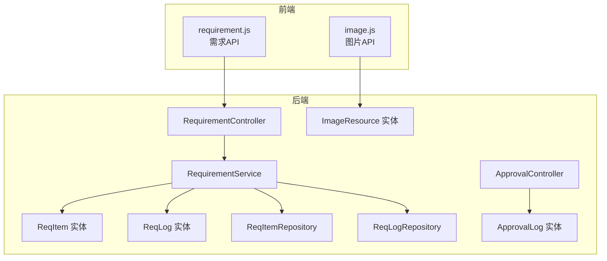
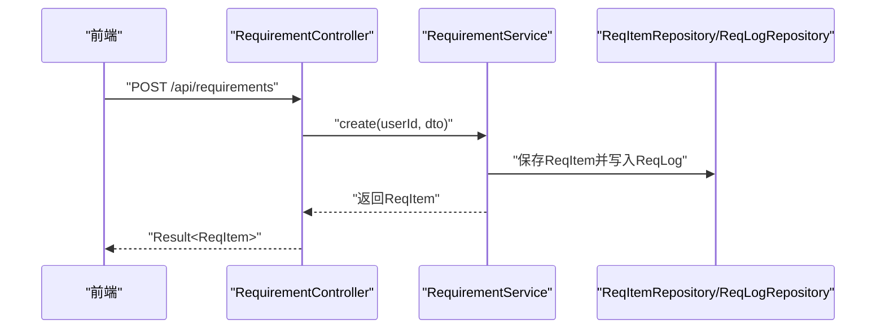
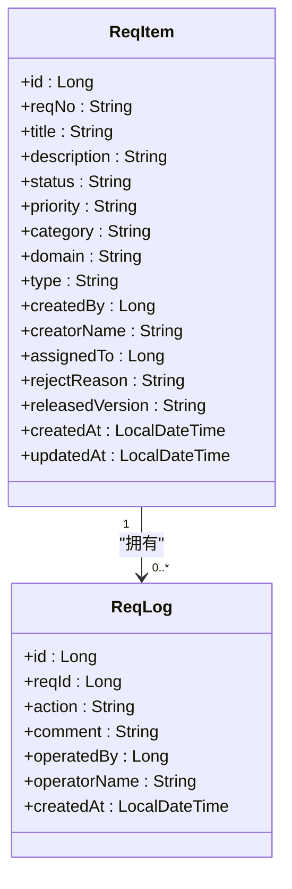
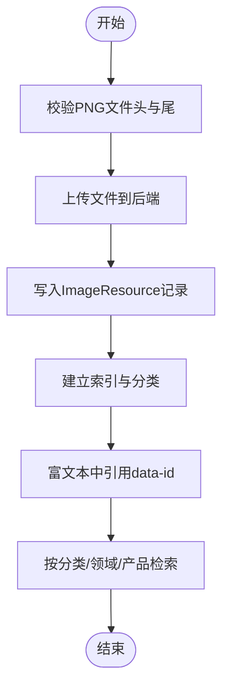
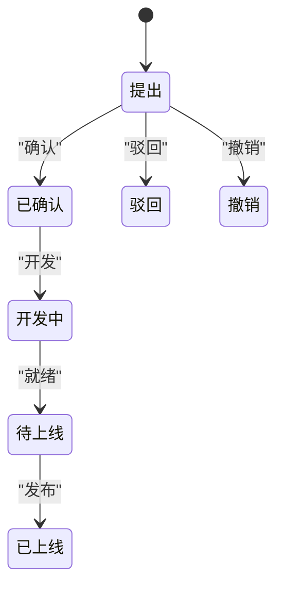
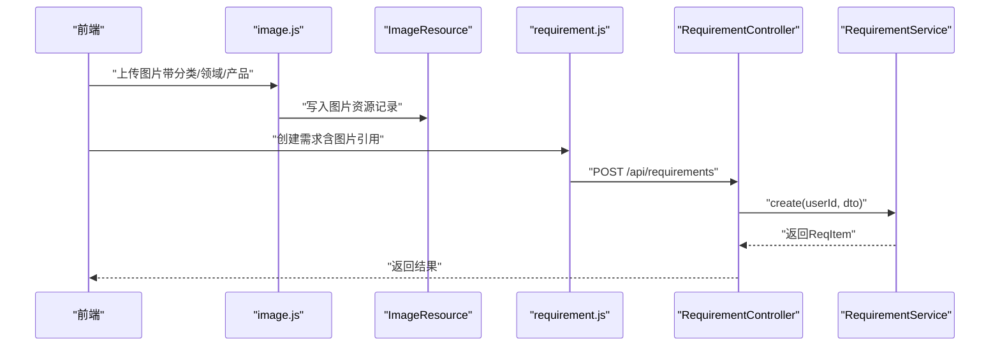
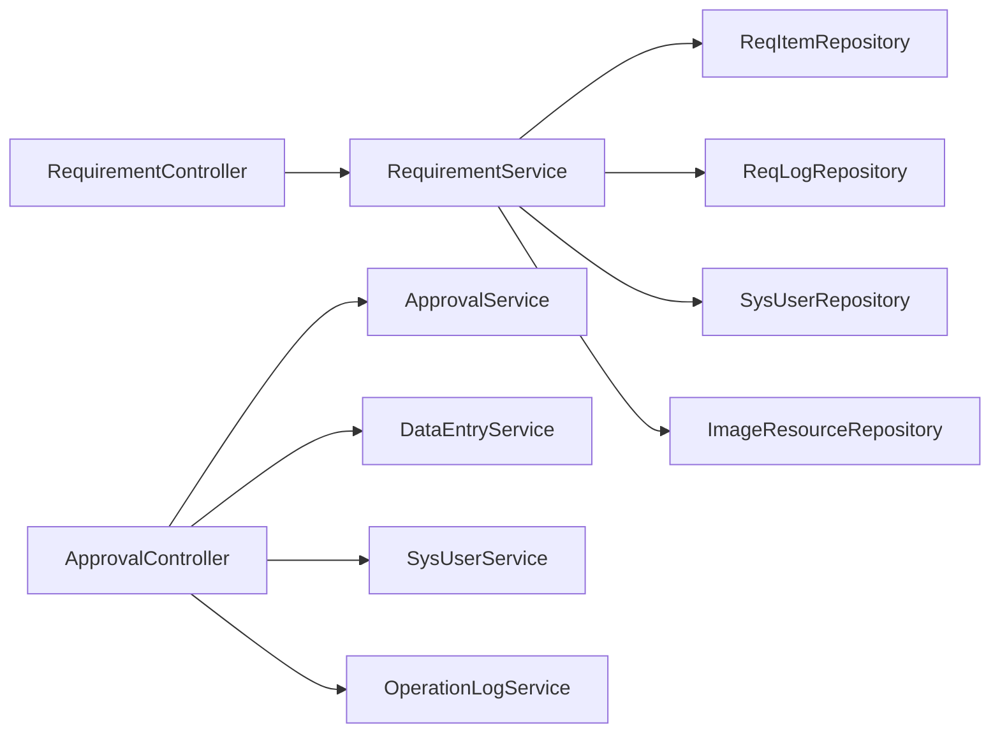

# 需求管理

<cite>
**本文引用的文件**
- [RequirementController.java](file://src/main/java/com/superpower/modules/requirement/controller/RequirementController.java)
- [RequirementService.java](file://src/main/java/com/superpower/modules/requirement/service/RequirementService.java)
- [ReqItem.java](file://src/main/java/com/superpower/modules/requirement/entity/ReqItem.java)
- [ReqLog.java](file://src/main/java/com/superpower/modules/requirement/entity/ReqLog.java)
- [ReqItemDTO.java](file://src/main/java/com/superpower/modules/requirement/dto/ReqItemDTO.java)
- [ReqItemRepository.java](file://src/main/java/com/superpower/modules/requirement/repository/ReqItemRepository.java)
- [ReqLogRepository.java](file://src/main/java/com/superpower/modules/requirement/repository/ReqLogRepository.java)
- [ApprovalController.java](file://src/main/java/com/superpower/modules/approval/controller/ApprovalController.java)
- [ApprovalLog.java](file://src/main/java/com/superpower/modules/approval/entity/ApprovalLog.java)
- [ImageResource.java](file://src/main/java/com/superpower/modules/image/entity/ImageResource.java)
- [requirement.js](file://frontend/src/api/requirement.js)
- [image.js](file://frontend/src/api/image.js)
- [init.sql](file://src/main/resources/db/init.sql)
- [20260531_add_requirement_tables.sql](file://db_changes/20260531_add_requirement_tables.sql)
- [20260531_req_images_directory.sql](file://db_changes/20260531_req_images_directory.sql)
</cite>

## 目录
1. [简介](#简介)
2. [项目结构](#项目结构)
3. [核心组件](#核心组件)
4. [架构总览](#架构总览)
5. [详细组件分析](#详细组件分析)
6. [依赖分析](#依赖分析)
7. [性能考虑](#性能考虑)
8. [故障排查指南](#故障排查指南)
9. [结论](#结论)
10. [附录](#附录)

## 简介
本文件面向需求管理系统，提供从数据模型到业务流程、从API接口到前后端集成的完整技术文档。重点覆盖以下方面：
- 需求清单的数据模型设计：ReqItem实体字段、业务规则与数据校验策略
- 需求图片管理：上传、存储、分类与检索机制
- 需求审批流程：ApprovalLog实体设计与状态流转
- 完整API接口说明：需求的创建、编辑、删除、查询与审批操作
- 工作流程示例：需求与产品数据的关联、审批权限控制与通知机制
- 在项目协作中的作用与使用场景

## 项目结构
后端采用Spring Boot分层架构，按模块组织：
- requirement：需求管理模块（控制器、服务、实体、仓库、DTO）
- approval：审批模块（控制器、实体、服务）
- image：图片资源模块（实体、服务、控制器）
- system：系统基础模块（用户、角色、菜单、操作日志等）

前端通过独立API模块调用后端REST接口。

图表来源
- [RequirementController.java:21-239](file://src/main/java/com/superpower/modules/requirement/controller/RequirementController.java#L21-L239)
- [RequirementService.java:24-274](file://src/main/java/com/superpower/modules/requirement/service/RequirementService.java#L24-L274)
- [ReqItem.java:10-59](file://src/main/java/com/superpower/modules/requirement/entity/ReqItem.java#L10-L59)
- [ReqLog.java:10-32](file://src/main/java/com/superpower/modules/requirement/entity/ReqLog.java#L10-L32)
- [ReqItemRepository.java:12-45](file://src/main/java/com/superpower/modules/requirement/repository/ReqItemRepository.java#L12-L45)
- [ReqLogRepository.java:9-13](file://src/main/java/com/superpower/modules/requirement/repository/ReqLogRepository.java#L9-L13)
- [ApprovalController.java:18-56](file://src/main/java/com/superpower/modules/approval/controller/ApprovalController.java#L18-L56)
- [ApprovalLog.java:10-38](file://src/main/java/com/superpower/modules/approval/entity/ApprovalLog.java#L10-L38)
- [ImageResource.java:10-59](file://src/main/java/com/superpower/modules/image/entity/ImageResource.java#L10-L59)
- [requirement.js:1-62](file://frontend/src/api/requirement.js#L1-L62)
- [image.js:1-93](file://frontend/src/api/image.js#L1-L93)

章节来源
- [RequirementController.java:21-239](file://src/main/java/com/superpower/modules/requirement/controller/RequirementController.java#L21-L239)
- [RequirementService.java:24-274](file://src/main/java/com/superpower/modules/requirement/service/RequirementService.java#L24-L274)
- [requirement.js:1-62](file://frontend/src/api/requirement.js#L1-L62)
- [image.js:1-93](file://frontend/src/api/image.js#L1-L93)

## 核心组件
- 需求实体ReqItem：承载需求编号、标题、描述、状态、优先级、分类、领域、类型、创建者、分配者、驳回原因、发布版本、时间戳等字段
- 需求日志ReqLog：记录每次操作动作、评论、操作人、时间
- 需求服务RequirementService：封装业务规则、状态流转、统计与日志记录
- 需求控制器RequirementController：暴露REST接口，处理鉴权与操作日志
- 审批实体ApprovalLog：记录审批流转的起止状态、操作、评论、操作人、时间
- 图片资源ImageResource：记录图片文件名、存储名、路径、分类、领域、产品、URL、尺寸、MIME、上传人、版本、宽高

章节来源
- [ReqItem.java:10-59](file://src/main/java/com/superpower/modules/requirement/entity/ReqItem.java#L10-L59)
- [ReqLog.java:10-32](file://src/main/java/com/superpower/modules/requirement/entity/ReqLog.java#L10-L32)
- [RequirementService.java:24-274](file://src/main/java/com/superpower/modules/requirement/service/RequirementService.java#L24-L274)
- [RequirementController.java:21-239](file://src/main/java/com/superpower/modules/requirement/controller/RequirementController.java#L21-L239)
- [ApprovalLog.java:10-38](file://src/main/java/com/superpower/modules/approval/entity/ApprovalLog.java#L10-L38)
- [ImageResource.java:10-59](file://src/main/java/com/superpower/modules/image/entity/ImageResource.java#L10-L59)

## 架构总览
需求管理由“前端API模块 + 后端控制器 + 服务层 + 数据访问层 + 数据库”构成。前端通过requirement.js与image.js调用后端接口；后端控制器负责鉴权与参数解析，服务层实现业务规则与状态机，仓库层负责数据持久化。

图表来源
- [RequirementController.java:164-170](file://src/main/java/com/superpower/modules/requirement/controller/RequirementController.java#L164-L170)
- [RequirementService.java:83-98](file://src/main/java/com/superpower/modules/requirement/service/RequirementService.java#L83-L98)
- [ReqItemRepository.java:12-45](file://src/main/java/com/superpower/modules/requirement/repository/ReqItemRepository.java#L12-L45)
- [ReqLogRepository.java:9-13](file://src/main/java/com/superpower/modules/requirement/repository/ReqLogRepository.java#L9-L13)

## 详细组件分析

### 数据模型设计与业务规则（ReqItem、ReqLog）
- 字段定义与约束
  - 需求编号reqNo：唯一、长度限制、自动生成
  - 标题title：必填、长度限制
  - 描述description：富文本可包含图片引用
  - 状态status：默认“提出”，支持“已确认”“开发中”“待上线”“已上线”“驳回”“撤销”
  - 优先级priority：默认“中”
  - 分类category、领域domain、类型type：用于筛选与统计
  - 创建者createdBy、分配者assignedTo：关联用户
  - 驳回原因rejectReason、发布版本releasedVersion：审批与发布阶段使用
  - 时间戳createdAt、updatedAt：自动维护
- 业务规则
  - 只能编辑“提出”状态的需求
  - 只有创建者可撤销“提出”状态的需求
  - 上线需提供版本号
  - 驳回需提供原因
  - 删除时清理未被其他需求引用的图片资源
- 日志记录
  - 每次状态变更均写入ReqLog，包含操作动作、评论、操作人

图表来源
- [ReqItem.java:10-59](file://src/main/java/com/superpower/modules/requirement/entity/ReqItem.java#L10-L59)
- [ReqLog.java:10-32](file://src/main/java/com/superpower/modules/requirement/entity/ReqLog.java#L10-L32)

章节来源
- [ReqItem.java:10-59](file://src/main/java/com/superpower/modules/requirement/entity/ReqItem.java#L10-L59)
- [ReqLog.java:10-32](file://src/main/java/com/superpower/modules/requirement/entity/ReqLog.java#L10-L32)
- [RequirementService.java:100-192](file://src/main/java/com/superpower/modules/requirement/service/RequirementService.java#L100-L192)

### 需求图片管理（上传、存储、分类与检索）
- 存储与分类
  - 图片资源实体ImageResource包含文件名、存储名、路径、URL、尺寸、MIME、上传人、版本、宽高等
  - 分类category、领域domain、产品product、产品IDproductId、版本versionId用于组织与检索
- 上传与校验
  - 前端对PNG进行头部与尾部完整性校验，避免损坏文件
  - 支持附加参数：category、domain、product、versionId、filename
- 检索与引用
  - 提供树形目录与列表查询接口
  - 支持批量引用查询与需求引用查询，便于在富文本中嵌入图片并追踪引用关系

图表来源
- [image.js:6-38](file://frontend/src/api/image.js#L6-L38)
- [ImageResource.java:10-59](file://src/main/java/com/superpower/modules/image/entity/ImageResource.java#L10-L59)

章节来源
- [image.js:1-93](file://frontend/src/api/image.js#L1-L93)
- [ImageResource.java:10-59](file://src/main/java/com/superpower/modules/image/entity/ImageResource.java#L10-L59)
- [20260531_req_images_directory.sql:1-7](file://db_changes/20260531_req_images_directory.sql#L1-L7)

### 需求审批流程（ApprovalLog与状态流转）
- 审批日志实体ApprovalLog
  - 记录entryId、fromStatus、toStatus、action、operatorId、operatorName、comment、createdAt
- 状态流转
  - 需求状态机：提出 → 已确认 → 开发中 → 待上线 → 已上线；或驳回/撤销
  - 控制器接收action与comment，服务层根据角色与状态执行审批
- 权限控制
  - 删除需求接口要求管理员角色
  - 操作日志记录审批行为，便于审计

图表来源
- [RequirementService.java:119-192](file://src/main/java/com/superpower/modules/requirement/service/RequirementService.java#L119-L192)
- [ApprovalController.java:35-49](file://src/main/java/com/superpower/modules/approval/controller/ApprovalController.java#L35-L49)
- [ApprovalLog.java:10-38](file://src/main/java/com/superpower/modules/approval/entity/ApprovalLog.java#L10-L38)

章节来源
- [RequirementService.java:119-192](file://src/main/java/com/superpower/modules/requirement/service/RequirementService.java#L119-L192)
- [ApprovalController.java:35-49](file://src/main/java/com/superpower/modules/approval/controller/ApprovalController.java#L35-L49)
- [ApprovalLog.java:10-38](file://src/main/java/com/superpower/modules/approval/entity/ApprovalLog.java#L10-L38)

### API接口说明（需求与审批）
- 需求管理API（后端）
  - GET /api/requirements：分页/筛选列表（支持状态、创建者、时间范围、分类、领域、类型、优先级）
  - GET /api/requirements/my：获取我的需求
  - GET /api/requirements/{id}：获取详情（含日志、创建者昵称）
  - GET /api/requirements/stats、/stats-by-module、/stats-by-type：统计
  - POST /api/requirements：创建
  - PUT /api/requirements/{id}：编辑（仅“提出”状态且本人）
  - PUT /api/requirements/{id}/confirm：确认
  - PUT /api/requirements/{id}/develop：开发
  - PUT /api/requirements/{id}/ready：就绪
  - PUT /api/requirements/{id}/release：发布（需版本号）
  - PUT /api/requirements/{id}/reject：驳回（需原因）
  - PUT /api/requirements/{id}/cancel：撤销（仅本人“提出”状态）
  - DELETE /api/requirements/{id}：删除（管理员）
- 审批API（后端）
  - POST /api/approval/{entryId}：提交审批动作与评论
  - GET /api/approval/{entryId}/logs：查询审批日志

章节来源
- [RequirementController.java:55-237](file://src/main/java/com/superpower/modules/requirement/controller/RequirementController.java#L55-L237)
- [ApprovalController.java:35-54](file://src/main/java/com/superpower/modules/approval/controller/ApprovalController.java#L35-L54)

### 前端API对接与工作流示例
- 前端通过requirement.js与image.js调用后端接口
- 典型工作流
  - 创建需求：前端调用创建接口，后端生成需求编号并写入ReqItem与ReqLog
  - 富文本嵌图：前端上传图片至ImageResource，后端返回引用信息；在描述中插入data-id
  - 审批与发布：审批控制器记录ApprovalLog；需求服务执行状态机，发布时校验版本号
  - 统计与检索：前端调用统计接口与图片树接口，实现多维聚合与分类浏览

图表来源
- [requirement.js:27-29](file://frontend/src/api/requirement.js#L27-L29)
- [image.js:24-38](file://frontend/src/api/image.js#L24-L38)
- [RequirementController.java:164-170](file://src/main/java/com/superpower/modules/requirement/controller/RequirementController.java#L164-L170)
- [RequirementService.java:83-98](file://src/main/java/com/superpower/modules/requirement/service/RequirementService.java#L83-L98)

## 依赖分析
- 组件耦合
  - RequirementController依赖RequirementService与系统用户、操作日志服务
  - RequirementService依赖ReqItemRepository、ReqLogRepository、SysUserRepository、ImageResourceRepository
  - ApprovalController依赖ApprovalService、DataEntryService、SysUserService、OperationLogService
- 外部依赖
  - 数据库：PostgreSQL（系统表）与SQLite（需求表迁移脚本）
  - 前端：基于axios封装的request工具与各模块API

图表来源
- [RequirementController.java:25-36](file://src/main/java/com/superpower/modules/requirement/controller/RequirementController.java#L25-L36)
- [RequirementService.java:27-40](file://src/main/java/com/superpower/modules/requirement/service/RequirementService.java#L27-L40)
- [ApprovalController.java:22-33](file://src/main/java/com/superpower/modules/approval/controller/ApprovalController.java#L22-L33)

章节来源
- [RequirementController.java:25-36](file://src/main/java/com/superpower/modules/requirement/controller/RequirementController.java#L25-L36)
- [RequirementService.java:27-40](file://src/main/java/com/superpower/modules/requirement/service/RequirementService.java#L27-L40)
- [ApprovalController.java:22-33](file://src/main/java/com/superpower/modules/approval/controller/ApprovalController.java#L22-L33)

## 性能考虑
- 查询优化
  - 列表查询支持多条件过滤，建议在高频查询字段上建立索引（如status、created_by、category、domain、type、priority）
- 事务边界
  - 状态变更与日志写入在同一事务内，保证一致性
- 图片清理
  - 删除需求时扫描描述中的图片引用，避免重复删除与误删
- 前端缓存
  - 建议对统计接口与图片树接口做轻量缓存，减少重复请求

## 故障排查指南
- 常见错误与定位
  - “需求不存在”：检查ReqItemRepository是否正确加载
  - “只能编辑自己提出的需求”：确认当前用户与createdBy一致
  - “只有‘提出’状态的需求可以编辑/撤销”：检查状态机流转
  - “上线操作必须填写版本号”：确认release接口传入releasedVersion
  - “当前状态不允许驳回”：确认需求状态为“提出”或“已确认”
- 日志与审计
  - 使用ReqLog与ApprovalLog核对操作轨迹
  - 操作日志服务记录关键动作，便于问题追溯

章节来源
- [RequirementService.java:103-108](file://src/main/java/com/superpower/modules/requirement/service/RequirementService.java#L103-L108)
- [RequirementService.java:153-155](file://src/main/java/com/superpower/modules/requirement/service/RequirementService.java#L153-L155)
- [RequirementService.java:166-171](file://src/main/java/com/superpower/modules/requirement/service/RequirementService.java#L166-L171)
- [RequirementService.java:182-187](file://src/main/java/com/superpower/modules/requirement/service/RequirementService.java#L182-L187)
- [ReqLogRepository.java:10-13](file://src/main/java/com/superpower/modules/requirement/repository/ReqLogRepository.java#L10-L13)

## 结论
需求管理系统以清晰的状态机与完善的日志体系为核心，结合图片资源的分类存储与引用追踪，满足项目协作中的需求全生命周期管理。通过REST接口与前端模块化API，系统实现了从创建、审批、开发到发布的闭环流程，并具备良好的扩展性与可审计性。

## 附录

### 数据库初始化与需求表结构
- 初始化脚本包含系统用户、角色、菜单、版本与数据条目等表
- 需求管理新增表：req_item、req_log

章节来源
- [init.sql:1-126](file://src/main/resources/db/init.sql#L1-L126)
- [20260531_add_requirement_tables.sql:1-28](file://db_changes/20260531_add_requirement_tables.sql#L1-L28)