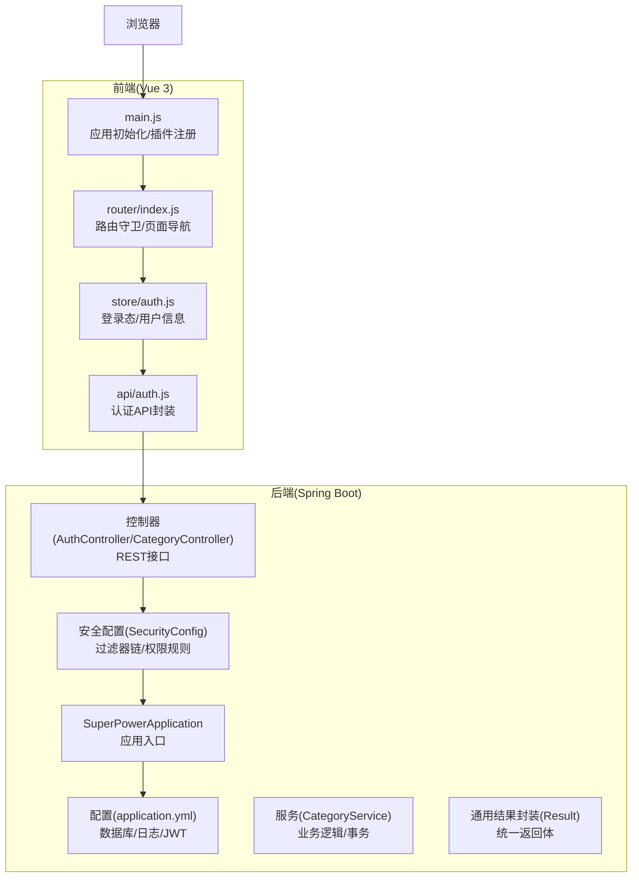
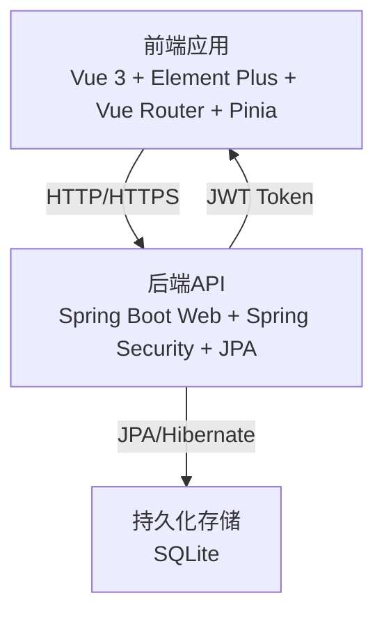
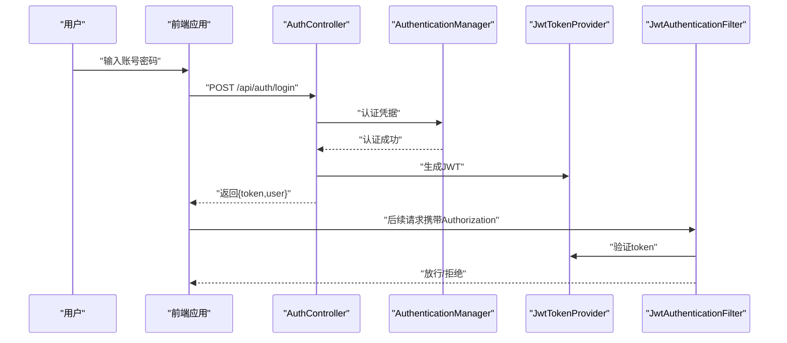
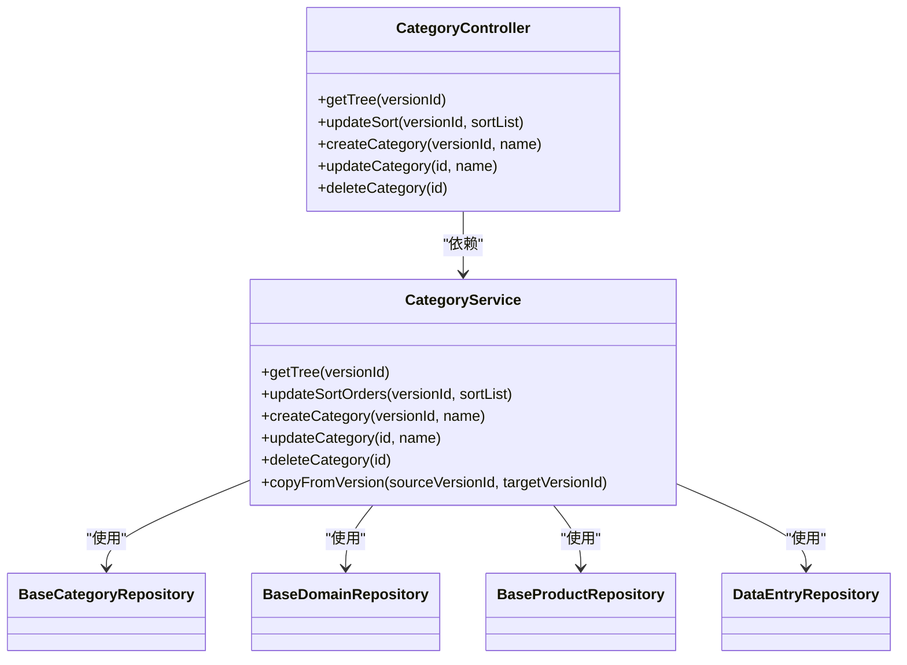
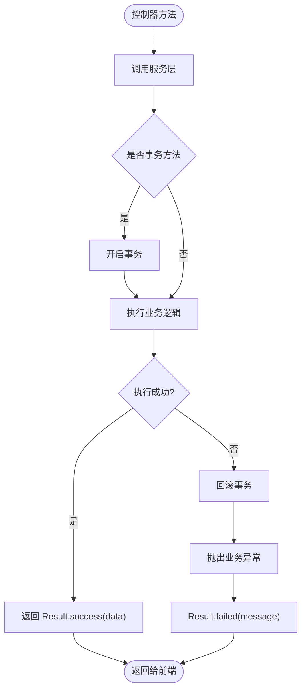
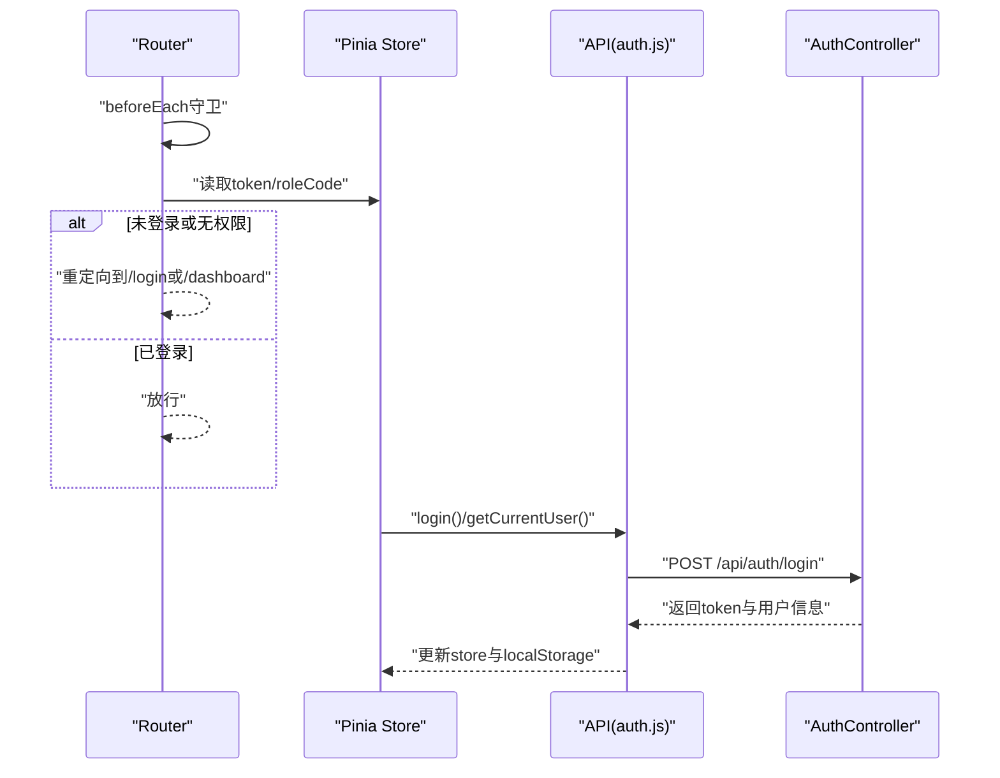
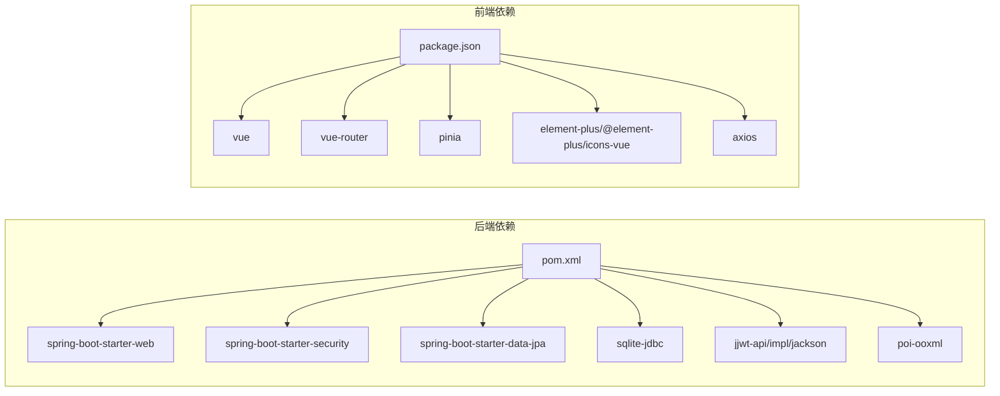

# 系统架构

<cite>
**本文引用的文件**
- [SuperPowerApplication.java](file://src/main/java/com/superpower/SuperPowerApplication.java)
- [application.yml](file://src/main/resources/application.yml)
- [pom.xml](file://pom.xml)
- [SecurityConfig.java](file://src/main/java/com/superpower/config/SecurityConfig.java)
- [JwtAuthenticationFilter.java](file://src/main/java/com/superpower/security/JwtAuthenticationFilter.java)
- [WebMvcConfig.java](file://src/main/java/com/superpower/config/WebMvcConfig.java)
- [AuthController.java](file://src/main/java/com/superpower/modules/system/controller/AuthController.java)
- [CategoryController.java](file://src/main/java/com/superpower/modules/category/controller/CategoryController.java)
- [CategoryService.java](file://src/main/java/com/superpower/modules/category/service/CategoryService.java)
- [Result.java](file://src/main/java/com/superpower/common/Result.java)
- [main.js](file://frontend/src/main.js)
- [index.js](file://frontend/src/router/index.js)
- [auth.js](file://frontend/src/api/auth.js)
- [auth.js（前端store）](file://frontend/src/store/auth.js)
- [package.json](file://frontend/package.json)
</cite>

## 目录
1. [引言](#引言)
2. [项目结构](#项目结构)
3. [核心组件](#核心组件)
4. [架构总览](#架构总览)
5. [详细组件分析](#详细组件分析)
6. [依赖分析](#依赖分析)
7. [性能考量](#性能考量)
8. [故障排查指南](#故障排查指南)
9. [结论](#结论)
10. [附录](#附录)

## 引言
本系统是一个基于前后端分离的产品清单管理系统，采用 Spring Boot 后端与 Vue.js 前端的组合架构，使用 JWT 进行无状态认证，并以 SQLite 作为默认持久化存储。系统通过模块化组织实现功能解耦，采用 MVC 分层设计与依赖注入，结合事务管理与统一响应包装，确保可维护性与可扩展性。

## 项目结构
系统采用典型的“后端 Java 工程 + 前端 Vue 工程”布局，后端以 Spring Boot 提供 REST API，前端通过 Vue Router 实现单页路由，Pinia 管理状态，Element Plus 提供 UI 组件库。

**图表来源**
- [SuperPowerApplication.java:1-82](file://src/main/java/com/superpower/SuperPowerApplication.java#L1-L82)
- [application.yml:1-40](file://src/main/resources/application.yml#L1-L40)
- [SecurityConfig.java:1-57](file://src/main/java/com/superpower/config/SecurityConfig.java#L1-L57)
- [AuthController.java:1-98](file://src/main/java/com/superpower/modules/system/controller/AuthController.java#L1-L98)
- [CategoryController.java:1-66](file://src/main/java/com/superpower/modules/category/controller/CategoryController.java#L1-L66)
- [CategoryService.java:1-273](file://src/main/java/com/superpower/modules/category/service/CategoryService.java#L1-L273)
- [Result.java:1-41](file://src/main/java/com/superpower/common/Result.java#L1-L41)
- [main.js:1-20](file://frontend/src/main.js#L1-L20)
- [index.js:1-129](file://frontend/src/router/index.js#L1-L129)
- [auth.js（前端store）:1-46](file://frontend/src/store/auth.js#L1-L46)
- [auth.js:1-22](file://frontend/src/api/auth.js#L1-L22)

**章节来源**
- [SuperPowerApplication.java:1-82](file://src/main/java/com/superpower/SuperPowerApplication.java#L1-L82)
- [application.yml:1-40](file://src/main/resources/application.yml#L1-L40)
- [pom.xml:1-116](file://pom.xml#L1-L116)
- [main.js:1-20](file://frontend/src/main.js#L1-L20)
- [index.js:1-129](file://frontend/src/router/index.js#L1-L129)
- [package.json:1-28](file://frontend/package.json#L1-L28)

## 核心组件
- 应用入口与初始化：后端通过 Spring Boot 启动类完成依赖注入与基础数据初始化；前端通过 Vue 应用挂载完成全局插件与路由注册。
- 安全与认证：后端通过 Spring Security 配置无状态会话策略，集成 JWT 过滤器链；前端通过 Pinia store 与路由守卫实现登录态校验与角色控制。
- 控制器与服务：控制器负责请求映射与参数校验，服务层承载业务逻辑并声明事务边界；统一返回体封装便于前端处理。
- 资源与静态访问：后端通过 WebMvc 配置对外暴露本地文件资源路径，支持图片与需求文件下载。

**章节来源**
- [SuperPowerApplication.java:35-80](file://src/main/java/com/superpower/SuperPowerApplication.java#L35-L80)
- [SecurityConfig.java:27-56](file://src/main/java/com/superpower/config/SecurityConfig.java#L27-L56)
- [JwtAuthenticationFilter.java:1-62](file://src/main/java/com/superpower/security/JwtAuthenticationFilter.java#L1-L62)
- [AuthController.java:22-98](file://src/main/java/com/superpower/modules/system/controller/AuthController.java#L22-L98)
- [CategoryController.java:13-66](file://src/main/java/com/superpower/modules/category/controller/CategoryController.java#L13-L66)
- [CategoryService.java:18-273](file://src/main/java/com/superpower/modules/category/service/CategoryService.java#L18-L273)
- [Result.java:1-41](file://src/main/java/com/superpower/common/Result.java#L1-L41)
- [WebMvcConfig.java:8-22](file://src/main/java/com/superpower/config/WebMvcConfig.java#L8-L22)
- [main.js:1-20](file://frontend/src/main.js#L1-L20)
- [index.js:111-126](file://frontend/src/router/index.js#L111-L126)
- [auth.js（前端store）:1-46](file://frontend/src/store/auth.js#L1-L46)

## 架构总览
系统采用前后端分离与分层架构，后端以 Spring Boot MVC 为核心，前端以 Vue Router + Pinia 为核心，通过 REST 接口进行通信。JWT 用于无状态认证，SQLite 作为默认数据库，JPA/Hibernate 提供 ORM 支持。

**图表来源**
- [pom.xml:21-83](file://pom.xml#L21-L83)
- [application.yml:18-34](file://src/main/resources/application.yml#L18-L34)
- [SecurityConfig.java:27-45](file://src/main/java/com/superpower/config/SecurityConfig.java#L27-L45)
- [JwtAuthenticationFilter.java:17-61](file://src/main/java/com/superpower/security/JwtAuthenticationFilter.java#L17-L61)
- [main.js:1-20](file://frontend/src/main.js#L1-L20)
- [index.js:1-129](file://frontend/src/router/index.js#L1-L129)

## 详细组件分析

### 认证与授权流程
系统采用基于 JWT 的无状态认证，后端在登录成功后签发令牌，前端将令牌保存在本地存储并通过请求头携带；安全过滤器链对受保护资源进行鉴权。

**图表来源**
- [AuthController.java:44-60](file://src/main/java/com/superpower/modules/system/controller/AuthController.java#L44-L60)
- [SecurityConfig.java:27-45](file://src/main/java/com/superpower/config/SecurityConfig.java#L27-L45)
- [JwtAuthenticationFilter.java:32-48](file://src/main/java/com/superpower/security/JwtAuthenticationFilter.java#L32-L48)
- [auth.js（前端store）:9-19](file://frontend/src/store/auth.js#L9-L19)
- [auth.js:3-5](file://frontend/src/api/auth.js#L3-L5)

**章节来源**
- [AuthController.java:44-60](file://src/main/java/com/superpower/modules/system/controller/AuthController.java#L44-L60)
- [SecurityConfig.java:27-45](file://src/main/java/com/superpower/config/SecurityConfig.java#L27-L45)
- [JwtAuthenticationFilter.java:32-48](file://src/main/java/com/superpower/security/JwtAuthenticationFilter.java#L32-L48)
- [auth.js（前端store）:9-19](file://frontend/src/store/auth.js#L9-L19)
- [auth.js:3-5](file://frontend/src/api/auth.js#L3-L5)

### 分类树管理（MVC 与事务）
分类树管理涉及三层协作：控制器接收请求并调用服务，服务层执行业务逻辑并保证事务一致性，仓储层负责数据持久化。

**图表来源**
- [CategoryController.java:13-66](file://src/main/java/com/superpower/modules/category/controller/CategoryController.java#L13-L66)
- [CategoryService.java:18-273](file://src/main/java/com/superpower/modules/category/service/CategoryService.java#L18-L273)

**章节来源**
- [CategoryController.java:23-64](file://src/main/java/com/superpower/modules/category/controller/CategoryController.java#L23-L64)
- [CategoryService.java:36-164](file://src/main/java/com/superpower/modules/category/service/CategoryService.java#L36-L164)

### 统一响应与异常处理
后端通过统一的结果封装类提供一致的响应格式，前端据此进行错误处理与提示。

**图表来源**
- [Result.java:17-39](file://src/main/java/com/superpower/common/Result.java#L17-L39)
- [CategoryService.java:80-103](file://src/main/java/com/superpower/modules/category/service/CategoryService.java#L80-L103)

**章节来源**
- [Result.java:1-41](file://src/main/java/com/superpower/common/Result.java#L1-L41)
- [CategoryService.java:80-103](file://src/main/java/com/superpower/modules/category/service/CategoryService.java#L80-L103)

### 前端路由与状态管理
前端通过 Vue Router 实现页面导航与权限控制，通过 Pinia store 管理登录态与用户信息，通过 API 模块封装 HTTP 请求。

**图表来源**
- [index.js:111-126](file://frontend/src/router/index.js#L111-L126)
- [auth.js（前端store）:9-28](file://frontend/src/store/auth.js#L9-L28)
- [auth.js:3-9](file://frontend/src/api/auth.js#L3-L9)

**章节来源**
- [index.js:111-126](file://frontend/src/router/index.js#L111-L126)
- [auth.js（前端store）:1-46](file://frontend/src/store/auth.js#L1-L46)
- [auth.js:1-22](file://frontend/src/api/auth.js#L1-L22)

## 依赖分析
后端依赖 Spring Boot Starter Web、Security、Data JPA、SQLite JDBC、jjwt 等；前端依赖 Vue 3、Vue Router、Pinia、Element Plus、Axios 等。

**图表来源**
- [pom.xml:21-83](file://pom.xml#L21-L83)
- [package.json:11-26](file://frontend/package.json#L11-L26)

**章节来源**
- [pom.xml:1-116](file://pom.xml#L1-L116)
- [package.json:1-28](file://frontend/package.json#L1-L28)

## 性能考量
- 数据库连接池与超时：配置最大连接数与连接泄漏检测阈值，避免高并发下的连接争用。
- SQL 执行与日志：关闭 SQL 显示与格式化，减少日志开销；必要时开启调试级别定位问题。
- 文件上传限制：设置合理的文件大小与请求大小上限，防止内存溢出。
- 前端渲染优化：虚拟滚动与按需加载组件，降低首屏与列表渲染压力。
- 缓存策略建议：可引入 Redis 缓存热点数据与令牌黑名单，提升响应速度与安全性。

[本节为通用指导，不直接分析具体文件]

## 故障排查指南
- 登录失败：检查用户名密码、数据库中用户是否存在、密码编码是否匹配；查看认证日志与安全过滤器链配置。
- 权限不足：确认路由元信息中的角色字段与用户角色码是否一致；检查安全配置中的放行规则。
- 文件访问异常：确认资源处理器映射路径与实际存储目录；检查文件权限与路径拼接逻辑。
- 统一返回体异常：核对 Result 封装与异常捕获逻辑，确保前端能正确解析错误码与消息。

**章节来源**
- [SecurityConfig.java:27-45](file://src/main/java/com/superpower/config/SecurityConfig.java#L27-L45)
- [WebMvcConfig.java:14-21](file://src/main/java/com/superpower/config/WebMvcConfig.java#L14-L21)
- [Result.java:25-39](file://src/main/java/com/superpower/common/Result.java#L25-L39)

## 结论
系统通过前后端分离与分层架构实现了清晰的职责划分，配合 JWT 无状态认证与统一响应体，提升了开发效率与用户体验。在当前单体架构基础上，建议逐步引入微服务拆分、插件化扩展点与更完善的缓存与监控体系，以支撑更大规模的业务演进。

[本节为总结性内容，不直接分析具体文件]

## 附录
- 技术栈要点
  - 后端：Spring Boot 3.x、Spring Security、Spring Data JPA、SQLite、jjwt
  - 前端：Vue 3、Vue Router、Pinia、Element Plus、Axios
- 关键配置参考
  - JWT 密钥与过期时间、文件上传大小、数据库连接池参数等

**章节来源**
- [application.yml:35-40](file://src/main/resources/application.yml#L35-L40)
- [pom.xml:16-18](file://pom.xml#L16-L18)
- [package.json:11-26](file://frontend/package.json#L11-L26)