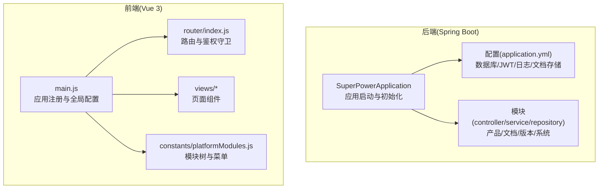
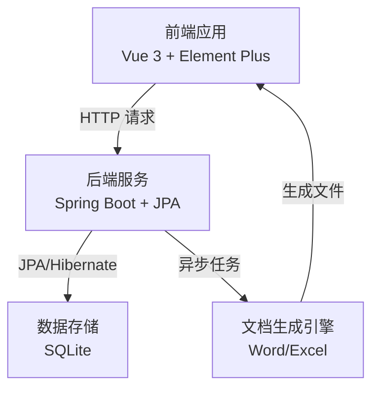
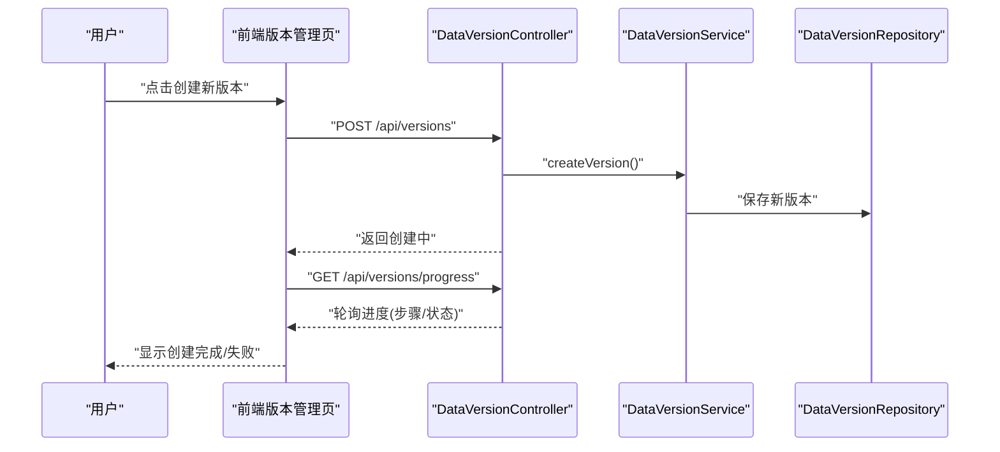
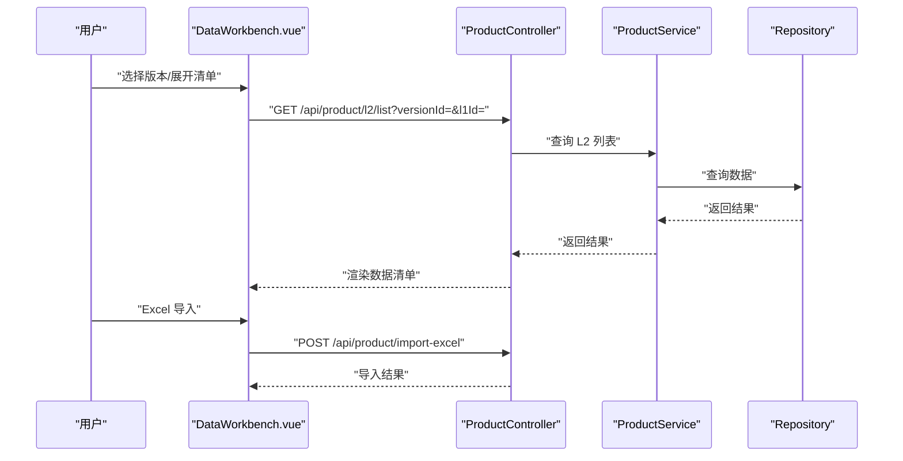
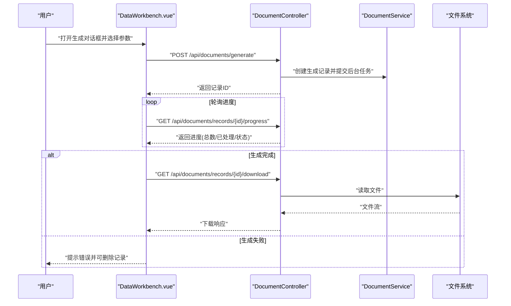
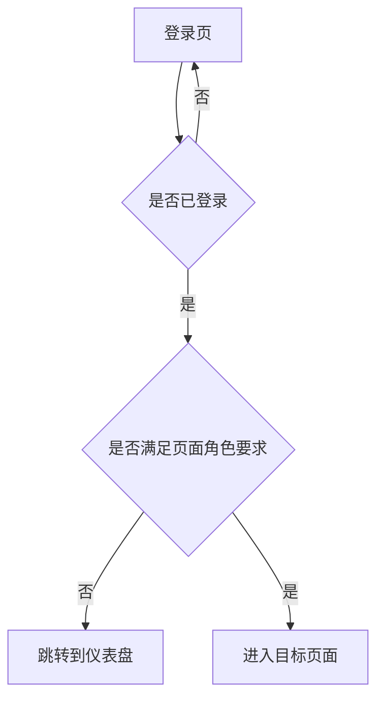
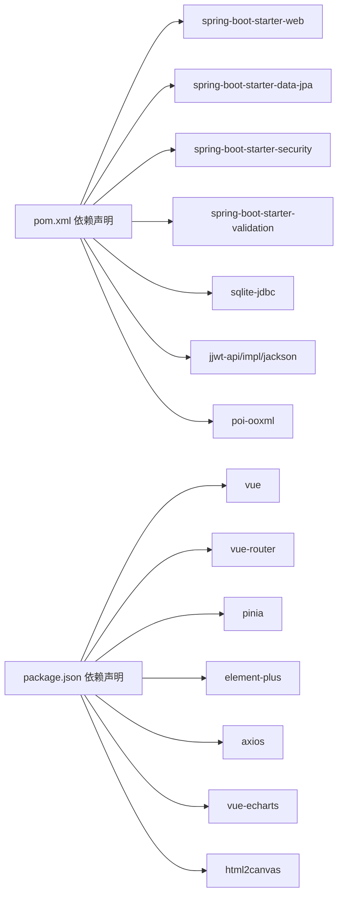

# 项目介绍

<cite>
**本文引用的文件**
- [application.yml](file://src/main/resources/application.yml)
- [pom.xml](file://pom.xml)
- [SuperPowerApplication.java](file://src/main/java/com/superpower/SuperPowerApplication.java)
- [ProductController.java](file://src/main/java/com/superpower/modules/category/controller/ProductController.java)
- [DocumentController.java](file://src/main/java/com/superpower/modules/document/controller/DocumentController.java)
- [DataVersionController.java](file://src/main/java/com/superpower/modules/version/controller/DataVersionController.java)
- [DataWorkbench.vue](file://frontend/src/views/dashboard/DataWorkbench.vue)
- [VersionManage.vue](file://frontend/src/views/system/VersionManage.vue)
- [index.js](file://frontend/src/router/index.js)
- [platformModules.js](file://frontend/src/constants/platformModules.js)
- [package.json](file://frontend/package.json)
- [BaseProductL1.java](file://src/main/java/com/superpower/modules/category/entity/BaseProductL1.java)
- [DocGenRecord.java](file://src/main/java/com/superpower/modules/document/entity/DocGenRecord.java)
- [DataVersion.java](file://src/main/java/com/superpower/modules/version/entity/DataVersion.java)
</cite>

## 目录
1. [引言](#引言)
2. [项目结构](#项目结构)
3. [核心组件](#核心组件)
4. [架构总览](#架构总览)
5. [详细组件分析](#详细组件分析)
6. [依赖关系分析](#依赖关系分析)
7. [性能考量](#性能考量)
8. [故障排查指南](#故障排查指南)
9. [结论](#结论)
10. [附录](#附录)

## 引言
本项目是一套面向企业的“产品清单管理系统”，旨在提供产品数据管理、版本控制与需求管理的一体化解决方案。系统支持产品层级维护、数据版本生命周期管理、自定义清单与批量文档生成，覆盖从数据录入、版本封板、到文档产出的完整业务闭环。通过前后端分离架构与模块化设计，系统具备良好的扩展性与企业级应用特性，适合在多团队协作、跨部门协同的复杂场景中稳定运行。

## 项目结构
项目采用“后端 Spring Boot + 前端 Vue 3”的分层架构，后端以模块化方式组织业务域，前端通过路由与组件化实现功能页面拼装。核心目录与职责如下：
- 后端
  - 模块化包结构：modules 下按领域拆分（category、document、version、system 等）
  - 配置与启动：application.yml 提供数据库、日志、JWT、文档存储路径等配置；SuperPowerApplication 负责初始化与默认数据注入
  - 构建：pom.xml 管理依赖与插件，集成 Spring Boot、JPA、SQLite、JWT、POI 等
- 前端
  - 应用入口：main.js 注册 Element Plus、路由、Pinia 状态管理
  - 页面与路由：views 下按模块组织页面，router/index.js 定义菜单与鉴权
  - 常量与主题：constants/platformModules.js 描述平台模块树，便于菜单渲染与权限控制

**图表来源**
- [SuperPowerApplication.java:1-82](file://src/main/java/com/superpower/SuperPowerApplication.java#L1-L82)
- [application.yml:1-40](file://src/main/resources/application.yml#L1-L40)
- [main.js:1-20](file://frontend/src/main.js#L1-L20)
- [index.js:1-129](file://frontend/src/router/index.js#L1-L129)
- [platformModules.js:1-29](file://frontend/src/constants/platformModules.js#L1-L29)

**章节来源**
- [application.yml:1-40](file://src/main/resources/application.yml#L1-L40)
- [pom.xml:1-116](file://pom.xml#L1-L116)
- [SuperPowerApplication.java:1-82](file://src/main/java/com/superpower/SuperPowerApplication.java#L1-L82)
- [main.js:1-20](file://frontend/src/main.js#L1-L20)
- [index.js:1-129](file://frontend/src/router/index.js#L1-L129)
- [platformModules.js:1-29](file://frontend/src/constants/platformModules.js#L1-L29)

## 核心组件
- 数据版本管理
  - 控制器：DataVersionController 提供版本查询、创建、封板发布、回滚与删除
  - 实体：DataVersion 记录版本号、状态、发布时间与回滚次数
  - 前端：VersionManage.vue 展示版本状态、进度轮询与操作面板
- 产品清单与分类
  - 控制器：ProductController 提供 L1/L2 分类的增删改查与排序、Excel 导入
  - 实体：BaseProductL1 等承载产品层级数据
  - 前端：DataWorkbench.vue 作为工作台，提供全景图、统计视图、数据清单与自定义清单标签页
- 文档生成
  - 控制器：DocumentController 提供文档生成任务提交、进度查询、记录管理与下载
  - 实体：DocGenRecord 记录生成任务状态、文件路径与进度
  - 前端：DataWorkbench.vue 内嵌文档生成对话框，支持 Word/Excel 输出、图片包含与压缩
- 权限与系统管理
  - 前端：router/index.js 通过 meta.roles 控制页面访问；platformModules.js 组织菜单树
  - 启动：SuperPowerApplication 初始化管理员与普通用户、默认版本

**章节来源**
- [DataVersionController.java:1-106](file://src/main/java/com/superpower/modules/version/controller/DataVersionController.java#L1-L106)
- [DataVersion.java:1-36](file://src/main/java/com/superpower/modules/version/entity/DataVersion.java#L1-L36)
- [VersionManage.vue:1-259](file://frontend/src/views/system/VersionManage.vue#L1-L259)
- [ProductController.java:1-88](file://src/main/java/com/superpower/modules/category/controller/ProductController.java#L1-L88)
- [BaseProductL1.java:1-30](file://src/main/java/com/superpower/modules/category/entity/BaseProductL1.java#L1-L30)
- [DocumentController.java:1-163](file://src/main/java/com/superpower/modules/document/controller/DocumentController.java#L1-L163)
- [DocGenRecord.java:1-63](file://src/main/java/com/superpower/modules/document/entity/DocGenRecord.java#L1-L63)
- [DataWorkbench.vue:1-1144](file://frontend/src/views/dashboard/DataWorkbench.vue#L1-L1144)
- [index.js:1-129](file://frontend/src/router/index.js#L1-L129)
- [platformModules.js:1-29](file://frontend/src/constants/platformModules.js#L1-L29)
- [SuperPowerApplication.java:1-82](file://src/main/java/com/superpower/SuperPowerApplication.java#L1-L82)

## 架构总览
系统采用前后端分离与模块化设计，后端以 Spring Boot 提供 REST API，前端使用 Vue 3 + Element Plus 构建交互界面。核心流程围绕“版本驱动的数据清单”展开：版本封板后只读，发布前可编辑；通过自定义清单与文档生成能力，支撑需求与交付场景。

**图表来源**
- [application.yml:18-34](file://src/main/resources/application.yml#L18-L34)
- [DocumentController.java:41-115](file://src/main/java/com/superpower/modules/document/controller/DocumentController.java#L41-L115)
- [package.json:11-22](file://frontend/package.json#L11-L22)

**章节来源**
- [application.yml:1-40](file://src/main/resources/application.yml#L1-L40)
- [package.json:1-28](file://frontend/package.json#L1-L28)

## 详细组件分析

### 版本管理组件
- 功能要点
  - 创建新版本：从最新已发布版本克隆全量数据，包含清单、分类、选项、图片、自定义清单与文档记录
  - 封板发布：锁定版本，禁止后续编辑
  - 回滚：将已发布版本退回至编辑中，支持多次回滚计数
  - 删除：清理指定版本的全部关联数据
- 前端交互
  - VersionManage.vue 提供版本表格、状态展示、进度轮询与操作按钮
  - 支持创建/删除/发布/回滚的弹窗确认与结果提示
- 后端实现
  - DataVersionController 提供版本 CRUD 与状态变更接口
  - DataVersion 实体记录版本号、状态、发布时间与回滚次数

**图表来源**
- [DataVersionController.java:66-77](file://src/main/java/com/superpower/modules/version/controller/DataVersionController.java#L66-L77)
- [VersionManage.vue:115-139](file://frontend/src/views/system/VersionManage.vue#L115-L139)

**章节来源**
- [DataVersionController.java:1-106](file://src/main/java/com/superpower/modules/version/controller/DataVersionController.java#L1-L106)
- [VersionManage.vue:1-259](file://frontend/src/views/system/VersionManage.vue#L1-L259)
- [DataVersion.java:1-36](file://src/main/java/com/superpower/modules/version/entity/DataVersion.java#L1-L36)

### 产品清单与分类组件
- 功能要点
  - L1/L2 分类的增删改查与排序
  - Excel 批量导入产品数据
  - 工作台 DataWorkbench.vue 提供全景图、统计视图、数据清单与自定义清单标签页
- 后端实现
  - ProductController 提供 REST 接口
  - BaseProductL1 等实体映射 base_product_l1 表
- 前端实现
  - DataWorkbench.vue 通过 TreePanel、StatsTab、DataListTab、PanoramaTab 组合展示
  - 支持插入到清单、预览、审批日志查看等

**图表来源**
- [ProductController.java:52-88](file://src/main/java/com/superpower/modules/category/controller/ProductController.java#L52-L88)
- [DataWorkbench.vue:60-148](file://frontend/src/views/dashboard/DataWorkbench.vue#L60-L148)

**章节来源**
- [ProductController.java:1-88](file://src/main/java/com/superpower/modules/category/controller/ProductController.java#L1-L88)
- [BaseProductL1.java:1-30](file://src/main/java/com/superpower/modules/category/entity/BaseProductL1.java#L1-L30)
- [DataWorkbench.vue:1-1144](file://frontend/src/views/dashboard/DataWorkbench.vue#L1-L1144)

### 文档生成组件
- 功能要点
  - 支持 Word 与 Excel 输出
  - 可选择生成范围（选中条目/整个清单/整个版本）
  - 支持包含图片与图片压缩
  - 异步生成与进度轮询，支持下载与删除
- 后端实现
  - DocumentController 提交生成任务、记录状态、执行生成、下载文件
  - DocGenRecord 记录任务状态、进度、文件路径与大小
- 前端实现
  - DataWorkbench.vue 内嵌生成对话框，展示生成记录、筛选与分页

**图表来源**
- [DocumentController.java:53-162](file://src/main/java/com/superpower/modules/document/controller/DocumentController.java#L53-L162)
- [DocGenRecord.java:1-63](file://src/main/java/com/superpower/modules/document/entity/DocGenRecord.java#L1-L63)
- [DataWorkbench.vue:166-273](file://frontend/src/views/dashboard/DataWorkbench.vue#L166-L273)

**章节来源**
- [DocumentController.java:1-163](file://src/main/java/com/superpower/modules/document/controller/DocumentController.java#L1-L163)
- [DocGenRecord.java:1-63](file://src/main/java/com/superpower/modules/document/entity/DocGenRecord.java#L1-L63)
- [DataWorkbench.vue:1-1144](file://frontend/src/views/dashboard/DataWorkbench.vue#L1-L1144)

### 权限与系统管理组件
- 路由与菜单
  - router/index.js 定义页面路由与角色权限（meta.roles）
  - platformModules.js 定义模块树，用于菜单渲染与导航
- 启动初始化
  - SuperPowerApplication 在首次启动时创建管理员与普通用户角色及默认版本

**图表来源**
- [index.js:111-126](file://frontend/src/router/index.js#L111-L126)
- [platformModules.js:1-29](file://frontend/src/constants/platformModules.js#L1-L29)
- [SuperPowerApplication.java:45-80](file://src/main/java/com/superpower/SuperPowerApplication.java#L45-L80)

**章节来源**
- [index.js:1-129](file://frontend/src/router/index.js#L1-L129)
- [platformModules.js:1-29](file://frontend/src/constants/platformModules.js#L1-L29)
- [SuperPowerApplication.java:1-82](file://src/main/java/com/superpower/SuperPowerApplication.java#L1-L82)

## 依赖关系分析
- 后端依赖
  - Spring Boot Starter Web、Data JPA、Security、Validation
  - SQLite JDBC、Hibernate Community Dialects、JWT(JJWT)、Apache POI(OOXML)
- 前端依赖
  - Vue 3、Vue Router、Pinia、Element Plus、Axios、ECharts、html2canvas

**图表来源**
- [pom.xml:21-83](file://pom.xml#L21-L83)
- [package.json:11-26](file://frontend/package.json#L11-L26)

**章节来源**
- [pom.xml:1-116](file://pom.xml#L1-L116)
- [package.json:1-28](file://frontend/package.json#L1-L28)

## 性能考量
- 数据库连接池与方言
  - 使用 HikariCP 连接池，SQLite 本地文件数据库，适合中小规模数据与单机部署
- 文档生成并发
  - 后端使用固定线程池执行生成任务，避免阻塞主线程；前端对生成进度进行轮询，防止长时间阻塞
- 前端渲染优化
  - 使用虚拟滚动与懒加载组件，减少大数据量下的渲染压力
- 文件上传限制
  - 后端设置 multipart 最大文件与请求大小，避免内存溢出

[本节为通用建议，无需特定文件引用]

## 故障排查指南
- 登录与权限
  - 若无法进入受保护页面，检查路由守卫与本地存储中的角色标识
- 版本操作
  - 创建/删除版本失败：查看后端进度轮询返回的状态与消息，确认是否处于运行中或失败
  - 发布/回滚异常：确认当前版本状态与回滚次数
- 文档生成
  - 生成超时：前端会提示超时并可取消；后端任务会在超时后自动清理
  - 下载失败：确认记录状态为已完成且文件存在
- Excel 导入
  - 导入报错：检查文件格式与字段映射，确保版本 ID 正确

**章节来源**
- [index.js:111-126](file://frontend/src/router/index.js#L111-L126)
- [VersionManage.vue:115-139](file://frontend/src/views/system/VersionManage.vue#L115-L139)
- [DocumentController.java:79-115](file://src/main/java/com/superpower/modules/document/controller/DocumentController.java#L79-L115)
- [DataWorkbench.vue:407-453](file://frontend/src/views/dashboard/DataWorkbench.vue#L407-L453)

## 结论
本产品清单管理系统以“版本驱动”的数据治理为核心，结合产品分类、自定义清单与文档生成能力，形成从数据维护到交付产出的闭环。前后端分离与模块化设计使系统具备高内聚低耦合的架构特性，适合在企业环境中持续演进与扩展。通过严格的版本控制与异步任务机制，系统在保证数据一致性的同时，提升了用户体验与运营效率。

## 附录
- 快速启动
  - 后端：使用 Maven 构建并启动 Spring Boot 应用
  - 前端：安装依赖后运行开发服务器
- 默认账号
  - 管理员：用户名与密码在启动时初始化
- 配置项
  - 数据库、JWT 密钥、文档存储路径等在 application.yml 中集中管理

**章节来源**
- [pom.xml:86-114](file://pom.xml#L86-L114)
- [SuperPowerApplication.java:45-80](file://src/main/java/com/superpower/SuperPowerApplication.java#L45-L80)
- [application.yml:18-40](file://src/main/resources/application.yml#L18-L40)