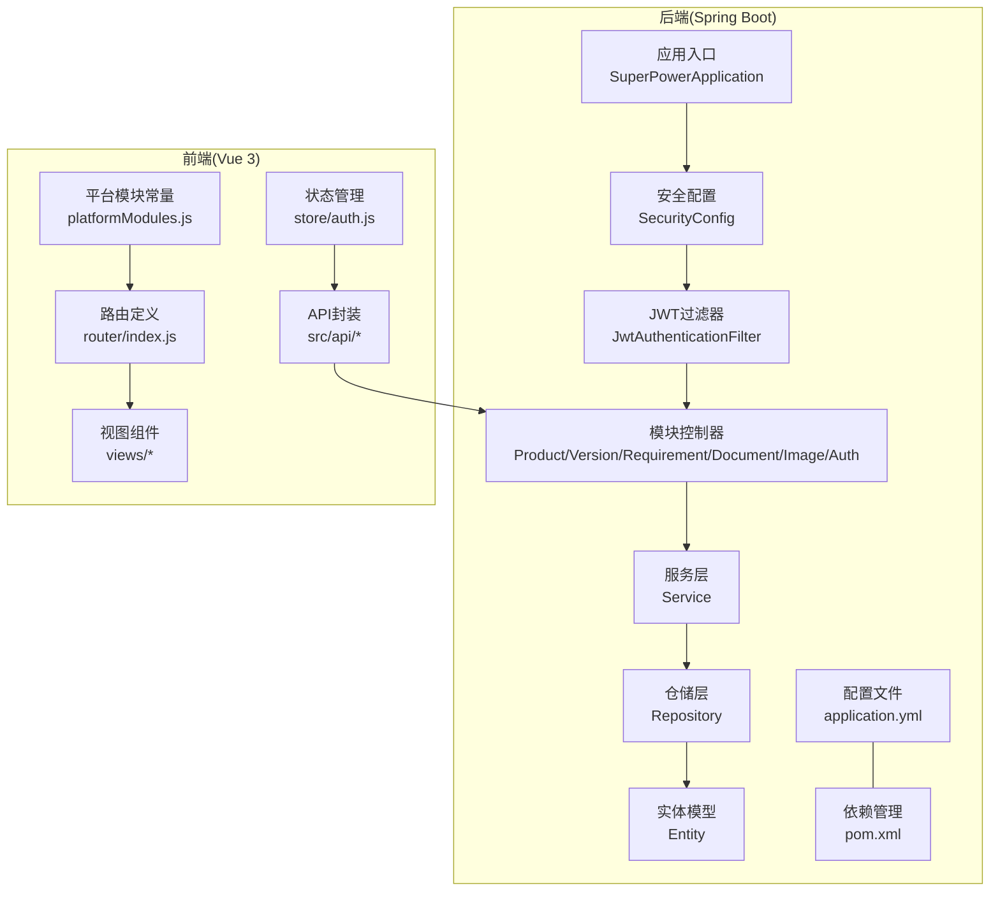
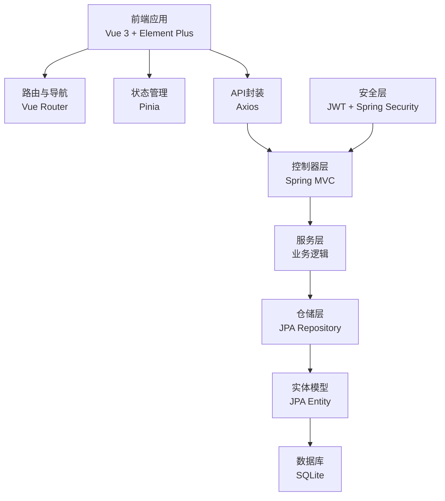
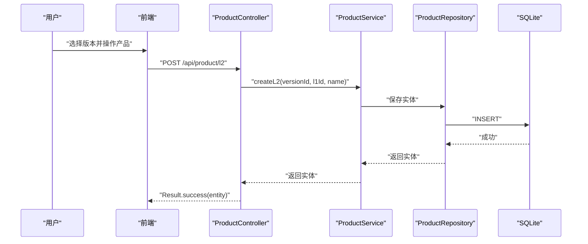
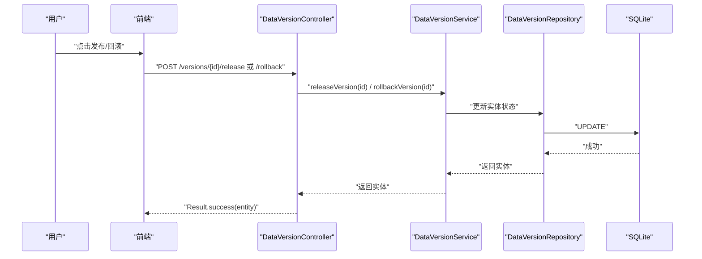
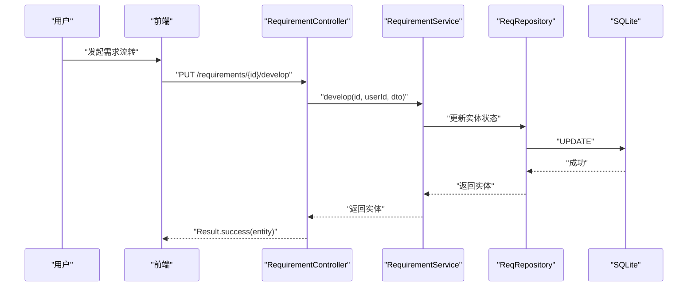
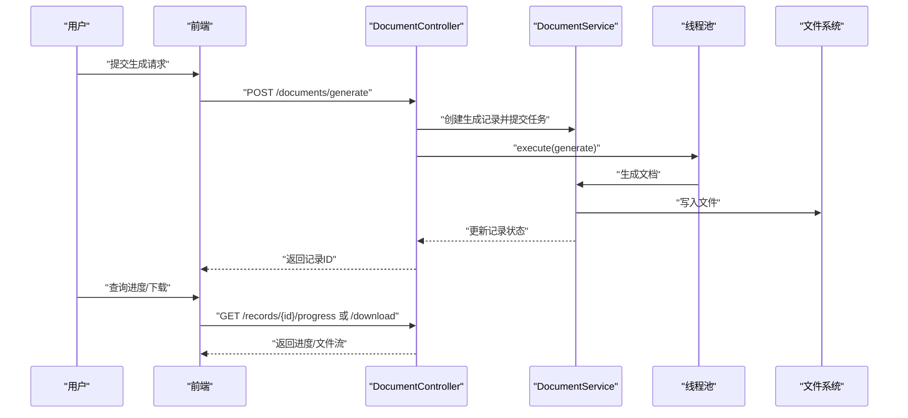
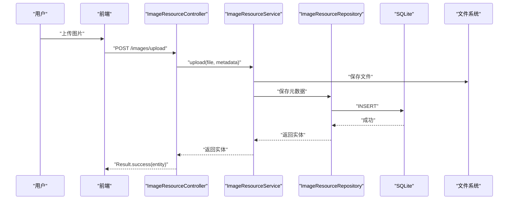
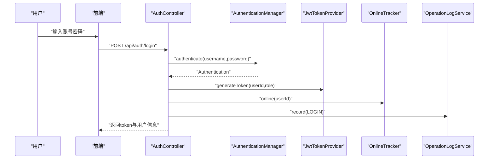
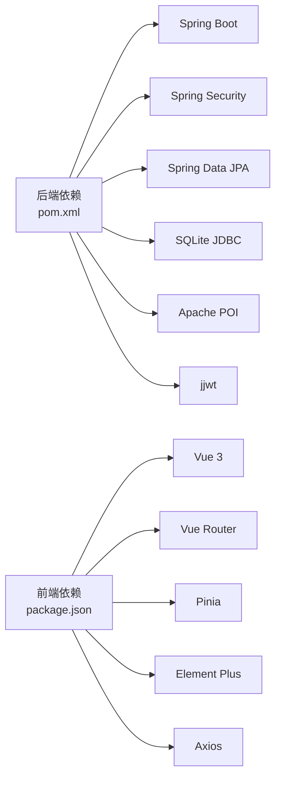

# 项目概述

<cite>
**本文引用的文件**
- [application.yml](file://src/main/resources/application.yml)
- [pom.xml](file://pom.xml)
- [SuperPowerApplication.java](file://src/main/java/com/superpower/SuperPowerApplication.java)
- [SecurityConfig.java](file://src/main/java/com/superpower/config/SecurityConfig.java)
- [JwtAuthenticationFilter.java](file://src/main/java/com/superpower/security/JwtAuthenticationFilter.java)
- [AuthController.java](file://src/main/java/com/superpower/modules/system/controller/AuthController.java)
- [ProductController.java](file://src/main/java/com/superpower/modules/category/controller/ProductController.java)
- [DataVersionController.java](file://src/main/java/com/superpower/modules/version/controller/DataVersionController.java)
- [RequirementController.java](file://src/main/java/com/superpower/modules/requirement/controller/RequirementController.java)
- [DocumentController.java](file://src/main/java/com/superpower/modules/document/controller/DocumentController.java)
- [ImageResourceController.java](file://src/main/java/com/superpower/modules/image/controller/ImageResourceController.java)
- [platformModules.js](file://frontend/src/constants/platformModules.js)
- [index.js](file://frontend/src/router/index.js)
- [auth.js](file://frontend/src/store/auth.js)
- [package.json](file://frontend/package.json)
</cite>

## 目录
1. [引言](#引言)
2. [项目结构](#项目结构)
3. [核心组件](#核心组件)
4. [架构总览](#架构总览)
5. [详细组件分析](#详细组件分析)
6. [依赖关系分析](#依赖关系分析)
7. [性能考量](#性能考量)
8. [故障排查指南](#故障排查指南)
9. [结论](#结论)
10. [附录](#附录)

## 引言
本项目是一个面向产品清单管理的企业级应用，采用前后端分离架构，后端基于 Spring Boot，前端基于 Vue.js，通过 JWT 实现无状态认证，并使用 SQLite 作为本地数据库。系统围绕“产品数据管理、版本控制、需求管理、系统管理、文档生成、图床管理”六大模块展开，提供从产品层级维护、版本发布与回滚、需求全生命周期跟踪、系统用户与权限管理、到批量文档生成与图片资源治理的一体化能力。项目旨在提升产品清单的可维护性、可追溯性与协作效率，适合中小团队在本地或轻量级部署场景下快速落地。

## 项目结构
项目采用典型的分层与模块化组织方式：
- 后端以 Spring Boot 应用为核心，按功能域划分为 modules（如 category、version、requirement、document、image、system 等），每个模块包含 controller、service、repository、entity、dto 等层次，职责清晰、内聚高、耦合低。
- 前端采用 Vue 3 + Vue Router + Pinia 架构，路由按模块划分，视图组件与 API 层解耦，状态集中管理。
- 配置层面通过 application.yml 统一管理数据库、日志、JWT、文件存储等参数；pom.xml 定义后端依赖与构建插件。

图表来源
- [SuperPowerApplication.java:17-42](file://src/main/java/com/superpower/SuperPowerApplication.java#L17-L42)
- [SecurityConfig.java:27-45](file://src/main/java/com/superpower/config/SecurityConfig.java#L27-L45)
- [JwtAuthenticationFilter.java:17-48](file://src/main/java/com/superpower/security/JwtAuthenticationFilter.java#L17-L48)
- [ProductController.java:14-87](file://src/main/java/com/superpower/modules/category/controller/ProductController.java#L14-L87)
- [DataVersionController.java:19-105](file://src/main/java/com/superpower/modules/version/controller/DataVersionController.java#L19-L105)
- [RequirementController.java:21-238](file://src/main/java/com/superpower/modules/requirement/controller/RequirementController.java#L21-L238)
- [DocumentController.java:31-162](file://src/main/java/com/superpower/modules/document/controller/DocumentController.java#L31-162)
- [ImageResourceController.java:23-151](file://src/main/java/com/superpower/modules/image/controller/ImageResourceController.java#L23-151)
- [AuthController.java:22-97](file://src/main/java/com/superpower/modules/system/controller/AuthController.java#L22-97)
- [application.yml:11-39](file://src/main/resources/application.yml#L11-L39)
- [pom.xml:21-84](file://pom.xml#L21-L84)
- [index.js:106-129](file://frontend/src/router/index.js#L106-L129)
- [platformModules.js:1-29](file://frontend/src/constants/platformModules.js#L1-L29)
- [auth.js:1-46](file://frontend/src/store/auth.js#L1-L46)

章节来源
- [application.yml:11-39](file://src/main/resources/application.yml#L11-L39)
- [pom.xml:21-84](file://pom.xml#L21-L84)
- [SuperPowerApplication.java:17-42](file://src/main/java/com/superpower/SuperPowerApplication.java#L17-L42)
- [index.js:106-129](file://frontend/src/router/index.js#L106-L129)
- [platformModules.js:1-29](file://frontend/src/constants/platformModules.js#L1-L29)
- [auth.js:1-46](file://frontend/src/store/auth.js#L1-L46)

## 核心组件
- 应用入口与初始化
  - 应用启动类负责初始化时区、注入仓储与密码编码器，并在首次运行时创建默认角色、用户与初始版本数据，确保系统开箱即用。
- 安全与认证
  - 基于 Spring Security 的无状态认证，禁用 CSRF，会话策略为 STATELESS；JWT 过滤器在请求进入时解析并校验令牌，加载用户详情并写入安全上下文；开放部分公开接口（如登录、版本查询、静态资源）。
- 数据库与ORM
  - 使用 SQLite 作为本地数据库，JPA/Hibernate 管理实体映射与DDL；通过自定义方言适配 SQLite；连接池采用 HikariCP，限制最大连接数并设置泄漏检测阈值。
- 前端路由与状态
  - 路由按模块划分，支持角色级访问控制；Pinia 管理登录态与用户信息；Element Plus 提供UI组件生态；Vue Router 提供导航守卫实现登录拦截与权限校验。

章节来源
- [SuperPowerApplication.java:35-80](file://src/main/java/com/superpower/SuperPowerApplication.java#L35-L80)
- [SecurityConfig.java:27-56](file://src/main/java/com/superpower/config/SecurityConfig.java#L27-L56)
- [JwtAuthenticationFilter.java:32-60](file://src/main/java/com/superpower/security/JwtAuthenticationFilter.java#L32-L60)
- [application.yml:18-34](file://src/main/resources/application.yml#L18-L34)
- [index.js:111-126](file://frontend/src/router/index.js#L111-L126)
- [auth.js:5-45](file://frontend/src/store/auth.js#L5-L45)

## 架构总览
系统采用前后端分离的三层架构：
- 表现层：Vue.js 前端，负责页面渲染、交互与状态管理。
- 控制层：Spring MVC 控制器，接收请求、参数校验、调用服务层并返回统一结果包装。
- 持久层：JPA 仓储与实体，负责数据存取与事务边界。
- 安全层：JWT 认证与授权，结合 Spring Security 过滤链实现细粒度权限控制。

图表来源
- [index.js:106-129](file://frontend/src/router/index.js#L106-L129)
- [auth.js:1-46](file://frontend/src/store/auth.js#L1-L46)
- [AuthController.java:22-97](file://src/main/java/com/superpower/modules/system/controller/AuthController.java#L22-97)
- [SecurityConfig.java:27-45](file://src/main/java/com/superpower/config/SecurityConfig.java#L27-L45)
- [JwtAuthenticationFilter.java:17-48](file://src/main/java/com/superpower/security/JwtAuthenticationFilter.java#L17-L48)
- [application.yml:18-34](file://src/main/resources/application.yml#L18-L34)

## 详细组件分析

### 产品数据管理
- 功能范围：支持产品两级分类（L1/L2）的增删改查、排序调整、Excel 批量导入。
- 关键接口：L1/L2 列表、创建、更新、删除、排序、Excel 导入。
- 数据流：前端调用控制器 → 服务层处理业务 → 仓储持久化 → 返回统一结果。

图表来源
- [ProductController.java:52-78](file://src/main/java/com/superpower/modules/category/controller/ProductController.java#L52-L78)
- [application.yml:18-24](file://src/main/resources/application.yml#L18-L24)

章节来源
- [ProductController.java:14-87](file://src/main/java/com/superpower/modules/category/controller/ProductController.java#L14-L87)

### 版本控制
- 功能范围：版本创建、查询、发布、回滚、进度统计、删除。
- 关键接口：GET /versions、POST /versions、POST /versions/{id}/release、POST /versions/{id}/rollback、DELETE /versions/{id}。
- 日志与审计：每次变更均记录操作日志，便于追踪。

图表来源
- [DataVersionController.java:66-104](file://src/main/java/com/superpower/modules/version/controller/DataVersionController.java#L66-L104)

章节来源
- [DataVersionController.java:19-105](file://src/main/java/com/superpower/modules/version/controller/DataVersionController.java#L19-L105)

### 需求管理
- 功能范围：需求列表、详情、统计（按状态/模块/类型）、多阶段流转（确认/开发/就绪/发布/驳回/取消）。
- 权限控制：删除与高级操作需 ADMIN 角色。
- 日志审计：所有变更记录操作日志。

图表来源
- [RequirementController.java:188-210](file://src/main/java/com/superpower/modules/requirement/controller/RequirementController.java#L188-L210)

章节来源
- [RequirementController.java:21-238](file://src/main/java/com/superpower/modules/requirement/controller/RequirementController.java#L21-L238)

### 文档生成
- 功能范围：根据版本与条目生成 Word/Excel 文档，异步执行，支持进度查询与下载。
- 并发控制：固定线程池并发生成，超时自动取消并记录错误。
- 存储路径：通过配置项指定生成目录。

图表来源
- [DocumentController.java:53-161](file://src/main/java/com/superpower/modules/document/controller/DocumentController.java#L53-L161)
- [application.yml:39-39](file://src/main/resources/application.yml#L39-L39)

章节来源
- [DocumentController.java:31-162](file://src/main/java/com/superpower/modules/document/controller/DocumentController.java#L31-162)

### 图床管理
- 功能范围：图片上传、树形目录浏览、查询、重命名、替换文件、批量删除、外部图片迁移、引用查询。
- 权限控制：删除与迁移等操作需 ADMIN 角色。
- 审计日志：上传、删除、重命名等操作均记录。

图表来源
- [ImageResourceController.java:52-65](file://src/main/java/com/superpower/modules/image/controller/ImageResourceController.java#L52-L65)

章节来源
- [ImageResourceController.java:23-151](file://src/main/java/com/superpower/modules/image/controller/ImageResourceController.java#L23-151)

### 系统管理与认证
- 认证流程：登录接口使用 AuthenticationManager 校验凭据，签发 JWT，记录登录日志与在线状态。
- 前端路由：登录拦截与角色校验，非管理员无法访问管理页。
- 平台模块：前端通过常量定义模块树，驱动菜单与路由生成。

图表来源
- [AuthController.java:44-60](file://src/main/java/com/superpower/modules/system/controller/AuthController.java#L44-L60)
- [SecurityConfig.java:33-41](file://src/main/java/com/superpower/config/SecurityConfig.java#L33-L41)
- [JwtAuthenticationFilter.java:32-47](file://src/main/java/com/superpower/security/JwtAuthenticationFilter.java#L32-L47)
- [index.js:111-126](file://frontend/src/router/index.js#L111-L126)
- [platformModules.js:1-29](file://frontend/src/constants/platformModules.js#L1-L29)

章节来源
- [AuthController.java:22-97](file://src/main/java/com/superpower/modules/system/controller/AuthController.java#L22-97)
- [SecurityConfig.java:27-56](file://src/main/java/com/superpower/config/SecurityConfig.java#L27-L56)
- [JwtAuthenticationFilter.java:17-61](file://src/main/java/com/superpower/security/JwtAuthenticationFilter.java#L17-L61)
- [index.js:106-129](file://frontend/src/router/index.js#L106-L129)
- [platformModules.js:1-29](file://frontend/src/constants/platformModules.js#L1-L29)
- [auth.js:1-46](file://frontend/src/store/auth.js#L1-L46)

## 依赖关系分析
- 技术栈与版本
  - 后端：Spring Boot 3.2 + Spring Security + Spring Data JPA + jjwt + SQLite JDBC + Apache POI。
  - 前端：Vue 3 + Vue Router + Pinia + Element Plus + Axios。
- 依赖特性
  - 后端通过 pom.xml 统一声明依赖与编译插件，启用 Lombok 注解处理器。
  - 前端通过 package.json 管理依赖与脚手架工具，使用 Vite 构建。
- 外部集成点
  - 文件上传与下载、Word/Excel 生成、图片存储与迁移、JWT 令牌签发与校验。

图表来源
- [pom.xml:21-84](file://pom.xml#L21-L84)
- [package.json:11-27](file://frontend/package.json#L11-L27)

章节来源
- [pom.xml:16-84](file://pom.xml#L16-L84)
- [package.json:1-28](file://frontend/package.json#L1-L28)

## 性能考量
- 数据库连接与SQL
  - HikariCP 最大连接数限制与连接泄漏检测，避免高并发下的连接争用与泄漏。
  - Hibernate SQL 格式化与关闭 Open-in-View，减少不必要的延迟与内存占用。
- 文档生成
  - 固定线程池并发生成，避免阻塞主线程；超时控制与异常兜底，保障系统稳定性。
- 前端交互
  - 虚拟滚动、懒加载组件与状态集中管理，降低首屏与复杂列表渲染压力。
- 缓存与离线
  - 当前未见专用缓存层，建议对高频查询（如版本列表、基础数据）引入本地缓存或浏览器缓存策略。

章节来源
- [application.yml:21-34](file://src/main/resources/application.yml#L21-L34)
- [DocumentController.java:41-45](file://src/main/java/com/superpower/modules/document/controller/DocumentController.java#L41-L45)
- [package.json:17-21](file://frontend/package.json#L17-L21)

## 故障排查指南
- 登录失败
  - 检查用户名/密码是否正确；确认 SecurityConfig 中的放行规则与 JWT 过滤器是否生效。
- 权限不足
  - 确认用户角色是否为 ADMIN；检查路由 meta.roles 与前端本地存储的角色码。
- 文件上传/下载异常
  - 检查 multipart 配置与文件大小限制；确认文件系统路径存在且具备读写权限。
- 文档生成失败
  - 查看后台日志中的任务状态与异常堆栈；确认生成目录可写、模板资源可用。
- 图片迁移卡住
  - 查询迁移任务进度接口，确认任务ID有效；检查外部资源可达性与目标目录权限。

章节来源
- [SecurityConfig.java:33-41](file://src/main/java/com/superpower/config/SecurityConfig.java#L33-L41)
- [JwtAuthenticationFilter.java:32-47](file://src/main/java/com/superpower/security/JwtAuthenticationFilter.java#L32-L47)
- [index.js:111-126](file://frontend/src/router/index.js#L111-L126)
- [application.yml:13-15](file://src/main/resources/application.yml#L13-L15)
- [DocumentController.java:99-115](file://src/main/java/com/superpower/modules/document/controller/DocumentController.java#L99-L115)
- [ImageResourceController.java:128-131](file://src/main/java/com/superpower/modules/image/controller/ImageResourceController.java#L128-131)

## 结论
本项目以模块化设计与前后端分离为核心，结合 Spring Boot 与 Vue.js 的成熟生态，实现了产品清单管理的关键业务闭环。通过 JWT 无状态认证与细粒度权限控制，保障了系统的安全性与可扩展性；SQLite 与 JPA 的组合满足了轻量级部署与快速迭代的需求。六大模块覆盖了从产品、版本、需求到系统管理与文档生成的全流程，适合在中小团队中推广使用。建议后续在缓存、监控与可观测性方面进一步完善，以支撑更大规模的应用场景。

## 附录
- 默认账户
  - 管理员：用户名 admin，密码 123456；普通用户：用户名 user，密码 123456。
- 关键配置
  - JWT 密钥与过期时间、SQLite 数据源、日志级别、文件上传大小限制、文档生成存储路径等。

章节来源
- [SuperPowerApplication.java:60-74](file://src/main/java/com/superpower/SuperPowerApplication.java#L60-L74)
- [application.yml:35-40](file://src/main/resources/application.yml#L35-L40)